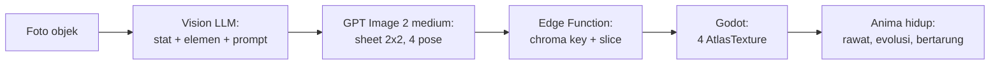

# Scanima

> Foto benda apa pun di sekitarmu. Benda itu jadi monster peliharaan.

Scanima adalah game mobile virtual pet (gaya Tamagotchi/Digimon) di mana setiap monster — disebut **Anima** — diciptakan dari foto objek nyata yang diambil pemain lewat kamera HP. Sebuah mouse komputer jadi Anima berkaki dengan dua tombol sebagai mata. Sebuah cangkir jadi Anima bulat dengan gagang sebagai ekor. Struktur monster harus **True to Object**: merepresentasikan bentuk geometris dan fitur unik objek aslinya, bukan monster generik yang ditempeli warna.

Genre: Virtual Pet + Creature Collector + Basic Tactical Battle.
Art style: 2D anime creature cel-shading — clean bold linework, flat colors, crisp 2–3 level shadows, cute-but-fierce techno-organic design, dan sudut pandang 3/4 terkunci.

## Status

**Phase 1 — pipeline art. Terbukti end-to-end pada 12 Agustus 2026.** Foto sungguhan sudah masuk lewat seluruh rantai — Vision, prompt, generation, chroma key, slicing, manifest — dan Godot merender Anima hasilnya. "True to Object" terverifikasi dengan mata: foto mouse komputer menghasilkan kreatur yang dua tombol kliknya jadi mata, scroll wheel jadi hidung, dan kabelnya jadi ekor bersegmen.

Eksperimen model berikutnya menetapkan **`openai/gpt-image-2` quality `medium`** sebagai default: hasil 1024×1024-nya lebih konsisten untuk anatomi anime dan biaya nyata sekitar $0.07 per sheet, sedangkan `high` sekitar empat kali token output dan 2,5 menit tanpa peningkatan yang sebanding. Prompt production v2 mengikuti [anime cel-shaded style guide](docs/monster_camera_anime_cel_shaded_style_guide.md); gate Gemini tetap tidak berubah.

**Smoke Set berbayar dengan template v2 final sudah dijalankan** (mouse, mug putih, sepatu): 3 dari 3 sheet lengkap 4/4 pose, gate menolak keduanya dengan benar, residu hijau 0,001–0,008% (target di bawah 0,1%), selisih skala Idle vs Attack 6–13%, dan latensi 61–74 detik per sheet. Biaya run: ~$0.225. Hasilnya ada di `eval/results/v2/smoke/index.html`.

Run itu memunculkan satu risiko yang bukan soal kualitas art: sheet sepatu mereproduksi logo merek dari fotonya di keempat pose. Larangan tekstual sudah ada di v2 dan tidak cukup, karena logonya datang dari foto referensi. **Prompt v3 kini jadi default**: ia memerintahkan model mengganti mark merek dengan permukaan polos atau marking geometris ciptaan sendiri. Uji satu foto sepatu (~$0.073) memberi 4/4 sel, residu 0,014%, logo hilang, dan `species_key` tidak bergeser. Mouse dan mug belum diulang di v3.

**Prompt v4 sekarang tersedia sebagai candidate, bukan default.** Temuan berikutnya menunjukkan opsi "marking geometris ciptaan sendiri" milik v3 membuat model menambahkan emblem mirip logo pada benda yang sebenarnya polos, dan daftar contoh DAMAGED yang universal (`loose cable`, `exposed wire`, `broken key`) membuat hampir semua Anima tampak cyborg. v4 selalu mengganti logo/teks dengan material polos, melarang emblem rekaan, dan membawa `surface_finish` + `damage_hints` dari Vision ke image prompt. Hint kabel disaring kecuali kabel benar-benar tercatat sebagai fitur objek. Kontrak mug/tanaman/mouse, bundel Edge Function, dan dry-run lima foto sudah lulus tanpa API; production tetap v3 sampai v4 melewati Smoke Set visual berbayar.

Tiga masalah post-processing yang ditemukan pada output nyata sudah ditangani: halo hijau di tepi sprite (0,21% → 0,014%), anggota tubuh pose kanan yang melewati garis tengah sheet, dan penjaga "keying gagal" yang salah membuang pose Attack karena speed line membuat bbox-nya seluas kuadran. Slicing sekarang menetapkan kepemilikan per komponen piksel, jadi tangan/kabel yang tersambung tidak dipotong dan bagian pose tetangga tidak ikut tercopy.

**Phase 2 sudah dimulai dari sisi yang menjaga uang.** Skema delapan tabel, RLS beserta hak kolom, dan fungsi kuota/care sudah ter-apply di proyek Supabase dan dibuktikan oleh [`backend/tests/quota_rules.sql`](backend/tests/quota_rules.sql): retry dengan `idempotency_key` sama hanya mendebit satu Genesis Core atau satu transaksi Bits, webhook yang terkirim dua kali hanya mengkredit satu, cap biaya harian menolak tanpa mendebit, cache hit tidak pernah menghasilkan Core gratis, dan peran `authenticated` tidak bisa menaikkan saldo, menulis kebutuhan/`care_score`, atau memanggil fungsi uang langsung.

**Post-processing sudah dibuktikan jalan di Edge Function, dengan sheet sungguhan.** Sheet v3 sepatu (1024×1024) diproses di runtime Deno dalam **173 ms** — batas CPU 2 detik tidak pernah dekat — dan hasilnya identik piksel per piksel dengan hasil Node (3.544.272 byte channel, nol selisih). Satu modul `postprocess.mjs` dipakai kedua runtime, jadi paritas itu bukan kebetulan yang harus dijaga manual. Yang berbeda hanya kompresi PNG-nya (886 KB di Node, 964 KB di edge), sehingga hash berbasis byte tidak bisa dibandingkan lintas runtime.

**Tiga Edge Function sudah hidup di produksi.** `create_anima`, `replicate_webhook`, dan `care_anima` ter-deploy; yang terakhir JWT-protected dan tidak punya model call. Smoke produksi berbiaya nol membuktikan 401 tanpa user, validasi 400, `sync`, serta dua Play dengan key sama menghasilkan Energy 95 dan `care_score` 1 sekali saja.

Satu jebakan ditemukan hanya karena jalur itu dicoba sungguhan: **sign-in anonim mati secara default di project Supabase**, dan Scanima tidak punya layar login. Setiap pemain baru akan gagal di detik pertama, di jalur yang tidak berbiaya sehingga tidak ada uji berbayar yang akan menangkapnya. Sekarang menyala di remote dan dideklarasikan di `config.toml`.

**Jalur uang sudah dijalankan utuh di produksi, sekali, dengan foto sungguhan (~$0.076).** Satu foto mug putih diunggah langsung ke Storage oleh pemain anonim, lalu `create_anima` balik dalam **15 detik** dengan Vision selesai dan generation berjalan; webhook Replicate menyelesaikan sisanya. Hasilnya "Muglet" (`mug_ceramic_handled` / `neutral_light`, element flow, def 75 dari badan keramiknya), **4 dari 4 pose terdeteksi**, residu hijau **0,005%**, varians tinggi Idle vs Attack 4,9%, dan `cross_boundary_pixels` **nol** di keempat pose. Mug putih adalah kasus keying tersulit yang sebelumnya belum pernah terbukti: 59% sheet-nya latar hijau, putih di atas hijau, dan tetap bersih. Foto mentahnya terhapus otomatis begitu sheet jadi.

Pemain **kedua** lalu memfoto mug yang sama: `cache_hit` dalam **11 detik**, Genesis Core-nya **tidak tersentuh** (3 tetap 3), generation tercatat berbiaya $0.0000, dan `times_reused` naik ke 1. Itu Discovery Scan yang bekerja persis seperti desain ekonominya — dan seluruh invarian uangnya terverifikasi di ledger, bukan diasumsikan.

Rantainya tertutup sampai ke game: sheet itu diunduh dari CDN publik apa adanya, dan `test_sprite_slicing.gd` lulus **75 dari 75** check terhadapnya. Bukan sheet buatan uji — art produksi yang keluar dari Edge Function.

**Sisi client sudah menyusul, dan sudah dijalankan sungguhan terhadap produksi.** Godot kini punya dua autoload — `GameState` (pemilik satu-satunya `user://state.json`) dan `Backend` (transport ke auth, REST, Storage, dan Edge Function) — plus scene `scan_flow` yang menjadi entry point: sign-in anonim, pilih foto, unggah ke bucket sendiri, `create_anima`, Incubator, lalu Anima hidup di layar. Uji headless `live_scan.gd` menjalankan rantai itu terhadap produksi dengan biaya ~$0.003: `create_anima` balik **11–16 detik**, sheet ~1 MB terunduh dari CDN, `AnimaLoader` menerimanya dengan keempat pose, dan saldo berkurang tepat satu Scan Charge tanpa menyentuh Genesis Core. Screenshot layarnya menunjukkan saldo dari server, Anima dari cache lokal, dan tombol pose yang dibangun dari manifest.

**Jeda generation sekarang punya inkubator yang benar-benar hidup.** Setelah Genesis dimulai, foto atau Anima lama diganti telur energi procedural dengan orbit cyan-violet, scanner, spark emas, dan core yang berdenyut—tanpa asset tambahan. Ia tetap berjalan selama polling Replicate, termasuk saat pending scan dilanjutkan setelah restart. Saat webhook selesai, ring meledak menjadi flash lalu Anima muncul dengan bounce, squash-and-stretch, dan settle; kegagalan/timeout mengembalikan Anima lama. Cache hit tetap instan dan tidak memalsukan proses hatch.

**UI sekarang berupa shell game mobile empat destination: Home, Scan, Collection, dan Anima Profile.** Home menjadikan Anima hero visual, kebutuhan diringkas dalam care dock, feedback mengambang tanpa mendorong layout, dan Scan tetap CTA cyan utama di bottom navigation. Keempat destination adalah child scene modular di dalam satu `scan_flow.tscn`, jadi pindah tab tidak me-reset request, pending scan, Stage, atau inkubator. Chip Core membuka penjelasan Genesis tanpa memenuhi HUD; Bond penuh menutup Play, dan saat tidur hanya Wake yang tersisa selebar dock. Timer berbasis timestamp server serta sync saat resume membangunkan Anima otomatis setelah enam jam tanpa mempercayai jam device. Seluruh copy production memakai katalog English Godot-native; `LocaleManager` menjadi pintu locale dan formatting untuk bahasa berikutnya. Theme cyan-violet-gold kini memakai font OFL Nunito Sans/Oxanium, ikon SVG berlisensi, touch target 96px, serta reduced-motion gate bersama. Pose debug hanya tinggal di `anima_demo`. `test_scan_ui.gd` menjaga 123 kontrak shell/touch/motion dan `test_i18n.gd` menjaga 828 kontrak katalog/formatter/layout.

**Aksi care sekarang merespons pada frame tap, bukan setelah jaringan.** Anima langsung memberi feedback dan hanya tombol care yang dikunci selama request; meter, Bits, sleep, serta `care_score` tetap menunggu hasil server-authoritative. `care_anima` juga memverifikasi JWT ES256 lewat `getClaims()` dengan cache JWKS, sehingga tidak lagi melakukan round-trip Auth `getUser()` pada setiap aksi.

Dua keputusan di client dibuat karena bentuk masalahnya, bukan karena kenyamanan. Pertama, **refresh token yang ditolak tidak dijawab dengan sign-in anonim baru**: itu akan meninggalkan koleksi di akun yang tidak bisa dijangkau lagi. Kedua, **kunci idempotency scan dan care bertahan di disk**, sehingga app yang mati tidak membayar Core/Bits kedua. Keduanya dijaga oleh 42 check di `test_client_state.gd`.

**Kamera sudah terpasang lewat plugin, bukan lewat `CameraServer`.** `CameraServer` memang mendukung Android sejak setelah 4.4, tapi ia memberi feed hidup sementara yang dibutuhkan satu jepretan — jadi memakainya berarti membangun sendiri fokus, eksposur, dan tombol jepret yang sudah gratis dari aplikasi kamera OEM. Yang dipakai [`GodotGetImage` fork PhotoPicker](https://github.com/cenullum/GodotGetImagePlugin-Android-PhotoPicker), prebuilt untuk 4.6.2, dan fork-nya dipilih karena manifest upstream menyuntikkan `READ_MEDIA_IMAGES` ke APK walau galeri tidak pernah dipanggil — izin yang ditolak Play untuk keperluan pilih-satu-foto. Galeri sengaja tidak dipakai: fiksinya memfoto benda di depanmu, dan galeri membuka pintu memindai gambar unduhan yang justru harus ditahan gate. Foto dikecilkan ke 1280 px di device sebelum diunggah, dan angka itu sama dengan foto terbesar di `eval/photos/` supaya input produksi tidak keluar dari amplop yang sudah divalidasi Smoke Set — dijaga gratis oleh skenario 18. Jalur `FileDialog` di desktop tetap ada, karena itu yang membuat seluruh alur bisa diperiksa tanpa perangkat Android.

**APK debug sudah benar-benar dibangun, dan yang diperiksa bukan bahwa file-nya ada.** Artefaknya memuat **tepat dua izin, `INTERNET` dan `CAMERA`** — nol `READ_MEDIA_IMAGES`, jadi pilihan fork PhotoPicker terbukti di APK jadi, bukan cuma di manifest sumbernya — dan kelas `GodotGetImage` terkonfirmasi ada di `classes.dex`. Dua jebakan ditemukan di jalan: Godot 4 **mematikan izin `INTERNET` secara default**, sehingga APK pertama terpasang dan terbuka lalu mati senyap di sign-in anonim; dan template Android 4.6.2 mematok Gradle 8.11.1 yang tidak menerima JDK di atas 23, jadi JDK 17 wajib terpasang berdampingan. Seluruh alurnya CLI, tanpa langkah editor — `--install-android-build-template` adalah flag, dan `export_presets.cfg` boleh ditulis tangan. Rinciannya di [CLAUDE.md](CLAUDE.md).

| Phase | Isi | Status |
| --- | --- | --- |
| 0 | Arsitektur, prompt spec, desain sistem | Selesai |
| 1 | MVP: buktikan pipeline art end-to-end | Terbukti — Smoke Set v2 3/3 sheet 4/4 pose, gate 2/2 |
| 2 | Backend Supabase + core game loop | Selesai — scan, hatch, Koleksi, Stats, Care, dan visual shell sudah hidup |
| 3 | Battle, evolusi, onboarding, audio, monetisasi | Belum mulai |
| 4 | Soft launch itch.io lalu Play Store | Belum mulai |

Yang sudah bisa dijalankan sekarang, gratis:

```bash
npm install
npm run selftest                 # 20 skenario + 12 uji tanda tangan webhook, tanpa API

# Godot: 80 pemeriksaan slicing/presenter, tanpa jendela
/Applications/Godot.app/Contents/MacOS/Godot --headless --path game \
    --script res://tests/test_sprite_slicing.gd

# Godot: 42 pemeriksaan sesi, pending scan/care, dan cache art — tanpa jaringan
/Applications/Godot.app/Contents/MacOS/Godot --headless --path game \
    --script res://tests/test_client_state.gd

# Godot: 123 pemeriksaan shell, theme, touch, care, inkubator, reduced motion
/Applications/Godot.app/Contents/MacOS/Godot --headless --path game \
    --script res://tests/test_scan_ui.gd

# Godot: 828 pemeriksaan katalog English, referensi key, formatter, dan layout
/Applications/Godot.app/Contents/MacOS/Godot --headless --path game \
    --script res://tests/test_i18n.gd

# Godot: 27 pemeriksaan decay, sleep, score harian, dan Dormant
/Applications/Godot.app/Contents/MacOS/Godot --headless --path game \
    --script res://tests/test_game_rules.gd

# Game: scan_flow, layar sungguhan. Butuh jaringan untuk sign-in.
/Applications/Godot.app/Contents/MacOS/Godot --path game

# Demo art: Anima placeholder yang bisa berganti pose dan memantul
/Applications/Godot.app/Contents/MacOS/Godot --path game res://scenes/anima_demo.tscn
```

Kontrak antara kedua sisi juga diuji tanpa biaya. Node menghasilkan sheet, Godot memuatnya:

```bash
node eval/selftest.mjs --emit /tmp/scanima_e2e
/Applications/Godot.app/Contents/MacOS/Godot --headless --path game \
    --script res://tests/test_sprite_slicing.gd -- --manifest=/tmp/scanima_e2e/manifest.json
```

Post-processing bisa diuji ulang terhadap sheet yang sudah dibayar, juga gratis:

```bash
node eval/run.mjs --set smoke --reprocess --prompt-version v2   # susun ulang dari raw.png, 0 panggilan API
```

Untuk mengulang run berbayarnya: taruh 5 foto di `eval/photos/` (lihat [panduannya](eval/photos/README.md)), jalankan `--vision-only` dulu (~$0.015), lalu `npm run smoke` (~$0.225). Hasil ditulis ke `eval/results/<versi prompt>/smoke/index.html`.

## Tech stack

| Layer | Pilihan | Catatan |
| --- | --- | --- |
| Engine | Godot 4.x (Mobile renderer, 2D) | Export Android + Web |
| Image generation | `openai/gpt-image-2` medium via Replicate | 1 panggilan menghasilkan sheet 1024×1024 berisi 4 pose |
| Vision + stat | `google/gemini-2.5-flash` via Replicate | Analisis objek, penentuan stat/elemen, penyusunan visual prompt |
| Backend | Supabase (Postgres + Auth + Storage + Edge Functions) | Proxy API key, kuota, caching, post-processing gambar |

Kedua model lewat Replicate, jadi seluruh proyek hanya butuh **satu kredensial**: `REPLICATE_API_TOKEN`. Ini bukan sekadar setup yang lebih ringkas — di mode BYOK, pemain cukup menempelkan satu token miliknya, bukan dua, dan itu menghapus friksi onboarding yang sebelumnya membuat jalur BYOK hampir tidak layak ditawarkan.

Dua konsekuensi dari memakai wrapper Replicate alih-alih Gemini API langsung, keduanya sudah ditangani di kode dan dijelaskan di [docs/02-prompt-engineering.md](docs/02-prompt-engineering.md): wrapper-nya tidak punya parameter `response_schema`, jadi JSON valid ditegakkan lewat kontrak di prompt plus parser yang tahan bungkus markdown; dan `gemini-2.5-flash` punya tanggal retirement 20 Oktober 2026, jadi migrasi model Vision adalah pekerjaan yang sudah terjadwal, bukan kejutan. Menggantinya cukup lewat env `VISION_MODEL` tanpa menyentuh kode.

## Cara kerja singkat



Satu Anima = satu panggilan image generation = **~$0.07** pada GPT Image 2 medium. Nilai persisnya mengikuti token input, tetapi dua run nyata berada di sekitar angka ini. Hampir semua keputusan ekonomi dan caching mengalir dari biaya tersebut. Lihat [docs/04-game-systems-economy.md](docs/04-game-systems-economy.md).

## Dokumentasi

| Dokumen | Isi |
| --- | --- |
| [docs/01-architecture-dataflow.md](docs/01-architecture-dataflow.md) | Pipeline data lengkap, skema Postgres + RLS, kontrak Edge Function, caching 3 lapis, penanganan latensi, jalur BYOK |
| [docs/02-prompt-engineering.md](docs/02-prompt-engineering.md) | System prompt Vision LLM, JSON schema output, pemetaan fitur objek ke stat, style lock, payload Replicate, harness evaluasi |
| [docs/03-godot-sprite-pipeline.md](docs/03-godot-sprite-pipeline.md) | Arsitektur node Godot, download + slicing sprite, background removal, animasi prosedural |
| [docs/04-game-systems-economy.md](docs/04-game-systems-economy.md) | Survival mechanics, evo-tree, kuota, ekonomi dengan angka nyata, algoritma battle |
| [docs/05-roadmap.md](docs/05-roadmap.md) | Breakdown Phase 1-4 dengan exit criteria dan risiko |
| [docs/06-ui-globalization.md](docs/06-ui-globalization.md) | Shell mobile empat destination, design tokens, i18n, accessibility, dan aturan penambahan locale |
| [docs/monster_camera_anime_cel_shaded_style_guide.md](docs/monster_camera_anime_cel_shaded_style_guide.md) | Sumber art direction v2: linework, cel shading, transformasi objek, pose, dan negative style |
| [CLAUDE.md](CLAUDE.md) | Konteks dan konvensi untuk AI coding agent |

## Struktur repo

```
scanima/
├── game/                         # Godot 4.6 project
│   ├── addons/GodotGetImage/     # kamera Android, prebuilt 4.6.2, .aar ikut commit
│   ├── scenes/
│   │   ├── scan_flow.tscn        # shell persisten: HUD + Stage + navigation
│   │   ├── ui/                    # Home, Scan, Collection, Profile, bottom nav
│   │   └── anima_demo.tscn       # alat periksa art, dipanggil eksplisit
│   ├── assets/                    # font OFL + ikon SVG beserta lisensinya
│   ├── locales/ui.csv             # katalog player-facing, English source
│   ├── scripts/
│   │   ├── game_state.gd         # autoload: sesi, pending scan/care, cache art
│   │   ├── backend.gd            # autoload: auth, REST, Storage, functions
│   │   ├── locale_manager.gd     # autoload: locale, formatter, enum mapping
│   │   ├── scan_flow.gd          # orkestrasi scan/care + shell navigation
│   │   ├── *_view.gd             # presentation per destination
│   │   ├── care_rules.gd         # mirror murni decay/sleep untuk preview + test
│   │   ├── incubator_effect.gd   # telur energi procedural + burst
│   │   ├── scanima_background.gd # chamber holografik procedural, tanpa texture
│   │   ├── ui_juice.gd           # motion bersama untuk button, meter, dan reveal
│   │   ├── ui_motion.gd          # reduced-motion switch bersama
│   │   ├── anima_loader.gd       # manifest + PNG -> SpriteFrames
│   │   ├── anima_presenter.gd    # pose + gerak prosedural via Tween
│   │   ├── placeholder_sheet.gd  # sheet buatan, untuk demo & test
│   │   └── anima_demo.gd
│   ├── themes/mobile_theme.tres  # palette, cards, CTA, modal, basis 720×1280
│   ├── shaders/chroma_key.gdshader   # cadangan, jalur BYOK saja
│   └── tests/
│       ├── test_sprite_slicing.gd    # headless, gratis
│       ├── test_client_state.gd      # headless, gratis, tanpa jaringan
│       ├── test_scan_ui.gd           # 123 kontrak shell + touch + motion
│       ├── test_i18n.gd              # 828 kontrak katalog + key + wrapping
│       ├── test_game_rules.gd        # 27 kontrak care tanpa jaringan
│       └── live_scan.gd              # jalur sungguhan ke produksi, ~$0.003
├── backend/
│   ├── prompts/v1/               # baseline nano-banana-pro, tidak diubah
│   ├── prompts/v2/               # GPT Image 2 medium + anime cel-shaded style
│   ├── prompts/v3/               # default: v2 + blok BRAND MARKS
│   ├── prompts/v4/               # candidate: tanpa emblem + damage material
│   ├── tools/bundle_prompts.mjs  # prompts/ -> modul yang bisa diimpor Deno
│   ├── supabase/migrations/      # skema, RLS + hak kolom, fungsi kuota
│   ├── supabase/functions/
│   │   ├── _shared/              # dipakai Edge Function DAN eval
│   │   │   ├── postprocess.mjs   # chroma key, slicing, manifest
│   │   │   ├── vision.mjs        # parsing, gate, perakitan prompt
│   │   │   ├── pricing.mjs       # harga per panggilan, dasar spend cap
│   │   │   ├── finalize_sheet.ts # sheet -> Storage + species_library
│   │   │   └── replicate.ts      # satu jalur panggilan Replicate
│   │   ├── create_anima/         # satu-satunya endpoint yang membelanjakan uang
│   │   └── replicate_webhook/    # menyelesaikan generation, refund kalau gagal
│   └── tests/quota_rules.sql     # uji invarian uang, aman di remote
├── eval/
│   ├── run.mjs                   # foto -> Vision -> Replicate -> sheet + HTML
│   ├── selftest.mjs              # tanpa API
│   ├── sets.json                 # smoke (5 foto) & full (20 foto)
│   └── photos/                   # tidak di-commit
└── docs/
```

## Setup

Prasyarat: Godot 4.6+, Node 20+. Supabase CLI baru diperlukan di Phase 2.

```bash
npm install
cp .env.example .env      # isi REPLICATE_API_TOKEN, cuma itu
```

Kunci di `.env` **hanya** untuk harness eval di laptop. API key tidak pernah masuk ke build Godot: semua panggilan berbayar lewat Edge Function, kecuali mode BYOK di mana pemain memakai token miliknya sendiri.

Sebelum membelanjakan apa pun, periksa dulu bahwa foto dan template sudah benar:

```bash
node eval/run.mjs --set smoke --dry-run      # gratis
node eval/run.mjs --set smoke --vision-only  # ~$0.015, gate + stat saja
node eval/run.mjs --set smoke                # ~$0.225
```

Urutan itu bukan formalitas. `--vision-only` menguji seluruh jalur Vision — gate keamanan, pemetaan stat, stabilitas `species_key` — dengan harga sekitar seperlima belas dari run penuh, jadi tidak ada alasan menemukan kesalahan prompt Vision lewat tagihan generation gambar.

## Lisensi

Lisensi kode Scanima belum ditentukan. Asset UI pihak ketiga yang dibundel
memiliki lisensinya sendiri:

- Nunito Sans — SIL Open Font License 1.1 (`game/assets/fonts/OFL-NunitoSans.txt`)
- Oxanium — SIL Open Font License 1.1 (`game/assets/fonts/OFL-Oxanium.txt`)
- Lucide icons — ISC License (`game/assets/icons/LICENSE-LUCIDE.txt`)
