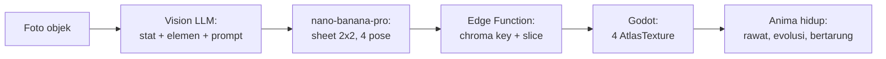

# Scanima

> Foto benda apa pun di sekitarmu. Benda itu jadi monster peliharaan.

Scanima adalah game mobile virtual pet (gaya Tamagotchi/Digimon) di mana setiap monster — disebut **Anima** — diciptakan dari foto objek nyata yang diambil pemain lewat kamera HP. Sebuah mouse komputer jadi Anima berkaki dengan dua tombol sebagai mata. Sebuah cangkir jadi Anima bulat dengan gagang sebagai ekor. Struktur monster harus **True to Object**: merepresentasikan bentuk geometris dan fitur unik objek aslinya, bukan monster generik yang ditempeli warna.

Genre: Virtual Pet + Creature Collector + Basic Tactical Battle.
Art style: 90s anime digital monster concept art — thick clean line art, warna vibrant, sudut pandang terkunci 3/4 isometric.

## Status

**Phase 1 — pipeline art.** Kerangkanya sudah berjalan dan teruji tanpa memanggil API berbayar sekali pun. Yang belum: foto sungguhan dan verifikasi "True to Object" dengan mata manusia, karena itu butuh generation berbayar dan itu langkah berikutnya.

| Phase | Isi | Status |
| --- | --- | --- |
| 0 | Arsitektur, prompt spec, desain sistem | Selesai |
| 1 | MVP: buktikan pipeline art end-to-end | Berjalan — kode siap, menunggu foto + run berbayar |
| 2 | Backend Supabase + core game loop | Belum mulai |
| 3 | Battle, evolusi, UI/UX, audio, monetisasi | Belum mulai |
| 4 | Soft launch itch.io lalu Play Store | Belum mulai |

Yang sudah bisa dijalankan sekarang, gratis:

```bash
npm install
npm run selftest                 # 14 pemeriksaan post-processing, tanpa API

# Godot: 75 pemeriksaan slicing sprite, tanpa jendela
/Applications/Godot.app/Contents/MacOS/Godot --headless --path game \
    --script res://tests/test_sprite_slicing.gd

# Demo: Anima placeholder yang bisa berganti pose dan memantul
/Applications/Godot.app/Contents/MacOS/Godot --path game
```

Kontrak antara kedua sisi juga diuji tanpa biaya. Node menghasilkan sheet, Godot memuatnya:

```bash
node eval/selftest.mjs --emit /tmp/scanima_e2e
/Applications/Godot.app/Contents/MacOS/Godot --headless --path game \
    --script res://tests/test_sprite_slicing.gd -- --manifest=/tmp/scanima_e2e/manifest.json
```

Langkah berikutnya yang berbiaya: taruh 5 foto di `eval/photos/` (lihat [panduannya](eval/photos/README.md)), lalu `npm run smoke` (~$0.40).

## Tech stack

| Layer | Pilihan | Catatan |
| --- | --- | --- |
| Engine | Godot 4.x (Mobile renderer, 2D) | Export Android + Web |
| Image generation | `nano-banana-pro` via Replicate | 1 panggilan menghasilkan sprite sheet 2x2 berisi 4 pose |
| Vision + stat | `gemini-3.1-flash-lite` | Analisis objek, penentuan stat/elemen, penyusunan visual prompt |
| Backend | Supabase (Postgres + Auth + Storage + Edge Functions) | Proxy API key, kuota, caching, post-processing gambar |

Kenapa `gemini-3.1-flash-lite` dan bukan `gemini-1.5-flash` seperti rencana awal: model 1.5 sudah dimatikan Google dan mengembalikan 404. Detail di [docs/01-architecture-dataflow.md](docs/01-architecture-dataflow.md).

## Cara kerja singkat



Satu Anima = satu panggilan image generation = **~$0.134**. Angka ini adalah batasan desain paling penting di seluruh proyek; hampir semua keputusan ekonomi dan caching mengalir darinya. Lihat [docs/04-game-systems-economy.md](docs/04-game-systems-economy.md).

## Dokumentasi

| Dokumen | Isi |
| --- | --- |
| [docs/01-architecture-dataflow.md](docs/01-architecture-dataflow.md) | Pipeline data lengkap, skema Postgres + RLS, kontrak Edge Function, caching 3 lapis, penanganan latensi, jalur BYOK |
| [docs/02-prompt-engineering.md](docs/02-prompt-engineering.md) | System prompt Vision LLM, JSON schema output, pemetaan fitur objek ke stat, style lock, payload Replicate, harness evaluasi |
| [docs/03-godot-sprite-pipeline.md](docs/03-godot-sprite-pipeline.md) | Arsitektur node Godot, download + slicing sprite, background removal, animasi prosedural |
| [docs/04-game-systems-economy.md](docs/04-game-systems-economy.md) | Survival mechanics, evo-tree, kuota, ekonomi dengan angka nyata, algoritma battle |
| [docs/05-roadmap.md](docs/05-roadmap.md) | Breakdown Phase 1-4 dengan exit criteria dan risiko |
| [CLAUDE.md](CLAUDE.md) | Konteks dan konvensi untuk AI coding agent |

## Struktur repo

```
scanima/
├── game/                         # Godot 4.6 project
│   ├── scenes/anima_demo.tscn
│   ├── scripts/
│   │   ├── anima_loader.gd       # manifest + PNG -> SpriteFrames
│   │   ├── anima_presenter.gd    # pose + gerak prosedural via Tween
│   │   ├── placeholder_sheet.gd  # sheet buatan, untuk demo & test
│   │   └── anima_demo.gd
│   ├── shaders/chroma_key.gdshader   # cadangan, jalur BYOK saja
│   └── tests/test_sprite_slicing.gd  # headless
├── backend/
│   ├── prompts/v1/               # vision_system, vision_schema, sprite_sheet
│   └── supabase/                 # Phase 2: Edge Functions + migrations
├── eval/
│   ├── run.mjs                   # foto -> Vision -> Replicate -> sheet + HTML
│   ├── postprocess.mjs           # chroma key, slicing, manifest
│   ├── selftest.mjs              # tanpa API
│   ├── sets.json                 # smoke (5 foto) & full (20 foto)
│   └── photos/                   # tidak di-commit
└── docs/
```

## Setup

Prasyarat: Godot 4.6+, Node 20+. Supabase CLI baru diperlukan di Phase 2.

```bash
npm install
cp .env.example .env      # isi GEMINI_API_KEY dan REPLICATE_API_TOKEN
```

Kunci di `.env` **hanya** untuk harness eval di laptop. API key tidak pernah masuk ke build Godot: semua panggilan berbayar lewat Edge Function, kecuali mode BYOK di mana pemain memakai token miliknya sendiri.

Sebelum membelanjakan apa pun, periksa dulu bahwa foto dan template sudah benar:

```bash
node eval/run.mjs --set smoke --dry-run   # gratis
node eval/run.mjs --set smoke             # ~$0.40
```

## Lisensi

Belum ditentukan.
