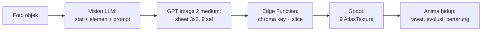

# Scanima

> Foto benda atau hewan non-manusia di sekitarmu. Subjek itu jadi monster peliharaan.

Scanima adalah game mobile virtual pet (gaya Tamagotchi/Digimon) di mana setiap monster — disebut **Anima** — diciptakan dari foto objek nyata atau hewan non-manusia yang aman, lewat kamera atau satu foto dari perangkat. Sebuah mouse komputer jadi Anima berkaki dengan dua tombol sebagai mata. Sebuah cangkir jadi Anima bulat dengan gagang sebagai ekor. Struktur monster harus **True to Subject**: merepresentasikan bentuk dan fitur unik subjek aslinya, bukan monster generik yang ditempeli warna.

Genre: Virtual Pet + Creature Collector + Basic Tactical Battle.
Art style: 2D anime creature cel-shading — clean bold linework, flat colors, crisp 2–3 level shadows, cute-but-fierce techno-organic design, dan sudut pandang 3/4 terkunci.

## Status

**Cutover Elements/Animals/Gallery, 15 Agustus 2026.** Kontrak aktif memakai 18
elemen dengan secondary opsional; Attack memakai primary dan Special memakai
secondary/fallback. Setiap capture yang diterima memakai 1 Genesis Core dan
menghasilkan art unik di bucket privat per pemilik/Anima. Akun Google mendapat
1 Core otomatis per 7 hari server saat saldo gratis di bawah 3. Gallery adalah
feed thumbnail opt-in yang dimoderasi dan tidak mengekspos identitas pemilik.
Enam Anima legacy telah disalin ke storage privat dan diretype tanpa model call;
bucket `sheets` lama kini privat. Detail kontrak baru ada di
[`docs/08-private-art-and-gallery.md`](docs/08-private-art-and-gallery.md).
Catatan cache-hit/species-library di bawah adalah sejarah pipeline sebelum
cutover dan hanya dipertahankan sebagai konteks rollback.

Probe production berbayar setelah cutover memakai foto Golden Retriever
public-domain: Vision mengembalikan `subject_kind=animal`, primary Fauna,
secondary Air, generation v13 selesai, sheet hanya dapat diunduh lewat storage
privat, dan `species_library` tetap tidak mendapat row baru. Akun serta art uji
dibersihkan setelah verifikasi. Probe itu juga menunjukkan fauna v13 terlalu
dekat dengan proporsi hewan nyata. V14 memperbaiki ekspresi dan proporsi, tetapi
satu eval masih terbaca sebagai anjing anime biasa sehingga ditolak. Kandidat
v15 memperkeras identitas monster lewat proportion break, landmark evolution,
dan organic motif terintegrasi tanpa mengubah Vision atau prompt objek. Eval
Golden Retriever v15 lulus visual 9/9 sel dalam 55 detik dan terbaca sebagai
monster pada ukuran game. Bundle v15 sudah dideploy sebagai `create_anima`
version 13 dan kini menjadi prompt production; v13 tetap rollback langsung.

**Phase 1 — pipeline art. Terbukti end-to-end pada 12 Agustus 2026.** Foto sungguhan sudah masuk lewat seluruh rantai — Vision, prompt, generation, chroma key, slicing, manifest — dan Godot merender Anima hasilnya. "True to Object" terverifikasi dengan mata: foto mouse komputer menghasilkan kreatur yang dua tombol kliknya jadi mata, scroll wheel jadi hidung, dan kabelnya jadi ekor bersegmen.

Eksperimen model berikutnya menetapkan **`openai/gpt-image-2` quality `medium`** sebagai default: hasil 1024×1024-nya lebih konsisten untuk anatomi anime. Replicate mencantumkan $0.047 per output image pada 13 Agustus 2026 dan generation terbaru tercatat sekitar $0.05 per sheet; dua run lama sebesar $0.068 dan $0.072 tetap menjadi data historis. Quality `high` memakai sekitar empat kali token output dan 2,5 menit tanpa peningkatan yang sebanding. Prompt production v2 mengikuti [anime cel-shaded style guide](docs/monster_camera_anime_cel_shaded_style_guide.md); gate Gemini tetap tidak berubah.

**Smoke Set berbayar dengan template v2 final sudah dijalankan** (mouse, mug putih, sepatu): 3 dari 3 sheet lengkap 4/4 pose, gate menolak keduanya dengan benar, residu hijau 0,001–0,008% (target di bawah 0,1%), selisih skala Idle vs Attack 6–13%, dan latensi 61–74 detik per sheet. Biaya run: ~$0.225. Hasilnya ada di `eval/results/v2/smoke/index.html`.

Run itu memunculkan satu risiko yang bukan soal kualitas art: sheet sepatu mereproduksi logo merek dari fotonya di keempat pose. Larangan tekstual sudah ada di v2 dan tidak cukup, karena logonya datang dari foto referensi. **Prompt v3 kini jadi default**: ia memerintahkan model mengganti mark merek dengan permukaan polos atau marking geometris ciptaan sendiri. Uji satu foto sepatu (~$0.073) memberi 4/4 sel, residu 0,014%, logo hilang, dan `species_key` tidak bergeser. Mouse dan mug belum diulang di v3.

**Prompt v7 kini default production.** V7 membawa seluruh pagar v6 (facing lock kiri, karakter, body plan, damage material, tanpa emblem), lalu mengubah sheet menjadi 3×3: tujuh pose karakter plus dua sel VFX battle (`fx_strike` / `fx_surge`) tanpa tubuh, dan Vision menulis nama Attack/Special unik per Anima. `species_key` tidak berubah, jadi cache 2×2 lama tetap kena. Eval visual Retroid Pocket Classic lulus 9/9 sel. v3–v6 tetap di git untuk rollback. **v8 adalah candidate**: Vision tidak berubah; facing lock ditambah anti-inward pada Idle/Happy/Damaged setelah sheet Playtron v7 memutar dua sel kolom kiri ke kanan.

**`google/nano-banana-2-lite` sudah mendapat satu A/B berbayar dengan mouse + prompt v5 dan ditolak.** Billing run tampil $0.03 dan generation selesai dalam 7 detik dengan 4/4 pose, tetapi model ikut menggambar label kuadran serta garis pembagi. Akibatnya bbox Sleep memenuhi tinggi sheet, cross-boundary mencapai 21.361 piksel, dan residu hijau 2,04% versus target <0,1%. Kecepatan dan harga tidak menutup kegagalan kepatuhan layout, jadi GPT Image 2 medium tetap dipakai.

Tiga masalah post-processing yang ditemukan pada output nyata sudah ditangani: halo hijau di tepi sprite (0,21% → 0,014%), anggota tubuh pose kanan yang melewati garis tengah sheet, dan penjaga "keying gagal" yang salah membuang pose Attack karena speed line membuat bbox-nya seluas kuadran. Slicing sekarang menetapkan kepemilikan per komponen piksel, jadi tangan/kabel yang tersambung tidak dipotong dan bagian pose tetangga tidak ikut tercopy.

**Phase 2 sudah dimulai dari sisi yang menjaga uang.** Skema delapan tabel, RLS beserta hak kolom, dan fungsi kuota/care sudah ter-apply di proyek Supabase dan dibuktikan oleh [`backend/tests/quota_rules.sql`](backend/tests/quota_rules.sql): retry dengan `idempotency_key` sama hanya mendebit satu Genesis Core atau satu transaksi Bits, webhook yang terkirim dua kali hanya mengkredit satu, cap biaya harian menolak tanpa mendebit, cache hit tidak pernah menghasilkan Core gratis, dan peran `authenticated` tidak bisa menaikkan saldo, menulis kebutuhan/`care_score`, atau memanggil fungsi uang langsung.

**Post-processing sudah dibuktikan jalan di Edge Function, dengan sheet sungguhan.** Sheet v3 sepatu (1024×1024) diproses di runtime Deno dalam **173 ms** — batas CPU 2 detik tidak pernah dekat — dan hasilnya identik piksel per piksel dengan hasil Node (3.544.272 byte channel, nol selisih). Satu modul `postprocess.mjs` dipakai kedua runtime, jadi paritas itu bukan kebetulan yang harus dijaga manual. Yang berbeda hanya kompresi PNG-nya (886 KB di Node, 964 KB di edge), sehingga hash berbasis byte tidak bisa dibandingkan lintas runtime.

**Tujuh Edge Function sudah hidup di produksi.** `create_anima`,
`replicate_webhook`, `care_anima`, `battle_anima`, `shop`, dan `seeker`
serta `gallery` ter-deploy. `seeker` menjadi boundary profil, upgrade Google, dan hapus akun;
operasinya menurunkan owner dari JWT, bukan body client.
Migrasi Shop/inventory/reward Bits sudah live di remote (starter 50, katalog
18, Feed dari tas, item Battle, cap 100 Bits/hari). Smoke 401 tanpa user
berlaku untuk `shop`, `care_anima`, dan `battle_anima`. Battle dan care
JWT-protected dan tidak punya model call. Smoke produksi menjaga 401 tanpa
user, validasi payload, care idempoten, serta start/resume/turn/forfeit Battle.

Satu jebakan ditemukan hanya karena jalur itu dicoba sungguhan: **sign-in anonim mati secara default di project Supabase**. Scanima tidak memasang login gate saat app dibuka: pemain langsung menjadi Guest Seeker, lalu boleh menautkan Google setelah punya progres. Setiap pemain baru akan gagal di detik pertama kalau provider anonim mati, di jalur yang tidak berbiaya sehingga tidak ada uji berbayar yang akan menangkapnya. Sekarang menyala di remote dan dideklarasikan di `config.toml`.

**Jalur uang sudah dijalankan utuh di produksi, sekali, dengan foto sungguhan (~$0.076).** Satu foto mug putih diunggah langsung ke Storage oleh pemain anonim, lalu `create_anima` balik dalam **15 detik** dengan Vision selesai dan generation berjalan; webhook Replicate menyelesaikan sisanya. Hasilnya "Muglet" (`mug_ceramic_handled` / `neutral_light`, element flow, def 75 dari badan keramiknya), **4 dari 4 pose terdeteksi**, residu hijau **0,005%**, varians tinggi Idle vs Attack 4,9%, dan `cross_boundary_pixels` **nol** di keempat pose. Mug putih adalah kasus keying tersulit yang sebelumnya belum pernah terbukti: 59% sheet-nya latar hijau, putih di atas hijau, dan tetap bersih. Foto mentahnya terhapus otomatis begitu sheet jadi.

Pemain **kedua** lalu memfoto mug yang sama: `cache_hit` dalam **11 detik**, Genesis Core-nya **tidak tersentuh** (saldo 3 pada akun uji lama tetap 3), generation tercatat berbiaya $0.0000, dan `times_reused` naik ke 1. Akun Guest Seeker baru sekarang mulai dengan 1 Core; cache hit tetap tidak memotong Core tetapi memakai satu kesempatan Scan guest. Itu Discovery Scan yang bekerja persis seperti desain ekonominya — dan seluruh invarian uangnya terverifikasi di ledger, bukan diasumsikan.

Rantainya tertutup sampai ke game: sheet itu diunduh dari CDN publik apa adanya, dan `test_sprite_slicing.gd` lulus **75 dari 75** check terhadapnya. Bukan sheet buatan uji — art produksi yang keluar dari Edge Function.

**Sisi client sudah menyusul, dan sudah dijalankan sungguhan terhadap produksi.** Godot kini punya lima autoload berurutan — `SecureStore`, `GameState`, `Backend`, `LocaleManager`, dan `AuthFlow`. Token hidup di Android Keystore/iOS Keychain; `user://state.json` hanya menyimpan UID, preference, dan intent idempoten. Scene `scan_flow` menjadi entry point: sign-in anonim, pilih foto, unggah ke bucket sendiri, `create_anima`, Incubator, lalu Anima hidup di layar. Uji headless `live_scan.gd` menjalankan rantai itu terhadap produksi dengan biaya ~$0.003: `create_anima` balik **11–16 detik**, sheet ~1 MB terunduh dari CDN, `AnimaLoader` menerimanya dengan keempat pose, dan saldo berkurang tepat satu Scan Charge tanpa menyentuh Genesis Core.

**Jeda generation sekarang punya inkubator yang benar-benar hidup.** Setelah Genesis dimulai, foto atau Anima lama diganti telur energi procedural dengan orbit cyan-violet, scanner, spark emas, dan core yang berdenyut—tanpa asset tambahan. Ia tetap berjalan selama polling Replicate, termasuk saat pending scan dilanjutkan setelah restart. Saat webhook selesai, ring meledak menjadi flash lalu Anima muncul dengan bounce, squash-and-stretch, dan settle; kegagalan/timeout mengembalikan Anima lama. Cache hit tetap instan dan tidak memalsukan proses hatch.

**UI sekarang berupa shell game mobile lima destination: Home, Scan, Battle,
Collection, dan Anima Profile.** Semua tab memakai ikon di atas label agar lima
target 96px tetap muat; Scan tetap CTA cyan dan Battle punya state aktif
tersendiri. Child scene persisten membuat pindah tab tidak me-reset request,
pending scan/care/battle, Stage, atau inkubator. Seluruh copy production memakai
katalog English Godot-native, theme cyan-violet-gold, ikon SVG berlisensi, dan
Reduced Motion bersama. Menu Seeker di HUD membuka profil, akun Google, bantuan,
setting Reduced Motion, dan hapus akun; onboarding nama Seeker muncul sesudah
Anima pertama menetas. `test_scan_ui.gd` menjaga 468 kontrak
shell/touch/Battle/Seeker/motion dan `test_i18n.gd` menjaga 2290 kontrak katalog.

**Guest Seeker dan upgrade Google sudah menjadi mekanik live.** Akun anonim baru
mendapat 1 Core dan satu Scan sukses; Genesis maupun cache hit memakai kesempatan
guest itu. Sesudahnya CTA Scan menjadi `Sign in to Scan Again`, sementara Care,
Battle, Shop, dan Collection tetap berjalan. Link Google memakai PKCE dan deep
link `scanima://auth/callback`, mempertahankan UID/progres, lalu melengkapi grant
starter menjadi 3 Core lifetime (+2 sekali). Kalau identity Google sudah dimiliki
akun lain, restore mengganti guest lokal tanpa merge setelah peringatan. Supabase
Auth memakai Site URL `scanima://auth/callback` dan allow-list
`scanima://auth/callback**` karena callback membawa query `state` acak; exact URL
akan jatuh ke default localhost setelah Google selesai. Server menolak Scan guest
kedua sebelum Vision berbayar; callback browser yang gagal bisa langsung dicoba
ulang, dan link baru diumumkan sukses setelah grant Core tersimpan.

**Collection sekarang memisahkan inspect dari Summon.** Tap kartu membuka bottom sheet dengan portrait, lima base stat yang tumbuh menurut Level, tiga kebutuhan, dan bar EXP yang disinkronkan server. `View Profile` membuka stats/delete tanpa mengganti companion aktif; `Summon` baru memindahkan pilihan ke Home melalui dissolve, portal cyan-violet, dan reveal, tanpa biaya atau model call. Roster yang benar-benar kosong menampilkan scanner procedural serta CTA first scan di Home dan Collection; loading atau error jaringan tidak lagi menyamar sebagai pemain baru. Setiap hatch tetap menawarkan rename opsional. Delete owner-only sudah live di production dan tetap tanpa refund.

**Aksi care sekarang merespons pada frame tap, bukan setelah jaringan.** Anima langsung memberi feedback dan hanya tombol care yang dikunci selama request; Feed memberi satu hop, Play memberi enam bounce selama sekitar 2,5 detik, dan pose Damaged melakukan heavy breathing loop selama Dormant. Meter, Bits, sleep, serta `care_score` tetap menunggu hasil server-authoritative. Pemain melihat **EXP dan Level** (Adult di 16, Evolved di 36); kolom wire tetap `care_score`, Bond hilang dari UI, dan Dormant tidak mereset EXP. `evolve_anima` tetap Phase 3 — slice ini hanya lompatan stat plus copy, tanpa art baru. `care_anima` juga memverifikasi JWT ES256 lewat `getClaims()` dengan cache JWKS, sehingga tidak lagi melakukan round-trip Auth `getUser()` pada setiap aksi.

**Battle vertical slice Phase 3 sudah live.** Anima aktif yang `ready`, bangun,
tidak Dormant, dan memiliki minimal 20 Energy (tiap duel baru memotong 20 Energy)
plus Hunger ≥40 melawan snapshot anonim Anima pemain lain. Attack, Special,
Guard, dan satu Item per duel dihitung server dari satu modul formula; Postgres
mengunci turn/version, menyimpan replay idempoten, dan memberi Bits menurut
kekuatan lawan (tier Favorable/Even/Tough/Formidable, ±1). Tiga kemenangan
pertama per hari sipil lokal juga memberi `care_score +4` dan `battle_wins +1`.
Training sesudah 3/3 masih membayar Bits sampai cap 100 per hari lokal; sesudah
itu nol. Session berumur 30 menit dan bisa dilanjutkan setelah restart.
Kalah/forfeit nol reward; Battle tidak pernah memberi Genesis Core. PvP, tim,
ranked, dan item drop belum masuk scope. Initiative mengikuti SPD dan diumumkan
sebelum animasi; kedua petarung menghadap serta menerjang ke arah lawan. Lobby
tidak memberi dua pilihan palsu: satu CTA berubah dari `Battle` menjadi `Train`
saat progression 3/3, dengan copy Bits-only sampai cap harian.

Dua keputusan di client dibuat karena bentuk masalahnya, bukan karena kenyamanan.
Pertama, **refresh token yang ditolak tidak dijawab dengan sign-in anonim baru**:
itu akan meninggalkan koleksi di akun yang tidak bisa dijangkau lagi. Kedua,
**kunci idempotency scan, care, dan Battle bertahan di disk**, sehingga app yang
mati tidak membayar atau commit dua kali. Transport juga memperbarui access
token sebelum setiap request terautentikasi. Ini dijaga oleh 74 check di
`test_client_state.gd`.

**Kamera dan single-photo picker memakai plugin yang sama, bukan `CameraServer`.**
`GodotGetImage` membuka kamera OEM melalui `getCameraImage()` atau system Photo
Picker melalui `getGalleryImage()`; keduanya bertemu di resize/preview/upload
yang sama. Fork PhotoPicker tidak meminta akses pustaka luas
`READ_MEDIA_IMAGES`, sehingga memilih satu foto tetap sesuai kebijakan Play.
Foto dikecilkan ke 1280 px di device sebelum diunggah.

**APK debug sudah benar-benar dibangun, dan yang diperiksa bukan bahwa file-nya ada.** Artefaknya memuat **tepat dua izin, `INTERNET` dan `CAMERA`** — nol `READ_MEDIA_IMAGES`, jadi pilihan fork PhotoPicker terbukti di APK jadi, bukan cuma di manifest sumbernya — dan kelas `GodotGetImage` terkonfirmasi ada di `classes.dex`. Dua jebakan ditemukan di jalan: Godot 4 **mematikan izin `INTERNET` secara default**, sehingga APK pertama terpasang dan terbuka lalu mati senyap di sign-in anonim; dan template Android 4.6.2 mematok Gradle 8.11.1 yang tidak menerima JDK di atas 23, jadi JDK 17 wajib terpasang berdampingan. Seluruh alurnya CLI, tanpa langkah editor — `--install-android-build-template` adalah flag, dan `export_presets.cfg` boleh ditulis tangan. Rinciannya di [CLAUDE.md](CLAUDE.md).

| Phase | Isi | Status |
| --- | --- | --- |
| 0 | Arsitektur, prompt spec, desain sistem | Selesai |
| 1 | MVP: buktikan pipeline art end-to-end | Terbukti — Smoke Set v2 3/3 sheet 4/4 pose, gate 2/2 |
| 2 | Backend Supabase + core game loop | Selesai — scan, hatch, Koleksi, Stats, Care, dan visual shell sudah hidup |
| 3 | Battle, evolusi, onboarding, audio, monetisasi | Berjalan — Battle dan onboarding Seeker live |
| 4 | Soft launch itch.io lalu Play Store | Belum mulai |

Yang sudah bisa dijalankan sekarang, gratis:

```bash
npm install
npm run selftest                 # 27 skenario + 12 uji tanda tangan webhook, tanpa API

# Godot: 144 pemeriksaan slicing/presenter, tanpa jendela
/Applications/Godot.app/Contents/MacOS/Godot --headless --path game \
    --script res://tests/test_sprite_slicing.gd

# Godot: 77 pemeriksaan sesi, secure token, pending intent, dan cache art
/Applications/Godot.app/Contents/MacOS/Godot --headless --path game \
    --script res://tests/test_client_state.gd

# Godot: 468 pemeriksaan shell, touch, Battle, Seeker, roster, reduced motion
/Applications/Godot.app/Contents/MacOS/Godot --headless --path game \
    --script res://tests/test_scan_ui.gd

# Godot: 2290 pemeriksaan katalog English, referensi key, formatter, dan layout
/Applications/Godot.app/Contents/MacOS/Godot --headless --path game \
    --script res://tests/test_i18n.gd

# Godot: 94 pemeriksaan care serta kontrak event Battle
/Applications/Godot.app/Contents/MacOS/Godot --headless --path game \
    --script res://tests/test_game_rules.gd

# Godot: 21 pemeriksaan PKCE callback, backup session, dan restore tanpa merge
/Applications/Godot.app/Contents/MacOS/Godot --headless --path game \
    --script res://tests/test_auth_flow.gd

# Game: scan_flow, layar sungguhan. Butuh jaringan untuk sign-in.
/Applications/Godot.app/Contents/MacOS/Godot --path game

# Demo art: Anima placeholder yang bisa berganti pose dan memantul
/Applications/Godot.app/Contents/MacOS/Godot --path game res://scenes/anima_demo.tscn

# Preview Battle 720×1280 tanpa model call
/Applications/Godot.app/Contents/MacOS/Godot --path game -- \
    --battle-demo --screenshot=/tmp/battle.png
```

Kontrak antara kedua sisi juga diuji tanpa biaya. Node menghasilkan sheet, Godot memuatnya:

```bash
node eval/selftest.mjs --emit /tmp/scanima_e2e
/Applications/Godot.app/Contents/MacOS/Godot --headless --path game \
    --script res://tests/test_sprite_slicing.gd -- --manifest=/tmp/scanima_e2e/manifest.json
```

Post-processing bisa diuji ulang terhadap sheet yang sudah dibayar, juga gratis:

```bash
node eval/run.mjs --set smoke --reprocess --prompt-version v2   # susun ulang dari raw.png, 0 panggilan API
```

Untuk mengulang run berbayarnya: taruh 5 foto di `eval/photos/` (lihat [panduannya](eval/photos/README.md)), jalankan `--vision-only` dulu (~$0.015), lalu `npm run smoke` (~$0.225). Hasil ditulis ke `eval/results/<versi prompt>/smoke/index.html`.

## Tech stack

| Layer | Pilihan | Catatan |
| --- | --- | --- |
| Engine | Godot 4.x (Mobile renderer, 2D) | Export Android + Web |
| Image generation | `openai/gpt-image-2` medium via Replicate | 1 panggilan menghasilkan sheet 1024×1024 3×3 (9 sel); cache 2×2 lama tetap dimuat |
| Vision + stat | `google/gemini-2.5-flash` via Replicate | Analisis objek, penentuan stat/elemen, penyusunan visual prompt |
| Backend | Supabase (Postgres + Auth + Storage + Edge Functions) | Proxy API key, kuota, caching, post-processing gambar |

Kedua model lewat Replicate, jadi seluruh proyek hanya butuh **satu kredensial**: `REPLICATE_API_TOKEN`. Ini bukan sekadar setup yang lebih ringkas — di mode BYOK, pemain cukup menempelkan satu token miliknya, bukan dua, dan itu menghapus friksi onboarding yang sebelumnya membuat jalur BYOK hampir tidak layak ditawarkan.

Dua konsekuensi dari memakai wrapper Replicate alih-alih Gemini API langsung, keduanya sudah ditangani di kode dan dijelaskan di [docs/02-prompt-engineering.md](docs/02-prompt-engineering.md): wrapper-nya tidak punya parameter `response_schema`, jadi JSON valid ditegakkan lewat kontrak di prompt plus parser yang tahan bungkus markdown; dan `gemini-2.5-flash` punya tanggal retirement 20 Oktober 2026, jadi migrasi model Vision adalah pekerjaan yang sudah terjadwal, bukan kejutan. Menggantinya cukup lewat env `VISION_MODEL` tanpa menyentuh kode.

## Cara kerja singkat



Satu Anima = satu panggilan image generation. GPT Image 2 medium terbaru terukur **~$0.05 per sheet**, sementara ekonomi dan spend cap masih menganggarkan **$0.07** secara konservatif. Hampir semua keputusan ekonomi dan caching mengalir dari biaya tersebut. Baseline pembanding model ada di [docs/02-prompt-engineering.md](docs/02-prompt-engineering.md#baseline-harga-untuk-pembanding-model), dan desain ekonominya di [docs/04-game-systems-economy.md](docs/04-game-systems-economy.md).

## Dokumentasi

| Dokumen | Isi |
| --- | --- |
| [docs/wiki/README.md](docs/wiki/README.md) | Panduan pemain: Seeker, perawatan, Cores/Bits, traits, EXP, Battle |
| [docs/01-architecture-dataflow.md](docs/01-architecture-dataflow.md) | Pipeline data lengkap, skema Postgres + RLS, kontrak Edge Function, caching 3 lapis, penanganan latensi, jalur BYOK |
| [docs/02-prompt-engineering.md](docs/02-prompt-engineering.md) | System prompt Vision LLM, JSON schema output, pemetaan fitur objek ke stat, style lock, payload Replicate, harness evaluasi |
| [docs/03-godot-sprite-pipeline.md](docs/03-godot-sprite-pipeline.md) | Arsitektur node Godot, download + slicing sprite, background removal, animasi prosedural |
| [docs/04-game-systems-economy.md](docs/04-game-systems-economy.md) | Survival mechanics, evo-tree, kuota, ekonomi dengan angka nyata, algoritma battle |
| [docs/05-roadmap.md](docs/05-roadmap.md) | Breakdown Phase 1-4 dengan exit criteria dan risiko |
| [docs/06-ui-globalization.md](docs/06-ui-globalization.md) | Shell mobile lima destination, design tokens, i18n, accessibility, dan aturan penambahan locale |
| [docs/07-collection-summon-and-empty-state.md](docs/07-collection-summon-and-empty-state.md) | Desain bottom sheet Collection, transisi Summon, dan empty state pemain tanpa Anima |
| [docs/monster_camera_anime_cel_shaded_style_guide.md](docs/monster_camera_anime_cel_shaded_style_guide.md) | Sumber art direction v2: linework, cel shading, transformasi objek, pose, dan negative style |
| [CLAUDE.md](CLAUDE.md) | Konteks dan konvensi untuk AI coding agent |

## Struktur repo

```
scanima/
├── game/                         # Godot 4.6 project
│   ├── addons/                    # kamera + OAuth2 + deep link, artefak mobile dipin
│   ├── scenes/
│   │   ├── scan_flow.tscn        # shell persisten: HUD + Stage + navigation
│   │   ├── ui/                    # Home, Scan, Collection, Profile, bottom nav
│   │   └── anima_demo.tscn       # alat periksa art, dipanggil eksplisit
│   ├── assets/                    # font OFL + ikon SVG beserta lisensinya
│   ├── locales/ui.csv             # katalog player-facing, English source
│   ├── scripts/
│   │   ├── secure_store.gd       # autoload: token Keystore/Keychain
│   │   ├── game_state.gd         # autoload: preference + pending intent
│   │   ├── backend.gd            # autoload: auth, REST, Storage, functions
│   │   ├── locale_manager.gd     # autoload: locale, formatter, enum mapping
│   │   ├── auth_flow.gd          # autoload: Google PKCE + link/restore
│   │   ├── scan_flow.gd          # orkestrasi scan/care/Battle + navigation
│   │   ├── *_view.gd             # presentation per destination
│   │   ├── care_rules.gd         # mirror murni decay/sleep untuk preview + test
│   │   ├── incubator_effect.gd   # telur energi procedural + burst
│   │   ├── scanima_background.gd # chamber holografik procedural, tanpa texture
│   │   ├── ui_juice.gd           # motion bersama untuk button, meter, dan reveal
│   │   ├── ui_motion.gd          # reduced-motion switch bersama
│   │   ├── anima_loader.gd       # manifest + PNG -> SpriteFrames
│   │   ├── anima_presenter.gd    # pose + gerak prosedural via Tween
│   │   ├── placeholder_sheet.gd  # sheet buatan, untuk demo & test
│   │   └── anima_demo.gd
│   ├── themes/mobile_theme.tres  # palette, cards, CTA, modal, basis 720×1280
│   ├── shaders/chroma_key.gdshader   # cadangan, jalur BYOK saja
│   └── tests/
│       ├── test_sprite_slicing.gd    # headless, gratis
│       ├── test_client_state.gd      # headless, gratis, tanpa jaringan
│       ├── test_scan_ui.gd           # 468 kontrak shell + Battle + Seeker + touch
│       ├── test_i18n.gd              # 2290 kontrak katalog + key + wrapping
│       ├── test_game_rules.gd        # 94 kontrak care + EXP/Level + event Battle
│       ├── test_auth_flow.gd         # PKCE/deep-link/session backup, tanpa jaringan
│       ├── live_scan.gd              # jalur sungguhan ke produksi, ~$0.003
│       └── live_battle.gd            # Battle produksi, nol model call
├── backend/
│   ├── prompts/v1/               # baseline nano-banana-pro, tidak diubah
│   ├── prompts/v2/               # GPT Image 2 medium + anime cel-shaded style
│   ├── prompts/v3/               # predecessor: v2 + blok BRAND MARKS
│   ├── prompts/v4/               # predecessor: tanpa emblem + damage material
│   ├── prompts/v5/               # predecessor: karakter + limb plan mengikuti objek
│   ├── prompts/v6/               # predecessor: v5 + facing lock empat pose
│   ├── prompts/v7/               # default: sheet 3x3 + nama move + VFX battle
│   ├── prompts/v8/               # candidate: v7 + facing lock kolom kiri
│   ├── tools/bundle_prompts.mjs  # prompts/ -> modul yang bisa diimpor Deno
│   ├── supabase/migrations/      # skema, RLS + hak kolom, fungsi kuota
│   ├── supabase/functions/
│   │   ├── _shared/              # dipakai Edge Function DAN eval
│   │   │   ├── postprocess.mjs   # chroma key, slicing, manifest
│   │   │   ├── vision.mjs        # parsing, gate, perakitan prompt
│   │   │   ├── pricing.mjs       # harga per panggilan, dasar spend cap
│   │   │   ├── finalize_sheet.ts # sheet -> Storage + species_library
│   │   │   └── replicate.ts      # satu jalur panggilan Replicate
│   │   ├── create_anima/         # satu-satunya endpoint yang membelanjakan uang
│   │   ├── seeker/               # profil, Google upgrade, delete account
│   │   └── replicate_webhook/    # menyelesaikan generation, refund kalau gagal
│   └── tests/quota_rules.sql     # uji invarian uang, aman di remote
├── eval/
│   ├── run.mjs                   # foto -> Vision -> Replicate -> sheet + HTML
│   ├── selftest.mjs              # tanpa API
│   ├── sets.json                 # smoke (5 foto) & full (20 foto)
│   └── photos/                   # tidak di-commit
└── docs/
```

## Setup

Prasyarat: Godot 4.6+, Node 20+. Supabase CLI baru diperlukan di Phase 2.

```bash
npm install
cp .env.example .env      # isi REPLICATE_API_TOKEN, cuma itu
```

Kunci di `.env` **hanya** untuk harness eval di laptop. API key tidak pernah masuk ke build Godot: semua panggilan berbayar lewat Edge Function, kecuali mode BYOK di mana pemain memakai token miliknya sendiri.

Sebelum membelanjakan apa pun, periksa dulu bahwa foto dan template sudah benar:

```bash
node eval/run.mjs --set smoke --dry-run      # gratis
node eval/run.mjs --set smoke --vision-only  # ~$0.015, gate + stat saja
node eval/run.mjs --set smoke                # ~$0.225
```

Urutan itu bukan formalitas. `--vision-only` menguji seluruh jalur Vision — gate keamanan, pemetaan stat, stabilitas `species_key` — dengan harga sekitar seperlima belas dari run penuh, jadi tidak ada alasan menemukan kesalahan prompt Vision lewat tagihan generation gambar.

## Lisensi

Lisensi kode Scanima belum ditentukan. Asset UI pihak ketiga yang dibundel
memiliki lisensinya sendiri:

- Nunito Sans — SIL Open Font License 1.1 (`game/assets/fonts/OFL-NunitoSans.txt`)
- Oxanium — SIL Open Font License 1.1 (`game/assets/fonts/OFL-Oxanium.txt`)
- Lucide icons — ISC License (`game/assets/icons/LICENSE-LUCIDE.txt`)
