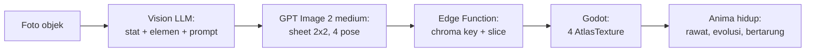

# Scanima

> Foto benda apa pun di sekitarmu. Benda itu jadi monster peliharaan.

Scanima adalah game mobile virtual pet (gaya Tamagotchi/Digimon) di mana setiap monster — disebut **Anima** — diciptakan dari foto objek nyata yang diambil pemain lewat kamera HP. Sebuah mouse komputer jadi Anima berkaki dengan dua tombol sebagai mata. Sebuah cangkir jadi Anima bulat dengan gagang sebagai ekor. Struktur monster harus **True to Object**: merepresentasikan bentuk geometris dan fitur unik objek aslinya, bukan monster generik yang ditempeli warna.

Genre: Virtual Pet + Creature Collector + Basic Tactical Battle.
Art style: 2D anime creature cel-shading — clean bold linework, flat colors, crisp 2–3 level shadows, cute-but-fierce techno-organic design, dan sudut pandang 3/4 terkunci.

## Status

**Phase 1 — pipeline art. Terbukti end-to-end pada 12 Agustus 2026.** Foto sungguhan sudah masuk lewat seluruh rantai — Vision, prompt, generation, chroma key, slicing, manifest — dan Godot merender Anima hasilnya. "True to Object" terverifikasi dengan mata: foto mouse komputer menghasilkan kreatur yang dua tombol kliknya jadi mata, scroll wheel jadi hidung, dan kabelnya jadi ekor bersegmen.

Eksperimen model berikutnya menetapkan **`openai/gpt-image-2` quality `medium`** sebagai default: hasil 1024×1024-nya lebih konsisten untuk anatomi anime dan biaya nyata sekitar $0.07 per sheet, sedangkan `high` sekitar empat kali token output dan 2,5 menit tanpa peningkatan yang sebanding. Prompt production v2 mengikuti [anime cel-shaded style guide](docs/monster_camera_anime_cel_shaded_style_guide.md); gate Gemini tetap tidak berubah.

Konfigurasi v2 sudah lolos dry-run dan pemeriksaan kontrak, tetapi Smoke Set berbayar dengan **template v2 final** belum dijalankan. Hasil eksperimen medium yang memilih modelnya memakai pendahulu langsung template tersebut.

Dua masalah post-processing yang ditemukan pada output nyata juga sudah ditangani: halo hijau di tepi sprite (0,21% → 0,014%) dan anggota tubuh pose kanan yang melewati garis tengah sheet. Slicing sekarang menetapkan kepemilikan per komponen piksel, jadi tangan/kabel yang tersambung tidak dipotong dan bagian pose tetangga tidak ikut tercopy.

| Phase | Isi | Status |
| --- | --- | --- |
| 0 | Arsitektur, prompt spec, desain sistem | Selesai |
| 1 | MVP: buktikan pipeline art end-to-end | Terbukti — 2 sheet penuh, 4/4 pose, gate 2/2 |
| 2 | Backend Supabase + core game loop | Belum mulai |
| 3 | Battle, evolusi, UI/UX, audio, monetisasi | Belum mulai |
| 4 | Soft launch itch.io lalu Play Store | Belum mulai |

Yang sudah bisa dijalankan sekarang, gratis:

```bash
npm install
npm run selftest                 # 17 skenario pemeriksaan, tanpa API

# Godot: 75 pemeriksaan slicing sprite, tanpa jendela
/Applications/Godot.app/Contents/MacOS/Godot --headless --path game \
    --script res://tests/test_sprite_slicing.gd

# Demo: Anima placeholder yang bisa berganti pose dan memantul
/Applications/Godot.app/Contents/MacOS/Godot --path game
```

Kontrak antara kedua sisi juga diuji tanpa biaya. Node menghasilkan sheet, Godot memuatnya:

```bash
node eval/selftest.mjs --emit /tmp/scanima_e2e
/Applications/Godot.app/Contents/MacOS/Godot --headless --path game \
    --script res://tests/test_sprite_slicing.gd -- --manifest=/tmp/scanima_e2e/manifest.json
```

Untuk mengulang run berbayarnya: taruh 5 foto di `eval/photos/` (lihat [panduannya](eval/photos/README.md)), jalankan `--vision-only` dulu (~$0.015), lalu `npm run smoke` (~$0.225). Hasil v2 ditulis ke `eval/results/v2/smoke/index.html`.

## Tech stack

| Layer | Pilihan | Catatan |
| --- | --- | --- |
| Engine | Godot 4.x (Mobile renderer, 2D) | Export Android + Web |
| Image generation | `openai/gpt-image-2` medium via Replicate | 1 panggilan menghasilkan sheet 1024×1024 berisi 4 pose |
| Vision + stat | `google/gemini-2.5-flash` via Replicate | Analisis objek, penentuan stat/elemen, penyusunan visual prompt |
| Backend | Supabase (Postgres + Auth + Storage + Edge Functions) | Proxy API key, kuota, caching, post-processing gambar |

Kedua model lewat Replicate, jadi seluruh proyek hanya butuh **satu kredensial**: `REPLICATE_API_TOKEN`. Ini bukan sekadar setup yang lebih ringkas — di mode BYOK, pemain cukup menempelkan satu token miliknya, bukan dua, dan itu menghapus friksi onboarding yang sebelumnya membuat jalur BYOK hampir tidak layak ditawarkan.

Dua konsekuensi dari memakai wrapper Replicate alih-alih Gemini API langsung, keduanya sudah ditangani di kode dan dijelaskan di [docs/02-prompt-engineering.md](docs/02-prompt-engineering.md): wrapper-nya tidak punya parameter `response_schema`, jadi JSON valid ditegakkan lewat kontrak di prompt plus parser yang tahan bungkus markdown; dan `gemini-2.5-flash` punya tanggal retirement 20 Oktober 2026, jadi migrasi model Vision adalah pekerjaan yang sudah terjadwal, bukan kejutan. Menggantinya cukup lewat env `VISION_MODEL` tanpa menyentuh kode.

## Cara kerja singkat



Satu Anima = satu panggilan image generation = **~$0.07** pada GPT Image 2 medium. Nilai persisnya mengikuti token input, tetapi dua run nyata berada di sekitar angka ini. Hampir semua keputusan ekonomi dan caching mengalir dari biaya tersebut. Lihat [docs/04-game-systems-economy.md](docs/04-game-systems-economy.md).

## Dokumentasi

| Dokumen | Isi |
| --- | --- |
| [docs/01-architecture-dataflow.md](docs/01-architecture-dataflow.md) | Pipeline data lengkap, skema Postgres + RLS, kontrak Edge Function, caching 3 lapis, penanganan latensi, jalur BYOK |
| [docs/02-prompt-engineering.md](docs/02-prompt-engineering.md) | System prompt Vision LLM, JSON schema output, pemetaan fitur objek ke stat, style lock, payload Replicate, harness evaluasi |
| [docs/03-godot-sprite-pipeline.md](docs/03-godot-sprite-pipeline.md) | Arsitektur node Godot, download + slicing sprite, background removal, animasi prosedural |
| [docs/04-game-systems-economy.md](docs/04-game-systems-economy.md) | Survival mechanics, evo-tree, kuota, ekonomi dengan angka nyata, algoritma battle |
| [docs/05-roadmap.md](docs/05-roadmap.md) | Breakdown Phase 1-4 dengan exit criteria dan risiko |
| [docs/monster_camera_anime_cel_shaded_style_guide.md](docs/monster_camera_anime_cel_shaded_style_guide.md) | Sumber art direction v2: linework, cel shading, transformasi objek, pose, dan negative style |
| [CLAUDE.md](CLAUDE.md) | Konteks dan konvensi untuk AI coding agent |

## Struktur repo

```
scanima/
├── game/                         # Godot 4.6 project
│   ├── scenes/anima_demo.tscn
│   ├── scripts/
│   │   ├── anima_loader.gd       # manifest + PNG -> SpriteFrames
│   │   ├── anima_presenter.gd    # pose + gerak prosedural via Tween
│   │   ├── placeholder_sheet.gd  # sheet buatan, untuk demo & test
│   │   └── anima_demo.gd
│   ├── shaders/chroma_key.gdshader   # cadangan, jalur BYOK saja
│   └── tests/test_sprite_slicing.gd  # headless
├── backend/
│   ├── prompts/v1/               # baseline nano-banana-pro, tidak diubah
│   ├── prompts/v2/               # GPT Image 2 medium + anime cel-shaded style
│   └── supabase/                 # Phase 2: Edge Functions + migrations
├── eval/
│   ├── run.mjs                   # foto -> Vision -> Replicate -> sheet + HTML
│   ├── postprocess.mjs           # chroma key, slicing, manifest
│   ├── selftest.mjs              # tanpa API
│   ├── sets.json                 # smoke (5 foto) & full (20 foto)
│   └── photos/                   # tidak di-commit
└── docs/
```

## Setup

Prasyarat: Godot 4.6+, Node 20+. Supabase CLI baru diperlukan di Phase 2.

```bash
npm install
cp .env.example .env      # isi REPLICATE_API_TOKEN, cuma itu
```

Kunci di `.env` **hanya** untuk harness eval di laptop. API key tidak pernah masuk ke build Godot: semua panggilan berbayar lewat Edge Function, kecuali mode BYOK di mana pemain memakai token miliknya sendiri.

Sebelum membelanjakan apa pun, periksa dulu bahwa foto dan template sudah benar:

```bash
node eval/run.mjs --set smoke --dry-run      # gratis
node eval/run.mjs --set smoke --vision-only  # ~$0.015, gate + stat saja
node eval/run.mjs --set smoke                # ~$0.225
```

Urutan itu bukan formalitas. `--vision-only` menguji seluruh jalur Vision — gate keamanan, pemetaan stat, stabilitas `species_key` — dengan harga sekitar seperlima belas dari run penuh, jadi tidak ada alasan menemukan kesalahan prompt Vision lewat tagihan generation gambar.

## Lisensi

Belum ditentukan.
