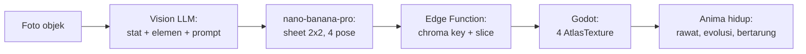

# Scanima

> Foto benda apa pun di sekitarmu. Benda itu jadi monster peliharaan.

Scanima adalah game mobile virtual pet (gaya Tamagotchi/Digimon) di mana setiap monster — disebut **Anima** — diciptakan dari foto objek nyata yang diambil pemain lewat kamera HP. Sebuah mouse komputer jadi Anima berkaki dengan dua tombol sebagai mata. Sebuah cangkir jadi Anima bulat dengan gagang sebagai ekor. Struktur monster harus **True to Object**: merepresentasikan bentuk geometris dan fitur unik objek aslinya, bukan monster generik yang ditempeli warna.

Genre: Virtual Pet + Creature Collector + Basic Tactical Battle.
Art style: 90s anime digital monster concept art — thick clean line art, warna vibrant, sudut pandang terkunci 3/4 isometric.

## Status

**Phase 0 — Dokumentasi.** Belum ada kode. Semua spec teknis sudah ditulis dan siap dieksekusi. Lihat [docs/05-roadmap.md](docs/05-roadmap.md) untuk urutan pengerjaan.

| Phase | Isi | Status |
| --- | --- | --- |
| 0 | Arsitektur, prompt spec, desain sistem | Selesai |
| 1 | MVP: buktikan pipeline art end-to-end | Belum mulai |
| 2 | Backend Supabase + core game loop | Belum mulai |
| 3 | Battle, evolusi, UI/UX, audio, monetisasi | Belum mulai |
| 4 | Soft launch itch.io lalu Play Store | Belum mulai |

## Tech stack

| Layer | Pilihan | Catatan |
| --- | --- | --- |
| Engine | Godot 4.x (Mobile renderer, 2D) | Export Android + Web |
| Image generation | `nano-banana-pro` via Replicate | 1 panggilan menghasilkan sprite sheet 2x2 berisi 4 pose |
| Vision + stat | `gemini-3.1-flash-lite` | Analisis objek, penentuan stat/elemen, penyusunan visual prompt |
| Backend | Supabase (Postgres + Auth + Storage + Edge Functions) | Proxy API key, kuota, caching, post-processing gambar |

Kenapa `gemini-3.1-flash-lite` dan bukan `gemini-1.5-flash` seperti rencana awal: model 1.5 sudah dimatikan Google dan mengembalikan 404. Detail di [docs/01-architecture-dataflow.md](docs/01-architecture-dataflow.md).

## Cara kerja singkat



Satu Anima = satu panggilan image generation = **~$0.134**. Angka ini adalah batasan desain paling penting di seluruh proyek; hampir semua keputusan ekonomi dan caching mengalir darinya. Lihat [docs/04-game-systems-economy.md](docs/04-game-systems-economy.md).

## Dokumentasi

| Dokumen | Isi |
| --- | --- |
| [docs/01-architecture-dataflow.md](docs/01-architecture-dataflow.md) | Pipeline data lengkap, skema Postgres + RLS, kontrak Edge Function, caching 3 lapis, penanganan latensi, jalur BYOK |
| [docs/02-prompt-engineering.md](docs/02-prompt-engineering.md) | System prompt Vision LLM, JSON schema output, pemetaan fitur objek ke stat, style lock, payload Replicate, harness evaluasi |
| [docs/03-godot-sprite-pipeline.md](docs/03-godot-sprite-pipeline.md) | Arsitektur node Godot, download + slicing sprite, background removal, animasi prosedural |
| [docs/04-game-systems-economy.md](docs/04-game-systems-economy.md) | Survival mechanics, evo-tree, kuota, ekonomi dengan angka nyata, algoritma battle |
| [docs/05-roadmap.md](docs/05-roadmap.md) | Breakdown Phase 1-4 dengan exit criteria dan risiko |
| [CLAUDE.md](CLAUDE.md) | Konteks dan konvensi untuk AI coding agent |

## Struktur repo (rencana)

```
scanima/
├── game/                    # Godot project
│   ├── project.godot
│   ├── scenes/              # .tscn
│   ├── scripts/             # .gd
│   ├── shaders/             # .gdshader
│   └── assets/              # art statis, font, audio
├── backend/
│   ├── supabase/
│   │   ├── functions/       # Edge Functions (Deno)
│   │   └── migrations/      # SQL
│   └── prompts/             # prompt versioned, v1/, v2/, ...
├── eval/                    # golden-set foto + hasil evaluasi prompt
└── docs/
```

## Setup (nanti, saat Phase 1 mulai)

Prasyarat: Godot 4.x, Supabase CLI, akun Replicate, akun Google AI Studio.

```bash
# backend
cd backend && supabase start
supabase secrets set REPLICATE_API_TOKEN=... GEMINI_API_KEY=...

# game
godot --path game
```

API key **tidak pernah** masuk ke build Godot. Semua panggilan berbayar lewat Edge Function, kecuali mode BYOK di mana pemain memakai token miliknya sendiri.

## Lisensi

Belum ditentukan.
