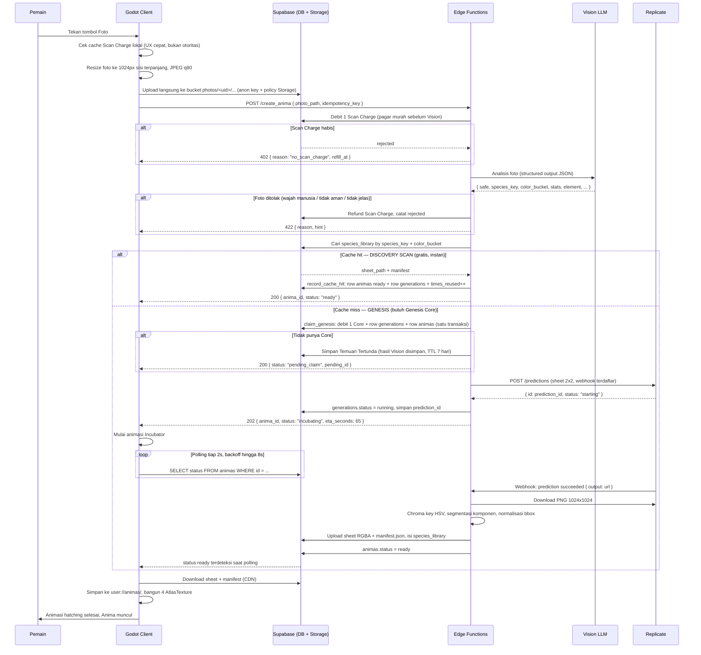
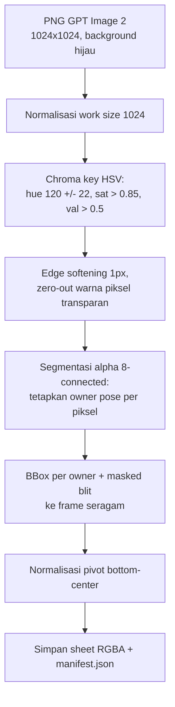
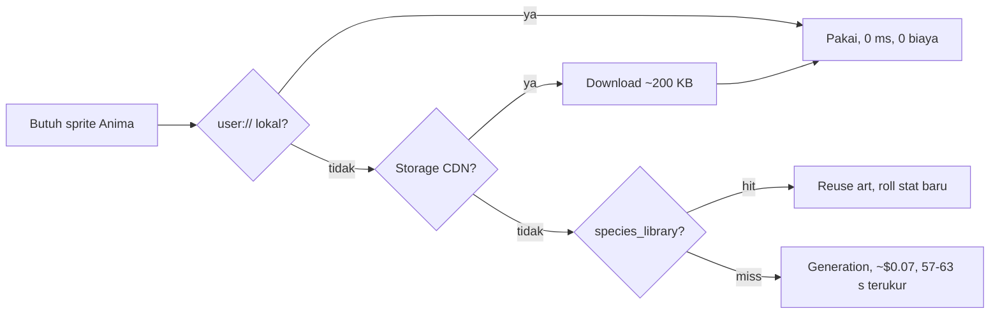
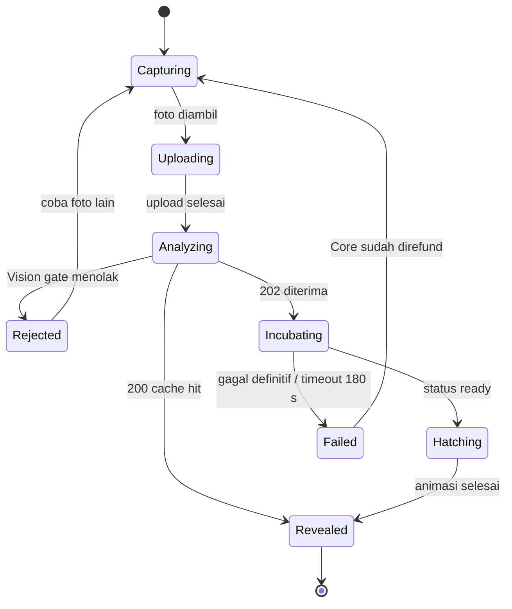
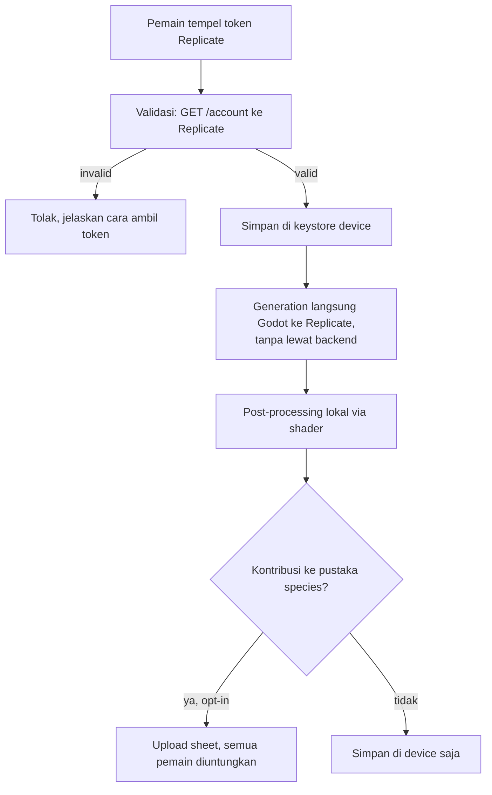

# 01 — Architecture & Data Flow Pipeline

Dokumen ini mendefinisikan apa yang terjadi antara pemain menekan tombol kamera dan Anima muncul di layar: komponen apa yang terlibat, siapa yang memegang uang dan kunci, bagaimana biaya ditekan lewat caching, dan bagaimana jeda sekitar satu menit dibungkus jadi pengalaman yang menyenangkan.

## 1. Prinsip arsitektur

Empat aturan yang menentukan bentuk seluruh sistem:

**Client itu bodoh dan tidak dipercaya.** Godot tidak menyimpan API key, tidak memutuskan kuota, dan tidak memproses piksel. Ia mengirim foto, menunggu, lalu memasang tekstur. Semua yang menghabiskan uang atau bisa dicurangi hidup di server.

**Semua pekerjaan piksel selesai di backend.** Edge Function yang melakukan chroma key, slicing, dan trimming, lalu menyimpan satu PNG RGBA + `manifest.json`. Konsekuensinya: hasil olahan bisa di-cache dan dibagi antar device, device low-end tidak perlu membakar CPU, dan kalau algoritma keying diperbaiki nanti kita bisa re-process aset lama tanpa update aplikasi.

**Tidak ada uang keluar tanpa jejak.** Setiap generation punya row di tabel `generations` dengan `idempotency_key`, `prompt_version`, dan `cost_usd_estimate`. Retry jaringan tidak boleh berarti double charge.

**Cache dulu, generate kemudian.** Generation adalah jalur paling mahal dan paling lambat, jadi ia adalah pilihan terakhir setelah tiga lapis cache gagal.

### Pilihan model dan alasannya

| Peran | Model | Alasan |
| --- | --- | --- |
| Vision, stat, taksonomi | `google/gemini-2.5-flash` via Replicate | Satu vendor dengan model gambar, ~$0.003 per panggilan |
| Image generation | `openai/gpt-image-2` medium via Replicate | Anime cel-shaded paling konsisten pada uji nyata; mendukung editing lewat `input_images`; ~$0.07 |

Spesifikasi awal menyebut `gemini-1.5-flash`, dan itu perlu dikoreksi: **model tersebut sudah dimatikan Google** dan request dengan ID itu mengembalikan 404.

Keputusan yang lebih menentukan bukan soal versi model, melainkan **lewat mana ia dipanggil**. Replicate juga meng-host Gemini, jadi Vision bisa berjalan di sana alih-alih memanggil Gemini API langsung. Konsekuensinya: seluruh proyek hanya butuh satu kredensial, `REPLICATE_API_TOKEN`. Itu menyederhanakan setup, tapi yang jauh lebih penting adalah dampaknya ke **mode BYOK** — pemain cukup menempelkan satu token miliknya, bukan dua. Meminta pemain mendaftar di dua penyedia sekaligus adalah friksi yang sebelumnya membuat jalur BYOK hampir tidak layak ditawarkan.

GPT-4o-mini yang juga disebut di spesifikasi awal bisa bekerja untuk peran ini, tapi tidak dipilih justru karena alasan yang sama: satu vendor, satu tagihan, satu tempat memeriksa kuota ketika ada yang salah.

Dua harga yang harus dibayar untuk konsolidasi itu, keduanya nyata dan keduanya sudah ditangani:

Pertama, **wrapper Replicate tidak punya parameter `response_schema`**. Parameter yang tersedia hanya `prompt`, `images`, `videos`, `system_instruction`, `temperature`, `top_p`, `max_output_tokens`, `thinking_budget`, dan `dynamic_thinking`. Jaminan "selalu JSON valid" dari structured output Gemini langsung karenanya hilang. Penggantinya: skema disisipkan literal ke `system_instruction`, keluaran diurai oleh parser yang tahan bungkus markdown dan kalimat pengantar, dan kalau tetap gagal ada satu percobaan ulang pada temperature 0. Retry itu tidak melanggar aturan "jangan retry otomatis", karena aturan tersebut menyangkut generation gambar yang sekitar 23 kali lebih mahal.

Kedua, **`gemini-2.5-flash` punya tanggal retirement 20 Oktober 2026**. Ini plafon yang diketahui sejak awal, bukan kejutan yang akan menabrak nanti: penggantinya sudah tersedia di Replicate (`google/gemini-3-flash`, `google/gemini-3.5-flash`), dan berpindah hanya perlu mengganti env `VISION_MODEL`. Yang tidak boleh dilewatkan saat berpindah adalah menjalankan ulang Smoke Set, sebab stat dan `species_key` bisa bergeser antar model dan pergeseran `species_key` berarti cache miss massal.

Biaya per panggilan Vision naik dari perkiraan awal ~$0.0003 menjadi ~$0.003 karena kelas modelnya lebih besar. Rinciannya: ~2,7k token teks (system prompt + skema) ditambah ~1k token untuk satu gambar 1024px, lalu ~700 token output. Dalam angka absolut ini sekitar seperduapuluh tiga harga satu gambar, tapi ia **tidak lagi bisa dianggap nol** saat menghitung ekonomi Discovery Scan, dan itu mengubah aritmetika iklan di [04](04-game-systems-economy.md) secara material.

`thinking_budget` diset 0 justru untuk menahan angka ini: token thinking ditagih sebagai token output, dan output di model ini delapan kali lebih mahal daripada input ($2.50 vs $0.30 per 1M). Tugas Vision di sini ekstraksi terstruktur, bukan penalaran berantai, jadi tidak ada yang hilang. Konsekuensi lain dari asimetri harga itu: **field output yang panjang berbiaya nyata**. `stat_reasoning` ada untuk keperluan eval dan debugging manusia; di produksi ia bisa dihilangkan dari skema dan itu sendiri memotong biaya Vision hampir separuh. Itu tuas termurah yang tersedia kalau tagihan Vision pernah terasa menekan — lebih murah daripada memangkas kuota gratis pemain.

Nama model **tidak boleh di-hardcode**. Keduanya disimpan di konfigurasi dan dicatat per baris di `generations.model`, sebab model gambar adalah komponen yang paling mungkin berubah harga atau dihentikan, dan ketika itu terjadi kita perlu bisa berpindah tanpa merilis ulang aplikasi.

## 2. Diagram alur lengkap



## 3. Komponen dan tanggung jawabnya

| Komponen | Tanggung jawab | Yang **tidak** boleh dilakukan |
| --- | --- | --- |
| Godot client | Ambil foto, resize, upload, polling, cache lokal, render | Simpan API key, tentukan kuota, proses piksel |
| `create_anima` | Vision, cek pustaka, lalu klaim Core hanya bila spesies baru | Menunggu gambar selesai (harus balik cepat) |
| `replicate_webhook` | Post-processing gambar, isi cache, tandai ready | Dipercaya tanpa verifikasi signature |
| `care_anima` | Verifikasi JWT, teruskan aksi care idempoten ke transaksi Postgres | Menerima `owner_id` dari client atau memanggil model |
| `battle_anima` | Start/resume/turn/forfeit; hitung formula; commit session | Menerima HP baru atau klaim kemenangan dari client |
| `shop` | Verifikasi JWT, debit Bits, upsert inventory, replay receipt | Dipanggil lewat RPC `purchase_catalog_item` dari client |
| `evolve_anima` | Generation stage berikutnya pakai sprite lama sebagai input | Dipanggil tanpa cek syarat evolusi di server |
| Postgres | Sumber kebenaran untuk kuota, stat, kepemilikan | Menyimpan foto mentah |
| Storage | Foto sementara, sheet RGBA, manifest | Menyimpan foto lebih dari 24 jam |

## 4. Skema database

```sql
-- Profil pemain, 1:1 dengan auth.users
-- Tiga mata uang, alasan pembagiannya ada di doc 04:
-- scan_charges  -> Discovery Scan, biaya kita ~$0.003, boleh murah
-- genesis_cores -> Genesis (spesies baru), biaya kita ~$0.07, harus dijaga
-- bits          -> item perawatan, biaya kita nol
create table profiles (
  id             uuid primary key references auth.users on delete cascade,
  display_name   text,
  scan_charges   int  not null default 8,
  scan_charge_max int not null default 8,
  genesis_cores  int  not null default 3,        -- 3 gratis saat onboarding
  bits           int  not null default 30,       -- starter care pack
  next_refill_at timestamptz,
  byok_enabled   bool not null default false,
  timezone_offset_minutes int not null default 0, -- menit timur UTC; bukan jam device
  timezone_offset_set_at timestamptz,             -- kunci ganti zona 24 jam
  created_at     timestamptz not null default now(),
  last_seen_at   timestamptz not null default now()
);

-- Pustaka art global. Inti dari penghematan biaya.
--
-- Primary key-nya TRIPLE, bukan species_key sendirian. Versi pertama dokumen ini
-- memakai species_key sebagai PK dan itu membatalkan seluruh gagasan dedup:
-- `color_bucket` ada justru supaya mug merah dan mug biru mendapat art berbeda,
-- dan evolusi menambah baris stage 2 dan 3 untuk species_key yang sama. Baris
-- kedua mana pun akan ditolak, dan penolakannya terjadi di tempat terburuk —
-- setelah sheet-nya dibayar dan diunggah. Lihat migrasi species_library_key_fix.
create table species_library (
  species_key    text not null,                 -- 'mug_ceramic_handled'
  color_bucket   text not null,                 -- 'warm_red', 'neutral_dark', ...
  sheet_path     text not null,                 -- Storage: sheets/<hash>.png (RGBA)
  manifest       jsonb not null,                -- region 4 pose, lihat doc 03
  stage          smallint not null default 1,   -- 1=baby, 2=adult, 3=perfect
  prompt_version text not null,
  times_reused   int  not null default 0,
  created_at     timestamptz not null default now(),
  primary key (species_key, color_bucket, stage)
);

-- Anima milik pemain
create table animas (
  id             uuid primary key default gen_random_uuid(),
  owner_id       uuid not null references profiles on delete cascade,
  nickname       text not null,
  species_key    text not null,
  color_bucket   text not null,
  stage          smallint not null default 1,
  status         text not null default 'incubating',  -- incubating|ready|failed
  element        text not null,                       -- lihat doc 04
  rarity         smallint not null,                   -- 1..5
  base_stats     jsonb not null,                      -- { hp, atk, def, spd, special }
  care           jsonb not null,                      -- { hunger, energy, hygiene, bond:0 }
  care_score     int  not null default 0,             -- EXP pemain; level = 1+floor(exp/5)
  born_at        timestamptz not null default now(),
  care_synced_at timestamptz not null default now(),  -- basis perhitungan decay
  sleep_started_at timestamptz,
  sleep_energy_at_start double precision,
  well_cared_on  date,                                -- bonus +8 per hari sipil lokal
  play_score_on  date,
  play_score_today smallint not null default 0,       -- cap +5 per hari sipil lokal
  dormant_since  timestamptz,                         -- bukan generation status
  battle_wins    int not null default 0,
  created_at     timestamptz not null default now()
);
create index on animas (owner_id, status);

-- Ledger setiap panggilan berbayar. Append-only.
create table generations (
  id             uuid primary key default gen_random_uuid(),
  owner_id       uuid not null references profiles on delete cascade,
  anima_id       uuid references animas on delete set null,
  idempotency_key text not null,
  kind           text not null,                 -- create|evolve
  status         text not null default 'pending', -- pending|running|succeeded|failed|rejected|cache_hit
  prediction_id  text,                          -- id Replicate
  prompt_version text not null,
  model          text not null,                 -- 'openai/gpt-image-2'
  cost_usd_estimate numeric(8,4) not null default 0,
  vision_result  jsonb,
  error          text,
  created_at     timestamptz not null default now(),
  finished_at    timestamptz,
  unique (owner_id, idempotency_key)
);

-- Jejak perubahan mata uang, untuk audit dan debugging sengketa
create table quota_ledger (
  id         bigserial primary key,
  owner_id   uuid not null references profiles on delete cascade,
  currency   text not null,                     -- scan_charges|genesis_cores|bits
  delta      int  not null,                     -- negatif debit, positif kredit
  reason     text not null,                     -- scan|genesis|refund|daily_refill|iap|ad|battle
  ref_id     uuid,                              -- generations.id bila relevan
  created_at timestamptz not null default now()
);

-- Intent care idempoten + audit. RLS aktif tanpa policy; hanya service_role.
create table care_events (
  id               uuid primary key default gen_random_uuid(),
  owner_id         uuid not null references profiles on delete cascade,
  anima_id         uuid not null references animas on delete cascade,
  idempotency_key  text not null,
  action           text not null,       -- feed|clean|sleep|wake|play
  bits_spent       int not null default 0,
  care_score_delta int not null default 0,
  created_at       timestamptz not null default now(),
  unique (owner_id, idempotency_key)
);

-- Battle 1v1 server-authoritative. Keduanya RLS tanpa policy client.
create table battle_sessions (
  id                uuid primary key default gen_random_uuid(),
  owner_id          uuid not null references profiles on delete cascade,
  player_anima_id   uuid not null references animas on delete restrict,
  bot_anima_id      uuid references animas on delete set null,
  player_snapshot   jsonb not null,
  bot_snapshot      jsonb not null,       -- tanpa owner_id/nickname
  state             jsonb not null,
  turn_number       int not null default 1,
  rng_seed          text not null,
  status            text not null default 'active',
  version           int not null default 1,
  rewarded_at       timestamptz,
  expires_at        timestamptz not null default now() + interval '30 minutes',
  created_at        timestamptz not null default now(),
  updated_at        timestamptz not null default now(),
  finished_at       timestamptz
);

create table battle_turns (
  id               uuid primary key default gen_random_uuid(),
  session_id       uuid not null references battle_sessions on delete cascade,
  turn_number      int not null,
  idempotency_key  text not null,
  action           text not null,         -- strike|surge|guard|item
  response         jsonb not null,        -- event log authoritative untuk replay
  created_at       timestamptz not null default now(),
  unique (session_id, turn_number),
  unique (session_id, idempotency_key)
);

-- Temuan Tertunda: spesies baru ditemukan tapi pemain belum punya Core.
-- Hasil Vision sudah dibayar, jadi jangan dibuang — biarkan diklaim nanti
-- tanpa harus memfoto ulang objek yang mungkin sudah tidak ada di dekatnya.
create table pending_discoveries (
  id            uuid primary key default gen_random_uuid(),
  owner_id      uuid not null references profiles on delete cascade,
  species_key   text not null,
  color_bucket  text not null,
  vision_result jsonb not null,
  created_at    timestamptz not null default now(),
  expires_at    timestamptz not null default now() + interval '7 days',
  claimed_at    timestamptz,
  unique (owner_id, species_key, color_bucket)
);

create table catalog_items (
  id            text primary key,
  kind          text not null,            -- food|item
  use_type      text not null,            -- food|energy|battle
  name_key      text not null,
  price         int not null,
  effect        text not null,
  effect_value  numeric not null,
  sprite_sheet  text not null,            -- food|item
  sprite_index  smallint not null,        -- 0..8
  active        boolean not null default true
);

create table player_inventory (
  owner_id   uuid not null references profiles on delete cascade,
  item_id    text not null references catalog_items,
  quantity   int not null,                -- 0..999
  updated_at timestamptz not null default now(),
  primary key (owner_id, item_id)
);

create table shop_purchases (
  id               uuid primary key default gen_random_uuid(),
  owner_id         uuid not null references profiles on delete cascade,
  item_id          text not null references catalog_items,
  price            int not null,
  idempotency_key  text not null,
  created_at       timestamptz not null default now(),
  unique (owner_id, idempotency_key)
);
```

### Row Level Security

RLS aktif di semua tabel. Pemain hanya bisa membaca miliknya sendiri dan **tidak bisa menulis apa pun yang berhubungan dengan kuota** — itu hak Edge Function lewat service role. `battle_sessions`, `battle_turns`, dan `shop_purchases` sengaja tidak punya policy sama sekali: client bahkan tidak membaca receipt pembelian atau state internal lewat PostgREST. Katalog `catalog_items` dan `player_inventory` SELECT-only; pembelian lewat `shop`.

Bentuk yang benar-benar ter-apply ada di [`backend/supabase/migrations/20260812172744_rls_and_guards.sql`](../backend/supabase/migrations/20260812172744_rls_and_guards.sql). Blok di bawah adalah rancangannya, dan empat hal berubah saat implementasi karena rancangan ini kurang ketat:

1. Semua policy memakai `(select auth.uid())` dan `to authenticated`. Sub-select membuat Postgres mengevaluasinya sekali per query, bukan sekali per baris.
2. **Hak kolom Postgres, bukan trigger, yang menjadi lapis utama.** `revoke update on profiles` lalu `grant update (display_name, last_seen_at)` membuat client secara struktural tidak punya privilege menulis kolom mata uang, dan kolom baru apa pun di masa depan otomatis tertutup. Trigger tetap ada sebagai lapis kedua.
3. `app_config` ikut RLS **tanpa policy sama sekali**, plus `revoke all`, karena sakelar biaya bukan urusan client. Advisor Supabase melaporkan ini sebagai INFO `rls_enabled_no_policy`; itu memang yang kita inginkan.
4. Keempat fungsi kuota SECURITY DEFINER dicabut EXECUTE-nya dari `anon` dan `authenticated`. Tanpa itu, Postgres memberi EXECUTE ke PUBLIC dan `refund_generation` menjadi endpoint publik di `/rest/v1/rpc/` — pemain bisa mengembalikan Core-nya sendiri sementara gambarnya tetap kita bayar.

```sql
alter table profiles            enable row level security;
alter table animas              enable row level security;
alter table generations         enable row level security;
alter table quota_ledger        enable row level security;
alter table species_library     enable row level security;
alter table pending_discoveries enable row level security;
alter table app_config          enable row level security;

-- Pemain baca profil sendiri; kolom mata uang tidak pernah bisa diubah client
create policy "read own profile" on profiles
  for select using (auth.uid() = id);
create policy "update own cosmetics" on profiles
  for update using (auth.uid() = id)
  with check (auth.uid() = id);
-- Catatan: kolom mata uang dilindungi oleh trigger di bawah, bukan oleh
-- policy, karena policy tidak bisa membatasi per-kolom.

-- Pemain boleh baca + update Anima sendiri (untuk aksi perawatan),
-- tapi tidak boleh insert (insert hanya lewat Edge Function)
create policy "read own animas" on animas
  for select using (auth.uid() = owner_id);
create policy "update own animas" on animas
  for update using (auth.uid() = owner_id) with check (auth.uid() = owner_id);

-- Ledger, generations, dan temuan tertunda: baca saja
create policy "read own generations" on generations
  for select using (auth.uid() = owner_id);
create policy "read own ledger" on quota_ledger
  for select using (auth.uid() = owner_id);
create policy "read own pending" on pending_discoveries
  for select using (auth.uid() = owner_id);

-- Pustaka species boleh dibaca semua orang yang login (art di-share)
create policy "read species" on species_library
  for select to authenticated using (true);
```

Trigger yang mengunci kolom sensitif dari update client:

```sql
create or replace function guard_profile_columns() returns trigger
language plpgsql set search_path = '' as $$
begin
  -- Whitelist, bukan blacklist: yang diperiksa adalah "apakah ada kolom LAIN
  -- yang berubah", jadi menambah kolom mata uang baru tidak perlu mengingat
  -- untuk memperbarui trigger ini.
  if current_role not in ('service_role', 'postgres', 'supabase_admin')
     and (to_jsonb(new) - 'display_name' - 'last_seen_at')
         is distinct from (to_jsonb(old) - 'display_name' - 'last_seen_at') then
    raise exception 'hanya display_name dan last_seen_at yang boleh diubah client';
  end if;
  return new;
end $$;

create trigger guard_profiles before update on profiles
  for each row execute function guard_profile_columns();
```

Dua detail di trigger itu berbeda dari rancangan awal dan keduanya penting. Ia memeriksa `current_role`, bukan `request.jwt.claim.role`, karena klaim JWT adalah data request yang bisa hilang atau dipalsukan konteksnya sementara peran koneksi tidak. Dan ia berupa whitelist: daftar kolom mata uang yang harus diingat manusia adalah daftar yang cepat atau lambat ketinggalan satu kolom.

Aksi perawatan **tidak lagi client-writable**. Feed memakai inventory, Clean memakai Bits, dan semua aksi bisa menaikkan `care_score`, jadi kebutuhan ikut menjadi bagian transaksi ekonomi. Hak UPDATE client pada `animas` sekarang hanya `nickname`; `care`, `care_synced_at`, sleep, counter harian, Dormant, dan `care_score` hanya berubah lewat `apply_care()` service-role.

RPC itu mengunci row Anima + profil, menghitung decay lebih dulu, mengonsumsi makanan/item atau mendebit Bits, menulis `quota_ledger` bila perlu, lalu menulis satu `care_events` untuk idempotency—semuanya satu transaksi. Edge Function `care_anima` memverifikasi JWT dan selalu menurunkan `owner_id` dari user terverifikasi, bukan body client. Timeout/app kill aman karena `GameState.pending_care` me-replay key yang sama beserta `item_id`.

### Klaim Core yang atomik

Debit Genesis Core dan pencatatan generation harus terjadi dalam satu transaksi, kalau tidak dua request paralel bisa lolos bersamaan dengan sisa Core 1 — dan itu berarti sekitar $0.07 keluar tanpa dibayar.

```sql
create or replace function public.claim_genesis(
  p_owner uuid, p_key text, p_nickname text, p_species text, p_color text,
  p_stage smallint, p_element text, p_rarity int, p_stats jsonb, p_care jsonb,
  p_vision jsonb, p_prompt_version text, p_model text, p_cost numeric,
  p_photo_path text
) returns jsonb
language plpgsql security definer set search_path = '' as $$
declare
  v_gen   public.generations;
  v_anima public.animas;
  v_cores int;
begin
  -- Idempotency: request yang sama dua kali balikkan baris yang sama.
  -- Inilah yang membuat retry jaringan tidak pernah berarti double charge.
  select * into v_gen from public.generations
   where owner_id = p_owner and idempotency_key = p_key;
  if found then
    return jsonb_build_object('generation_id', v_gen.id, 'anima_id', v_gen.anima_id);
  end if;

  -- Lock baris profil, cegah race antar request paralel
  select genesis_cores into v_cores from public.profiles where id = p_owner for update;
  if v_cores <= 0 then raise exception 'NO_CORE'; end if;

  -- Cap biaya harian diperiksa di sini, bukan di Edge Function: lock-nya sudah
  -- dipegang, jadi pemeriksaan dan debitnya satu transaksi.
  -- (... baca app_config.daily_spend_cap_usd, raise SPEND_CAP kalau tembus ...)

  update public.profiles set genesis_cores = genesis_cores - 1 where id = p_owner;

  insert into public.animas (owner_id, nickname, species_key, color_bucket, stage,
                             status, element, rarity, base_stats, care)
  values (p_owner, p_nickname, p_species, p_color, p_stage, 'incubating',
          p_element, least(5, greatest(1, p_rarity)), p_stats, p_care)
  returning * into v_anima;

  insert into public.generations
    (owner_id, anima_id, idempotency_key, kind, status, prompt_version, model,
     cost_usd_estimate, vision_result, photo_path)
  values (p_owner, v_anima.id, p_key, 'create', 'pending', p_prompt_version,
          p_model, p_cost, p_vision, p_photo_path)
  returning * into v_gen;

  insert into public.quota_ledger (owner_id, currency, delta, reason, ref_id)
  values (p_owner, 'genesis_cores', -1, 'genesis', v_gen.id);

  return jsonb_build_object('generation_id', v_gen.id, 'anima_id', v_anima.id);
end $$;
```

Baris `animas` ikut dibuat di dalam fungsi ini, bukan menyusul lewat panggilan
kedua dari Edge Function. Alasannya sama dengan alasan debit dan pencatatan
disatukan: kalau fungsi mati di antara dua panggilan, pemain kehilangan satu Core
tanpa mendapat apa pun, dan tidak ada pemeriksaan yang bisa membedakan keadaan itu
dari generation sah yang sedang menunggu. Kembarannya untuk jalur gratis,
`record_cache_hit(...)`, menyatukan hal yang setara: baris `animas` berstatus
`ready`, baris `generations` berbiaya nol, dan kenaikan `times_reused`.

Fungsi kembarnya, `refund_generation(p_gen_id, p_reason)`, mengembalikan Core, menulis ledger, dan menandai status. Dipanggil pada dua kondisi: kegagalan atau pembatalan dari Replicate, dan timeout keras.

Perhatikan bahwa cache hit **tidak** butuh refund, karena Core tidak pernah didebit untuk Discovery Scan — pengecekan pustaka terjadi sebelum `claim_genesis` dipanggil. Ini alasan urutan langkah di bawah tidak boleh ditukar: memeriksa lebih dulu lalu menagih menghasilkan lebih sedikit jalur refund, dan setiap jalur refund adalah tempat uang bisa hilang tanpa jejak.

Scan Charge memakai fungsi terpisah `claim_scan_charge(p_owner)` dengan pola lock yang sama. Ia lebih longgar (nilainya $0.003) tapi tetap harus atomik, sebab tanpa pagar itu satu klien yang rusak bisa memanggil Vision beribu kali — dan pada harga ini seribu panggilan liar sudah $3, bukan $0,30.

## 5. Kontrak Edge Function

### Unggah foto: tidak ada endpoint

Foto tidak lewat Edge Function, dan juga tidak lewat endpoint penerbit signed URL.
Client menulis langsung ke `photos/<uid>/<uuid>.jpg` dengan anon key-nya, dan yang
membatasinya sudah disediakan platform:

```sql
create policy "unggah foto ke folder sendiri" on storage.objects
  for insert to authenticated
  with check (
    bucket_id = 'photos'
    and (storage.foldername(name))[1] = (select auth.uid())::text
  );
```

Batas ukuran dan tipe ditegakkan bucket (`file_size_limit` 6 MB,
`allowed_mime_types` jpeg/png/webp), bukan kode kita. Menulis endpoint penerbit
signed URL berarti menulis dan menguji ulang pagar per-path yang sudah ada, demi
satu round-trip tambahan sebelum tiap foto. `create_anima` hanya menerima
`photo_path` dan memeriksa prefiksnya cocok dengan uid dari token — itu batas
kepercayaannya, dan itu tetap wajib. Terverifikasi terhadap bucket produksi:
folder sendiri diterima, folder pemain lain dijawab RLS dengan 403, `text/plain`
dijawab bucket dengan 415.

INSERT adalah **satu-satunya** policy di bucket ini, dan itu bukan kelalaian.
Client tidak pernah perlu membaca, melihat daftar, atau menghapus fotonya: yang
membacanya adalah Edge Function lewat signed URL service role, dan yang
menghapusnya adalah server begitu post-processing selesai. Menambahkan SELECT
berarti memberi jalan membaca foto yang seharusnya sudah lenyap.

Identitas yang dipakai policy ini datang dari **sign-in anonim**, dan itu mati
secara default di project Supabase baru — `POST /auth/v1/signup` menjawab
`anonymous_provider_disabled`. Karena Scanima tidak punya layar login, setelan itu
adalah prasyarat, bukan opsi: tanpa ia menyala, app gagal di detik pertama, di
jalur yang tidak memanggil API sama sekali. Ia dideklarasikan di
`backend/supabase/config.toml` supaya tidak hanya hidup sebagai sakelar dashboard.

### `POST /create_anima`

Blok di bawah ini adalah kontrak yang **sudah ter-deploy**, bukan usulan. Ia
berbeda dari rancangan awal di dua hal yang akan langsung menggigit penulis client:
`photo_path` relatif terhadap bucket (**tanpa** awalan `photos/`, sebab prefiksnya
dibandingkan dengan uid), dan field-nya bernama `nickname`, bukan
`nickname_hint`. Saldo tidak dikembalikan di response mana pun — client membaca
`profiles`-nya sendiri lewat RLS, jadi tidak ada dua sumber kebenaran untuk saldo.

```jsonc
// Request
{
  "photo_path": "<user_id>/<uuid>.jpg",   // relatif bucket photos, prefiks wajib uid
  "idempotency_key": "c1f8...",            // wajib, maks 128 char
  "nickname": null                         // opsional; null = pakai usulan Vision
}

// 200 — DISCOVERY SCAN: spesies sudah ada di pustaka, gratis dan instan
{ "cache_hit": true, "generation_id": "...", "anima_id": "...",
  "status": "ready", "sheet_path": "...", "manifest": { }, "vision": { } }

// 202 — GENESIS: spesies baru, generation berjalan, webhook yang menyelesaikan
{ "generation_id": "...", "anima_id": "...", "status": "running",
  "eta_seconds": 65, "vision": { } }

// 200 — request yang sama dikirim ulang; tidak ada yang didebit dua kali
{ "idempoten": true, "generation_id": "...", "anima_id": "...", "status": "running" }

// 200 — gate menolak foto. Scan Charge sudah direfund dan fotonya sudah dihapus
{ "gate": "rejected", "reason": "human_face" }

// 402 — Scan Charge habis, Vision belum dipanggil
{ "error": "NO_SCAN_CHARGE" }

// 402 — spesies baru tapi Core habis. Hasil Vision sudah dibayar, jadi disimpan
{ "error": "NO_CORE", "pending": true, "vision": { } }

// 403 photo_path di luar folder sendiri · 400 idempotency_key hilang
// 404 foto tidak ada · 502 Vision gagal atau tak bisa diparse (charge direfund)
// 503 SPEND_CAP harian tercapai
{ "error": "..." }
```

Fungsi ini **harus** balik dalam beberapa detik. Ia tidak menunggu gambar selesai; itu tugas webhook. Urutan internalnya:

1. Verifikasi JWT, ambil `owner_id`. Periksa `photo_path` berada di dalam `<owner_id>/` — tanpa ini, pemain bisa menunjuk foto pemain lain dan signed URL yang kita terbitkan dengan service role akan menurutinya.
2. Terbitkan signed **download** URL foto (TTL 15 menit) supaya Vision LLM dan Replicate bisa membacanya. GPT Image 2 menerima `input_images` berupa array URL, jadi foto wajib punya URL publik sementara. TTL-nya harus melebihi ~60 detik generation plus antrean Replicate, bukan cuma umur request kita. Langkah ini sengaja mendahului klaim charge: foto yang tidak ada menghasilkan 404 sebelum ada apa pun yang perlu direfund.
3. `claim_scan_charge(owner_id)` — pagar murah sebelum memanggil Vision. Kalau habis, balik 402 tanpa efek samping.
4. Panggil Vision LLM. Kalau gate-nya menolak (wajah, tidak aman, bukan objek), refund Scan Charge, hapus fotonya, balik 200 dengan `gate: "rejected"` — penolakan yang wajar bukan galat, dan client menampilkannya sebagai saran, bukan error.
5. Normalisasi `species_key` terhadap entri yang sudah ada (Levenshtein ≤ 2) supaya typo tidak memecah cache.
6. Cari `species_library` untuk `(species_key, color_bucket, stage=1)`. **Ada** → Discovery Scan: `record_cache_hit(...)` membuat `animas` status `ready`, mencatat generation berbiaya nol, dan menaikkan `times_reused` dalam satu transaksi. Balik 200. Tidak ada Core yang tersentuh.
7. **Tidak ada** → Genesis. `claim_genesis(...)`; kalau `NO_CORE`, simpan `pending_discoveries` (hasil Vision jangan dibuang, biayanya sudah keluar) dan balik 402 dengan `pending: true`. Kalau `SPEND_CAP`, balik 503.
8. `POST` ke Replicate dengan `webhook` + `webhook_events_filter: ["completed"]`, simpan `prediction_id`, balik 202.

Urutan langkah 6 sebelum 7 adalah inti kontrol biaya seluruh sistem, dan bukan sekadar optimasi: ia yang memisahkan aksi $0.003 dari aksi ~$0.07 sehingga keduanya bisa diberi harga berbeda kepada pemain. Alasan desain lengkapnya di [04](04-game-systems-economy.md).

### `POST /replicate_webhook`

Endpoint publik, jadi harus diverifikasi. Replicate menandatangani setiap kiriman dengan HMAC-SHA256 (`webhook-id`, `webhook-timestamp`, `webhook-signature`); verifikasi sebelum menyentuh database, dan tolak timestamp yang lebih tua dari 5 menit supaya kiriman lama tidak bisa diputar ulang.

Rahasia penanda tangannya **tidak** dipasang sebagai secret terpisah: fungsi mengambilnya dari `GET /v1/webhooks/default/secret` memakai `REPLICATE_API_TOKEN` yang sudah ada, lalu men-cache-nya selama instance hidup. Satu kredensial lebih sedikit berarti satu langkah setup yang tidak bisa terlupakan — dan webhook tanpa verifikasi berarti siapa pun bisa menulis ke `species_library` yang di-share semua pemain.

Langkah:

1. Verifikasi signature. Gagal, balik 401 dan jangan log body mentah.
2. Cocokkan `prediction_id` ke row `generations`. Tidak ada, balik 200 (jangan bikin Replicate retry selamanya).
3. `status == "failed"` atau `canceled`: refund Genesis Core, `animas.status = failed`, selesai.
4. `succeeded`: unduh PNG dari `output` (string URI tunggal, dan host-nya wajib diperiksa masih `replicate.delivery`), jalankan post-processing (bagian 6), upload hasil, isi `species_library`, set `animas.status = ready`, `generations.status = succeeded`.
5. Hapus foto mentah dari Storage.

Webhook idempoten: kalau `generations.status` sudah `succeeded`, balik 200 tanpa memproses ulang.

### `POST /care_anima`

Endpoint JWT-protected, tanpa model call dan tanpa background job:

```jsonc
{ "anima_id": "b3d1...", "action": "feed", "item_id": "ember_noodles", "idempotency_key": "..." }
```

`sync` tidak membutuhkan key; `feed`, `clean`, `sleep`, `wake`, `play`, `summon`, dan `use_item` wajib memilikinya. `feed` dan `use_item` wajib `item_id`. RPC `apply_care()` menghitung decay sejak `care_synced_at` (cap 48 jam, tanpa grace), Sleep, bonus harian, serta Dormant sebelum memproses aksi. Feed mengonsumsi makanan inventory; Clean gratis; Play memakai 5 Energy; item Energy dijepit 100 tanpa EXP. Battle/Train memotong 20 Energy saat session baru dimulai, dan response selalu membawa snapshot Anima terbaru beserta saldo Bits. Fungsi SQL hanya bisa dieksekusi `service_role`; peran `authenticated` tidak dapat melewati Edge Function lewat `/rest/v1/rpc`.

### `POST /battle_anima`

Endpoint JWT-protected dengan empat operasi:

```jsonc
{ "operation": "start", "anima_id": "..." }
{ "operation": "resume", "session_id": "..." }
{ "operation": "turn", "session_id": "...", "expected_turn": 1,
  "expected_version": 1, "action": "strike", "idempotency_key": "..." }
{ "operation": "turn", "session_id": "...", "expected_turn": 1,
  "expected_version": 1, "action": "item", "item_id": "vital_patch",
  "idempotency_key": "..." }
{ "operation": "forfeit", "session_id": "..." }
```

`start` menyinkronkan care lalu menolak Anima yang bukan milik pemain, belum
`ready`, tidur, atau Dormant. Bot dipilih service role dari Anima `ready` milik
pemain lain yang art-nya ada di `species_library`; snapshot yang dikirim ke
client tidak memuat `owner_id` atau nickname.

Formula hanya hidup di
`backend/supabase/functions/_shared/battle.mjs`. Edge Function menghitung satu
turn, tetapi RPC `commit_battle_turn()` yang mengunci session, memeriksa
turn/version, menyimpan event log, dan memberi reward. Jadi client hanya
mengirim intent dan menganimasikan event server; ia tidak pernah mengirim HP
baru atau klaim kemenangan.

Session aktif berumur 30 menit dan hanya satu per pemain. Satu
`idempotency_key` disimpan di `battle_turns`, sehingga retry mengembalikan
response yang sama tanpa damage atau reward kedua. Reward Bits dihitung dari
rasio combat power saat `start` dan disimpan di session; replay tidak
mengubahnya. Tiga kemenangan pertama per hari sipil lokal menulis
`reason = 'battle_win'` (Bits + EXP + win). Training sesudahnya menulis
`reason = 'battle_train'` (Bits saja) sampai cap 100 Bits lokal. Kalah/forfeit
nol reward dan Battle tidak pernah menyentuh Genesis Core. Aksi `item` membawa
`item_id`; satu item per session, konsumsi inventory atomik. Session payload
membawa `daily_reward` (progression dan Bits). Operasi `battle_anima/status`
memberi status yang sama sebelum session dibuat. Payload menyertakan
`server_now` dan `reset_at`; client menjadwalkan refresh dari selisih keduanya
dan meminta ulang saat app resume, sehingga CTA `Battle`/`Train` tidak
bergantung pada jam device. `GameState.pending_battle` menyimpan session,
expected turn/version, action, `item_id`, dan key sampai response authoritative
diterima.

### `POST /shop`

Endpoint JWT-protected, tanpa model call:

```jsonc
{ "item_id": "byte_berry", "expected_price": 2, "idempotency_key": "..." }
```

RPC `purchase_catalog_item()` mengunci profil, menolak harga basi
(`PRICE_CHANGED`), Bits kurang (`NO_BITS`), dan stack 999 (`STACK_FULL`), lalu
mendebit Bits, upsert inventory, dan menulis ledger `shop_buy` dalam satu
transaksi. Replay key yang sama mengembalikan receipt tanpa debit kedua.
EXECUTE dicabut dari `anon`/`authenticated`. Katalog dan tas dibaca lewat RLS
SELECT; client tidak menulis inventory.

### `POST /evolve_anima`

```jsonc
{ "anima_id": "b3d1...", "idempotency_key": "..." }
```

Server memverifikasi syarat evolusi (level/form, bukan umur dinding) — client tidak dipercaya soal ini. `evolve_anima` belum live; slice sekarang hanya lompatan stat + copy di Lv 16/36 dengan sprite stage 1. Nanti `input_images` diisi **sprite pose Idle milik Anima itu sendiri**, bukan foto asli, supaya identitas visual terjaga antar stage. Alur sisanya identik dengan `create_anima`.

### `POST /grant_reward`

Menerima callback verifikasi rewarded ad dari SDK, menambah `bits` atau `scan_charges`. **Tidak pernah** menambah `genesis_cores` — satu tayangan iklan bernilai ~$0.002 sementara satu Core berbiaya ~$0.07, jadi satu Core tetap memerlukan sekitar 35 tayangan rata-rata. Perhitungannya di [04](04-game-systems-economy.md).

## 6. Post-processing gambar

Berjalan di dalam `replicate_webhook`. Ini langkah wajib, bukan opsional: runtime GPT Image 2 menolak `background: "transparent"` dan hanya jalur chroma green yang terbukti bekerja.



GPT Image 2 production sudah menghasilkan 1024×1024, jadi tidak ada downscale pada jalur normal. `workSize: 1024` tetap menjadi pagar: aset rollback 2K dinormalisasi sebelum keying agar Edge Function tidak menyentuh 4,2 juta piksel.

Keying memakai HSV, bukan jarak RGB, karena hijau `#00FF00` punya hue yang sangat khas dan ambang berbasis hue jauh lebih tahan terhadap variasi shading di tepi sprite. Ambang yang dipakai: hue dalam ±22° dari 120°, **saturation > 0,85, value > 0,5**. Setelah keying, warna piksel yang alpha-nya nol di-nolkan supaya tidak muncul halo hijau saat tekstur di-filter bilinear.

Ambang saturasi 0,85 itu jauh lebih ketat daripada resep chroma key pada umumnya (0,3), dan alasannya spesifik untuk game ini. Anima berelemen `plant` — tanaman, buah, daun — tubuhnya hijau. Hijau daun seperti `rgb(60,160,70)` punya saturasi 0,63 dan hue 126°, jadi dengan ambang 0,3 ia lolos sebagai warna kunci dan tubuh Anima-nya **bolong**. Background `#00FF00` punya saturasi ~1,0, jadi ambang 0,85 memisahkan keduanya dengan bersih. Ambang value 0,5 melindungi bayangan hijau gelap di lekuk tubuh dengan cara yang sama. Ini bukan teori: ada test regresi khusus untuk enam nuansa hijau yang harus selamat, di `eval/selftest.mjs`.

### Halo hijau di tepi, dan kenapa ambang bukan jawabannya

Ambang ketat itu menyelesaikan satu masalah dan meninggalkan satu lagi, yang baru terlihat setelah sheet sungguhan diukur. Pada run smoke pertama, 0,21% dan 0,30% piksel masih kehijauan setelah keying, dan di latar gelap game ia tampak sebagai halo yang mengelilingi keyline putih.

Pengukurannya menunjukkan penyebabnya dengan tepat: **99,7% piksel kehijauan itu berada persis 1px dari piksel transparan.** Ia bukan background yang gagal terhapus, melainkan piksel anti-alias — campuran keyline putih dengan background hijau, membentang dari `rgb(37,227,38)` yang hampir hijau murni sampai `rgb(219,255,220)` yang hampir putih.

Yang penting dipahami: **melonggarkan ambang saturasi tidak akan memperbaiki ini**, dan itu bukan sekadar karena berbahaya bagi Anima `plant`. Campuran di tengah seperti `rgb(128,255,128)` cuma bersaturasi 0,5 — untuk menghapusnya, ambang harus turun jauh di bawah saturasi hijau daun (0,63), yang berarti melubangi tubuh Anima. Saturasi tidak bisa memisahkan keduanya, titik.

Dua ciri lain yang bisa. Pertama, **kedekatan ke piksel transparan**: halo selalu di cincin terluar, tempat warna tubuh yang sah tidak punya kepentingan. Kedua, **channel hijau yang tersangkut di dekat 255**: campuran putih dengan `#00FF00` selalu berbentuk `(t, 255, t)` karena kedua warna sumbernya punya g=255, sedangkan hijau daun g-nya cuma 160. Jadi erosi diterapkan hanya pada piksel di cincin 1px yang `g >= 220` dan hijaunya dominan atas merah dan biru.

Hasil terukurnya: residu turun ke 0,014% dan 0,024%, sekitar 15 kali lebih bersih, dan halo hilang dari layar. Biayanya jujur dan sempit: Anima bertubuh hijau **sangat terang** (g ≥ 220) kehilangan 1px di tepinya. Hijau daun, forest green, hijau pupus, dan hijau kekuningan yang didokumentasikan semuanya di bawah g=200 dan tidak tersentuh — ada test yang memakukan keduanya sekaligus di `eval/selftest.mjs`.

Satu efek sampingan yang harus diketahui pembaca metrik: karena cincin terluar sudah dierosi, `green_residue_ratio` tidak lagi melaporkan halo setipis 1px. Yang masih dilaporkannya justru dua kasus yang lebih layak dialarmkan — hijau di interior sprite, dan fringe yang lebih tebal dari 1px, yang berarti keyline putih gagal muncul.

Satu pagar lagi yang wajib ada: kalau rasio piksel yang ter-key di bawah 15%, sheet **ditolak keras**. Background hijau selalu jadi mayoritas sheet, jadi angka di bawah itu berarti model mengembalikan latar putih, hitam, atau checkerboard. Tanpa pagar ini, sheet berlatar putih tidak menghasilkan error melainkan empat "sprite" palsu seukuran kuadran penuh — dan karena hasilnya masuk cache spesies, satu kegagalan sunyi akan dipakai oleh semua pemain yang men-scan spesies yang sama.

### Anggota tubuh yang melewati center seam

BBox content-aware saja belum cukup kalau pencariannya tetap dibatasi kuadran 512×512. Pada output GPT Image 2 medium yang nyata, pose Attack mouse mempunyai **813 piksel** yang tersambung ke tubuh tetapi berada di kuadran kiri; pose Damaged mempunyai 1.273. Crop kuadran lama memotong tangan itu.

`segmentPosePixels()` sekarang mencari komponen alpha 8-connected di seluruh sheet. Setiap komponen dimiliki pose dari kuadran yang memuat mayoritas pikselnya. Bbox boleh melewati center seam, lalu `blitOwned()` hanya menyalin piksel dengan owner tersebut. Mask ownership itu penting: memperlebar bbox tanpa mask bisa ikut menyalin bagian monster tetangga.

**ponytail:** komponen yang benar-benar terputus dari tubuh (misalnya satu spark kecil) dimiliki kuadran tempat ia berada. Kalau model menggambar dua tubuh sampai saling bersentuhan, keduanya menjadi satu komponen dan sheet harus direview; upgrade-nya adalah instance segmentation, tetapi tidak dibutuhkan sampai mode gagal itu benar-benar muncul.

Library: **ImageScript** (pure TypeScript, jalan di Deno maupun Node). Bukan `sharp`, yang butuh native binary dan tidak jalan di edge runtime. Karena jalan di dua runtime, harness eval di laptop dan Edge Function memakai file yang sama: `backend/supabase/functions/_shared/postprocess.mjs`, satu salinan, bukan dua yang harus dijaga sinkron.

Satu jebakan yang tidak terlihat dari sifat "pure TypeScript" itu: **`npm:imagescript` gagal di edge runtime** dengan galat arch/platform tidak didukung. Yang jalan adalah `https://deno.land/x/imagescript@1.2.15/mod.ts` lewat `functions/import_map.json`, dan Node di-pin ke versi yang sama supaya paritasnya bukan harapan.

### Risiko CPU limit dan fallback bertingkat

**Sudah diukur, dan risikonya jauh lebih kecil dari dugaan: 173 ms.** Sheet v3 sepatu 1024×1024 (1,46 MB) diproses di runtime edge dalam 173 ms, versus 162 ms di Node pada laptop — batas CPU 2 detik tidak pernah dekat, dan seluruh request termasuk unduh keluaran, unggah sheet, dan tulis database selesai dalam 1.448 ms. Angka ini yang menutup pertanyaan arsitektur di sini; tangga di bawah tetap dicatat untuk kalau resolusi dinaikkan, bukan sebagai sesuatu yang perlu dikerjakan sekarang.

Pengukuran yang sama membuktikan hasilnya identik lintas runtime: 3.544.272 byte channel sama persis, nol selisih, manifest sama. Yang berbeda hanya kompresi PNG-nya (886 KB di Node, 964 KB di edge), sehingga `sheet_path` yang berbasis SHA-256 byte terenkode tidak stabil lintas runtime. Produksi selalu mengenkode di edge sehingga dedup-nya utuh — tapi jangan pernah menyimpulkan ada regresi dari hash yang berbeda; bandingkan pikselnya.

Tangga mitigasinya, kalau suatu saat memang kena:

1. Downscale dulu (sudah jadi default di atas).
2. Kalau masih kena limit, potong menjadi dua invocation: satu untuk keying, satu untuk slicing, dihubungkan lewat Storage.
3. Kalau tetap tidak cukup, pindahkan post-processing ke Godot: render sheet lewat shader `canvas_item` chroma key di dalam `SubViewport`, ambil `get_image()` sekali, simpan PNG RGBA ke `user://`. Shader-nya sudah ditulis di [03](03-godot-sprite-pipeline.md) sebagai fallback. Biayanya: keying jadi per-device (tidak bisa di-cache lintas pemain) dan bbox trimming hilang, jadi ini benar-benar pilihan terakhir.

## 7. Strategi caching tiga lapis



**Lapis 1 — device.** Satu folder per varian art: `user://animas/<species_key>_<color_bucket>_<stage>/` berisi `manifest.json` dan sheet PNG dengan nama hash asli dari server. Kunci cache memakai species, bukan `anima_id`, supaya dua Anima dengan spesies sama hanya menyimpan satu salinan.

Folder, bukan dua file bernama sama di satu direktori, karena `AnimaLoader` sudah mencari sheet dari field `sheet` di manifest **relatif terhadap folder manifest itu**. Menyimpan apa adanya berarti art dari jaringan memakai jalur muat yang sama persis dengan art hasil eval di laptop; tata letak rata membutuhkan penggantian nama sheet plus penulisan ulang manifest, yaitu jalur kode kedua yang bisa berbeda diam-diam.

Manifest ditulis **terakhir**. `GameState.has_sprite()` menuntut manifest ada *dan* sheet yang disebutnya ada, jadi unduhan yang mati di tengah terbaca sebagai belum ada dan diulang, bukan dimuat lalu menampilkan Anima yang rusak. Eviction: LRU sederhana dengan plafon 100 MB, dicek saat startup — belum diimplementasikan.

**Lapis 2 — Storage/CDN.** Sheet RGBA hasil olahan, disajikan lewat CDN Supabase dengan cache header panjang. Nama file memakai hash konten sehingga bisa `Cache-Control: immutable`.

**Lapis 3 — pustaka species global.** Ini pengungkit biaya terbesar dan sekaligus keputusan desain paling berdampak pada rasa game, jadi perlu jujur soal trade-off-nya.

Realitanya, foto pemain akan menumpuk di objek yang sama: mug, keyboard, sepatu, botol air, tanaman hias, gunting, remote TV. Kalau setiap foto mug memicu generation baru, kita membayar sekitar $0.07 berulang kali untuk art yang hampir identik. Dengan pustaka species, foto mug ke-2 sampai ke-1000 memakai art yang sudah ada dan biayanya nol.

Yang di-share hanya **art**. Yang tetap unik per pemain: nama, stat (di-roll dengan varians dari detail foto spesifik), rarity, dan seluruh riwayat perawatan. Jadi dua pemain bisa punya Anima mug yang terlihat sama tapi berbeda kekuatan dan kepribadian — persis seperti dua pemain Pokémon yang sama-sama punya Pikachu.

Kunci cache-nya sengaja tidak terlalu longgar. `species_key` saja akan membuat semua mug seragam; `species_key + color_bucket` membuat mug merah dan mug hitam tetap berbeda art. Kalau ternyata pemain mengeluh art terlalu sering berulang, pengetatan berikutnya adalah menambah dimensi ke kunci (misalnya `form_bucket` untuk proporsi) — bukan mematikan cache.

`species_key` datang dari Vision LLM dengan taksonomi tertutup supaya tidak meledak jadi ribuan varian typo. Aturannya ada di [02](02-prompt-engineering.md).

## 8. Penanganan latensi: Incubator

Ekspektasi awal 5-10 detik tidak realistis. Dua run nyata GPT Image 2 medium pada 12 Agustus 2026 selesai dalam **57 dan 63 detik**. Jadi desain UI harus menganggap sekitar satu menit; itu durasi di mana pemain bisa meninggalkan aplikasi, bukan menunggu sambil menatap layar. Quality high terukur ~153 detik dan karena itu tidak dipakai.

Dua konsekuensi yang mengikat: state generation **wajib** bertahan melewati app-background dan proses yang dimatikan OS, jadi sumber kebenarannya tetap di server dan client menyalakan kembali visual Incubator saat melanjutkan polling; dan notifikasi push saat selesai bukan lagi fitur tambahan yang manis, melainkan bagian dari alur utama.

Selain lambat, generation tetap bisa **ditolak** oleh kapasitas atau moderation vendor. nano-banana-pro pernah memberi `ModelRateLimitError (E003)` berulang; pindah model mengurangi risiko spesifik itu tetapi tidak menghapus kebutuhan job persistence. Prediksi yang gagal biasanya tidak ditagih, tapi pemain **sudah** membayar Genesis Core-nya, jadi job wajib disimpan dan dicoba ulang belakangan, bukan hilang bersama request HTTP.

Jadi jeda ini tidak boleh berupa layar kosong atau spinner generik. Implementasi saat ini memakai **momen ritual**: telur energi procedural dengan orbit cyan-violet, scan line, spark emas, dan core yang berdenyut. Anima lama/foto diganti selama generation; saat siap, ring meledak menjadi flash dan Anima masuk lewat squash-and-stretch reveal.

### State machine



Setiap state punya pasangan visual dan teks, karena diam tanpa penjelasan selama 30 detik terasa seperti aplikasi hang:

| State | Visual | Teks |
| --- | --- | --- |
| Uploading | Preview foto tetap terlihat | "Mengunggah foto…" |
| Analyzing | Preview foto tetap terlihat | "Menganalisis foto… (belasan detik)" |
| Incubating | Telur energi berdenyut, orbit + scanner + spark bergerak | "Menyintesis Anima… energi sedang dibentuk" |
| Hatching | Ring membesar, flash putih, Anima bounce + squash/stretch | "Menetas!" |
| Revealed | Anima muncul, kartu stat masuk | nama + elemen + rarity |

Beberapa detail yang membuat ini terasa benar dan bukan cuma spinner:

Tidak ada persentase atau progres retakan palsu karena Replicate tidak memberi progress fraction yang bermakna. Incubator loop sampai row menjadi `ready`, lalu `burst()` mengembalikan kontrol tepat di puncak flash agar `AnimaPresenter.hatch_reveal()` overlap dengan sisa shockwave. Cache hit bukan generation dan sengaja langsung reveal—menahannya empat detik hanya menambah latensi palsu pada jalur yang seharusnya menjadi hadiah dari cache.

Timeout client saat ini 180 detik. Ia tidak mengubah status server menjadi gagal: pending scan tetap tersimpan, Incubator berhenti, Anima lama kembali, dan polling dilanjutkan saat app dibuka lagi. Gagal definitif dari server sudah merefund Core.

Aplikasi masuk background bukan kasus tepi, itu perilaku normal orang menunggu. Jadi: catat `anima_id` yang sedang inkubasi di penyimpanan lokal, dan saat aplikasi kembali, lanjutkan polling dari mana pun ia berada. Push notification lokal saat status jadi `ready` dijadwalkan di Phase 3.

### Polling, bukan Realtime

Godot melakukan `SELECT status` ke row miliknya sendiri setiap 2 detik. Ini sengaja sederhana; komentar `ponytail:` di client menetapkan plafon sekitar 500 hatch bersamaan, dan upgrade ke Realtime baru dilakukan bila trafik nyata mendekatinya.

Batas atas pendekatan ini kira-kira beberapa ratus hatch bersamaan sebelum beban query jadi terasa. Kalau kena, upgrade-nya jelas: pindah ke Realtime subscription pada tabel `animas`. Tandai di kode dengan komentar `ponytail:` yang menyebut plafon itu.

### Yang sudah berjalan di client

`scenes/scan_flow.tscn` mengimplementasikan rantainya dan sudah diuji terhadap produksi. Tiga hal berbeda dari rancangan di atas, dan ketiganya karena pengukuran atau karena bentuk kegagalannya:

**Penantiannya dua fase, bukan satu.** `create_anima` menahan request selama Vision berjalan — 11–16 detik terukur dari client — sebab hasil Vision-lah yang menentukan apakah server berhak mendebit Core. Baru sesudah itu gambarnya dibuat, sekitar satu menit lagi. Jadi teks statusnya berganti dua kali, dan cache hit melewati fase kedua sepenuhnya.

**Polling berhenti di 180 detik tanpa menyatakan gagal.** State `Failed` hanya dimasuki kalau baris `animas` benar-benar berkata `failed`, sebab yang berhak menyatakan kegagalan dan melakukan refund adalah server, bukan stopwatch di client. Kalau batas waktunya lewat, client berkata scan-nya tersimpan dan bisa dilihat lagi nanti — webhook mungkin masih jalan, dan menuduh gagal sementara Core-nya belum direfund adalah cara tercepat membuat pemain merasa dicurangi.

**Scan yang tertunda dilanjutkan, bukan dimulai ulang.** `idempotency_key` dibuat sekali per scan dan disimpan ke `user://state.json` sebelum foto diunggah, beserta `photo_path` yang diturunkan dari kunci itu. App yang mati di antara unggah dan balasan akan memanggil `create_anima` lagi dengan kunci yang sama saat dibuka — yang dijawab server dengan hasil yang sama, bukan Core kedua. Karena bucket `photos` sengaja tidak memberi hak menimpa, unggahan ulang dijawab 409 dan client memperlakukannya sebagai berhasil.

## 9. Jalur BYOK

Bring-your-own-key untuk pemain yang ingin generate tanpa batas: mereka menempelkan token Replicate sendiri, dan sejak itu biaya generation jadi tanggungan mereka.



Beberapa keputusan yang perlu dicatat:

Token disimpan **hanya di device**, tidak pernah dikirim ke backend kita. Itu menghilangkan seluruh kelas masalah penyimpanan kredensial pihak lain. Konsekuensinya jalur BYOK memakai post-processing lokal (fallback shader di [03](03-godot-sprite-pipeline.md)), karena Edge Function tidak dilibatkan.

Karena Vision dan image generation kini berjalan di penyedia yang sama, satu token milik pemain menutup **keduanya**. Ini menghapus keberatan terbesar terhadap BYOK: sebelumnya jalur ini menuntut pemain mendaftar di dua penyedia, dan Vision harus tetap lewat backend kita dengan kuota terpisah karena meminta dua API key adalah friksi yang tidak sepadan. Sekarang tidak perlu lagi, dan itu juga berarti biaya Vision pemain BYOK tidak lagi kita tanggung.

Pemain BYOK ditawari opt-in menyumbangkan sheet hasil generasinya ke pustaka species global. Ini bukan sekadar altruisme: setiap sumbangan mengurangi biaya generation untuk semua pemain gratis. Tawarkan dengan jelas, jangan diam-diam.

BYOK tidak menghapus Vision gate. Filter penolakan wajah dan konten tidak aman tetap berlaku, karena itu soal kebijakan toko aplikasi dan keamanan pemain, bukan soal siapa yang membayar.

## 10. Keamanan dan privasi

**Vision gate wajib.** Orang akan memfoto teman, wajah sendiri, dan hal-hal yang tidak pantas. Vision LLM mengembalikan flag `safe` dan `is_object` sebelum satu sen pun dibelanjakan ke Replicate. Foto berisi wajah manusia ditolak dengan pesan ramah, bukan tuduhan. `safety_filter_level: "block_only_high"` di sisi Replicate adalah jaring kedua, bukan pertahanan utama.

**Foto mentah berumur pendek.** Dihapus dari Storage segera setelah post-processing, dengan cron harian menyapu sisa yang lebih tua dari 24 jam. Yang kita simpan permanen adalah sprite hasil, bukan foto rumah pemain.

**Rate limit berlapis.** Genesis Core membatasi image generation, Scan Charge membatasi panggilan Vision. Selain itu perlu batas kasar untuk mencegah orang membanjiri bucket `photos` tanpa pernah memanggil `create_anima`; karena unggahannya langsung ke Storage, pagarnya ada di kuota bucket dan sapuan cron, bukan di kode endpoint.

**Privacy policy wajib sebelum Play Store.** Aplikasi mengakses kamera, mengunggah foto ke server, dan mengirimnya ke pihak ketiga (Google untuk Vision, OpenAI untuk image generation, melalui Replicate). Fakta itu harus dinyatakan eksplisit, termasuk berapa lama foto disimpan.

## 11. Estimasi biaya per Anima

| Komponen | Biaya |
| --- | --- |
| Vision (`gemini-2.5-flash`, ~3,8k token input + ~700 output, thinking off) | ~$0.003 |
| Image generation (`gpt-image-2`, medium, 1024×1024) | ~$0.070 |
| Storage + bandwidth (~200 KB sheet) | ~$0.0001 |
| Edge Function invocation (3x) | ~$0.00001 |
| **Total, cache miss** | **~$0.073** |
| **Total, cache hit species** | **~$0.003** |

Rasio cache hit adalah metrik bisnis paling penting di game ini, bukan sekadar metrik teknis. Pada 60% hit rate, biaya rata-rata per Anima turun jadi ~$0.031; pada 85% jadi ~$0.014. Instrumentasi untuk mengukurnya harus ada sejak Phase 2, bukan ditambahkan setelah tagihan membengkak.

Satu pergeseran yang perlu diperhatikan sejak sekarang: dengan Vision di kelas `gemini-2.5-flash`, **cache hit tidak lagi mendekati nol** — ia bertiga kali lipat dari perkiraan sebelumnya. Discovery Scan yang gratis bagi pemain kini berbiaya ~$0.003 bagi kita, jadi seribu scan gratis per hari adalah $3/hari, bukan $1. Ini masih dibiayai iklan dengan nyaman (lihat [04](04-game-systems-economy.md)), tapi ia menegaskan kenapa Scan Charge tetap dibatasi meskipun scan tidak memanggil generator gambar. Kalau angka ini pernah terasa menekan, jalur termurahnya bukan mencabut kuota gratis melainkan mengecilkan model Vision.

Turunan ekonominya — harga IAP, kuota gratis, kenapa iklan tidak boleh membiayai generation — dibahas di [04](04-game-systems-economy.md).
