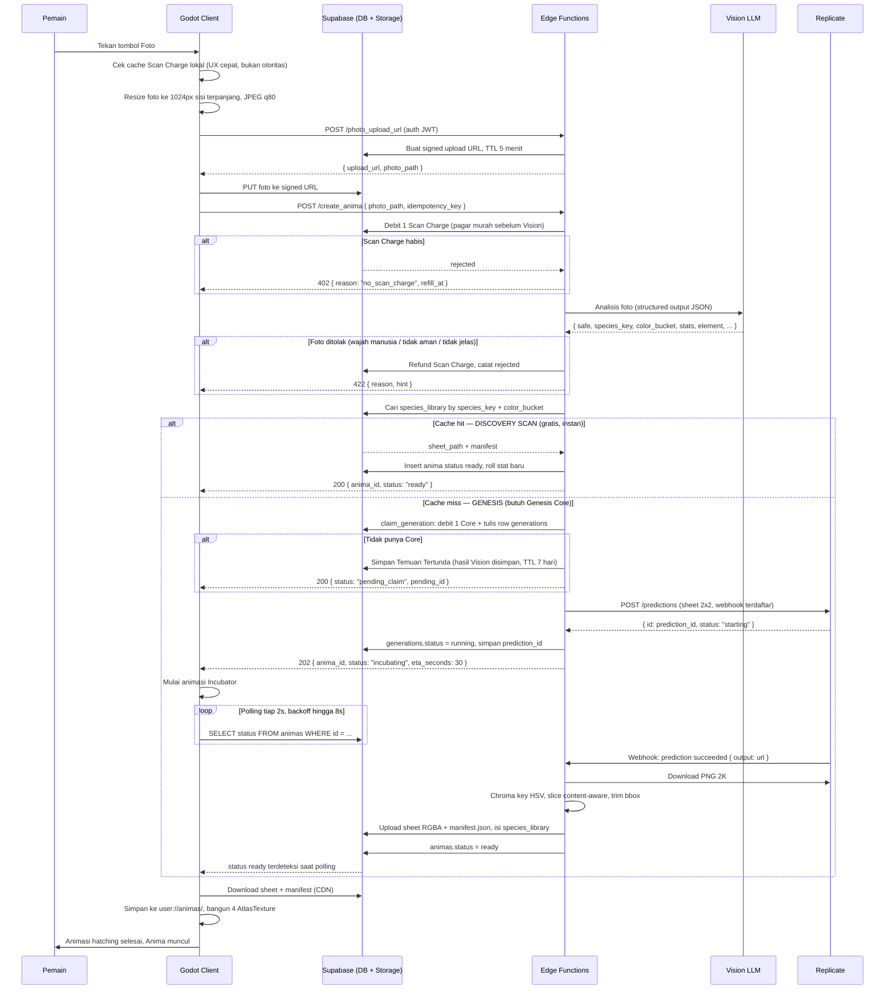
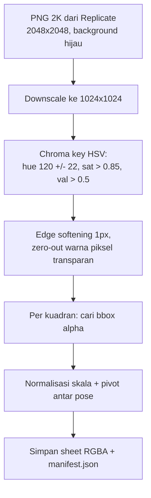
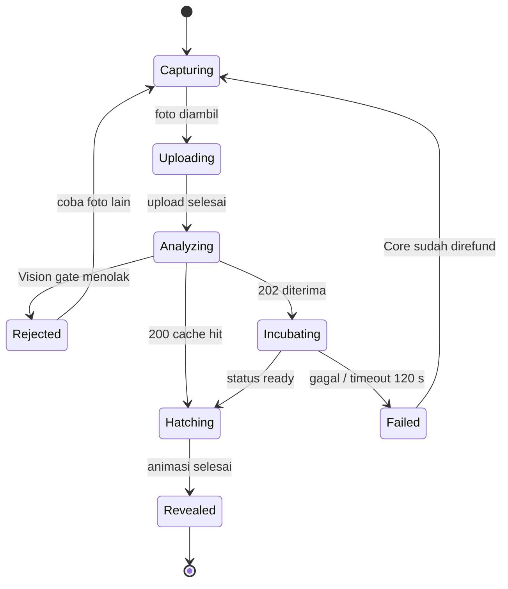
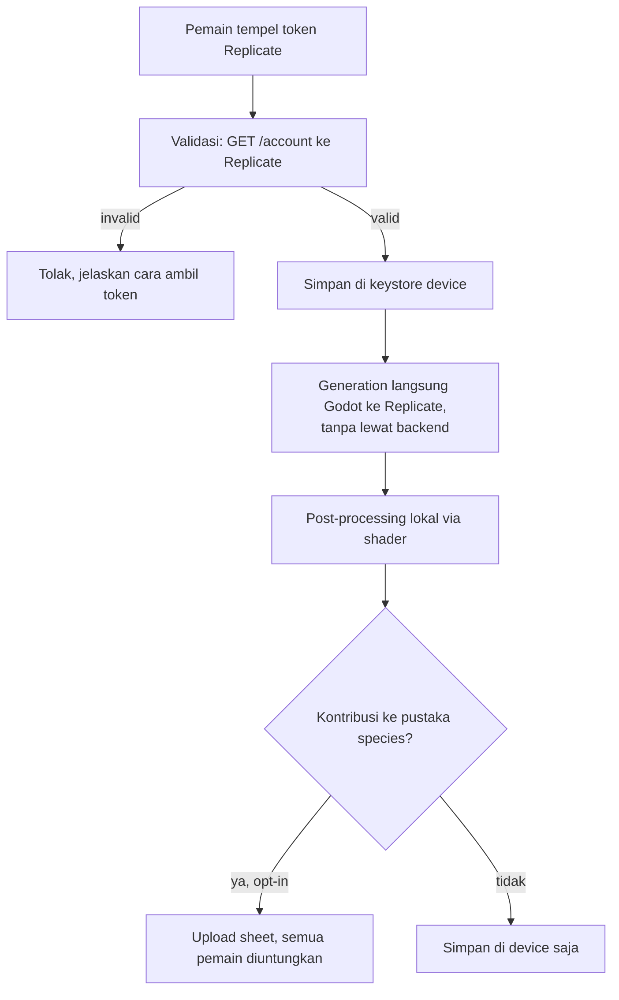

# 01 — Architecture & Data Flow Pipeline

Dokumen ini mendefinisikan apa yang terjadi antara pemain menekan tombol kamera dan Anima muncul di layar: komponen apa yang terlibat, siapa yang memegang uang dan kunci, bagaimana biaya ditekan lewat caching, dan bagaimana jeda 15-45 detik dibungkus jadi pengalaman yang menyenangkan.

## 1. Prinsip arsitektur

Empat aturan yang menentukan bentuk seluruh sistem:

**Client itu bodoh dan tidak dipercaya.** Godot tidak menyimpan API key, tidak memutuskan kuota, dan tidak memproses piksel. Ia mengirim foto, menunggu, lalu memasang tekstur. Semua yang menghabiskan uang atau bisa dicurangi hidup di server.

**Semua pekerjaan piksel selesai di backend.** Edge Function yang melakukan chroma key, slicing, dan trimming, lalu menyimpan satu PNG RGBA + `manifest.json`. Konsekuensinya: hasil olahan bisa di-cache dan dibagi antar device, device low-end tidak perlu membakar CPU, dan kalau algoritma keying diperbaiki nanti kita bisa re-process aset lama tanpa update aplikasi.

**Tidak ada uang keluar tanpa jejak.** Setiap generation punya row di tabel `generations` dengan `idempotency_key`, `prompt_version`, dan `cost_usd_estimate`. Retry jaringan tidak boleh berarti double charge.

**Cache dulu, generate kemudian.** Generation adalah jalur paling mahal dan paling lambat, jadi ia adalah pilihan terakhir setelah tiga lapis cache gagal.

### Pilihan model dan alasannya

| Peran | Model | Alasan |
| --- | --- | --- |
| Vision, stat, taksonomi | `gemini-3.1-flash-lite` | Stabil sejak Mei 2026, structured output, ~$0.0003 per panggilan |
| Image generation | `google/nano-banana-pro` via Replicate | Kualitas tertinggi untuk gaya concept art, mendukung editing lewat `image_input` |

Spesifikasi awal menyebut `gemini-1.5-flash`, dan itu perlu dikoreksi: **model tersebut sudah dimatikan Google** dan request dengan ID itu mengembalikan 404. Penggantinya yang paling jelas, `gemini-2.5-flash`, juga bukan pilihan yang tepat untuk proyek yang baru mulai karena tanggal retirement-nya 20 Oktober 2026 — hanya beberapa bulan dari sekarang, dan itu berarti migrasi paksa di tengah pengembangan. `gemini-3.1-flash-lite` sudah stabil, harganya di kelas yang sama, dan punya runway paling panjang.

GPT-4o-mini yang juga disebut di spesifikasi awal bisa bekerja untuk peran ini, tapi tidak dipilih karena satu alasan operasional: memakai keluarga model yang sama dengan generator gambar (nano-banana-pro adalah Gemini 3 Pro Image) berarti satu vendor, satu tagihan, dan satu tempat memeriksa kuota ketika ada yang salah.

Nama model **tidak boleh di-hardcode**. Keduanya disimpan di konfigurasi dan dicatat per baris di `generations.model`, sebab model gambar adalah komponen yang paling mungkin berubah harga atau dihentikan, dan ketika itu terjadi kita perlu bisa berpindah tanpa merilis ulang aplikasi.

## 2. Diagram alur lengkap



## 3. Komponen dan tanggung jawabnya

| Komponen | Tanggung jawab | Yang **tidak** boleh dilakukan |
| --- | --- | --- |
| Godot client | Ambil foto, resize, upload, polling, cache lokal, render | Simpan API key, tentukan kuota, proses piksel |
| `photo_upload_url` | Terbitkan signed upload URL bertenggat | Menerima file (biar Storage yang terima) |
| `create_anima` | Vision, cek pustaka, lalu klaim Core hanya bila spesies baru | Menunggu gambar selesai (harus balik cepat) |
| `replicate_webhook` | Post-processing gambar, isi cache, tandai ready | Dipercaya tanpa verifikasi signature |
| `evolve_anima` | Generation stage berikutnya pakai sprite lama sebagai input | Dipanggil tanpa cek syarat evolusi di server |
| Postgres | Sumber kebenaran untuk kuota, stat, kepemilikan | Menyimpan foto mentah |
| Storage | Foto sementara, sheet RGBA, manifest | Menyimpan foto lebih dari 24 jam |

## 4. Skema database

```sql
-- Profil pemain, 1:1 dengan auth.users
-- Tiga mata uang, alasan pembagiannya ada di doc 04:
-- scan_charges  -> Discovery Scan, biaya kita ~$0.0003, boleh murah
-- genesis_cores -> Genesis (spesies baru), biaya kita $0.134, harus dijaga
-- bits          -> item perawatan, biaya kita nol
create table profiles (
  id             uuid primary key references auth.users on delete cascade,
  display_name   text,
  scan_charges   int  not null default 8,
  scan_charge_max int not null default 8,
  genesis_cores  int  not null default 3,        -- 3 gratis saat onboarding
  bits           int  not null default 0,
  next_refill_at timestamptz,
  byok_enabled   bool not null default false,
  created_at     timestamptz not null default now(),
  last_seen_at   timestamptz not null default now()
);

-- Pustaka art global. Inti dari penghematan biaya.
create table species_library (
  species_key    text primary key,              -- 'mug_ceramic_handled'
  color_bucket   text not null,                 -- 'warm_red', 'neutral_dark', ...
  sheet_path     text not null,                 -- Storage: sheets/<hash>.png (RGBA)
  manifest       jsonb not null,                -- region 4 pose, lihat doc 03
  stage          smallint not null default 1,   -- 1=baby, 2=adult, 3=perfect
  prompt_version text not null,
  times_reused   int  not null default 0,
  created_at     timestamptz not null default now(),
  unique (species_key, color_bucket, stage)
);

-- Anima milik pemain
create table animas (
  id             uuid primary key default gen_random_uuid(),
  owner_id       uuid not null references profiles on delete cascade,
  nickname       text not null,
  species_key    text not null,
  color_bucket   text not null,
  stage          smallint not null default 1,
  status         text not null default 'incubating',  -- incubating|ready|failed
  element        text not null,                       -- lihat doc 04
  rarity         smallint not null,                   -- 1..5
  base_stats     jsonb not null,                      -- { hp, atk, def, spd, special }
  care           jsonb not null,                      -- { hunger, energy, hygiene, bond }
  care_score     int  not null default 0,             -- akumulasi, gerbang evolusi
  born_at        timestamptz not null default now(),
  care_synced_at timestamptz not null default now(),  -- basis perhitungan decay
  created_at     timestamptz not null default now()
);
create index on animas (owner_id, status);

-- Ledger setiap panggilan berbayar. Append-only.
create table generations (
  id             uuid primary key default gen_random_uuid(),
  owner_id       uuid not null references profiles on delete cascade,
  anima_id       uuid references animas on delete set null,
  idempotency_key text not null,
  kind           text not null,                 -- create|evolve
  status         text not null default 'pending', -- pending|running|succeeded|failed|rejected|cache_hit
  prediction_id  text,                          -- id Replicate
  prompt_version text not null,
  model          text not null,                 -- 'google/nano-banana-pro'
  cost_usd_estimate numeric(8,4) not null default 0,
  vision_result  jsonb,
  error          text,
  created_at     timestamptz not null default now(),
  finished_at    timestamptz,
  unique (owner_id, idempotency_key)
);

-- Jejak perubahan mata uang, untuk audit dan debugging sengketa
create table quota_ledger (
  id         bigserial primary key,
  owner_id   uuid not null references profiles on delete cascade,
  currency   text not null,                     -- scan_charges|genesis_cores|bits
  delta      int  not null,                     -- negatif debit, positif kredit
  reason     text not null,                     -- scan|genesis|refund|daily_refill|iap|ad|battle
  ref_id     uuid,                              -- generations.id bila relevan
  created_at timestamptz not null default now()
);

-- Temuan Tertunda: spesies baru ditemukan tapi pemain belum punya Core.
-- Hasil Vision sudah dibayar, jadi jangan dibuang — biarkan diklaim nanti
-- tanpa harus memfoto ulang objek yang mungkin sudah tidak ada di dekatnya.
create table pending_discoveries (
  id            uuid primary key default gen_random_uuid(),
  owner_id      uuid not null references profiles on delete cascade,
  species_key   text not null,
  color_bucket  text not null,
  vision_result jsonb not null,
  created_at    timestamptz not null default now(),
  expires_at    timestamptz not null default now() + interval '7 days',
  claimed_at    timestamptz,
  unique (owner_id, species_key, color_bucket)
);
```

### Row Level Security

RLS aktif di semua tabel. Pemain hanya bisa membaca miliknya sendiri dan **tidak bisa menulis apa pun yang berhubungan dengan kuota** — itu hak Edge Function lewat service role.

```sql
alter table profiles            enable row level security;
alter table animas              enable row level security;
alter table generations         enable row level security;
alter table quota_ledger        enable row level security;
alter table species_library     enable row level security;
alter table pending_discoveries enable row level security;

-- Pemain baca profil sendiri; kolom mata uang tidak pernah bisa diubah client
create policy "read own profile" on profiles
  for select using (auth.uid() = id);
create policy "update own cosmetics" on profiles
  for update using (auth.uid() = id)
  with check (auth.uid() = id);
-- Catatan: kolom mata uang dilindungi oleh trigger di bawah, bukan oleh
-- policy, karena policy tidak bisa membatasi per-kolom.

-- Pemain boleh baca + update Anima sendiri (untuk aksi perawatan),
-- tapi tidak boleh insert (insert hanya lewat Edge Function)
create policy "read own animas" on animas
  for select using (auth.uid() = owner_id);
create policy "update own animas" on animas
  for update using (auth.uid() = owner_id) with check (auth.uid() = owner_id);

-- Ledger, generations, dan temuan tertunda: baca saja
create policy "read own generations" on generations
  for select using (auth.uid() = owner_id);
create policy "read own ledger" on quota_ledger
  for select using (auth.uid() = owner_id);
create policy "read own pending" on pending_discoveries
  for select using (auth.uid() = owner_id);

-- Pustaka species boleh dibaca semua orang yang login (art di-share)
create policy "read species" on species_library
  for select to authenticated using (true);
```

Trigger yang mengunci kolom sensitif dari update client:

```sql
create or replace function guard_profile_columns() returns trigger
language plpgsql security definer as $$
begin
  -- service_role melewati guard; client tidak
  if current_setting('request.jwt.claim.role', true) <> 'service_role' then
    if new.scan_charges <> old.scan_charges
       or new.scan_charge_max <> old.scan_charge_max
       or new.genesis_cores <> old.genesis_cores
       or new.bits <> old.bits
       or new.next_refill_at is distinct from old.next_refill_at then
      raise exception 'kolom mata uang hanya bisa diubah server';
    end if;
  end if;
  return new;
end $$;

create trigger guard_profiles before update on profiles
  for each row execute function guard_profile_columns();
```

Aksi perawatan (`animas.care`) sengaja dibiarkan client-writable. Menyontek nilai kenyang tidak merugikan siapa pun secara ekonomi dan menghemat satu round-trip per tap; kalau nanti ada leaderboard atau PvP kompetitif, pindahkan ke RPC server-side.

### Klaim Core yang atomik

Debit Genesis Core dan pencatatan generation harus terjadi dalam satu transaksi, kalau tidak dua request paralel bisa lolos bersamaan dengan sisa Core 1 — dan itu berarti $0.134 keluar tanpa dibayar.

```sql
create or replace function claim_generation(
  p_owner uuid, p_key text, p_kind text, p_prompt_version text, p_model text
) returns generations
language plpgsql security definer as $$
declare
  v_gen   generations;
  v_cores int;
begin
  -- Idempotency: request yang sama dua kali balikkan row yang sama.
  -- Inilah yang membuat retry jaringan tidak pernah berarti double charge.
  select * into v_gen from generations
   where owner_id = p_owner and idempotency_key = p_key;
  if found then return v_gen; end if;

  -- Lock baris profil, cegah race antar request paralel
  select genesis_cores into v_cores from profiles where id = p_owner for update;
  if v_cores <= 0 then
    raise exception 'NO_CORE';
  end if;

  update profiles set genesis_cores = genesis_cores - 1 where id = p_owner;
  insert into quota_ledger (owner_id, currency, delta, reason)
  values (p_owner, 'genesis_cores', -1, 'genesis');

  insert into generations (owner_id, idempotency_key, kind, prompt_version, model, status)
  values (p_owner, p_key, p_kind, p_prompt_version, p_model, 'pending')
  returning * into v_gen;

  return v_gen;
end $$;
```

Fungsi kembarnya, `refund_generation(p_gen_id, p_reason)`, mengembalikan Core, menulis ledger, dan menandai status. Dipanggil pada dua kondisi: kegagalan atau pembatalan dari Replicate, dan timeout keras.

Perhatikan bahwa cache hit **tidak** butuh refund, karena Core tidak pernah didebit untuk Discovery Scan — pengecekan pustaka terjadi sebelum `claim_generation` dipanggil. Ini alasan urutan langkah di bawah tidak boleh ditukar: memeriksa lebih dulu lalu menagih menghasilkan lebih sedikit jalur refund, dan setiap jalur refund adalah tempat uang bisa hilang tanpa jejak.

Scan Charge memakai fungsi terpisah `claim_scan_charge(p_owner)` dengan pola lock yang sama. Ia lebih longgar (nilainya hanya $0.0003) tapi tetap harus atomik, sebab tanpa pagar itu satu klien yang rusak bisa memanggil Vision beribu kali.

## 5. Kontrak Edge Function

### `POST /photo_upload_url`

Client tidak mengunggah lewat Edge Function karena itu membakar CPU/bandwidth function untuk sesuatu yang Storage lakukan lebih baik.

```jsonc
// Request: header Authorization: Bearer <supabase jwt>, body kosong
// Response 200
{
  "upload_url": "https://<proj>.supabase.co/storage/v1/object/upload/sign/photos/...",
  "photo_path": "photos/<user_id>/<uuid>.jpg",
  "expires_in": 300
}
```

### `POST /create_anima`

```jsonc
// Request
{
  "photo_path": "photos/<user_id>/<uuid>.jpg",
  "idempotency_key": "c1f8...-generated-by-client",
  "nickname_hint": null          // opsional, kalau null nama diusulkan Vision LLM
}

// Response 200 — DISCOVERY SCAN: spesies sudah ada, gratis dan instan
{ "anima_id": "b3d1...", "status": "ready", "mode": "discovery",
  "species_key": "mug_ceramic_handled", "first_discovered_by": "Rangga",
  "scan_charges_left": 7, "genesis_cores_left": 3 }

// Response 202 — GENESIS: spesies baru, masuk inkubasi
{ "anima_id": "b3d1...", "status": "incubating", "mode": "genesis",
  "eta_seconds": 30, "is_world_first": true,
  "scan_charges_left": 7, "genesis_cores_left": 2 }

// Response 200 — spesies baru tapi Core habis: disimpan sebagai Temuan Tertunda
{ "status": "pending_claim", "pending_id": "9a2c...",
  "species_key": "camera_metal_vintage_dialed",
  "expires_at": "2026-08-19T11:00:00Z",
  "offers": ["iap", "byok"] }

// Response 402 — Scan Charge habis, Vision belum dipanggil
{ "error": "no_scan_charge", "refill_at": "2026-08-13T00:00:00Z",
  "offers": ["ad", "subscription"] }

// Response 422 — foto ditolak, Scan Charge sudah direfund
{ "error": "photo_rejected", "reason": "human_face",
  "hint": "Coba foto benda, bukan orang. Botol, sepatu, atau tanaman cocok banget." }
```

Fungsi ini **harus** balik dalam beberapa detik. Ia tidak menunggu gambar selesai; itu tugas webhook. Urutan internalnya:

1. Verifikasi JWT, ambil `owner_id`.
2. `claim_scan_charge(owner_id)` — pagar murah sebelum memanggil Vision. Kalau habis, balik 402 tanpa efek samping.
3. Terbitkan signed **download** URL foto (TTL 10 menit) supaya Vision LLM dan Replicate bisa membacanya. Replicate menerima `image_input` berupa array URL, jadi foto wajib punya URL publik sementara.
4. Panggil Vision LLM dengan structured output. Kalau `safe == false` atau `is_object == false`, refund Scan Charge lalu balik 422.
5. Normalisasi `species_key` terhadap entri yang sudah ada (Levenshtein ≤ 2) supaya typo tidak memecah cache.
6. Cari `species_library` untuk `(species_key, color_bucket, stage=1)`. **Ada** → Discovery Scan: buat `animas` status `ready` dengan stat di-roll ulang, naikkan `times_reused`, balik 200. Tidak ada Core yang tersentuh.
7. **Tidak ada** → Genesis. `claim_generation(...)`; kalau `NO_CORE`, simpan `pending_discoveries` (hasil Vision jangan dibuang, biayanya sudah keluar) dan balik 200 dengan `status: "pending_claim"`.
8. `POST` ke Replicate dengan `webhook` + `webhook_events_filter: ["completed"]`, simpan `prediction_id`, balik 202.

Urutan langkah 6 sebelum 7 adalah inti kontrol biaya seluruh sistem, dan bukan sekadar optimasi: ia yang memisahkan aksi $0.0003 dari aksi $0.134 sehingga keduanya bisa diberi harga berbeda kepada pemain. Alasan desain lengkapnya di [04](04-game-systems-economy.md).

### `POST /replicate_webhook`

Endpoint publik, jadi harus diverifikasi. Replicate mengirim header signature; verifikasi sebelum menyentuh database. Selain itu pakai secret path token di query string sebagai lapisan kedua.

Langkah:

1. Verifikasi signature. Gagal, balik 401 dan jangan log body mentah.
2. Cocokkan `prediction_id` ke row `generations`. Tidak ada, balik 200 (jangan bikin Replicate retry selamanya).
3. `status == "failed"` atau `canceled`: refund Genesis Core, `animas.status = failed`, selesai.
4. `succeeded`: unduh PNG dari `output` (string URI tunggal), jalankan post-processing (bagian 6), upload hasil, isi `species_library`, set `animas.status = ready`, `generations.status = succeeded`.
5. Hapus foto mentah dari Storage.

Webhook idempoten: kalau `generations.status` sudah `succeeded`, balik 200 tanpa memproses ulang.

### `POST /evolve_anima`

```jsonc
{ "anima_id": "b3d1...", "idempotency_key": "..." }
```

Server memverifikasi syarat evolusi (umur, `care_score`, stage saat ini) — client tidak dipercaya soal ini. `image_input` diisi **sprite pose Idle milik Anima itu sendiri**, bukan foto asli, supaya identitas visual terjaga antar stage. Alur sisanya identik dengan `create_anima`.

### `POST /grant_reward`

Menerima callback verifikasi rewarded ad dari SDK, menambah `bits` atau `scan_charges`. **Tidak pernah** menambah `genesis_cores` — satu tayangan iklan bernilai ~$0.002 sementara satu Core berbiaya $0.134, jadi jalur itu akan merugi 60 kali lipat. Perhitungannya di [04](04-game-systems-economy.md).

## 6. Post-processing gambar

Berjalan di dalam `replicate_webhook`. Ini langkah wajib, bukan opsional: model Gemini image tidak pernah mengeluarkan alpha channel, apa pun yang diminta prompt.



Downscale ke 1024x1024 dilakukan **sebelum** keying dan itu keputusan sadar: 2048² berarti 4,2 juta piksel yang harus disentuh satu per satu, sementara 1024² hanya 1 juta. Sprite final 512px per pose sudah lebih dari cukup untuk layar HP, jadi tidak ada yang hilang selain biaya CPU.

Keying memakai HSV, bukan jarak RGB, karena hijau `#00FF00` punya hue yang sangat khas dan ambang berbasis hue jauh lebih tahan terhadap variasi shading di tepi sprite. Ambang yang dipakai: hue dalam ±22° dari 120°, **saturation > 0,85, value > 0,5**. Setelah keying, warna piksel yang alpha-nya nol di-nolkan supaya tidak muncul halo hijau saat tekstur di-filter bilinear.

Ambang saturasi 0,85 itu jauh lebih ketat daripada resep chroma key pada umumnya (0,3), dan alasannya spesifik untuk game ini. Anima berelemen `plant` — tanaman, buah, daun — tubuhnya hijau. Hijau daun seperti `rgb(60,160,70)` punya saturasi 0,63 dan hue 126°, jadi dengan ambang 0,3 ia lolos sebagai warna kunci dan tubuh Anima-nya **bolong**. Background `#00FF00` punya saturasi ~1,0, jadi ambang 0,85 memisahkan keduanya dengan bersih. Ambang value 0,5 melindungi bayangan hijau gelap di lekuk tubuh dengan cara yang sama. Ini bukan teori: ada test regresi khusus untuk enam nuansa hijau yang harus selamat, di `eval/selftest.mjs`.

Satu pagar lagi yang wajib ada: kalau rasio piksel yang ter-key di bawah 15%, sheet **ditolak keras**. Background hijau selalu jadi mayoritas sheet, jadi angka di bawah itu berarti model mengembalikan latar putih, hitam, atau checkerboard. Tanpa pagar ini, sheet berlatar putih tidak menghasilkan error melainkan empat "sprite" palsu seukuran kuadran penuh — dan karena hasilnya masuk cache spesies, satu kegagalan sunyi akan dipakai oleh semua pemain yang men-scan spesies yang sama.

Library: **ImageScript** (pure TypeScript, jalan di Deno maupun Node). Bukan `sharp`, yang butuh native binary dan tidak jalan di edge runtime. Karena jalan di dua runtime, harness eval di laptop (`eval/postprocess.mjs`) dan Edge Function nanti bisa memakai kode yang sama.

### Risiko CPU limit dan fallback bertingkat

Edge Function punya batas CPU time. Memproses 1 juta piksel di TypeScript ada di zona aman tapi bukan tanpa risiko, terutama kalau nanti resolusi dinaikkan. Tangga mitigasinya, dipakai berurutan:

1. Downscale dulu (sudah jadi default di atas).
2. Kalau masih kena limit, potong menjadi dua invocation: satu untuk keying, satu untuk slicing, dihubungkan lewat Storage.
3. Kalau tetap tidak cukup, pindahkan post-processing ke Godot: render sheet lewat shader `canvas_item` chroma key di dalam `SubViewport`, ambil `get_image()` sekali, simpan PNG RGBA ke `user://`. Shader-nya sudah ditulis di [03](03-godot-sprite-pipeline.md) sebagai fallback. Biayanya: keying jadi per-device (tidak bisa di-cache lintas pemain) dan bbox trimming hilang, jadi ini benar-benar pilihan terakhir.

## 7. Strategi caching tiga lapis


**Lapis 1 — device.** `user://animas/<species_key>_<color_bucket>_<stage>.png` plus `.json`. Kunci cache memakai species, bukan `anima_id`, supaya dua Anima dengan spesies sama hanya menyimpan satu file. Eviction: LRU sederhana dengan plafon 100 MB, dicek saat startup.

**Lapis 2 — Storage/CDN.** Sheet RGBA hasil olahan, disajikan lewat CDN Supabase dengan cache header panjang. Nama file memakai hash konten sehingga bisa `Cache-Control: immutable`.

**Lapis 3 — pustaka species global.** Ini pengungkit biaya terbesar dan sekaligus keputusan desain paling berdampak pada rasa game, jadi perlu jujur soal trade-off-nya.

Realitanya, foto pemain akan menumpuk di objek yang sama: mug, keyboard, sepatu, botol air, tanaman hias, gunting, remote TV. Kalau setiap foto mug memicu generation baru, kita membayar $0.134 berulang kali untuk art yang hampir identik. Dengan pustaka species, foto mug ke-2 sampai ke-1000 memakai art yang sudah ada dan biayanya nol.

Yang di-share hanya **art**. Yang tetap unik per pemain: nama, stat (di-roll dengan varians dari detail foto spesifik), rarity, dan seluruh riwayat perawatan. Jadi dua pemain bisa punya Anima mug yang terlihat sama tapi berbeda kekuatan dan kepribadian — persis seperti dua pemain Pokémon yang sama-sama punya Pikachu.

Kunci cache-nya sengaja tidak terlalu longgar. `species_key` saja akan membuat semua mug seragam; `species_key + color_bucket` membuat mug merah dan mug hitam tetap berbeda art. Kalau ternyata pemain mengeluh art terlalu sering berulang, pengetatan berikutnya adalah menambah dimensi ke kunci (misalnya `form_bucket` untuk proporsi) — bukan mematikan cache.

`species_key` datang dari Vision LLM dengan taksonomi tertutup supaya tidak meledak jadi ribuan varian typo. Aturannya ada di [02](02-prompt-engineering.md).

## 8. Penanganan latensi: Incubator

Ekspektasi awal 5-10 detik tidak realistis. Generation 2K butuh **15-45 detik**, kadang lebih saat Replicate ramai. Dengan `allow_fallback_model: false` sesuai spesifikasi, request bisa mengantre saat model penuh, dan itu memang trade-off yang diambil demi konsistensi gaya art.

Jadi jeda ini tidak boleh diperlakukan sebagai loading screen yang harus disembunyikan. Ia adalah **momen ritual**: telur yang berdenyut, retak sedikit demi sedikit. Kalau dirancang benar, pemain justru menikmati penantiannya.

### State machine



Setiap state punya pasangan visual dan teks, karena diam tanpa penjelasan selama 30 detik terasa seperti aplikasi hang:

| State | Visual | Teks |
| --- | --- | --- |
| Uploading | Telur muncul, kamera menutup | "Mengirim jejak objek..." |
| Analyzing | Telur berpendar, garis scan | "Membaca bentuk dan materialnya..." |
| Incubating | Telur berdenyut, retakan bertambah seiring waktu | "Sesuatu bergerak di dalam..." |
| Hatching | Retakan pecah, flash putih | "Menetas!" |
| Revealed | Anima muncul, kartu stat masuk | nama + elemen + rarity |

Beberapa detail yang membuat ini terasa benar dan bukan cuma spinner:

Progres retakan diikat ke **waktu berlalu**, bukan ke progres server yang sebenarnya, karena Replicate tidak memberi persentase. Kalau server selesai lebih cepat dari animasi, jangan potong animasinya di tengah — biarkan ia mencapai titik pecah terdekat lalu menetas. Cache hit yang balik dalam 1 detik justru harus **diperlambat** menjadi minimal 4 detik, kalau tidak momen dramatisnya hilang dan pemain merasa dicurangi.

Kalau lewat 45 detik, ganti teks jadi sesuatu yang mengakui keterlambatan tanpa panik ("Anima ini keras kepala, sebentar lagi..."). Timeout keras di 120 detik memicu state Failed dengan refund otomatis.

Aplikasi masuk background bukan kasus tepi, itu perilaku normal orang menunggu. Jadi: catat `anima_id` yang sedang inkubasi di penyimpanan lokal, dan saat aplikasi kembali, lanjutkan polling dari mana pun ia berada. Push notification lokal saat status jadi `ready` dijadwalkan di Phase 3.

### Polling, bukan Realtime

Godot melakukan `SELECT status` ke row miliknya sendiri setiap 2 detik, dengan backoff naik ke 8 detik setelah 30 detik pertama. Supabase Realtime lewat WebSocket lebih elegan tapi menambah dependensi dan penanganan reconnect di client untuk keuntungan yang tidak dirasakan pemain pada skala ini.

Batas atas pendekatan ini kira-kira beberapa ratus hatch bersamaan sebelum beban query jadi terasa. Kalau kena, upgrade-nya jelas: pindah ke Realtime subscription pada tabel `animas`. Tandai di kode dengan komentar `ponytail:` yang menyebut plafon itu.

## 9. Jalur BYOK

Bring-your-own-key untuk pemain yang ingin generate tanpa batas: mereka menempelkan token Replicate sendiri, dan sejak itu biaya generation jadi tanggungan mereka.



Beberapa keputusan yang perlu dicatat:

Token disimpan **hanya di device**, tidak pernah dikirim ke backend kita. Itu menghilangkan seluruh kelas masalah penyimpanan kredensial pihak lain. Konsekuensinya jalur BYOK memakai post-processing lokal (fallback shader di [03](03-godot-sprite-pipeline.md)), karena Edge Function tidak dilibatkan.

Vision LLM tetap lewat backend kita dengan kuota terpisah yang longgar, sebab biaya `gemini-3.1-flash-lite` di bawah $0.001 per panggilan dan meminta pemain menyiapkan dua API key sekaligus adalah friksi yang tidak sepadan.

Pemain BYOK ditawari opt-in menyumbangkan sheet hasil generasinya ke pustaka species global. Ini bukan sekadar altruisme: setiap sumbangan mengurangi biaya generation untuk semua pemain gratis. Tawarkan dengan jelas, jangan diam-diam.

BYOK tidak menghapus Vision gate. Filter penolakan wajah dan konten tidak aman tetap berlaku, karena itu soal kebijakan toko aplikasi dan keamanan pemain, bukan soal siapa yang membayar.

## 10. Keamanan dan privasi

**Vision gate wajib.** Orang akan memfoto teman, wajah sendiri, dan hal-hal yang tidak pantas. Vision LLM mengembalikan flag `safe` dan `is_object` sebelum satu sen pun dibelanjakan ke Replicate. Foto berisi wajah manusia ditolak dengan pesan ramah, bukan tuduhan. `safety_filter_level: "block_only_high"` di sisi Replicate adalah jaring kedua, bukan pertahanan utama.

**Foto mentah berumur pendek.** Dihapus dari Storage segera setelah post-processing, dengan cron harian menyapu sisa yang lebih tua dari 24 jam. Yang kita simpan permanen adalah sprite hasil, bukan foto rumah pemain.

**Rate limit berlapis.** Genesis Core membatasi image generation, Scan Charge membatasi panggilan Vision. Selain itu perlu batas kasar per IP pada `photo_upload_url` untuk mencegah orang membanjiri Storage tanpa pernah memanggil `create_anima`.

**Privacy policy wajib sebelum Play Store.** Aplikasi mengakses kamera, mengunggah foto ke server, dan mengirimnya ke pihak ketiga (Google, Replicate). Ketiga fakta itu harus dinyatakan eksplisit, termasuk berapa lama foto disimpan.

## 11. Estimasi biaya per Anima

| Komponen | Biaya |
| --- | --- |
| Vision (`gemini-3.1-flash-lite`, ~1 gambar + ~800 token output) | < $0.001 |
| Image generation (nano-banana-pro, 2K) | $0.134 |
| Storage + bandwidth (~200 KB sheet) | ~$0.0001 |
| Edge Function invocation (3x) | ~$0.00001 |
| **Total, cache miss** | **~$0.135** |
| **Total, cache hit species** | **~$0.001** |

Rasio cache hit adalah metrik bisnis paling penting di game ini, bukan sekadar metrik teknis. Pada 60% hit rate, biaya rata-rata per Anima turun jadi ~$0.055; pada 85% jadi ~$0.021. Instrumentasi untuk mengukurnya harus ada sejak Phase 2, bukan ditambahkan setelah tagihan membengkak.

Turunan ekonominya — harga IAP, kuota gratis, kenapa iklan tidak boleh membiayai generation — dibahas di [04](04-game-systems-economy.md).
