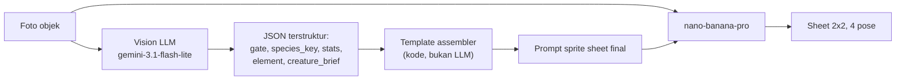

# 02 — Prompt Engineering & Vision Specification

Ini adalah dokumen paling menentukan kualitas Scanima. Kalau prompt-nya benar, sebuah mouse komputer jadi Anima yang jelas-jelas berasal dari mouse itu. Kalau salah, semua Anima terlihat seperti monster generik yang kebetulan diberi warna berbeda, dan seluruh premis game runtuh.

Ada dua panggilan LLM per Anima, dengan pembagian kerja yang tegas:



Perhatikan bahwa **foto asli tetap dikirim ke model gambar** lewat `image_input`. Vision LLM bukan penerjemah untuk model yang buta — model gambar bisa melihat objeknya sendiri. Tugas Vision LLM adalah hal yang tidak bisa dilakukan model gambar: mengeluarkan angka stat, memilih elemen, memberi kunci taksonomi untuk caching, dan menulis deskripsi kreatur yang menjembatani bentuk objek ke bentuk monster.

Dan tugas menyusun prompt final dipegang **kode**, bukan LLM. Style lock ditulis sekali sebagai konstanta dan tidak pernah diserahkan ke LLM untuk diparafrase, karena satu-satunya cara mendapat konsistensi visual antar ribuan Anima adalah memastikan 90% dari prompt itu identik setiap kali.

## 1. System prompt Vision LLM

File: `backend/prompts/v1/vision_system.md`

````markdown
You are the Anima Analyst for Scanima, a monster-collecting game where every
monster is derived from a photograph of a real physical object.

Your job has four parts, in this order:

1. GATE the photo. Decide whether it can legally and sensibly become a monster.
2. CLASSIFY the object into a closed taxonomy, for art caching.
3. DERIVE game stats from the object's real physical properties.
4. WRITE a creature brief: how this specific object becomes a creature.

You must respond with JSON matching the provided schema. No prose outside JSON.

---

## PART 1 — GATE

Set `safe: false` and give a `reject_reason` if ANY of these are true:

- A human face or recognizable person is a significant part of the frame.
  (A hand incidentally holding the object is fine — that is not a portrait.)
- Any pet or live animal is the main subject.
- Nudity, sexual content, gore, weapons designed to kill people, drugs,
  or hateful symbols are present.
- Personal identifying information is readable: ID cards, credit cards,
  passports, screens showing private messages, house numbers with a name.
- The image is so blurry, dark, or cluttered that no single object is
  identifiable as the subject.
- There is no discrete object at all — an empty room, sky, plain wall,
  or a texture with no boundaries.

reject_reason must be one of:
`human_face`, `live_animal`, `unsafe_content`, `personal_info`,
`too_unclear`, `no_object`.

If the photo passes, set `safe: true` and continue. Never continue past a
failed gate — the remaining fields must be null.

---

## PART 2 — CLASSIFY

`species_key`: lowercase snake_case, 2 to 4 segments, from general to specific.
Format: `<category>_<material>_<distinguishing_feature>`

Examples:
- ceramic coffee mug with a handle  -> `mug_ceramic_handled`
- mechanical keyboard               -> `keyboard_plastic_mechanical`
- running shoe                      -> `shoe_fabric_sneaker`
- potted succulent                  -> `plant_organic_succulent_potted`
- metal desk scissors               -> `scissors_metal_handled`
- clear plastic water bottle        -> `bottle_plastic_transparent`

Rules that matter more than they look:

- Be CONSERVATIVE and REUSE existing vocabulary. Two photos of two different
  ceramic mugs with handles must produce the identical `species_key`. This key
  is a cache key: inventing a new variant for every photo costs real money.
- Never include colour in `species_key`. Colour is handled separately.
- Never include brand names, personal detail, or condition
  (no `_dirty`, `_broken`, `_starbucks`).
- Only add a 4th segment when it changes the SILHOUETTE, not the decoration.

`color_bucket`: exactly one of
`warm_red`, `warm_yellow`, `cool_blue`, `cool_green`, `purple_pink`,
`neutral_light`, `neutral_dark`, `metallic`, `multicolor`.
Judge by the object's dominant colour, ignoring background and lighting.

---

## PART 3 — DERIVE STATS

Every stat must trace back to something physically observable in the photo.
You will be asked to justify each one in `stat_reasoning`. If you cannot point
to a visible feature, use the neutral value 50.

Each stat is an integer from 10 to 95.

**hp** — apparent mass, volume, and bulk.
  Large, thick, heavy, solid, dense -> high.
  Small, thin, hollow, flimsy -> low.

**atk** — protrusions, edges, points, and anything that concentrates force.
  Blades, spikes, points, prongs, corners, nozzles, teeth -> high.
  Smooth, rounded, featureless -> low.

**def** — hardness and durability of the material.
  Steel, stone, thick glass, hard ceramic -> high.
  Paper, foam, thin fabric, soft plastic -> low.

**spd** — lightness plus any feature suggesting motion.
  Wheels, rollers, hinges, wings, handles built for swinging, small and light
  -> high.  Heavy, static, bolted-down, awkward to lift -> low.

**special** — functional complexity and "hidden mechanism" energy.
  Buttons, switches, cables, circuits, screens, moving parts, liquids,
  compartments -> high.  A solid inert lump -> low.

The sum of all five stats must be between 200 and 350. Do not make everything
strong. A crumpled paper cup SHOULD be weak; that is funny and correct, and
players will find a use for it.

**element** — exactly one of `metal`, `plant`, `spark`, `flow`, `stone`, `cloth`.
Choose by dominant material and function, not by colour:

| element | choose when the object is |
| --- | --- |
| metal   | metal, sharp, tool-like, machined |
| plant   | organic, wooden, food, living or once-living |
| spark   | electronic, powered, screen-bearing, cable-bearing |
| flow    | liquid-holding, transparent, glass, ceramic, plumbing |
| stone   | heavy, mineral, concrete, dense inert mass |
| cloth   | fabric, paper, foam, flexible, soft, wearable |

**rarity** — integer 1 to 5, based on how visually distinctive and structurally
unusual the object is. A plain white mug is 1. An ornate antique camera with
many dials is 5. Do not inflate: 1 and 2 should be the most common outcomes.

---

## PART 4 — CREATURE BRIEF

This is the bridge from object to monster, and the part that makes Scanima
feel like Scanima. It gets inserted into an image prompt, so write it as
visual description only — no story, no lore, no adjectives about mood.

`creature_brief`: 40 to 70 words. It must state:
- the overall silhouette, derived from the object's actual geometry
- where the head/face sits on that silhouette
- how limbs emerge, and from which part of the object
- what the object's most distinctive feature becomes on the creature

`signature_features`: 2 to 4 short strings. These are the specific real details
that MUST survive into the artwork. Be concrete and countable.
Good: "two clickable buttons become the eyes", "the curved handle becomes a tail".
Bad: "mouse-like qualities", "interesting texture".

`suggested_name`: an invented creature name, 2 to 4 syllables, that hints at the
object without naming it outright. Use no real-world brand. Style it like a
90s monster name: Mugmon, Klikra, Sneakoid, Sporelet.

### Worked example — photo of a white ceramic mug with a handle

creature_brief: "A rounded barrel-shaped body that is unmistakably a mug, wide
mouth open at the top like a crown of ceramic. Two large eyes sit on the front
curve of the vessel. Two short stubby legs push out from the flat base. The
curved handle stays on the right side and functions as a single muscular arm."

signature_features: ["curved side handle becomes a single arm",
"open ceramic rim on top of the head", "flat circular base as feet"]

### Worked example — photo of a computer mouse

creature_brief: "A low domed shell shaped exactly like a mouse chassis, wider
at the back and tapering forward. The two click buttons at the front become
two heavy-lidded eyes. The scroll wheel between them reads as a nose. Four
thin insect legs sprout from underneath the shell. The cable trails behind as
a long segmented tail."

signature_features: ["left and right click buttons as the two eyes",
"scroll wheel as a nose", "USB cable as a segmented tail"]

---

Analyse the attached photograph now. Respond only with JSON.
````

## 2. JSON schema output Vision LLM

Dipasang lewat structured output (`responseSchema` di Gemini API), bukan sekadar diminta di prompt. Ini mengubah "biasanya JSON valid" menjadi "selalu JSON valid" dan menghapus seluruh kelas bug parsing.

Satu catatan implementasi yang penting: `responseSchema` Gemini **bukan** JSON Schema penuh, melainkan subset OpenAPI. Skema di bawah ditulis dalam notasi JSON Schema untuk keterbacaan, tapi file yang sungguhan dipakai (`backend/prompts/v1/vision_schema.json`) harus memakai `"nullable": true` alih-alih tipe array seperti `["string", "null"]`, dan tidak boleh memakai `pattern`. Batasan yang tidak bisa diungkapkan di skema — format `species_key`, jumlah stat 200-350, larangan kata kabur di `signature_features` — ditegakkan di kode, di `validateVision()` pada `eval/run.mjs`.

```json
{
  "type": "object",
  "required": ["safe", "reject_reason", "is_object"],
  "properties": {
    "safe":          { "type": "boolean" },
    "is_object":     { "type": "boolean" },
    "reject_reason": {
      "type": ["string", "null"],
      "enum": ["human_face", "live_animal", "unsafe_content",
               "personal_info", "too_unclear", "no_object", null]
    },
    "object_label":  { "type": ["string", "null"] },
    "species_key":   { "type": ["string", "null"], "pattern": "^[a-z]+(_[a-z]+){1,3}$" },
    "color_bucket":  {
      "type": ["string", "null"],
      "enum": ["warm_red", "warm_yellow", "cool_blue", "cool_green",
               "purple_pink", "neutral_light", "neutral_dark",
               "metallic", "multicolor", null]
    },
    "element": {
      "type": ["string", "null"],
      "enum": ["metal", "plant", "spark", "flow", "stone", "cloth", null]
    },
    "rarity": { "type": ["integer", "null"], "minimum": 1, "maximum": 5 },
    "stats": {
      "type": ["object", "null"],
      "required": ["hp", "atk", "def", "spd", "special"],
      "properties": {
        "hp":      { "type": "integer", "minimum": 10, "maximum": 95 },
        "atk":     { "type": "integer", "minimum": 10, "maximum": 95 },
        "def":     { "type": "integer", "minimum": 10, "maximum": 95 },
        "spd":     { "type": "integer", "minimum": 10, "maximum": 95 },
        "special": { "type": "integer", "minimum": 10, "maximum": 95 }
      }
    },
    "stat_reasoning": {
      "type": ["object", "null"],
      "description": "Fitur nyata yang mendasari tiap stat. Untuk debugging dan tooltip.",
      "properties": {
        "hp": { "type": "string" }, "atk": { "type": "string" },
        "def": { "type": "string" }, "spd": { "type": "string" },
        "special": { "type": "string" }
      }
    },
    "creature_brief":      { "type": ["string", "null"], "maxLength": 600 },
    "signature_features":  {
      "type": ["array", "null"],
      "items": { "type": "string", "maxLength": 120 },
      "minItems": 2, "maxItems": 4
    },
    "suggested_name":      { "type": ["string", "null"], "maxLength": 24 },
    "dominant_colors":     {
      "type": ["array", "null"],
      "items": { "type": "string", "pattern": "^#[0-9a-fA-F]{6}$" },
      "maxItems": 3
    }
  }
}
```

Konfigurasi panggilan: `temperature: 0.4` (cukup rendah agar `species_key` stabil antar foto serupa, cukup tinggi agar `creature_brief` tidak monoton), thinking dimatikan bila tersedia karena tugas ini tidak butuh penalaran bertahap dan thinking token dibilling di tarif output.

### Validasi setelah LLM

Schema menjamin bentuk, bukan kewajaran isi. Empat pemeriksaan tambahan di kode sebelum lanjut ke Replicate:

Jumlah stat dinormalisasi ke rentang 200-350 kalau LLM meleset, dengan penskalaan proporsional agar karakter relatif objeknya tetap terjaga. `species_key` dicocokkan ke daftar yang sudah ada di `species_library` dengan Levenshtein distance ≤ 2; kalau mirip, pakai yang lama — ini yang mencegah `mug_ceramic_handled` dan `mug_ceramic_handle` jadi dua entri cache berbeda. `signature_features` yang kosong atau berisi frasa kabur seperti "unique texture" memicu satu kali retry, karena fitur kabur adalah penyebab utama art yang tidak "True to Object". Dan `suggested_name` disaring terhadap blocklist kata kasar sebelum ditampilkan.

## 3. Style lock: konstanta, bukan variabel

Ini bagian prompt gambar yang **identik untuk setiap Anima**. Ia tinggal di file, bukan di string literal, dan setiap perubahan berarti versi prompt baru.

File: `backend/prompts/v1/sprite_sheet.md`

Empat hal yang dikunci mati, masing-masing karena alasan teknis yang spesifik:

**Sudut pandang 3/4 isometric.** Kalau sudut pandang bebas, pose Idle dan pose Attack bisa datang dari kamera berbeda dan sprite akan terlihat "melompat" saat animasi berganti. Sudut terkunci membuat empat pose bisa saling menggantikan di titik piksel yang sama.

**Chroma key green `#00FF00` + white keyline 2-3px.** Spesifikasi art awal menyebut "isolated white background", dan itu benar untuk *tampilan* concept art — tapi game butuh alpha channel, dan model Gemini image tidak bisa menghasilkannya sama sekali. Minta "transparent background" akan dibalas piksel putih solid atau pola checkerboard yang dilukis. Jadi kompromi yang dipakai: background hijau untuk keying, dan **outline putih tebal di sekeliling sprite** yang justru mempertahankan estetika sticker concept art 90-an sekaligus mencegah warna hijau merembes ke tepi sprite saat keying. Dua kebutuhan yang tampak bertentangan diselesaikan satu keputusan.

**Skala identik antar keempat frame.** Tanpa instruksi ini model akan memperbesar pose Attack karena dramatis, dan Anima akan terlihat mengembang-mengempis saat animasi.

**Tanpa teks, label, nomor, atau garis pemisah.** Model gambar suka membubuhkan label "IDLE" / "ATTACK" di bawah setiap frame. Label itu akan ikut terpotong ke dalam sprite dan merusak deteksi bbox.

## 4. Template prompt sprite sheet

Placeholder `{{...}}` diisi kode dari hasil Vision LLM.

````markdown
A 2x2 sprite sheet grid containing four poses of a single original creature,
drawn in the style of 1990s Japanese digital monster trading card concept art.

THE CREATURE
{{creature_brief}}

The creature is derived from the real object in the reference image. Its body
structure must clearly read as that object brought to life — same proportions,
same silhouette logic, same defining parts. A viewer holding the real object
must instantly recognise it in the creature.

These specific details MUST be visible and preserved in every pose:
{{signature_features_as_bullets}}

Do not replace the object's shape with a generic animal, dragon, or humanoid
body. The object IS the body.

ART STYLE (identical across all four frames)
Thick clean black line art of even weight, hand-inked look. Bold flat vibrant
colours with simple two-tone cel shading, one clear light source from the upper
left. Slightly chunky, friendly, toy-like proportions. Expressive cartoon eyes.
Retro anime monster design of the late 1990s. No airbrush, no photorealism,
no gradient meshes, no lens effects, no watercolour texture, no sketch lines.

CAMERA — LOCKED, IDENTICAL IN ALL FOUR FRAMES
Three-quarter isometric view from slightly above, creature facing forward-left.
Do not change the camera angle, the distance, or the creature's scale between
frames. Full body visible in every frame, nothing cropped.

LAYOUT — EXACTLY FOUR CELLS IN A 2x2 GRID
Top-left cell: IDLE. Standing upright at rest, neutral calm expression,
  arms or limbs relaxed at the sides.
Top-right cell: ATTACK. Mid-lunge forward, one limb thrust out striking,
  mouth open, fierce determined expression, body leaning into the motion.
Bottom-left cell: SLEEP. Curled down low with eyes closed, peaceful,
  body settled and compact.
Bottom-right cell: DEFEATED. Slumped and knocked back, eyes closed or
  swirled, limbs limp, sitting or lying down, no blood and no injury.

Each creature is fully centred inside its own cell with generous even margin
on all four sides. Keep the creature at the SAME size in all four cells.
Leave clear empty space between cells.

BACKGROUND — CRITICAL
The entire background of the whole image is solid flat chroma key green,
exact hex #00FF00, RGB (0, 255, 0). Perfectly uniform. No gradient, no noise,
no texture, no vignette, no shadow, no ground plane, no cast shadow, no glow,
and no lighting variation anywhere in the background.
No green anywhere on the creature itself.

EDGES — CRITICAL
Draw a clean solid white outline 2 to 3 pixels wide around the entire outer
silhouette of the creature in every frame, sitting between the black line art
and the green background, fully sealing the creature with no gaps.

FORBIDDEN
No text, no letters, no numbers, no labels, no captions, no frame titles,
no watermark, no signature, no panel borders, no dividing lines, no grid lines,
no arrows, no UI, no drop shadows, no background props, no other characters.
````

Bagian `FORBIDDEN` sengaja panjang dan berulang. Model gambar melanggar aturan negatif jauh lebih sering daripada aturan positif, dan tiga hal yang paling sering menyusup — label teks, garis pemisah panel, dan cast shadow — semuanya merusak slicing otomatis, bukan cuma jelek.

Assembler mengubah `signature_features` jadi daftar berpoin sebelum disisipkan:

```ts
const bullets = vision.signature_features.map(f => `- ${f}`).join("\n");
const prompt = template
  .replaceAll("{{creature_brief}}", vision.creature_brief)
  .replaceAll("{{signature_features_as_bullets}}", bullets);
```

## 5. Payload Replicate

Model: `google/nano-banana-pro`. Endpoint: `POST https://api.replicate.com/v1/predictions`.

Skema input model ini menerima `prompt` (string), `image_input` (array URL, maksimal 14), `aspect_ratio`, `resolution`, `output_format`, `safety_filter_level`, dan `allow_fallback_model`. Output-nya **satu string URI**, bukan array.

```jsonc
{
  "model": "google/nano-banana-pro",
  "input": {
    "prompt": "<hasil template di bagian 4, sudah terisi>",
    "image_input": [
      "https://<project>.supabase.co/storage/v1/object/sign/photos/<uid>/<uuid>.jpg?token=..."
    ],
    "aspect_ratio": "1:1",
    "resolution": "2K",
    "output_format": "png",
    "safety_filter_level": "block_only_high",
    "allow_fallback_model": false
  },
  "webhook": "https://<project>.supabase.co/functions/v1/replicate_webhook?t=<secret>",
  "webhook_events_filter": ["completed"]
}
```

Catatan per parameter, karena beberapa punya alasan yang tidak terlihat dari nilainya:

`image_input` harus berupa URL yang bisa diakses Replicate, bukan base64. Karena itu foto wajib diunggah ke Storage dan diberi signed URL lebih dulu — inilah alasan `photo_upload_url` ada sebagai langkah terpisah di [01](01-architecture-dataflow.md).

`resolution: "2K"` dipilih karena harganya **identik** dengan 1K ($0.134 keduanya, karena keduanya dihitung 1.120 output token). Menurunkan ke 1K tidak menghemat sepeser pun, sementara 2K memberi 1024px per pose setelah dibagi empat. 4K berharga $0.24 dan tidak dibutuhkan layar HP.

`output_format: "png"` wajib. JPEG akan menambahkan artefak kompresi di sekitar tepi sprite, dan artefak itu persis merusak chroma keying di piksel yang paling penting.

`allow_fallback_model: false` sesuai spesifikasi. Konsekuensinya jujur: saat nano-banana-pro penuh, request mengantre lebih lama. Itu trade-off yang diambil sadar — model fallback (Seedream) punya karakter visual berbeda, dan satu Anima yang tampak "salah gaya" di koleksi lebih merusak daripada menunggu 20 detik ekstra.

`webhook_events_filter: ["completed"]` mencegah kita dibanjiri event `start` dan `logs` yang tidak dipakai.

### Payload evolusi

Bedanya hanya `image_input`, dan bedanya penting: yang dikirim adalah **sprite Idle Anima itu sendiri**, bukan foto asli. Model gambar unggul dalam editing, jadi memberinya sprite stage sebelumnya membuat identitas visual bertahan antar stage — mata yang sama, palet yang sama, fitur khas yang sama, hanya lebih besar dan lebih garang.

```jsonc
{
  "input": {
    "prompt": "<template evolusi, lihat di bawah>",
    "image_input": ["https://.../sheets/<hash>_idle.png"],
    "aspect_ratio": "1:1", "resolution": "2K", "output_format": "png",
    "safety_filter_level": "block_only_high", "allow_fallback_model": false
  }
}
```

Tambahan prompt evolusi, disisipkan setelah blok `THE CREATURE`:

```markdown
EVOLUTION
The reference image is this creature's earlier form. Keep its identity clearly
intact: the same colour palette, the same eye design, and all of the signature
features listed above must still be recognisable.

Now evolve it into a more powerful adult stage. It is larger and taller, its
proportions are more athletic and less rounded, it gains one or two new
armoured or elaborate details growing out of existing parts, and its
expression is more confident. A player must look at the two forms side by side
and say "that is the same creature, grown up".
```

## 6. Kegagalan yang sudah diketahui dan penanganannya

Daftar ini disusun dari mode kegagalan yang terdokumentasi pada generasi sprite sheet dengan model Gemini image. Semuanya ditangani, bukan cuma dicatat.

| Gejala | Sebab | Penanganan |
| --- | --- | --- |
| Background checkerboard abu-putih | Model "menggambar" arti transparansi | Jangan pernah sebut kata transparent/alpha/PNG di prompt; minta hijau eksplisit dengan hex |
| Hijau merembes ke tepi sprite | Antialiasing tepi mencampur hijau ke line art | White keyline 2-3px + keying HSV, bukan RGB |
| Skala berbeda antar frame | Model mendramatisasi pose Attack | Instruksi skala eksplisit; deteksi di post-processing dengan membandingkan tinggi bbox, selisih > 25% ditandai untuk review |
| Label teks "IDLE" muncul | Kebiasaan model pada sheet berlabel | Blok FORBIDDEN; bbox akan memasukkan teks kalau lolos, jadi cek rasio aspek bbox yang mencurigakan |
| Hanya 3 sel terisi | Instruksi layout terlalu implisit | Sebut "exactly four cells" dan definisikan tiap kuadran per nama posisi |
| Subjek tidak center di kuadran | Komposisi bebas model | Slicing content-aware berbasis bbox, bukan pembagian 2048/2 |
| Kreatur jadi naga/hewan generik | Model condong ke prior "monster" | Kalimat "the object IS the body" + larangan eksplisit + `signature_features` yang konkret |
| Cast shadow di bawah kreatur | Kebiasaan render | Larangan eksplisit; keying akan menyisakan noda gelap kalau lolos |

Yang tidak bisa diperbaiki lewat prompt, dan harus diterima: model tidak akan pernah 100% konsisten. Karena itu ada `regenerate` dengan biaya 1 Genesis Core seperti Genesis biasa, dan `generations.status` mencatat kegagalan agar rasio retry bisa diukur.

## 7. Versioning prompt

Prompt adalah kode produksi yang menentukan kualitas aset permanen, jadi ia diperlakukan seperti kode.

```
backend/prompts/
├── v1/
│   ├── vision_system.md
│   ├── vision_schema.json
│   ├── sprite_sheet.md
│   └── sprite_sheet_evolve.md
└── v2/
```

Tiga aturan operasionalnya:

Setiap row `generations` menyimpan `prompt_version`. Ini yang memungkinkan pertanyaan "kenapa Anima bulan lalu lebih bagus?" dijawab dengan data, bukan ingatan.

Versi yang sudah dipakai produksi **tidak pernah diedit**. Perubahan sekecil apa pun berarti direktori baru. Alasannya: aset lama dibuat dengan prompt lama, dan kalau file-nya berubah kita kehilangan kemampuan mereproduksi atau membandingkan.

`species_library` juga menyimpan `prompt_version`. Kalau v2 terbukti lebih baik, entri lama bisa di-regenerate bertahap di latar belakang — dan karena art di-share lintas pemain, satu regenerasi memperbaiki tampilan untuk semua pemilik spesies itu.

## 8. Evaluation harness: dua tingkat

Menilai prompt dari satu-dua foto adalah cara tercepat menipu diri sendiri. Tapi menjalankan 20 foto setiap kali mengubah satu kalimat prompt juga salah, karena biayanya $2,41 per putaran dan iterasi prompt butuh puluhan putaran.

Jadi ada dua set dengan peran berbeda, dan pembagian ini mengikuti pola yang sama seperti test suite pada umumnya: satu yang cepat dan murah untuk dijalankan terus-menerus, satu yang lengkap dan lambat untuk gerbang penerimaan.

| Set | Isi | Biaya per run | Kapan dijalankan |
| --- | --- | --- | --- |
| **Smoke Set** | 5 foto (3 generation + 2 uji gate) | **~$0.40** | Setiap kali prompt diubah |
| **Full Set** | 20 foto (18 generation + 2 uji gate) | ~$2,41 | Sekali, saat prompt dianggap siap |

### Smoke Set — 5 foto

Tiga foto yang memicu generation dipilih bukan karena mewakili objek paling umum, tapi karena masing-masing menguji satu mode kegagalan yang berbeda dan paling mungkin terjadi. Dengan anggaran tiga foto, yang dicari adalah cakupan kegagalan terluas, bukan keterwakilan objek.

| # | Foto | Mode kegagalan yang diuji | Kenapa foto ini |
| --- | --- | --- | --- |
| 1 | **Mouse komputer** | Kreatur jadi hewan generik, fitur objek hilang | Kepadatan fitur tertinggi per satu foto: tombol jadi mata, scroll jadi hidung, kabel jadi ekor. Kalau prompt gagal "True to Object", di sini paling kelihatan |
| 2 | **Mug putih keramik** | Keying gagal, white keyline tenggelam | Objek putih menguji tabrakan antara outline putih dan badan putih, sekaligus objek paling umum yang akan difoto pemain |
| 3 | **Sepatu atau bantal** | Silhouette dipaksa jadi kaku dan bersudut | Material lunak adalah tempat model paling sering menyerah dan menggambar monster keras generik |
| 4 | **Foto berisi wajah** | Gate bocor | Biaya ~$0.0003, tidak ada generation |
| 5 | **Foto dinding kosong** | Gate bocor (`no_object`) | Biaya ~$0.0003, tidak ada generation |

Dua foto uji gate **tidak perlu dipotong meski anggaran ketat**, dan ini poin yang mudah terlewat: keduanya ditolak sebelum satu sen pun sampai ke Replicate, jadi biayanya hanya panggilan Vision. Memangkas keduanya menghemat $0.0006 sambil menghilangkan pemeriksaan yang risikonya paling besar — gate yang bocor adalah masalah kebijakan toko aplikasi, bukan sekadar art yang jelek.

Jadi "5 foto" sebenarnya berarti **3 generation**, dan itulah angka yang menentukan biaya.

### Iterasi manual: cara paling murah menyetel kata-kata prompt

Sebelum menyentuh API sama sekali, sebagian besar penyetelan prompt bisa dilakukan **manual di aplikasi Gemini atau AI Studio**: tempel foto, tempel prompt, lihat hasilnya, ubah satu kalimat, ulangi. Untuk pekerjaan menemukan kalimat yang membuat model berhenti menggambar naga generik, ini jauh lebih cepat dan hampir tanpa biaya marginal dibandingkan menjalankan script.

Batasnya harus dipahami supaya tidak menyesatkan: aplikasi web memakai default sendiri untuk resolusi, aspect ratio, dan safety filter, dan **tidak memakai jalur `image_input` + payload yang sebenarnya akan dipakai produksi**. Jadi iterasi manual hanya sah untuk menyetel *kata-kata*. Begitu kata-katanya stabil, Smoke Set lewat API tetap wajib, sebab yang diuji di situ bukan lagi prompt-nya melainkan seluruh pipeline: payload, keying, slicing, manifest.

Satu jalan pintas lain yang **tidak** disarankan: iterasi memakai model yang lebih murah (Nano Banana 2, $0.101 per 2K) lalu pindah ke Pro di akhir. Selisihnya hanya sekitar 25% sementara mode kegagalannya berbeda, jadi risikonya adalah menyetel prompt untuk model yang salah dan menemukannya setelah semua pekerjaan selesai. Penghematan beberapa dolar tidak sepadan.

### Full Set — 20 foto

Dijalankan sekali sebagai gerbang penerimaan, bukan sebagai alat iterasi. Tiga foto pertama Smoke Set ikut di dalamnya sebagai nomor 4, 1, dan 6.

| # | Foto | Yang diuji |
| --- | --- | --- |
| 1-3 | Mug, gelas, botol | Objek paling umum, dasar uji dedup cache |
| 4-5 | Keyboard, mouse | Fitur kecil banyak (tombol) yang harus jadi mata/detail |
| 6-7 | Sepatu, tas kain | Material lunak, silhouette tidak kaku |
| 8-9 | Gunting, kunci | Objek tajam, uji pemetaan ATK tinggi |
| 10-11 | Tanaman pot, buah | Organik, uji elemen plant |
| 12-13 | Batu, koin | Massa padat inert, uji stat ekstrem rendah SPD |
| 14 | Kabel charger kusut | Objek tanpa silhouette jelas, kasus sulit |
| 15 | Objek transparan (botol kaca) | Uji keying pada tepi tembus pandang |
| 16 | Objek hitam di latar gelap | Uji kontras rendah dan bbox |
| 17 | Objek putih di latar putih | Uji keying dan white keyline |
| 18 | Objek dengan pantulan (logam) | Uji `metallic` color bucket |
| 19 | **Foto berisi wajah** | **Gate harus menolak** |
| 20 | **Foto dinding kosong** | **Gate harus menolak (`no_object`)** |

### Cara menjalankan

```bash
node eval/run.mjs --prompt-version v2 --set smoke   # 5 foto, ~$0.40
node eval/run.mjs --prompt-version v2 --set full    # 20 foto, ~$2,41
```

Keduanya memakai harness yang sama dan hanya berbeda daftar foto, jadi tidak ada kode terpisah yang bisa menyimpang. Hasil disimpan ke `eval/results/<version>/<set>/` sebagai contact sheet HTML (foto asli di kiri, sheet hasil di kanan, JSON Vision di bawahnya) plus metrik otomatis.

Simpan setiap hasil dan **jangan pernah hapus**. Perbandingan antar versi prompt harus bisa dilakukan tanpa re-run, karena re-run berarti membayar lagi.

Metrik yang bisa dihitung mesin: rasio gate benar (harus sempurna, tanpa pengecualian), jumlah sel terdeteksi per sheet (harus 4), **varians tinggi bbox antara Idle dan Attack** (target < 15%), persentase piksel hijau tersisa setelah keying (target < 0,1%), dan stabilitas `species_key` saat foto objek serupa divariasikan.

Yang dibandingkan sengaja hanya Idle dan Attack, bukan keempat pose. Kreatur yang meringkuk tidur memang jauh lebih pendek daripada yang berdiri, jadi varians keempat pose akan memberi alarm palsu pada sheet yang sempurna dan melatih kita mengabaikan peringatan. Yang benar-benar menandakan model mengubah skala adalah selisih antara dua pose yang sama-sama berdiri penuh.

Untuk `species_key`, harness juga melaporkan jumlah species unik dari total foto. Angka ini adalah proksi paling awal untuk rasio cache hit, dan rasio cache hit-lah yang menentukan sehat atau tidaknya seluruh model biaya di [04](04-game-systems-economy.md). Kalau 20 foto menghasilkan 20 species unik, artinya prompt terlalu mudah menciptakan varian baru dan tidak ada Discovery Scan yang gratis. Typo satu huruf pun dinormalisasi lewat jarak Levenshtein ≤ 2 terhadap kunci yang sudah ada, karena satu huruf beda berarti satu generation dibayar dua kali.

Metrik yang butuh mata manusia, diberi skor 1-5 per foto dan dicatat di file yang sama: **kemiripan ke objek asli** (apakah "True to Object" tercapai) dan **konsistensi gaya** antar keempat pose. Ini dua hal yang tidak ada proksi otomatisnya, dan keduanya adalah inti produk.
