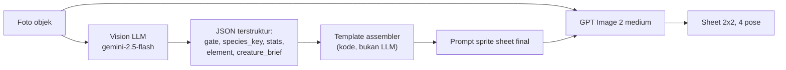

# 02 — Prompt Engineering & Vision Specification

Ini adalah dokumen paling menentukan kualitas Scanima. Kalau prompt-nya benar, sebuah mouse komputer jadi Anima yang jelas-jelas berasal dari mouse itu. Kalau salah, semua Anima terlihat seperti monster generik yang kebetulan diberi warna berbeda, dan seluruh premis game runtuh.

Ada dua panggilan LLM per Anima, dengan pembagian kerja yang tegas:



Perhatikan bahwa **foto asli tetap dikirim ke model gambar** lewat `input_images`. Vision LLM bukan penerjemah untuk model yang buta — model gambar bisa melihat objeknya sendiri. Tugas Vision LLM adalah hal yang tidak bisa dilakukan model gambar: mengeluarkan angka stat, memilih elemen, memberi kunci taksonomi untuk caching, dan menulis deskripsi kreatur yang menjembatani bentuk objek ke bentuk monster.

Dan tugas menyusun prompt final dipegang **kode**, bukan LLM. Style lock ditulis sekali sebagai konstanta dan tidak pernah diserahkan ke LLM untuk diparafrase, karena satu-satunya cara mendapat konsistensi visual antar ribuan Anima adalah memastikan 90% dari prompt itu identik setiap kali.

## 1. System prompt Vision LLM

File: `backend/prompts/v1/vision_system.md`

````markdown
You are the Anima Analyst for Scanima, a monster-collecting game where every
monster is derived from a photograph of a real physical object.

Your job has four parts, in this order:

1. GATE the photo. Decide whether it can legally and sensibly become a monster.
2. CLASSIFY the object into a closed taxonomy, for art caching.
3. DERIVE game stats from the object's real physical properties.
4. WRITE a creature brief: how this specific object becomes a creature.

You must respond with JSON matching the provided schema. No prose outside JSON.

---

## PART 1 — GATE

Set `safe: false` and give a `reject_reason` if ANY of these are true:

- A human face or recognizable person is a significant part of the frame.
  (A hand incidentally holding the object is fine — that is not a portrait.)
- Any pet or live animal is the main subject.
- Nudity, sexual content, gore, weapons designed to kill people, drugs,
  or hateful symbols are present.
- Personal identifying information is readable: ID cards, credit cards,
  passports, screens showing private messages, house numbers with a name.
- The image is so blurry, dark, or cluttered that no single object is
  identifiable as the subject.
- There is no discrete object at all — an empty room, sky, plain wall,
  or a texture with no boundaries.

reject_reason must be one of:
`human_face`, `live_animal`, `unsafe_content`, `personal_info`,
`too_unclear`, `no_object`.

If the photo passes, set `safe: true` and continue. Never continue past a
failed gate — the remaining fields must be null.

---

## PART 2 — CLASSIFY

`species_key`: lowercase snake_case, 2 to 4 segments, from general to specific.
Format: `<category>_<material>_<distinguishing_feature>`

Examples:
- ceramic coffee mug with a handle  -> `mug_ceramic_handled`
- mechanical keyboard               -> `keyboard_plastic_mechanical`
- running shoe                      -> `shoe_fabric_sneaker`
- potted succulent                  -> `plant_organic_succulent_potted`
- metal desk scissors               -> `scissors_metal_handled`
- clear plastic water bottle        -> `bottle_plastic_transparent`

Rules that matter more than they look:

- Be CONSERVATIVE and REUSE existing vocabulary. Two photos of two different
  ceramic mugs with handles must produce the identical `species_key`. This key
  is a cache key: inventing a new variant for every photo costs real money.
- Never include colour in `species_key`. Colour is handled separately.
- Never include brand names, personal detail, or condition
  (no `_dirty`, `_broken`, `_starbucks`).
- Only add a 4th segment when it changes the SILHOUETTE, not the decoration.

`color_bucket`: exactly one of
`warm_red`, `warm_yellow`, `cool_blue`, `cool_green`, `purple_pink`,
`neutral_light`, `neutral_dark`, `metallic`, `multicolor`.
Judge by the object's dominant colour, ignoring background and lighting.

---

## PART 3 — DERIVE STATS

Every stat must trace back to something physically observable in the photo.
You will be asked to justify each one in `stat_reasoning`. If you cannot point
to a visible feature, use the neutral value 50.

Each stat is an integer from 10 to 95.

**hp** — apparent mass, volume, and bulk.
  Large, thick, heavy, solid, dense -> high.
  Small, thin, hollow, flimsy -> low.

**atk** — protrusions, edges, points, and anything that concentrates force.
  Blades, spikes, points, prongs, corners, nozzles, teeth -> high.
  Smooth, rounded, featureless -> low.

**def** — hardness and durability of the material.
  Steel, stone, thick glass, hard ceramic -> high.
  Paper, foam, thin fabric, soft plastic -> low.

**spd** — lightness plus any feature suggesting motion.
  Wheels, rollers, hinges, wings, handles built for swinging, small and light
  -> high.  Heavy, static, bolted-down, awkward to lift -> low.

**special** — functional complexity and "hidden mechanism" energy.
  Buttons, switches, cables, circuits, screens, moving parts, liquids,
  compartments -> high.  A solid inert lump -> low.

The sum of all five stats must be between 200 and 350. Do not make everything
strong. A crumpled paper cup SHOULD be weak; that is funny and correct, and
players will find a use for it.

**element** — exactly one of `metal`, `plant`, `spark`, `flow`, `stone`, `cloth`.
Choose by dominant material and function, not by colour:

| element | choose when the object is |
| --- | --- |
| metal   | metal, sharp, tool-like, machined |
| plant   | organic, wooden, food, living or once-living |
| spark   | electronic, powered, screen-bearing, cable-bearing |
| flow    | liquid-holding, transparent, glass, ceramic, plumbing |
| stone   | heavy, mineral, concrete, dense inert mass |
| cloth   | fabric, paper, foam, flexible, soft, wearable |

**rarity** — integer 1 to 5, based on how visually distinctive and structurally
unusual the object is. A plain white mug is 1. An ornate antique camera with
many dials is 5. Do not inflate: 1 and 2 should be the most common outcomes.

---

## PART 4 — CREATURE BRIEF

This is the bridge from object to monster, and the part that makes Scanima
feel like Scanima. It gets inserted into an image prompt, so write it as
visual description only — no story, no lore, no adjectives about mood.

`creature_brief`: 40 to 70 words. It must state:
- the overall silhouette, derived from the object's actual geometry
- where the head/face sits on that silhouette
- how limbs emerge, and from which part of the object
- what the object's most distinctive feature becomes on the creature

`signature_features`: 2 to 4 short strings. These are the specific real details
that MUST survive into the artwork. Be concrete and countable.
Good: "two clickable buttons become the eyes", "the curved handle becomes a tail".
Bad: "mouse-like qualities", "interesting texture".

`suggested_name`: an invented creature name, 2 to 4 syllables, that hints at the
object without naming it outright. Use no real-world brand. Style it like a
90s monster name: Mugmon, Klikra, Sneakoid, Sporelet.

### Worked example — photo of a white ceramic mug with a handle

creature_brief: "A rounded barrel-shaped body that is unmistakably a mug, wide
mouth open at the top like a crown of ceramic. Two large eyes sit on the front
curve of the vessel. Two short stubby legs push out from the flat base. The
curved handle stays on the right side and functions as a single muscular arm."

signature_features: ["curved side handle becomes a single arm",
"open ceramic rim on top of the head", "flat circular base as feet"]

### Worked example — photo of a computer mouse

creature_brief: "A low domed shell shaped exactly like a mouse chassis, wider
at the back and tapering forward. The two click buttons at the front become
two heavy-lidded eyes. The scroll wheel between them reads as a nose. Four
thin insect legs sprout from underneath the shell. The cable trails behind as
a long segmented tail."

signature_features: ["left and right click buttons as the two eyes",
"scroll wheel as a nose", "USB cable as a segmented tail"]

---

Analyse the attached photograph now. Respond only with JSON.
````

## 2. JSON schema output Vision LLM

**Skema ini kontrak yang ditegakkan kode, bukan jaminan dari API.** Perbedaannya penting dan datang dari keputusan memanggil Gemini lewat Replicate (alasannya di [01](01-architecture-dataflow.md)): wrapper Replicate tidak menyediakan parameter `response_schema`. Rancangan awal dokumen ini mengandalkan structured output Gemini langsung, yang mengubah "biasanya JSON valid" menjadi "selalu JSON valid". Jaminan itu **tidak tersedia** di jalur yang dipakai sekarang, jadi ia harus digantikan oleh tiga lapis di kode:

1. Skema di bawah disisipkan **literal** ke `system_instruction`, bukan hanya dideskripsikan dalam prosa. Menunjukkan bentuk yang diinginkan jauh lebih efektif daripada menjelaskannya.
2. `extractJson()` di `backend/supabase/functions/_shared/vision.mjs` menangani bentuk keluaran yang wajar tapi tidak diminta: bungkus ```json, kalimat pengantar sebelum objek, dan array potongan string yang harus disambung (skema output wrapper-nya iterator).
3. Kalau tetap gagal, satu percobaan ulang pada `temperature: 0`. Ini tidak melanggar larangan retry otomatis di CLAUDE.md, karena larangan itu menyangkut generation gambar yang sekitar 23 kali lebih mahal. Retry yang terjadi dicatat di `summary.json`: kalau angkanya sering muncul, yang perlu diperbaiki adalah kontrak output di prompt, bukan parser-nya.

Skema tetap ditulis dalam notasi subset OpenAPI (`"nullable": true` alih-alih `["string", "null"]`, tanpa keyword `pattern`) meski `response_schema` tidak dipakai, karena format itu tetap benar sebagai deskripsi untuk model dan membuat perpindahan kembali ke Gemini API langsung tinggal menyalurkan file yang sama tanpa penulisan ulang.

Batasan yang memang tidak bisa diungkapkan di skema apa pun — format `species_key`, jumlah stat 200-350, larangan kata kabur di `signature_features` — ditegakkan di `validateVision()` pada `backend/supabase/functions/_shared/vision.mjs` — satu file yang dipakai harness eval maupun Edge Function, sebab gate yang berbeda antara keduanya berarti eval meloloskan foto yang produksi tolak, atau sebaliknya. Fungsi itu sekarang menjadi satu-satunya penjaga bentuk data, bukan lapis kedua di belakang jaminan API.

```json
{
  "type": "object",
  "required": ["safe", "reject_reason", "is_object"],
  "properties": {
    "safe":          { "type": "boolean" },
    "is_object":     { "type": "boolean" },
    "reject_reason": {
      "type": ["string", "null"],
      "enum": ["human_face", "live_animal", "unsafe_content",
               "personal_info", "too_unclear", "no_object", null]
    },
    "object_label":  { "type": ["string", "null"] },
    "species_key":   { "type": ["string", "null"], "pattern": "^[a-z]+(_[a-z]+){1,3}$" },
    "color_bucket":  {
      "type": ["string", "null"],
      "enum": ["warm_red", "warm_yellow", "cool_blue", "cool_green",
               "purple_pink", "neutral_light", "neutral_dark",
               "metallic", "multicolor", null]
    },
    "element": {
      "type": ["string", "null"],
      "enum": ["metal", "plant", "spark", "flow", "stone", "cloth", null]
    },
    "rarity": { "type": ["integer", "null"], "minimum": 1, "maximum": 5 },
    "stats": {
      "type": ["object", "null"],
      "required": ["hp", "atk", "def", "spd", "special"],
      "properties": {
        "hp":      { "type": "integer", "minimum": 10, "maximum": 95 },
        "atk":     { "type": "integer", "minimum": 10, "maximum": 95 },
        "def":     { "type": "integer", "minimum": 10, "maximum": 95 },
        "spd":     { "type": "integer", "minimum": 10, "maximum": 95 },
        "special": { "type": "integer", "minimum": 10, "maximum": 95 }
      }
    },
    "stat_reasoning": {
      "type": ["object", "null"],
      "description": "Fitur nyata yang mendasari tiap stat. Untuk debugging dan tooltip.",
      "properties": {
        "hp": { "type": "string" }, "atk": { "type": "string" },
        "def": { "type": "string" }, "spd": { "type": "string" },
        "special": { "type": "string" }
      }
    },
    "creature_brief":      { "type": ["string", "null"], "maxLength": 600 },
    "signature_features":  {
      "type": ["array", "null"],
      "items": { "type": "string", "maxLength": 120 },
      "minItems": 2, "maxItems": 4
    },
    "suggested_name":      { "type": ["string", "null"], "maxLength": 24 },
    "dominant_colors":     {
      "type": ["array", "null"],
      "items": { "type": "string", "pattern": "^#[0-9a-fA-F]{6}$" },
      "maxItems": 3
    }
  }
}
```

Konfigurasi panggilan: `temperature: 0.4` (cukup rendah agar `species_key` stabil antar foto serupa, cukup tinggi agar `creature_brief` tidak monoton), thinking dimatikan bila tersedia karena tugas ini tidak butuh penalaran bertahap dan thinking token dibilling di tarif output.

### Validasi setelah LLM

Schema menjamin bentuk, bukan kewajaran isi. Empat pemeriksaan tambahan di kode sebelum lanjut ke Replicate:

Jumlah stat dinormalisasi ke rentang 200-350 kalau LLM meleset, dengan penskalaan proporsional agar karakter relatif objeknya tetap terjaga. `species_key` dicocokkan ke daftar yang sudah ada di `species_library` dengan Levenshtein distance ≤ 2; kalau mirip, pakai yang lama — ini yang mencegah `mug_ceramic_handled` dan `mug_ceramic_handle` jadi dua entri cache berbeda. `signature_features` yang kosong atau berisi frasa kabur seperti "unique texture" memicu satu kali retry, karena fitur kabur adalah penyebab utama art yang tidak "True to Object". `suggested_name` generated yang masih berakhiran `mon` dinormalisasi sebelum ditulis ke Anima; nickname yang diketik pemain tidak ikut diubah.

## 3. Style lock: konstanta, bukan variabel

Style production yang sudah diterima tetap **v3**. **V5 adalah candidate terbaru**: ia membawa perbaikan material/logo milik v4 lalu menambah variasi karakter dan body plan. V4 tetap tersimpan sebagai predecessor yang belum dipromosikan. V5 belum menjadi default karena kontrak gratis hanya membuktikan teks dan data flow; kualitas visual tetap harus dibuktikan lewat model production berbayar. V1–v4 tetap utuh agar aset lama dan setiap iterasi prompt bisa direproduksi.

Style lock v2 yang identik untuk setiap Anima:

- 2D Japanese anime creature, cute-but-fierce, dengan readability monster game 1990-an tetapi wajib original
- linework gelap yang clean dan moderately bold
- flat base colors, crisp 2–3 level cel shading, hard-edged shadows, minimal gradients
- bentuk sederhana, silhouette kuat, anatomi sedikit dilebihkan
- bukan photorealism, CGI, 3D render, toy, painterly art, atau pixel art

Detail techno-organic, kabel, armor mekanis, atau cybernetic hanya sah untuk benda elektronik/mekanis. Yang dinamis: nama, `creature_brief`, 2–4 `signature_features`, palet, personality, `surface_finish`, `damage_hints`, dan mulai v5 `character_direction`. Personality tetap diturunkan deterministik dari stat tertinggi, sedangkan `character_direction` dibaca Vision dari cue visual objek; keduanya hanya memengaruhi ekspresi, proporsi, dan perilaku—bukan menambah komponen atau aksesori yang tidak ada.

Ada dua adaptasi teknis dari mockup guide:

1. Background transport tetap `#00FF00`, bukan putih, karena runtime GPT Image 2 menolak alpha. Sesudah post-processing hasil final transparan, jadi hijau bukan bagian dari art direction.
2. Label IDLE/BATTLE/SLEEP/DAMAGED dilarang. Teks model akan ikut bbox dan merusak sprite; posisi kuadran sudah menjadi label mesin.

Sudut pandang tetap 3/4 dari sedikit atas. White keyline dinaikkan menjadi 3–5px. Setiap appendage dan efek diminta berjarak minimal 6% dari center seam, tetapi post-processing juga wajib tahan jika model melanggar.

### Logo merek: v3 menyelesaikan reproduksi, lalu menciptakan logo semu

Foto pemain akan sering berisi logo, dan logo itu masuk ke gambar lewat `input_images`, bukan lewat teks prompt. Ini terbukti: v2 sudah memuat "no logos, brand names" di blok FORBIDDEN, Vision tidak pernah menyebut merek apa pun di `signature_features`, dan GPT Image 2 tetap menggambar swoosh Nike di keempat pose sheet sepatu. Larangan negatif tidak menang melawan bukti visual yang ada di gambar referensi.

V3 memakai instruksi pengganti: anggap mark merek tidak ada, lalu gambar permukaan polos atau marking geometris ciptaan sendiri. Hasil uji satu foto: swoosh hilang, diganti chevron ciptaan model, 4/4 sel, residu hijau 0,014%, dan `species_key` tetap stabil. Temuan berikutnya menunjukkan chevron/sigil buatan itu sendiri terbaca seperti logo, bahkan pada objek yang semula polos.

V4 menghapus cabang marking sepenuhnya. Logo, teks, model number, badge, stripe merek, dan simbol dianggap tidak ada; tempatnya selalu diisi material polos yang setia pada objek. Surface interest hanya boleh datang dari weave, grain, glaze, seams, natural speckles, leaf veins, wear, atau geometri fungsi—tidak pernah emblem/sigil/rune/chevron/swoosh rekaan.

### Damaged harus mengikuti material, bukan template robot

V3 menyebut `loose cable`, `exposed wire`, dan `broken key` dalam daftar contoh universal, sementara global style lock menyebut techno-organic. Image model mengikuti contoh konkret itu lebih kuat daripada frasa abstrak “object-appropriate”, sehingga mug, tanaman, dan kain ikut tampak seperti cyborg.

V4 menambah dua field Vision nullable tanpa mengubah `species_key`: `surface_finish` (misalnya `smooth glazed ceramic`, `woven canvas fabric`, `living waxy leaves`) dan 2–3 `damage_hints`. Assembler menyisipkannya langsung ke pose Damaged. Ia juga menyaring token teknis: cable/cord/wire/circuit/gear/key/screen/plug hanya boleh lolos bila token yang sama ada pada `signature_features`. Hasilnya: kaca retak/chip, keramik retak glasir, tanaman sobek/layu, kain berjumbai, kayu berserpih, logam penyok, dan plastik mengalami stress mark; kabel tetap boleh rusak pada mouse berkabel.

### V5: karakter dan anggota tubuh mengikuti objek

V5 dibuat dari v4 untuk menghapus dua default lain yang membuat hasil terasa
seragam: ekspresi fierce pada Idle dan anggota tubuh yang selalu dipaksakan.
Vision mendapat field `character_direction`, yaitu arahan visual singkat yang
diturunkan hanya dari bentuk, proporsi, warna, material, dan detail objek.
Arahnya boleh cute, feminin, maskulin, netral/androgynous, elegan, kokoh, atau
aneh; bila cue-nya ambigu, hasilnya wajib netral dan tidak boleh menebak gender.

Body plan menjadi keputusan eksplisit. Nol, satu, dua, atau banyak tangan/kaki
semuanya sah. Kalau bentuk objek lebih kuat sebagai makhluk melayang, melata,
menggelinding, bersayap, bercangkang, atau amorf, `creature_brief` menjelaskan
cara bergerak atau bertumpunya tanpa menambahkan tangan dan kaki generik.

Template gambar memakai `character_direction` untuk silhouette, proporsi,
wajah, dan bahasa pose yang konsisten di empat sel. Idle wajib rileks,
terbuka, dan tidak marah; sifat fierce hanya boleh muncul di Battle. Evolusi
mempertahankan presentation dan limb plan bentuk sebelumnya, bukan otomatis
membuatnya lebih garang atau menumbuhkan anggota tubuh baru.

Di client, Play dirancang sebagai bounce berulang sekitar 2,5 detik. Pose
Damaged—key internal-nya tetap `defeated`—memakai heavy breathing loop selama
Anima berada dalam Dormant. Keduanya tetap Tween procedural, berhenti saat
state berubah, dan tunduk pada satu sakelar Reduced Motion.

V5 juga menghentikan pola nama `-mon`: Vision dilarang memakai suffix itu maupun
meniru pola nama franchise monster yang sudah ada. Pagar runtime tetap berlaku
untuk semua versi prompt dan generation lama yang dilanjutkan, sehingga default
production v3 tidak dapat membocorkan contoh historis `Mugmon` ke nickname baru.
Pagar ini hanya menyentuh nama generated; nama lama tidak dimigrasi dan popup
setelah hatch memberi pemain pilihan mempertahankan hasil model atau menggantinya.

## 4. Template prompt sprite sheet

File default production adalah `backend/prompts/v3/sprite_sheet.md`; candidate terbaru ada di v5. File sumber itu tidak disalin ulang di dokumen ini. Arsitekturnya mengikuti blok stabil:

```text
[GLOBAL STYLE LOCK]
[OBJECT CONTEXT]
[CHARACTER RANGE]                   (v5: object-led presentation)
[SURFACE MARKS]                     (v4+: omit, never replace)
[OBJECT-TO-CREATURE TRANSFORMATION]
[COLOR + PERSONALITY]
[CHARACTER CONSISTENCY]
[FOUR STATES]
[COMPOSITION + TECHNICAL BACKGROUND]
[NEGATIVE STYLE]
```

Assembler mengisi semua placeholder dari hasil Vision yang sudah lolos gate:

```ts
const prompt = assemblePrompt(template, vision);
// {{object_name}}                    <- object_label / species_key
// {{creature_brief}}                 <- Vision
// {{signature_features_as_bullets}}  <- Vision array menjadi bullet list
// {{color_palette}}                  <- dominant_colors / color_bucket
// {{personality}}                    <- stat tertinggi
// {{surface_finish}}                 <- material/finish yang terlihat
// {{damage_hints_as_bullets}}        <- damage material; hint teknis disaring
// {{character_direction}}            <- cue visual objek; netral bila ambigu
```

Keempat keadaan visual adalah Idle, Battle, Sleep, dan Damaged. Untuk kompatibilitas manifest/Godot yang sudah ada, slot bawah-kanan masih memakai key internal `defeated`; art-nya mengikuti kontrak Damaged: kerusakan kecil yang spesifik ke objek, bukan tubuh dihancurkan atau didesain ulang.

## 5. Payload Replicate

Model production: `openai/gpt-image-2`, quality `medium`. Endpoint: `POST https://api.replicate.com/v1/models/openai/gpt-image-2/predictions`.

```jsonc
{
  "model": "openai/gpt-image-2",
  "input": {
    "prompt": "<hasil template di bagian 4, sudah terisi>",
    "input_images": [
      "https://<project>.supabase.co/storage/v1/object/sign/photos/<uid>/<uuid>.jpg?token=..."
    ],
    "aspect_ratio": "1024x1024",
    "quality": "medium",
    "number_of_images": 1,
    "background": "opaque",
    "output_format": "png",
    "output_compression": 100,
    "moderation": "auto"
  },
  "webhook": "https://<project>.supabase.co/functions/v1/replicate_webhook?t=<secret>",
  "webhook_events_filter": ["completed"]
}
```

Catatan per parameter, karena beberapa punya alasan yang tidak terlihat dari nilainya:

`input_images` memakai signed URL Supabase di produksi. Harness lokal boleh memakai data URI agar tidak membutuhkan Storage. Nama field ini berbeda dari nano-banana-pro (`image_input`); menyamakan keduanya akan membuat model mengabaikan foto.

`quality: "medium"` adalah keputusan berbasis run nyata, bukan asumsi. Dua sheet medium selesai dalam 57 dan 63 detik dengan 1.756 output token. Quality high memakai 7.024 output token dan ~153 detik; peningkatan art tidak sebanding dengan biaya dan latensinya.

### Baseline harga untuk pembanding model

Snapshot pricing Replicate pada **13 Agustus 2026** untuk `openai/gpt-image-2`:

| Quality | Harga tercantum per output image |
| --- | ---: |
| `auto` | $0.128 |
| `low` | $0.012 |
| `medium` | $0.047 |
| `high` | $0.128 |

Satu output image Scanima adalah satu PNG 1024×1024 yang memuat satu sheet Anima
2×2 berisi empat pose. Generation production `medium` terbaru tercatat sekitar
**$0.05 per sheet**, dekat dengan harga tercantum $0.047. Dua run medium lama
sebesar $0.068 dan $0.072 tetap dicatat sebagai data historis, bukan ditimpa;
harga provider dan komponen billing dapat berubah. Biaya Vision sekitar $0.003
terpisah dari angka image generation.

Untuk membandingkan model baru, selalu catat tanggal, model/version, quality,
jumlah dan resolusi input/output, biaya **per sheet yang lolos QA**, latensi,
kelengkapan 4/4 pose, kesetiaan True to Object, dan hasil keying. Harga katalog
saja tidak cukup jika model murah lebih sering menghasilkan sheet yang harus
diulang. Estimasi operasional di `pricing.mjs` tetap $0.07 sebagai pagar spend
cap konservatif sampai sampel production berulang membenarkan perubahan.

`output_format: "png"` wajib. JPEG akan menambahkan artefak kompresi di sekitar tepi sprite, dan artefak itu persis merusak chroma keying di piksel yang paling penting.

`background: "opaque"` bukan preferensi estetika. Runtime GPT Image 2 menolak `transparent` dengan `invalid_value` meskipun opsi itu terlihat di schema wrapper. Karena itu prompt tetap meminta chroma green.

`webhook_events_filter: ["completed"]` mencegah kita dibanjiri event `start` dan `logs` yang tidak dipakai.

### Payload evolusi

Bedanya hanya isi `input_images`, dan bedanya penting: yang dikirim adalah **sprite Idle Anima itu sendiri**, bukan foto asli. Model gambar unggul dalam editing, jadi memberinya sprite stage sebelumnya membuat identitas visual bertahan antar stage — mata yang sama, palet yang sama, fitur khas yang sama, hanya lebih besar dan lebih garang.

```jsonc
{
  "input": {
    "prompt": "<template evolusi, lihat di bawah>",
    "input_images": ["https://.../sheets/<hash>_idle.png"],
    "aspect_ratio": "1024x1024", "quality": "medium",
    "number_of_images": 1, "background": "opaque", "output_format": "png"
  }
}
```

Tambahan prompt evolusi, disisipkan setelah blok `THE CREATURE`:

```markdown
EVOLUTION
The reference image is this creature's earlier form. Keep its identity clearly
intact: the same colour palette, the same eye design, and all of the signature
features listed above must still be recognisable.

Now evolve it into a more powerful adult stage. It is larger and taller, its
proportions are more athletic and less rounded, it gains one or two new
armoured or elaborate details growing out of existing parts, and its
expression is more confident. A player must look at the two forms side by side
and say "that is the same creature, grown up".
```

## 6. Kegagalan yang sudah diketahui dan penanganannya

Daftar ini disusun dari output nyata nano-banana-pro dan GPT Image 2. Semuanya ditangani, bukan cuma dicatat.

| Gejala | Sebab | Penanganan |
| --- | --- | --- |
| Background checkerboard abu-putih | Model "menggambar" arti transparansi | Jangan pernah sebut kata transparent/alpha/PNG di prompt; minta hijau eksplisit dengan hex |
| Hijau merembes ke tepi sprite | Antialiasing tepi mencampur hijau ke line art | White keyline 2-3px + keying HSV, bukan RGB |
| Skala berbeda antar frame | Model mendramatisasi pose Attack | Instruksi skala eksplisit; deteksi di post-processing dengan membandingkan tinggi bbox, selisih > 25% ditandai untuk review |
| Label teks "IDLE" muncul | Kebiasaan model pada sheet berlabel | Blok FORBIDDEN; bbox akan memasukkan teks kalau lolos, jadi cek rasio aspek bbox yang mencurigakan |
| Hanya 3 sel terisi | Instruksi layout terlalu implisit | Sebut "exactly four cells" dan definisikan tiap kuadran per nama posisi |
| Tangan/kabel pose kanan melewati center seam | Pose dinamis melanggar margin kuadran | Segmentasi alpha 8-connected + ownership mask per piksel; jangan kembali ke bbox yang dibatasi kuadran |
| Subjek tidak center di kuadran | Komposisi bebas model | Normalisasi bbox hasil segmentasi, bottom-center ke frame seragam |
| Pose Attack dibuang sebagai "keying gagal" | Speed line dan percikan membuat bbox seluas kuadran padahal isinya cuma 42% opak | Penjaga harus menuntut dua syarat sekaligus: bbox seluas kuadran **dan** terisi padat |
| Kreatur jadi naga/hewan generik | Model condong ke prior "monster" | Kalimat "the object IS the body" + larangan eksplisit + `signature_features` yang konkret |
| Cast shadow di bawah kreatur | Kebiasaan render | Larangan eksplisit; keying akan menyisakan noda gelap kalau lolos |
| `background: "transparent"` ditolak | Runtime GPT Image 2 belum mendukung alpha | Pakai `opaque` + chroma green; jangan percaya schema tanpa request nyata |

Yang tidak bisa diperbaiki lewat prompt, dan harus diterima: model tidak akan pernah 100% konsisten. Karena itu ada `regenerate` dengan biaya 1 Genesis Core seperti Genesis biasa, dan `generations.status` mencatat kegagalan agar rasio retry bisa diukur.

## 7. Versioning prompt

Prompt adalah kode produksi yang menentukan kualitas aset permanen, jadi ia diperlakukan seperti kode.

```
backend/prompts/
├── v1/
│   ├── vision_system.md
│   ├── vision_schema.json
│   ├── sprite_sheet.md
│   └── sprite_sheet_evolve.md
├── v2/
│   ├── vision_system.md
│   ├── vision_schema.json
│   ├── sprite_sheet.md
│   └── sprite_sheet_evolve.md
├── v3/                    <- default production
│   ├── vision_system.md
│   ├── vision_schema.json
│   ├── sprite_sheet.md
│   └── sprite_sheet_evolve.md
├── v4/                    <- predecessor: material + damage
│   ├── vision_system.md
│   ├── vision_schema.json
│   ├── sprite_sheet.md
│   └── sprite_sheet_evolve.md
└── v5/                    <- candidate terbaru, belum Smoke Set berbayar
    ├── vision_system.md   # + character_direction + limb plan opsional
    ├── vision_schema.json
    ├── sprite_sheet.md    # Idle non-angry + character range
    └── sprite_sheet_evolve.md
```

Versi yang aktif dibaca dari tabel `app_config`, bukan dari env Edge Function, supaya rollback kualitas art tidak menunggu deploy.

**Edge Function tidak bisa membaca file-file itu langsung.** `Deno.readTextFile()` gagal untuk file pendamping yang dideploy lewat MCP, jadi `backend/tools/bundle_prompts.mjs` membundel semua versi menjadi `functions/_shared/prompts.generated.ts` yang diimpor sebagai modul biasa. Sumber kebenarannya tetap file `.md` di git; yang di-generate adalah turunan, dan skenario 17 di `npm run selftest` gagal kalau turunannya basi. Menyalin isi prompt ke dalam kode adalah jawaban yang lebih buruk: salinan itu akan menyimpang, dan divergensinya baru terlihat saat art produksi berbeda dari art yang sudah disetujui di Smoke Set.

Tiga aturan operasionalnya:

Setiap row `generations` menyimpan `prompt_version`. Ini yang memungkinkan pertanyaan "kenapa Anima bulan lalu lebih bagus?" dijawab dengan data, bukan ingatan.

Versi yang sudah dipakai produksi **tidak pernah diedit**. Perubahan sekecil apa pun berarti direktori baru. Alasannya: aset lama dibuat dengan prompt lama, dan kalau file-nya berubah kita kehilangan kemampuan mereproduksi atau membandingkan.

`species_library` juga menyimpan `prompt_version`. Kalau v2 terbukti lebih baik, entri lama bisa di-regenerate bertahap di latar belakang — dan karena art di-share lintas pemain, satu regenerasi memperbaiki tampilan untuk semua pemilik spesies itu.

## 8. Evaluation harness: dua tingkat

Menilai prompt dari satu-dua foto adalah cara tercepat menipu diri sendiri. Tapi menjalankan 20 foto setiap kali mengubah satu kalimat prompt juga salah, karena biayanya sekitar $1.32 per putaran dan iterasi prompt butuh beberapa putaran.

Jadi ada dua set dengan peran berbeda, dan pembagian ini mengikuti pola yang sama seperti test suite pada umumnya: satu yang cepat dan murah untuk dijalankan terus-menerus, satu yang lengkap dan lambat untuk gerbang penerimaan.

| Set | Isi | Biaya per run | Kapan dijalankan |
| --- | --- | --- | --- |
| **Smoke Set** | 5 foto (3 generation + 2 uji gate) | **~$0.225** | Setiap kali prompt diubah |
| **Full Set** | 20 foto (18 generation + 2 uji gate) | ~$1.32 | Sekali, saat prompt dianggap siap |

### Smoke Set — 5 foto

Tiga foto yang memicu generation dipilih bukan karena mewakili objek paling umum, tapi karena masing-masing menguji satu mode kegagalan yang berbeda dan paling mungkin terjadi. Dengan anggaran tiga foto, yang dicari adalah cakupan kegagalan terluas, bukan keterwakilan objek.

| # | Foto | Mode kegagalan yang diuji | Kenapa foto ini |
| --- | --- | --- | --- |
| 1 | **Mouse komputer** | Kreatur jadi hewan generik, fitur objek hilang | Kepadatan fitur tertinggi per satu foto: tombol jadi mata, scroll jadi hidung, kabel jadi ekor. Kalau prompt gagal "True to Object", di sini paling kelihatan |
| 2 | **Mug putih keramik** | Keying gagal, white keyline tenggelam | Objek putih menguji tabrakan antara outline putih dan badan putih, sekaligus objek paling umum yang akan difoto pemain |
| 3 | **Sepatu atau bantal** | Silhouette dipaksa jadi kaku dan bersudut | Material lunak adalah tempat model paling sering menyerah dan menggambar monster keras generik |
| 4 | **Foto berisi wajah** | Gate bocor | Biaya ~$0.003, tidak ada generation |
| 5 | **Foto dinding kosong** | Gate bocor (`no_object`) | Biaya ~$0.003, tidak ada generation |

Dua foto uji gate **tidak perlu dipotong meski anggaran ketat**, dan ini poin yang mudah terlewat: keduanya ditolak sebelum satu sen pun sampai ke Replicate, jadi biayanya hanya panggilan Vision. Memangkas keduanya menghemat $0.0006 sambil menghilangkan pemeriksaan yang risikonya paling besar — gate yang bocor adalah masalah kebijakan toko aplikasi, bukan sekadar art yang jelek.

Jadi "5 foto" sebenarnya berarti **3 generation**, dan itulah angka yang menentukan biaya.

**Hasil terukur run v2 pertama, 12 Agustus 2026.** Ketiga foto generation lolos: `mouse_plastic_wired`, `mug_ceramic_handled`, `shoe_fabric_sneaker`, masing-masing 4/4 sel dengan residu hijau 0,008%, 0,001%, dan 0,008% — jauh di bawah ambang 0,1%. Selisih skala Idle vs Attack 9,1%, 12,7%, dan 6,1%; latensi 74, 69, dan 61 detik; total $0.225. Kedua foto uji gate ditolak dengan alasan yang benar (`human_face`, `no_object`). Satu bug post-processing ikut tertangkap di run ini, bukan bug prompt: penjaga kegagalan keying membuang pose Attack milik mouse karena speed line-nya membuat bbox mengisi 96% kuadran. Sheet-nya diperbaiki lewat `--reprocess` tanpa membayar generation kedua.

### Iterasi manual: cara paling murah menyetel kata-kata prompt

Sebelum menyentuh API sama sekali, sebagian besar penyetelan prompt bisa dilakukan **manual di aplikasi Gemini atau AI Studio**: tempel foto, tempel prompt, lihat hasilnya, ubah satu kalimat, ulangi. Untuk pekerjaan menemukan kalimat yang membuat model berhenti menggambar naga generik, ini jauh lebih cepat dan hampir tanpa biaya marginal dibandingkan menjalankan script.

Batasnya harus dipahami supaya tidak menyesatkan: aplikasi web memakai default sendiri untuk resolusi, quality, aspect ratio, dan moderation, dan **tidak memakai jalur `input_images` + payload production**. Jadi iterasi manual hanya sah untuk menyetel *kata-kata*. Begitu kata-katanya stabil, Smoke Set lewat API tetap wajib, sebab yang diuji di situ bukan lagi prompt-nya melainkan seluruh pipeline: payload, keying, slicing, manifest.

Jangan menyetel v2 memakai nano-banana-pro lalu menganggap hasilnya berlaku untuk GPT Image 2. Kedua model punya mode kegagalan komposisi dan style yang berbeda. Baseline v1 tetap tersedia untuk A/B, tetapi gerbang penerimaan v2 harus dijalankan pada model production yang sebenarnya.

### Full Set — 20 foto

Dijalankan sekali sebagai gerbang penerimaan, bukan sebagai alat iterasi. Tiga foto pertama Smoke Set ikut di dalamnya sebagai nomor 4, 1, dan 6.

| # | Foto | Yang diuji |
| --- | --- | --- |
| 1-3 | Mug, gelas, botol | Objek paling umum, dasar uji dedup cache |
| 4-5 | Keyboard, mouse | Fitur kecil banyak (tombol) yang harus jadi mata/detail |
| 6-7 | Sepatu, tas kain | Material lunak, silhouette tidak kaku |
| 8-9 | Gunting, kunci | Objek tajam, uji pemetaan ATK tinggi |
| 10-11 | Tanaman pot, buah | Organik, uji elemen plant |
| 12-13 | Batu, koin | Massa padat inert, uji stat ekstrem rendah SPD |
| 14 | Kabel charger kusut | Objek tanpa silhouette jelas, kasus sulit |
| 15 | Objek transparan (botol kaca) | Uji keying pada tepi tembus pandang |
| 16 | Objek hitam di latar gelap | Uji kontras rendah dan bbox |
| 17 | Objek putih di latar putih | Uji keying dan white keyline |
| 18 | Objek dengan pantulan (logam) | Uji `metallic` color bucket |
| 19 | **Foto berisi wajah** | **Gate harus menolak** |
| 20 | **Foto dinding kosong** | **Gate harus menolak (`no_object`)** |

### Cara menjalankan

```bash
node eval/run.mjs --set smoke                       # v3, 5 foto, ~$0.225
node eval/run.mjs --set full                        # v3, 20 foto, ~$1.32
node eval/run.mjs --set smoke --prompt-version v5 --dry-run    # gratis
node eval/run.mjs --set smoke --prompt-version v2 --reprocess   # gratis, dari raw.png
```

Ketiganya memakai harness yang sama dan hanya berbeda daftar foto, jadi tidak ada kode terpisah yang bisa menyimpang. `--reprocess` ada karena perubahan post-processing tidak boleh menuntut generation baru: ia memakai `raw.png` yang sudah dibayar, menyusun ulang sheet, manifest, dan contact sheet tanpa satu pun panggilan API, dan sengaja tidak menimpa `vision.json` maupun `prompt.txt` karena keduanya catatan run yang menghasilkan gambar itu. Hasil disimpan ke `eval/results/<version>/<set>/` sebagai contact sheet HTML (foto asli di kiri, sheet hasil di kanan, JSON Vision di bawahnya) plus metrik otomatis.

Simpan setiap hasil dan **jangan pernah hapus**. Perbandingan antar versi prompt harus bisa dilakukan tanpa re-run, karena re-run berarti membayar lagi.

Metrik yang bisa dihitung mesin: rasio gate benar (harus sempurna, tanpa pengecualian), jumlah sel terdeteksi per sheet (harus 4), **varians tinggi bbox antara Idle dan Attack** (target < 15%), persentase piksel hijau tersisa setelah keying (target < 0,1%), dan stabilitas `species_key` saat foto objek serupa divariasikan.

Angka terukur dari run smoke v2, sebagai patokan terbaru: gate 2/2, sel 4/4 pada ketiga sheet, varians Idle vs Attack 6,1–12,7%, residu hijau 0,001–0,008%. Angka dari run smoke v1 pertama, untuk pembanding: gate 2/2, sel 4/4 pada kedua sheet, varians Idle vs Attack 3,4%, residu hijau 0,014% dan 0,024%. Ketiga metrik pertama lolos sejak percobaan pertama; residu hijau **tidak** — ia mulai di 0,21% dan baru sampai ke angka itu setelah erosi tepi ditambahkan, ceritanya di [01](01-architecture-dataflow.md). Perlu diingat saat membaca metrik ini ke depan: karena erosi menghapus cincin 1px, angka residu sekarang mengukur halo yang lebih tebal dan hijau di interior, bukan lagi fringe setipis satu piksel.

Yang dibandingkan sengaja hanya Idle dan Attack, bukan keempat pose. Kreatur yang meringkuk tidur memang jauh lebih pendek daripada yang berdiri, jadi varians keempat pose akan memberi alarm palsu pada sheet yang sempurna dan melatih kita mengabaikan peringatan. Yang benar-benar menandakan model mengubah skala adalah selisih antara dua pose yang sama-sama berdiri penuh.

Untuk `species_key`, harness juga melaporkan jumlah species unik dari total foto. Angka ini adalah proksi paling awal untuk rasio cache hit, dan rasio cache hit-lah yang menentukan sehat atau tidaknya seluruh model biaya di [04](04-game-systems-economy.md). Kalau 20 foto menghasilkan 20 species unik, artinya prompt terlalu mudah menciptakan varian baru dan tidak ada Discovery Scan yang gratis. Typo satu huruf pun dinormalisasi lewat jarak Levenshtein ≤ 2 terhadap kunci yang sudah ada, karena satu huruf beda berarti satu generation dibayar dua kali.

Metrik yang butuh mata manusia, diberi skor 1-5 per foto dan dicatat di file yang sama: **kemiripan ke objek asli** (apakah "True to Object" tercapai) dan **konsistensi gaya** antar keempat pose. Ini dua hal yang tidak ada proksi otomatisnya, dan keduanya adalah inti produk.
