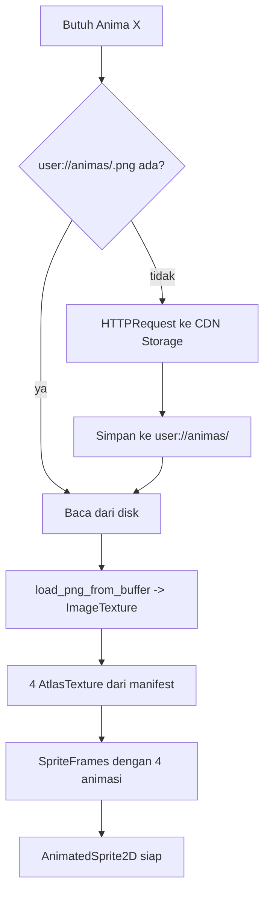

# 03 — Godot Engine Integration & Sprite Handling

Dokumen ini menjelaskan apa yang terjadi di dalam Godot: bagaimana sprite sheet diunduh, dipecah jadi empat pose, dipasang ke `AnimatedSprite2D`, di-cache, dan dibuat terasa hidup meski hanya berisi empat gambar statis.

Prinsip yang mengatur seluruh bab ini: **Godot tidak memproses piksel.** Semua keying, slicing, dan trimming sudah selesai di backend. Godot menerima satu PNG RGBA plus satu manifest JSON, lalu memasang empat `AtlasTexture` yang menunjuk region berbeda pada satu tekstur yang sama. Nol copy piksel, nol dekode ulang, nol beban CPU di device low-end.

## 1. Kontrak manifest

Manifest adalah satu-satunya hal yang menghubungkan backend dan Godot soal geometri sprite. Kalau formatnya jelas, Godot tidak perlu tahu apa pun tentang chroma key atau bbox.

```json
{
  "version": 1,
  "sheet": "mug_ceramic_handled_neutral_light_1.png",
  "sheet_size": [1024, 1024],
  "frame_size": [420, 460],
  "poses": {
    "idle":     { "region": [ 46,  22, 420, 460] },
    "attack":   { "region": [558,  22, 420, 460] },
    "sleep":    { "region": [ 46, 534, 420, 460] },
    "defeated": { "region": [558, 534, 420, 460] }
  },
  "qa": {
    "green_residue_ratio": 0.0004,
    "bbox_height_variance": 0.11,
    "cells_detected": 4
  }
}
```

Satu detail di sini menyelesaikan masalah yang mudah diremehkan: **`frame_size` sama untuk keempat pose.** Backend menghitung bbox rapat setiap pose, mengambil ukuran union terbesar, lalu memperluas keempat region ke ukuran identik dengan menjaga titik jangkar (bottom-center kuadran asal) tetap di posisi relatif yang sama.

Kenapa itu penting: `AnimatedSprite2D` hanya punya satu properti `offset` untuk seluruh animasi, bukan per-frame. Kalau setiap pose punya ukuran region berbeda, sprite akan tersentak berpindah posisi setiap ganti frame, dan tidak ada cara memperbaikinya di client tanpa menambah node pembungkus per frame. Menormalisasi di backend menghapus masalahnya seluruhnya, dan biayanya cuma beberapa baris aritmetika di tempat yang sudah menyentuh piksel.

Blok `qa` tidak dipakai game, tapi ikut disimpan agar sheet yang buruk bisa ditemukan lewat query alih-alih laporan pemain: `green_residue_ratio` tinggi berarti keying gagal, `bbox_height_variance` tinggi berarti model mengubah skala antar pose.

## 2. Arsitektur node

```
AnimaView (Node2D)
├── AnimaSprite (AnimatedSprite2D)   %AnimaSprite
├── Shadow (Sprite2D)                bayangan elips statis, bukan dari sheet
├── FxLayer (Node2D)                 partikel makan/tidur/level up
└── Body (Node2D)                    target tween, membungkus sprite
```

Alasan `AnimaSprite` ada di dalam `Body` yang terpisah: animasi prosedural memanipulasi `scale` dan `position` milik `Body`, sementara `AnimaSprite` menyimpan `flip_h` dan pergantian pose. Memisahkan keduanya berarti tween squash-stretch tidak pernah berkelahi dengan logika arah hadap.

`Shadow` sengaja tidak berasal dari sheet. Prompt melarang cast shadow karena bayangan yang di-render model akan ikut ter-keying jadi noda gelap dan berbeda bentuk di setiap pose. Satu elips statis yang di-scale mengikuti tween napas jauh lebih murah dan justru lebih konsisten.

## 3. Alur pemuatan



### Autoload `AnimaLoader`

```gdscript
extends Node
## Mengunduh, meng-cache, dan membangun SpriteFrames untuk Anima.

const CACHE_DIR := "user://animas/"
const CACHE_LIMIT_BYTES := 100 * 1024 * 1024

signal sheet_ready(cache_key: String, frames: SpriteFrames)
signal sheet_failed(cache_key: String, reason: String)

var _cache: Dictionary = {}          # cache_key -> SpriteFrames
var _in_flight: Dictionary = {}      # cache_key -> true

func _ready() -> void:
	DirAccess.make_dir_recursive_absolute(CACHE_DIR)


func request_frames(anima: AnimaData) -> void:
	var key := anima.cache_key()      # "<species_key>_<color_bucket>_<stage>"
	if _cache.has(key):
		sheet_ready.emit(key, _cache[key])
		return
	if _in_flight.has(key):
		return                         # sudah ada permintaan jalan untuk key ini
	_in_flight[key] = true

	if _has_local(key):
		_build_from_local(key)
	else:
		_download(key, anima.sheet_url, anima.manifest_url)


func _has_local(key: String) -> bool:
	return FileAccess.file_exists(CACHE_DIR + key + ".png") \
		and FileAccess.file_exists(CACHE_DIR + key + ".json")


func _build_from_local(key: String) -> void:
	var png := FileAccess.get_file_as_bytes(CACHE_DIR + key + ".png")
	var raw := FileAccess.get_file_as_string(CACHE_DIR + key + ".json")
	var manifest: Variant = JSON.parse_string(raw)

	if png.is_empty() or typeof(manifest) != TYPE_DICTIONARY:
		# Cache korup: buang dan paksa unduh ulang berikutnya.
		DirAccess.remove_absolute(CACHE_DIR + key + ".png")
		DirAccess.remove_absolute(CACHE_DIR + key + ".json")
		_in_flight.erase(key)
		sheet_failed.emit(key, "cache_corrupt")
		return

	var frames := build_sprite_frames(png, manifest)
	_in_flight.erase(key)
	if frames == null:
		sheet_failed.emit(key, "decode_failed")
		return
	_cache[key] = frames
	sheet_ready.emit(key, frames)
```

### Membangun `SpriteFrames`

Inilah inti "slicing" — dan perhatikan bahwa tidak ada satu pun piksel yang disalin. `AtlasTexture` hanyalah jendela ke region tekstur induk.

```gdscript
const POSES := ["idle", "attack", "sleep", "defeated"]

func build_sprite_frames(png_bytes: PackedByteArray, manifest: Dictionary) -> SpriteFrames:
	var image := Image.new()
	if image.load_png_from_buffer(png_bytes) != OK:
		return null

	var sheet := ImageTexture.create_from_image(image)
	var frames := SpriteFrames.new()
	frames.remove_animation("default")

	var poses: Dictionary = manifest.get("poses", {})
	for pose in POSES:
		if not poses.has(pose):
			return null                      # manifest tidak lengkap, tolak seluruhnya
		var r: Array = poses[pose]["region"]

		var atlas := AtlasTexture.new()
		atlas.atlas = sheet
		atlas.region = Rect2(r[0], r[1], r[2], r[3])
		atlas.filter_clip = true             # cegah bleed dari region sebelah

		frames.add_animation(pose)
		frames.set_animation_loop(pose, pose == "idle" or pose == "sleep")
		frames.set_animation_speed(pose, 1.0)
		frames.add_frame(pose, atlas)

	return frames
```

`filter_clip = true` adalah satu baris yang mencegah bug yang membingungkan: tanpa itu, filtering bilinear pada tepi region bisa mengambil sampel dari kuadran sebelahnya, memunculkan garis tipis berisi potongan pose lain. Padding antar sel di prompt sudah mengurangi risikonya, tapi ini menutupnya sepenuhnya.

Keempat animasi masing-masing berisi **satu frame**. Terdengar aneh untuk `SpriteFrames`, tapi ini memberi keuntungan nyata: pergantian pose jadi `sprite.play("attack")`, satu baris, dan sistem battle maupun sistem perawatan tidak perlu tahu apa pun tentang atlas atau region.

### Unduh dengan retry

```gdscript
func _download(key: String, sheet_url: String, manifest_url: String) -> void:
	var manifest_bytes := await _http_get(manifest_url, 2)
	if manifest_bytes.is_empty():
		_in_flight.erase(key)
		sheet_failed.emit(key, "manifest_unreachable")
		return

	var png_bytes := await _http_get(sheet_url, 2)
	if png_bytes.is_empty():
		_in_flight.erase(key)
		sheet_failed.emit(key, "sheet_unreachable")
		return

	# Tulis ke cache hanya setelah KEDUANYA berhasil, supaya tidak pernah ada
	# pasangan file setengah jadi di disk.
	FileAccess.open(CACHE_DIR + key + ".png", FileAccess.WRITE).store_buffer(png_bytes)
	FileAccess.open(CACHE_DIR + key + ".json", FileAccess.WRITE).store_buffer(manifest_bytes)
	_enforce_cache_limit()
	_build_from_local(key)


func _http_get(url: String, retries: int) -> PackedByteArray:
	for attempt in retries + 1:
		var req := HTTPRequest.new()
		add_child(req)
		req.timeout = 15.0
		var err := req.request(url)
		if err != OK:
			req.queue_free()
			continue
		var result: Array = await req.request_completed
		req.queue_free()
		# result = [result, response_code, headers, body]
		if result[0] == HTTPRequest.RESULT_SUCCESS and result[1] == 200:
			return result[3]
		if attempt < retries:
			await get_tree().create_timer(1.0 * (attempt + 1)).timeout
	return PackedByteArray()
```

Urutan penulisan file itu disengaja: unduh keduanya ke memori dulu, baru tulis. Menulis PNG lebih dulu lalu gagal mengunduh manifest akan meninggalkan cache yang lolos pemeriksaan `_has_local()` separuh dan gagal misterius nanti.

### Batas cache

```gdscript
func _enforce_cache_limit() -> void:
	# ponytail: LRU berbasis modified-time, dijalankan hanya setelah tulis baru.
	# Plafon: O(n) scan direktori tiap unduh. Naikkan ke index terpisah kalau
	# jumlah file cache pernah melewati ~2000.
	var entries: Array = []
	var total := 0
	var dir := DirAccess.open(CACHE_DIR)
	dir.list_dir_begin()
	var name := dir.get_next()
	while name != "":
		if name.ends_with(".png"):
			var path := CACHE_DIR + name
			var size := FileAccess.open(path, FileAccess.READ).get_length()
			entries.append({ "key": name.trim_suffix(".png"), "size": size,
				"mtime": FileAccess.get_modified_time(path) })
			total += size
		name = dir.get_next()
	dir.list_dir_end()

	if total <= CACHE_LIMIT_BYTES:
		return

	entries.sort_custom(func(a, b): return a["mtime"] < b["mtime"])
	for e in entries:
		if total <= CACHE_LIMIT_BYTES:
			break
		DirAccess.remove_absolute(CACHE_DIR + e["key"] + ".png")
		DirAccess.remove_absolute(CACHE_DIR + e["key"] + ".json")
		_cache.erase(e["key"])
		total -= e["size"]
```

Kunci cache memakai `species_key` dan bukan `anima_id`, jadi lima Anima mug hanya memakan satu slot disk. Ini konsekuensi langsung dari pustaka species di [01](01-architecture-dataflow.md), dan alasan plafon 100 MB terasa longgar meski sheet-nya besar.

## 4. Background removal

Jalur normal: **tidak ada pekerjaan sama sekali di Godot.** Backend sudah mengirim PNG RGBA yang bersih. Bagian ini adalah jaring pengaman untuk dua kasus: mode BYOK (yang memotong backend seluruhnya) dan skenario di mana keying backend harus dipindah ke client karena batas CPU Edge Function.

### Shader chroma key

```glsl
shader_type canvas_item;
render_mode unshaded;

uniform float key_hue     : hint_range(0.0, 1.0) = 0.3333;  // 120 derajat
uniform float hue_tol     : hint_range(0.0, 0.5) = 0.061;   // +/- 22 derajat
uniform float sat_min     : hint_range(0.0, 1.0) = 0.30;
uniform float val_min     : hint_range(0.0, 1.0) = 0.30;
uniform float edge_soften : hint_range(0.0, 0.2) = 0.02;

vec3 rgb2hsv(vec3 c) {
	vec4 K = vec4(0.0, -1.0 / 3.0, 2.0 / 3.0, -1.0);
	vec4 p = mix(vec4(c.bg, K.wz), vec4(c.gb, K.xy), step(c.b, c.g));
	vec4 q = mix(vec4(p.xyw, c.r), vec4(c.r, p.yzx), step(p.x, c.r));
	float d = q.x - min(q.w, q.y);
	float e = 1.0e-10;
	return vec3(abs(q.z + (q.w - q.y) / (6.0 * d + e)), d / (q.x + e), q.x);
}

void fragment() {
	vec4 src = texture(TEXTURE, UV);
	vec3 hsv = rgb2hsv(src.rgb);

	float hue_dist = abs(hsv.x - key_hue);
	hue_dist = min(hue_dist, 1.0 - hue_dist);          // hue itu melingkar

	float is_key = step(hue_dist, hue_tol)
	             * step(sat_min, hsv.y)
	             * step(val_min, hsv.z);

	// Fade lembut di ambang supaya tepi tidak bergerigi
	float soft = smoothstep(hue_tol, max(hue_tol - edge_soften, 0.0), hue_dist);
	float alpha = src.a * (1.0 - is_key * soft);

	// Nolkan warna di piksel transparan: mencegah halo hijau saat difilter
	COLOR = vec4(src.rgb * step(0.01, alpha), alpha);
}
```

Keying memakai HSV dan bukan jarak RGB karena hijau `#00FF00` punya hue yang sangat khas, sementara jarak RGB akan ikut memakan warna hijau yang sah pada tubuh Anima (misalnya Anima tanaman). Hue melingkar, jadi `min(d, 1-d)` bukan detail kosmetik — tanpa itu hijau di sekitar hue 0 akan lolos.

### Bake sekali, jangan dipakai terus-menerus

Menjalankan shader ini setiap frame untuk setiap Anima adalah pemborosan: hasilnya selalu sama. Jadi jalankan sekali, ambil hasilnya, simpan sebagai PNG RGBA, lalu buang shader-nya.

```gdscript
func bake_chroma_key(source: Texture2D) -> Image:
	var vp := SubViewport.new()
	vp.size = source.get_size()
	vp.transparent_bg = true
	vp.render_target_update_mode = SubViewport.UPDATE_ONCE

	var rect := TextureRect.new()
	rect.texture = source
	rect.material = load("res://shaders/chroma_key.gdshader_material.tres")
	rect.size = source.get_size()
	vp.add_child(rect)
	add_child(vp)

	# Tunggu satu frame gambar selesai sebelum membaca hasilnya.
	await RenderingServer.frame_post_draw
	var baked := vp.get_texture().get_image()
	vp.queue_free()
	return baked
```

Setelah ini, `baked.save_png(CACHE_DIR + key + ".png")` dan seterusnya jalur pemuatannya identik dengan jalur normal.

Yang hilang di jalur fallback ini, dan harus diakui: bbox trimming per pose. Tanpa backend yang mengukur, kita jatuh ke pembagian grid buta 2x2 — yang sudah dicatat di [02](02-prompt-engineering.md) sebagai penyebab sprite terpotong ketika model tidak menaruh subjek di tengah sel. Itulah sebabnya jalur ini fallback, bukan pilihan utama. Mitigasi minimalnya: setelah bake, hitung bbox alpha per kuadran di GDScript pada gambar yang sudah di-downscale ke 512x512 (262 ribu piksel, di bawah 100 ms di mid-range), lalu normalisasi seperti yang backend lakukan.

## 5. Menghidupkan empat gambar statis

Empat pose statis tidak menghasilkan makhluk yang terasa hidup. Tapi menghasilkan animasi frame-by-frame dari model gambar itu mahal dan tidak konsisten — dan tidak perlu, karena hampir seluruh kesan "hidup" pada sprite datang dari transformasi, bukan dari perubahan piksel.

Jadi kehidupan datang dari `Tween` di atas satu frame:

```gdscript
extends Node2D
class_name AnimaPresenter

@onready var body: Node2D = %Body
@onready var sprite: AnimatedSprite2D = %AnimaSprite
@onready var shadow: Sprite2D = %Shadow

var _idle_tween: Tween


func show_pose(pose: String) -> void:
	sprite.play(pose)
	if _idle_tween:
		_idle_tween.kill()
	match pose:
		"idle":     _breathe()
		"sleep":    _breathe_slow()
		"attack":   _lunge()
		"defeated": _slump()


func _breathe() -> void:
	# Squash-stretch halus dengan volume terjaga: melebar saat memendek.
	_idle_tween = create_tween().set_loops()
	_idle_tween.tween_property(body, "scale", Vector2(1.02, 0.98), 1.1) \
		.set_trans(Tween.TRANS_SINE).set_ease(Tween.EASE_IN_OUT)
	_idle_tween.parallel().tween_property(body, "position:y", 2.0, 1.1) \
		.set_trans(Tween.TRANS_SINE)
	_idle_tween.tween_property(body, "scale", Vector2(0.99, 1.01), 1.3) \
		.set_trans(Tween.TRANS_SINE).set_ease(Tween.EASE_IN_OUT)
	_idle_tween.parallel().tween_property(body, "position:y", -2.0, 1.3) \
		.set_trans(Tween.TRANS_SINE)


func _lunge() -> void:
	# Antisipasi ke belakang, serang cepat, kembali. Timing asimetris:
	# tarikan lambat, hentakan cepat.
	var t := create_tween()
	t.tween_property(body, "position:x", -14.0, 0.14).set_ease(Tween.EASE_OUT)
	t.tween_property(body, "position:x", 46.0, 0.07).set_ease(Tween.EASE_IN)
	t.parallel().tween_property(body, "scale", Vector2(1.08, 0.94), 0.07)
	t.tween_interval(0.06)
	t.tween_property(body, "position:x", 0.0, 0.22).set_trans(Tween.TRANS_BACK)
	t.parallel().tween_property(body, "scale", Vector2.ONE, 0.22)
	t.finished.connect(func(): show_pose("idle"))


func _slump() -> void:
	var t := create_tween()
	t.tween_property(body, "rotation_degrees", -8.0, 0.3).set_trans(Tween.TRANS_BOUNCE)
	t.parallel().tween_property(body, "position:y", 10.0, 0.3)
	t.parallel().tween_property(shadow, "scale", Vector2(1.15, 0.8), 0.3)


func hop() -> void:
	# Dipanggil acak tiap 4-9 detik saat idle, dan setelah diberi makan.
	var t := create_tween()
	t.tween_property(body, "scale", Vector2(0.92, 1.12), 0.10)     # tekuk kaki
	t.tween_property(body, "position:y", -34.0, 0.20).set_trans(Tween.TRANS_QUAD).set_ease(Tween.EASE_OUT)
	t.parallel().tween_property(body, "scale", Vector2(1.06, 0.94), 0.20)
	t.parallel().tween_property(shadow, "scale", Vector2(0.7, 0.7), 0.20)
	t.tween_property(body, "position:y", 0.0, 0.16).set_trans(Tween.TRANS_QUAD).set_ease(Tween.EASE_IN)
	t.parallel().tween_property(shadow, "scale", Vector2.ONE, 0.16)
	t.tween_property(body, "scale", Vector2(1.10, 0.90), 0.06)     # mendarat, mengempis
	t.tween_property(body, "scale", Vector2.ONE, 0.12).set_trans(Tween.TRANS_ELASTIC)
```

Beberapa hal yang membuat ini terasa organik dan bukan sekadar objek bergoyang:

Napas memakai durasi tidak simetris (1,1 detik masuk, 1,3 detik keluar). Napas yang periodenya rata terlihat mekanis; ketimpangan kecil membuat mata membacanya sebagai makhluk hidup.

Squash-stretch selalu menjaga volume — melebar ketika memendek. Ini konvensi animasi klasik dan satu-satunya alasan skala non-uniform tidak terlihat seperti bug.

Bayangan ikut bereaksi. Saat Anima melompat, bayangan mengecil; saat tersungkur, bayangan melebar dan menipis. Ini yang menjual keberadaan makhluk di suatu ruang, dan biayanya satu tween paralel.

Lompatan dipicu pada interval acak 4-9 detik, bukan periodik. Interval tetap akan langsung terbaca sebagai loop.

**Yang tidak bisa dilakukan dengan empat pose: berkedip.** Berkedip butuh gambar mata tertutup, dan tidak ada trik transformasi yang bisa memalsukannya. Menutupinya dengan shader yang menggelapkan area mata terdengar pintar tapi butuh koordinat mata per spesies, yang tidak kita punya. Jadi berkedip tidak ada, dan itu keputusan sadar.

Kalau nanti terasa perlu, upgrade-nya sudah jelas dan **gratis dari sisi biaya API**: satu gambar 2K bisa memuat grid 3x2 dan menghasilkan enam pose (menambah Blink dan Happy) dengan harga yang sama persis $0.134, karena harga dihitung per gambar, bukan per sel. Trade-off-nya: sel mengecil dari 512 ke sekitar 341x512 piksel, dan konsistensi model cenderung turun seiring bertambahnya sel yang harus dikomposisi. Karena itu 2x2 tetap default sampai ada bukti kualitas 3x2 masih bisa diterima.

## 6. Pengaturan tekstur dan performa

Import setting tidak berlaku di sini karena tekstur datang saat runtime, jadi semuanya diatur lewat kode:

Filtering di-set ke linear pada `CanvasItem` (`texture_filter = TEXTURE_FILTER_LINEAR`) karena sprite akan di-scale turun dari 512 ke ukuran layar yang lebih kecil; nearest akan terlihat bergerigi. Mipmap dimatikan, sebab sprite tidak pernah mengecil drastis dan mipmap menambah memori 33% tanpa manfaat.

Satu `ImageTexture` per spesies, dibagi keempat `AtlasTexture`. Untuk sheet 1024x1024 RGBA8 itu 4 MB VRAM per spesies. Layar battle menampilkan dua Anima, layar koleksi bisa menampilkan puluhan — jadi layar koleksi memakai thumbnail 128px yang dibuat sekali dari pose Idle dan di-cache terpisah, bukan memuat sheet penuh untuk setiap petak grid.

Ada satu jebakan yang perlu disebut karena gejalanya membingungkan: `AtlasTexture` menyimpan referensi ke `atlas`, jadi selama satu `AtlasTexture` masih dipakai, seluruh sheet tetap di memori. Membebaskan satu pose tidak membebaskan apa pun. Pembebasan memori dilakukan pada level `SpriteFrames` di `_cache`, bukan per pose.

## 7. Pemeriksaan yang wajib ada

Satu file, tanpa framework, dijalankan lewat `godot --headless --script res://tests/test_sprite_slicing.gd`. Yang diuji adalah hal-hal yang kalau rusak akan menghasilkan bug visual yang sulit dilacak:

```gdscript
extends SceneTree

func _init() -> void:
	# Sheet sintetis 1024x1024: empat kuadran diberi warna berbeda,
	# jadi kalau region salah, warna yang terbaca akan salah.
	var img := Image.create(1024, 1024, false, Image.FORMAT_RGBA8)
	img.fill_rect(Rect2i(0, 0, 512, 512),     Color.RED)
	img.fill_rect(Rect2i(512, 0, 512, 512),   Color.GREEN)
	img.fill_rect(Rect2i(0, 512, 512, 512),   Color.BLUE)
	img.fill_rect(Rect2i(512, 512, 512, 512), Color.YELLOW)

	var manifest := {
		"version": 1, "sheet_size": [1024, 1024], "frame_size": [400, 400],
		"poses": {
			"idle":     { "region": [ 50,  50, 400, 400] },
			"attack":   { "region": [562,  50, 400, 400] },
			"sleep":    { "region": [ 50, 562, 400, 400] },
			"defeated": { "region": [562, 562, 400, 400] },
		}
	}

	var frames := AnimaLoader.build_sprite_frames(img.save_png_to_buffer(), manifest)
	assert(frames != null, "sheet valid harus terbangun")

	# Keempat pose ada, masing-masing satu frame
	for pose in ["idle", "attack", "sleep", "defeated"]:
		assert(frames.has_animation(pose), "pose hilang: " + pose)
		assert(frames.get_frame_count(pose) == 1, "harus tepat 1 frame: " + pose)

	# frame_size seragam: inilah yang mencegah sprite tersentak antar pose
	var size0 := frames.get_frame_texture("idle", 0).get_size()
	for pose in ["attack", "sleep", "defeated"]:
		assert(frames.get_frame_texture(pose, 0).get_size() == size0,
			"ukuran frame tidak seragam di " + pose)

	# Region menunjuk kuadran yang benar
	var expected := { "idle": Color.RED, "attack": Color.GREEN,
		"sleep": Color.BLUE, "defeated": Color.YELLOW }
	for pose in expected:
		var atlas: AtlasTexture = frames.get_frame_texture(pose, 0)
		var px := atlas.atlas.get_image().get_pixelv(atlas.region.position + Vector2(10, 10))
		assert(px.is_equal_approx(expected[pose]), "region salah untuk " + pose)

	# Manifest tidak lengkap harus ditolak seluruhnya, bukan sebagian terpasang
	var broken := manifest.duplicate(true)
	broken["poses"].erase("sleep")
	assert(AnimaLoader.build_sprite_frames(img.save_png_to_buffer(), broken) == null,
		"manifest tidak lengkap harus ditolak")

	print("test_sprite_slicing: OK")
	quit()
```

Pemeriksaan region per warna itu yang paling berharga dari semuanya. Membalik dua region (misalnya `sleep` dan `defeated` tertukar) adalah bug yang lolos dari semua pemeriksaan struktural dan hanya muncul sebagai "kok Anima-nya tidur waktu kalah" berbulan-bulan kemudian.
