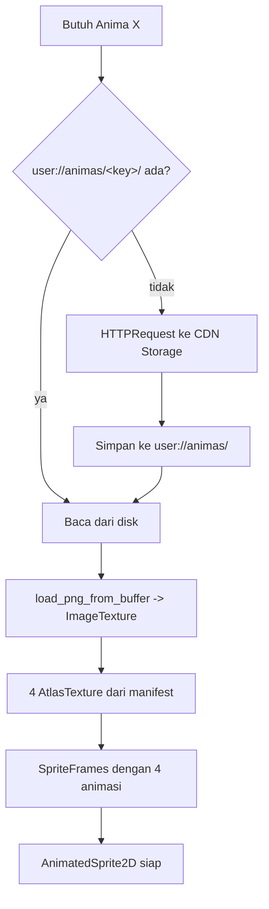

# 03 — Godot Engine Integration & Sprite Handling

Dokumen ini menjelaskan apa yang terjadi di dalam Godot: bagaimana sprite sheet diunduh, dipecah jadi pose, dipasang ke `AnimatedSprite2D`, di-cache, dan dibuat terasa hidup meski hanya berisi gambar statis.

Prinsip yang mengatur seluruh bab ini: **Godot tidak memproses piksel.** Semua keying, slicing, dan trimming sudah selesai di backend. Godot menerima satu PNG RGBA plus satu manifest JSON, lalu memasang `AtlasTexture` yang menunjuk region berbeda pada satu tekstur yang sama. Nol copy piksel, nol dekode ulang, nol beban CPU di device low-end. Sheet production v18 memakai art prompt v15 yang identik: 9 pose (Idle/Battle/Sleep/Happy/Hungry/Dirty/Damaged plus overlay `fx_strike`/`fx_surge`). Loader hanya mewajibkan Idle, jadi cache 2×2 lama tetap tampil.

## Kontrak private art v13

Capture baru menyimpan manifest langsung di row Anima dan sheet di bucket privat
`anima_sheets`. `Backend.download_anima_sheet()` memakai sesi pemain; URL privat
permanen tidak disimpan client. Cache lokal berada di
`user://animas/v6_<anima_id>_<stage>/`, bukan lagi
`species_key + color_bucket + stage`, karena dua capture subjek serupa tetap
memiliki art unik. Manifest ditulis terakhir supaya download terputus tidak
terbaca sebagai cache valid.

Suffix stage diperlukan oleh pipeline evolusi yang backend-nya sudah live tetapi
gate pemainnya masih off. Adult/Evolved memakai `anima_id` yang sama dengan
Hatchling; tanpa stage pada key, reveal bisa memuat manifest form lama.
`anima_forms` menyimpan
sheet lama secara privat untuk history/rollback, tetapi UI hanya membaca form
committed terbaru. Pending ritual disimpan di `GameState.pending_evolution`, dan
art baru baru menggantikan presenter setelah server mengembalikan stage baru dan
bundle stage itu selesai diunduh.

Battle opponent adalah pengecualian sempit: server memberi signed URL singkat
hanya untuk thumbnail/sheet lawan publication Atlas approved atau fallback
sistem. Thumbnail Atlas memiliki cache terpisah yang dibatasi 96 file. Contoh dan
pembahasan cache berbasis spesies di bagian lama dokumen ini berlaku hanya untuk
aset legacy.

## 1. Kontrak manifest

Manifest adalah satu-satunya hal yang menghubungkan backend dan Godot soal geometri sprite. Kalau formatnya jelas, Godot tidak perlu tahu apa pun tentang chroma key atau bbox.

```json
{
  "version": 1,
  "sheet": "mug_ceramic_handled_neutral_light_1.png",
  "sheet_size": [840, 920],
  "frame_size": [420, 460],
  "poses": {
    "idle":     { "region": [  0,   0, 420, 460] },
    "attack":   { "region": [420,   0, 420, 460] },
    "sleep":    { "region": [  0, 460, 420, 460] },
    "defeated": { "region": [420, 460, 420, 460] }
  },
  "render_metrics": {
    "reference_height_px": 448,
    "reference_width_px": 312
  },
  "qa": {
    "green_residue_ratio": 0.0004,
    "standing_height_variance": 0.04,
    "bbox_heights": { "idle": 448, "attack": 442, "sleep": 208, "defeated": 262 },
    "pose_ownership": {
      "idle": { "opaque_pixels": 58320, "cross_boundary_pixels": 0 },
      "attack": { "opaque_pixels": 61210, "cross_boundary_pixels": 813 }
    },
    "cells_detected": 4,
    "warnings": []
  }
}
```

Satu detail di sini menyelesaikan masalah yang mudah diremehkan: **`frame_size` sama untuk keempat pose.** Backend menghitung bbox rapat setiap pose, mengambil ukuran terbesar, lalu menempelkan keempat pose ke sel berukuran identik dengan jangkar **bottom-center bbox** — yaitu titik tumpu kreatur di tanah.

Jangkarnya bbox, bukan kuadran, dan itu penting: keempat pose jadi berdiri di garis tanah yang sama, termasuk pose Sleep dan Defeated yang memang lebih rendah. Pose meringkuk duduk di lantai, bukan melayang di tengah frame.

Key manifest `defeated` dipertahankan untuk kompatibilitas Godot, tetapi prompt v2 dan UI memperlakukannya sebagai keadaan visual **Damaged**: karakter yang sama dengan kerusakan kecil spesifik objek, bukan tubuh yang dihancurkan.

Kenapa ukuran seragam itu penting: `AnimatedSprite2D` hanya punya satu properti `offset` untuk seluruh animasi, bukan per-frame. Kalau setiap pose punya ukuran region berbeda, sprite akan tersentak berpindah posisi setiap ganti frame, dan tidak ada cara memperbaikinya di client tanpa menambah node pembungkus per frame. Menormalisasi di backend menghapus masalahnya seluruhnya. `AnimaLoader` menolak manifest yang region-nya tidak seukuran `frame_size`, jadi pelanggaran kontrak ini gagal keras di client, bukan muncul sebagai getaran halus yang sulit dilacak.

`render_metrics` berbeda dari QA: game memang membacanya. Tinggi dan lebar itu
adalah bbox opak pose `idle` (atau `intro_idle` untuk Boss Seeker), bukan ukuran
frame transparan. Bersama `body_height_cm` dari snapshot authoritative, metrik
ini memungkinkan Duel, Team Battle, dan Expedition menampilkan monster kecil,
normal, dan raksasa dengan proporsi yang konsisten meski padding sheet berbeda.
Chapter Factory dan post-process capture menghasilkan blok yang sama.

Project memakai basis 720×1602 (Xiaomi 14 20:9, native 1200×2670) dengan
stretch `expand`, supaya viewport logical benar-benar mencerminkan portrait,
tablet, atau landscape. Karena itu art statis tidak boleh diregangkan:
Home, Duel, dan Team Battle memilih pasangan 9:16 atau 16:9 dari aspect
viewport lalu memasangnya sebagai `cover` yang dipin ke bawah. Ground Home
berada pada 60% tinggi safe band di portrait dan 51% di landscape; kaki Duel
dan Team Battle tetap pada 91% tinggi arena. Art chapter Expedition tetap
center-crop karena komposisinya datang dari server dan tidak memiliki pasangan
aspect lokal.

`BattleScale.shared_scales()` memakai satu kurva tinggi untuk setiap tubuh di
shot yang sama, termasuk Boss Seeker. Tinggi dikunci ke kartu desain 720×800
tanpa memandang lebar jendela: Anima 120 cm mengisi sekitar 45% kartu itu.
Tubuh yang lebih lebar dari 50% kartu — Duskadon 326 px pada tinggi 135 cm
adalah contohnya — mengecilkan kedua Anima bersama supaya muat di 720.
Seeker memakai back lane terpisah dan tidak ikut mengecil hanya karena Anima
lebar. Tepi opak kedua Anima dipin 5,5% dari tepi layar; padding transparan
sel tidak ikut menentukan posisi. Kaki opak, bukan dasar sel kotak, duduk di
garis tanah 91% tinggi stage. Itu pola Godot Keep-Width / zoom-to-fit tanpa
Camera2D: sumbu pendek (lebar HP) yang membatasi foto tempur, ruang vertikal
ekstra menjadi latar. Arena yang lebih pendek dari kartu itu tetap
mengecilkan semua tubuh bersama. Sheet Boss 3×3 1024 dibuka per sel penuh (341 px) di client, karena
capture 300 px memotong kaki tubuh yang lebih tinggi dari jendela itu. Duel
memakai wrapper dua tubuh `fighter_pair_scales()`. Sprite lebar tidak dikecilkan
sendiri sampai monster yang lebih tinggi tampak lebih pendek. Skala tubuh
dipasang pada anchor di luar `AnimaPresenter`; tween napas/lunge tetap bebas
menulis transform presenter tanpa menghapus skala kanonis.

Vision production v19 memilih `body_height_cm` sebagai tinggi vertikal stance
Battle. Skala nyata adalah anchor; benda genggam kecil menjadi companion
berbadan kecil sekitar boneka gendong (~50 cm), sedangkan exaggeration besar
hanya untuk silhouette yang memang towering atau massive. Angka ini hanya
presentasi, bukan combat stat.

Blok `qa` tidak dipakai game, tapi ikut disimpan agar sheet yang buruk bisa ditemukan lewat query alih-alih laporan pemain. `pose_ownership.cross_boundary_pixels` mengukur bagian pose yang melewati center seam pada PNG mentah tetapi berhasil dipertahankan oleh segmentasi; nilainya bukan error selama sel tetap terpisah.

Manifest v12 menambah dua field opsional tanpa menaikkan `version`:

```json
{
  "poses": {
    "fx_strike": { "region": [420, 920, 420, 460], "motion": "sweep" },
    "fx_surge":  { "region": [840, 920, 420, 460], "motion": "bloom" }
  },
  "qa": {
    "seam_margin": { "passed": true, "ratio": 0.12, "violations": [] }
  }
}
```

`motion` hanya menerima `projectile`, `sweep`, `impact`, atau `bloom`.
`AnimaLoader` mengabaikan nilai lain dan sheet lama fallback ke `projectile`.
`seam_margin` membuktikan tidak ada komponen sekunder di band seam **Idle**.
Itu satu-satunya pose yang aman diaudit keras karena prompt melarang efek di
sana; debris Battle, kotoran, Z, dan pecahan VFX adalah komponen terlepas yang
sah dan tidak dapat diklasifikasikan hanya dari piksel. Pada v12 pelanggaran
Idle gagal sebelum sheet masuk pustaka dan Core direfund oleh jalur webhook
yang sudah ada.

Perhatikan metriknya: yang diukur `standing_height_variance`, **hanya antara Idle dan Attack**, bukan varians keempat pose. Membandingkan keempatnya adalah metrik yang salah, karena kreatur yang meringkuk tidur memang jauh lebih pendek daripada yang berdiri — ambang apa pun akan memberi alarm palsu pada sheet yang sempurna. Yang benar-benar menandakan model mengubah skala adalah selisih antara dua pose yang sama-sama berdiri penuh. Sebagai pelengkap, pose Sleep atau Defeated yang lebih *tinggi* dari Idle juga ditandai, karena arah itu hampir pasti berarti model membesarkan kreaturnya alih-alih menidurkannya.

## 2. Arsitektur node

```
AnimaView (Node2D)
├── AnimaSprite (AnimatedSprite2D)   %AnimaSprite
├── Shadow (Sprite2D)                bayangan elips statis, bukan dari sheet
├── FxLayer (Node2D)                 partikel makan/tidur/level up
└── Body (Node2D)                    target tween, membungkus sprite
```

Alasan `AnimaSprite` ada di dalam `Body` yang terpisah: animasi prosedural memanipulasi `scale` dan `position` milik `Body`, sementara `AnimaSprite` menyimpan `flip_h` dan pergantian pose. Memisahkan keduanya berarti tween squash-stretch tidak pernah berkelahi dengan logika arah hadap.

`Shadow` sengaja tidak berasal dari sheet. Prompt melarang cast shadow karena bayangan yang di-render model akan ikut ter-keying jadi noda gelap dan berbeda bentuk di setiap pose. Satu elips statis yang di-scale mengikuti tween napas jauh lebih murah dan justru lebih konsisten.

## 3. Alur pemuatan



### Yang benar-benar dibangun

Tanggung jawab di rancangan bawah ini akhirnya terpecah tiga, bukan satu autoload:

| Bagian | Di mana | Bentuknya |
| --- | --- | --- |
| manifest + PNG → `SpriteFrames` | `scripts/anima_loader.gd` | `RefCounted` dengan fungsi statis, tanpa state dan tanpa I/O jaringan |
| unduh dari CDN | `scripts/backend.gd` (autoload `Backend`) | satu `_send()` untuk semua HTTP |
| cache di `user://` | `scripts/game_state.gd` (autoload `GameState`) | `store_sprite()` / `has_sprite()` |

Alasannya bukan selera: `AnimaLoader` yang tidak menyentuh jaringan maupun disk bisa diuji dengan sheet yang dibuat di memori, dan itulah yang membuat 72 check `test_sprite_slicing.gd` berjalan gratis tanpa satu pun PNG fixture di repo. Begitu ia juga bertugas mengunduh, setiap uji region butuh jaringan atau mock.

Konsekuensinya, cache **tidak** memakai signal `sheet_ready` / `sheet_failed`. Pemanggilnya `await` langsung ke `Backend`, lalu memuat dari disk secara sinkron — sebab file yang sudah ada di `user://` dibaca dalam hitungan milidetik, dan signal untuk operasi yang tidak menunggu hanya menambah jalur yang harus dibaca.

### Autoload `AnimaLoader` (rancangan awal, tidak dipakai apa adanya)

```gdscript
extends Node
## Mengunduh, meng-cache, dan membangun SpriteFrames untuk Anima.

const CACHE_DIR := "user://animas/"
const CACHE_LIMIT_BYTES := 100 * 1024 * 1024

signal sheet_ready(cache_key: String, frames: SpriteFrames)
signal sheet_failed(cache_key: String, reason: String)

var _cache: Dictionary = {}          # cache_key -> SpriteFrames
var _in_flight: Dictionary = {}      # cache_key -> true

func _ready() -> void:
	DirAccess.make_dir_recursive_absolute(CACHE_DIR)


func request_frames(anima: AnimaData) -> void:
	var key := anima.cache_key()      # "<species_key>_<color_bucket>_<stage>"
	if _cache.has(key):
		sheet_ready.emit(key, _cache[key])
		return
	if _in_flight.has(key):
		return                         # sudah ada permintaan jalan untuk key ini
	_in_flight[key] = true

	if _has_local(key):
		_build_from_local(key)
	else:
		_download(key, anima.sheet_url, anima.manifest_url)


func _has_local(key: String) -> bool:
	return FileAccess.file_exists(CACHE_DIR + key + ".png") \
		and FileAccess.file_exists(CACHE_DIR + key + ".json")


func _build_from_local(key: String) -> void:
	var png := FileAccess.get_file_as_bytes(CACHE_DIR + key + ".png")
	var raw := FileAccess.get_file_as_string(CACHE_DIR + key + ".json")
	var manifest: Variant = JSON.parse_string(raw)

	if png.is_empty() or typeof(manifest) != TYPE_DICTIONARY:
		# Cache korup: buang dan paksa unduh ulang berikutnya.
		DirAccess.remove_absolute(CACHE_DIR + key + ".png")
		DirAccess.remove_absolute(CACHE_DIR + key + ".json")
		_in_flight.erase(key)
		sheet_failed.emit(key, "cache_corrupt")
		return

	var frames := build_sprite_frames(png, manifest)
	_in_flight.erase(key)
	if frames == null:
		sheet_failed.emit(key, "decode_failed")
		return
	_cache[key] = frames
	sheet_ready.emit(key, frames)
```

### Membangun `SpriteFrames`

Inilah inti "slicing" — dan perhatikan bahwa tidak ada satu pun piksel yang disalin. `AtlasTexture` hanyalah jendela ke region tekstur induk.

```gdscript
const POSES := ["idle", "attack", "sleep", "defeated"]

func build_sprite_frames(png_bytes: PackedByteArray, manifest: Dictionary) -> SpriteFrames:
	var image := Image.new()
	if image.load_png_from_buffer(png_bytes) != OK:
		return null

	var sheet := ImageTexture.create_from_image(image)
	var frames := SpriteFrames.new()
	frames.remove_animation("default")

	var poses: Dictionary = manifest.get("poses", {})
	for pose in POSES:
		if not poses.has(pose):
			return null                      # manifest tidak lengkap, tolak seluruhnya
		var r: Array = poses[pose]["region"]

		var atlas := AtlasTexture.new()
		atlas.atlas = sheet
		atlas.region = Rect2(r[0], r[1], r[2], r[3])
		atlas.filter_clip = true             # cegah bleed dari region sebelah

		frames.add_animation(pose)
		frames.set_animation_loop(pose, pose == "idle" or pose == "sleep")
		frames.set_animation_speed(pose, 1.0)
		frames.add_frame(pose, atlas)

	return frames
```

`filter_clip = true` adalah satu baris yang mencegah bug yang membingungkan: tanpa itu, filtering bilinear pada tepi region bisa mengambil sampel dari kuadran sebelahnya, memunculkan garis tipis berisi potongan pose lain. Padding antar sel di prompt sudah mengurangi risikonya, tapi ini menutupnya sepenuhnya.

Keempat animasi masing-masing berisi **satu frame**. Terdengar aneh untuk `SpriteFrames`, tapi ini memberi keuntungan nyata: pergantian pose jadi `sprite.play("attack")`, satu baris, dan sistem battle maupun sistem perawatan tidak perlu tahu apa pun tentang atlas atau region.

### Unduh dengan retry

```gdscript
func _download(key: String, sheet_url: String, manifest_url: String) -> void:
	var manifest_bytes := await _http_get(manifest_url, 2)
	if manifest_bytes.is_empty():
		_in_flight.erase(key)
		sheet_failed.emit(key, "manifest_unreachable")
		return

	var png_bytes := await _http_get(sheet_url, 2)
	if png_bytes.is_empty():
		_in_flight.erase(key)
		sheet_failed.emit(key, "sheet_unreachable")
		return

	# Tulis ke cache hanya setelah KEDUANYA berhasil, supaya tidak pernah ada
	# pasangan file setengah jadi di disk.
	FileAccess.open(CACHE_DIR + key + ".png", FileAccess.WRITE).store_buffer(png_bytes)
	FileAccess.open(CACHE_DIR + key + ".json", FileAccess.WRITE).store_buffer(manifest_bytes)
	_enforce_cache_limit()
	_build_from_local(key)


func _http_get(url: String, retries: int) -> PackedByteArray:
	for attempt in retries + 1:
		var req := HTTPRequest.new()
		add_child(req)
		req.timeout = 15.0
		var err := req.request(url)
		if err != OK:
			req.queue_free()
			continue
		var result: Array = await req.request_completed
		req.queue_free()
		# result = [result, response_code, headers, body]
		if result[0] == HTTPRequest.RESULT_SUCCESS and result[1] == 200:
			return result[3]
		if attempt < retries:
			await get_tree().create_timer(1.0 * (attempt + 1)).timeout
	return PackedByteArray()
```

Urutan penulisan file itu disengaja: unduh keduanya ke memori dulu, baru tulis. Menulis PNG lebih dulu lalu gagal mengunduh manifest akan meninggalkan cache yang lolos pemeriksaan `_has_local()` separuh dan gagal misterius nanti.

### Batas cache

```gdscript
func _enforce_cache_limit() -> void:
	# ponytail: LRU berbasis modified-time, dijalankan hanya setelah tulis baru.
	# Plafon: O(n) scan direktori tiap unduh. Naikkan ke index terpisah kalau
	# jumlah file cache pernah melewati ~2000.
	var entries: Array = []
	var total := 0
	var dir := DirAccess.open(CACHE_DIR)
	dir.list_dir_begin()
	var name := dir.get_next()
	while name != "":
		if name.ends_with(".png"):
			var path := CACHE_DIR + name
			var size := FileAccess.open(path, FileAccess.READ).get_length()
			entries.append({ "key": name.trim_suffix(".png"), "size": size,
				"mtime": FileAccess.get_modified_time(path) })
			total += size
		name = dir.get_next()
	dir.list_dir_end()

	if total <= CACHE_LIMIT_BYTES:
		return

	entries.sort_custom(func(a, b): return a["mtime"] < b["mtime"])
	for e in entries:
		if total <= CACHE_LIMIT_BYTES:
			break
		DirAccess.remove_absolute(CACHE_DIR + e["key"] + ".png")
		DirAccess.remove_absolute(CACHE_DIR + e["key"] + ".json")
		_cache.erase(e["key"])
		total -= e["size"]
```

Kunci cache memakai `species_key` dan bukan `anima_id`, jadi lima Anima mug hanya memakan satu slot disk. Ini konsekuensi langsung dari pustaka species di [01](01-architecture-dataflow.md), dan alasan plafon 100 MB terasa longgar meski sheet-nya besar.

## 4. Background removal

Jalur normal: **tidak ada pekerjaan sama sekali di Godot.** Backend sudah mengirim PNG RGBA yang bersih. Bagian ini adalah jaring pengaman untuk dua kasus: mode BYOK (yang memotong backend seluruhnya) dan skenario di mana keying backend harus dipindah ke client karena batas CPU Edge Function.

### Shader chroma key

Implementasinya ada di `game/shaders/chroma_key.gdshader`. Inti keputusannya satu baris: piksel **dipertahankan** kalau hue-nya jauh dari kunci, **atau** saturasinya rendah, **atau** gelap.

```glsl
float keep = smoothstep(hue_tolerance, hue_tolerance + softness, hue_dist);
keep = max(keep, 1.0 - smoothstep(sat_min - softness, sat_min, hsv.y));
keep = max(keep, 1.0 - smoothstep(val_min - softness, val_min, hsv.z));
COLOR = vec4(tex.rgb, tex.a * keep);
```

Syarat "atau" itulah yang menyelamatkan Anima berelemen `plant`: hijau daun saturasinya jauh di bawah `sat_min`, jadi ia lolos lewat cabang kedua meski hue-nya persis hijau. Nilai uniform-nya harus tetap sama dengan `backend/supabase/functions/_shared/postprocess.mjs` (hue ±22°, `sat_min` 0,85, `val_min` 0,5). Kalau berbeda, sprite yang sama akan tampil berbeda antara pemain biasa dan pemain BYOK.

Yang **tidak** bisa dikerjakan shader ini, dan karena itu mode BYOK tetap terpaksa memakai region grid buta 2x2: mencari bounding box, menyeragamkan ukuran frame, dan menolak sheet yang cacat. Ketiganya butuh membaca seluruh piksel sekaligus, sesuatu yang fragment shader tidak bisa lakukan. Jadi mode BYOK secara struktural memberi kualitas sprite yang lebih rendah, bukan sekadar lebih lambat.

Satu kekurangan lagi yang sekarang sudah terukur: jalur Node melakukan **erosi halo hijau pada cincin 1px terluar**, dan shader ini tidak. Erosi itu bergantung pada tahu apakah piksel tetangga transparan, dan justru syarat tetangga itulah yang melindungi tubuh Anima hijau terang dari ikut terkikis. Fragment shader sebenarnya bisa mencuplik tetangga lewat `TEXTURE_PIXEL_SIZE`, jadi ini bukan kemustahilan seperti bounding box — tapi ia empat cuplikan tekstur tambahan per piksel untuk memperbaiki halo yang tebalnya satu piksel. Sampai ada bukti halonya mengganggu di perangkat sungguhan, pemain BYOK melihat halo hijau tipis dan pemain biasa tidak. Angka pembandingnya ada di [01](01-architecture-dataflow.md): 0,21% berbanding 0,014%.

Keying memakai HSV dan bukan jarak RGB karena hijau `#00FF00` punya hue yang sangat khas, sementara jarak RGB akan ikut memakan warna hijau yang sah pada tubuh Anima (misalnya Anima tanaman). Hue melingkar, jadi `min(d, 1-d)` bukan detail kosmetik — tanpa itu hijau di sekitar hue 0 akan lolos.

### Bake sekali, jangan dipakai terus-menerus

Menjalankan shader ini setiap frame untuk setiap Anima adalah pemborosan: hasilnya selalu sama. Jadi jalankan sekali, ambil hasilnya, simpan sebagai PNG RGBA, lalu buang shader-nya.

```gdscript
func bake_chroma_key(source: Texture2D) -> Image:
	var vp := SubViewport.new()
	vp.size = source.get_size()
	vp.transparent_bg = true
	vp.render_target_update_mode = SubViewport.UPDATE_ONCE

	var rect := TextureRect.new()
	rect.texture = source
	rect.material = load("res://shaders/chroma_key.gdshader_material.tres")
	rect.size = source.get_size()
	vp.add_child(rect)
	add_child(vp)

	# Tunggu satu frame gambar selesai sebelum membaca hasilnya.
	await RenderingServer.frame_post_draw
	var baked := vp.get_texture().get_image()
	vp.queue_free()
	return baked
```

Setelah ini, `baked.save_png(CACHE_DIR + key + ".png")` dan seterusnya jalur pemuatannya identik dengan jalur normal.

Yang hilang di jalur fallback ini, dan harus diakui: segmentasi ownership + bbox trimming per pose. Tanpa backend yang mengukur, kita jatuh ke pembagian grid buta 2x2 — penyebab tangan Attack terpotong saat melewati center seam. Itulah sebabnya jalur ini fallback, bukan pilihan utama. **ponytail:** jangan port flood-fill + masked blit ke GDScript sampai pemain BYOK benar-benar memerlukannya; upgrade path-nya adalah memindahkan `segmentPosePixels()` ke implementasi client.

## 5. Menghidupkan empat gambar statis

Empat pose statis tidak menghasilkan makhluk yang terasa hidup. Tapi menghasilkan animasi frame-by-frame dari model gambar itu mahal dan tidak konsisten — dan tidak perlu, karena hampir seluruh kesan "hidup" pada sprite datang dari transformasi, bukan dari perubahan piksel.

Jadi kehidupan datang dari `Tween` di atas satu frame. Implementasi produksi
dipusatkan di `AnimaPresenter` dan selalu membunuh tween pose lama sebelum pose
baru menulis transform yang sama:

```gdscript
match pose:
	"idle":     _motion = _breathe(1.6, 0.045)
	"sleep":    _motion = _breathe(2.8, 0.07)
	"attack":   _motion = _lunge()
	"defeated": _motion = _heavy_breathe()
```

Sel `fx_strike` / `fx_surge` tidak mengganti pose tubuh. `play_fx()` menaruhnya
sebagai overlay sibling dan membaca motion opsional dari manifest: projectile
meluncur dari penyerang, sweep menyapu target, impact pop langsung di target,
dan bloom tumbuh radial dari target. Keempatnya memakai beat waktu tetap agar
event damage server tetap sinkron. Sheet lama fallback projectile; sheet 2×2
tanpa sel efek melewati overlay diam-diam.

Idle memakai squash-stretch halus. Sleep lebih lambat dan dalam. Key internal
`defeated` berarti visual Damaged saat Anima Dormant, jadi ia bukan jasad yang
diam: heavy breathing memakai siklus 1,1 detik yang pendek dan tidak simetris,
loop sampai state server menyatakan pulih. Pergantian ke Idle membunuh loop itu
dan mereset scale, rotation, serta position sebelum memulai napas biasa.

Feedback Care memakai tween kedua agar intent terlihat pada frame tap tanpa
menunggu commit server. Feed mendapat satu hop; Play mendapat enam bounce
setinggi 14 px dengan total sekitar 2,5 detik. Napas menulis `scale` sementara
bounce menulis `position`, jadi keduanya tidak berebut. Hatch adalah pengecualian
yang memang menulis keduanya: ia membunuh tween pose dan feedback dulu, lalu
menyalakan pose kembali setelah reveal selesai.

**Yang tidak bisa dilakukan dengan empat pose: berkedip.** Berkedip butuh gambar mata tertutup, dan tidak ada trik transformasi yang bisa memalsukannya. Menutupinya dengan shader yang menggelapkan area mata terdengar pintar tapi butuh koordinat mata per spesies, yang tidak kita punya. Jadi berkedip tidak ada, dan itu keputusan sadar.

Kalau nanti terasa perlu, satu gambar 1024×1024 bisa memuat grid 3x2 dan menghasilkan enam pose (menambah Blink dan Happy) tanpa menambah jumlah image output. Trade-off-nya: sel mengecil dari 512 ke sekitar 341×512 piksel dan konsistensi model turun saat komposisi makin rumit. Karena itu 2x2 tetap default sampai ada bukti kualitas 3x2 masih bisa diterima; jangan mengasumsikan biaya token tetap identik sebelum menguji payload sebenarnya.

## 6. Pengaturan tekstur dan performa

Import setting tidak berlaku di sini karena tekstur datang saat runtime, jadi semuanya diatur lewat kode:

Filtering di-set ke linear pada `CanvasItem` (`texture_filter = TEXTURE_FILTER_LINEAR`) karena sprite akan di-scale turun dari 512 ke ukuran layar yang lebih kecil; nearest akan terlihat bergerigi. Mipmap dimatikan, sebab sprite tidak pernah mengecil drastis dan mipmap menambah memori 33% tanpa manfaat.

Satu `ImageTexture` per spesies, dibagi keempat `AtlasTexture`. Untuk sheet 1024x1024 RGBA8 itu 4 MB VRAM per spesies. Layar battle menampilkan dua Anima, layar koleksi bisa menampilkan puluhan — jadi layar koleksi memakai thumbnail 128px yang dibuat sekali dari pose Idle dan di-cache terpisah, bukan memuat sheet penuh untuk setiap petak grid.

Ada satu jebakan yang perlu disebut karena gejalanya membingungkan: `AtlasTexture` menyimpan referensi ke `atlas`, jadi selama satu `AtlasTexture` masih dipakai, seluruh sheet tetap di memori. Membebaskan satu pose tidak membebaskan apa pun. Pembebasan memori dilakukan pada level `SpriteFrames` di `_cache`, bukan per pose.

### Visual shell dan kepemilikan motion

UI production dan `anima_demo` memakai `themes/mobile_theme.tres` yang sama. Theme itu menyimpan palette serta variasi semantik—CTA utama, navigasi, empat aksi Care, status, dan modal—supaya scene hanya memilih peran, bukan menyalin StyleBox. Satu pengecualian yang disengaja adalah fill empat meter Care: warna lapar, energi, kebersihan, dan bond membawa arti gameplay sehingga tetap menjadi override lokal.

Latar chamber tidak berupa PNG. `ScanimaBackground` menggambar gradient, ring, partikel, floor glow, dan perspective grid dari primitive CanvasItem pada 15 fps. Ini menjaga visual tajam pada aspect ratio berbeda dan tidak menambah asset APK. Incubator tetap menggambar sendiri pada 30 fps karena scanner dan burst memang focal animation; jangan menaikkan latar ke 60 fps hanya karena scene lain bergerak.

Semua motion milik Control lewat `UiJuice`: button press/release/hover/focus, reveal awal, buka-tutup modal, status pop, dan tween meter. Dynamic pose button dipasang saat dibuat. Helper menyimpan tween aktif di metadata Control dan membunuhnya sebelum gerak baru dimulai, sehingga rapid tap tidak menumpuk dua writer pada `scale` atau `modulate`. Transform Anima tetap milik `AnimaPresenter` dan transform inkubator milik `IncubatorEffect`; pembagian ini mencegah hatch, idle bob, dan UI motion saling berebut properti.

## 7. Pemeriksaan yang wajib ada

Satu file, tanpa framework, dijalankan lewat `godot --headless --script res://tests/test_sprite_slicing.gd`. Yang diuji adalah hal-hal yang kalau rusak akan menghasilkan bug visual yang sulit dilacak:

```gdscript
extends SceneTree

func _init() -> void:
	# Sheet sintetis 1024x1024: empat kuadran diberi warna berbeda,
	# jadi kalau region salah, warna yang terbaca akan salah.
	var img := Image.create(1024, 1024, false, Image.FORMAT_RGBA8)
	img.fill_rect(Rect2i(0, 0, 512, 512),     Color.RED)
	img.fill_rect(Rect2i(512, 0, 512, 512),   Color.GREEN)
	img.fill_rect(Rect2i(0, 512, 512, 512),   Color.BLUE)
	img.fill_rect(Rect2i(512, 512, 512, 512), Color.YELLOW)

	var manifest := {
		"version": 1, "sheet_size": [1024, 1024], "frame_size": [400, 400],
		"poses": {
			"idle":     { "region": [ 50,  50, 400, 400] },
			"attack":   { "region": [562,  50, 400, 400] },
			"sleep":    { "region": [ 50, 562, 400, 400] },
			"defeated": { "region": [562, 562, 400, 400] },
		}
	}

	var frames := AnimaLoader.build_sprite_frames(img.save_png_to_buffer(), manifest)
	assert(frames != null, "sheet valid harus terbangun")

	# Keempat pose ada, masing-masing satu frame
	for pose in ["idle", "attack", "sleep", "defeated"]:
		assert(frames.has_animation(pose), "pose hilang: " + pose)
		assert(frames.get_frame_count(pose) == 1, "harus tepat 1 frame: " + pose)

	# frame_size seragam: inilah yang mencegah sprite tersentak antar pose
	var size0 := frames.get_frame_texture("idle", 0).get_size()
	for pose in ["attack", "sleep", "defeated"]:
		assert(frames.get_frame_texture(pose, 0).get_size() == size0,
			"ukuran frame tidak seragam di " + pose)

	# Region menunjuk kuadran yang benar
	var expected := { "idle": Color.RED, "attack": Color.GREEN,
		"sleep": Color.BLUE, "defeated": Color.YELLOW }
	for pose in expected:
		var atlas: AtlasTexture = frames.get_frame_texture(pose, 0)
		var px := atlas.atlas.get_image().get_pixelv(atlas.region.position + Vector2(10, 10))
		assert(px.is_equal_approx(expected[pose]), "region salah untuk " + pose)

	# Manifest tidak lengkap harus ditolak seluruhnya, bukan sebagian terpasang
	var broken := manifest.duplicate(true)
	broken["poses"].erase("sleep")
	assert(AnimaLoader.build_sprite_frames(img.save_png_to_buffer(), broken) == null,
		"manifest tidak lengkap harus ditolak")

	print("test_sprite_slicing: OK")
	quit()
```

Pemeriksaan region per warna itu yang paling berharga dari semuanya. Membalik dua region (misalnya `sleep` dan `defeated` tertukar) adalah bug yang lolos dari semua pemeriksaan struktural dan hanya muncul sebagai "kok Anima-nya tidur waktu kalah" berbulan-bulan kemudian.
