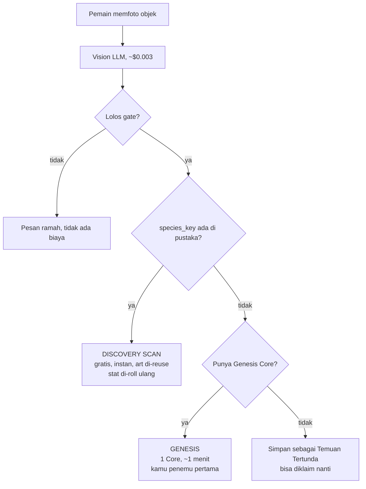
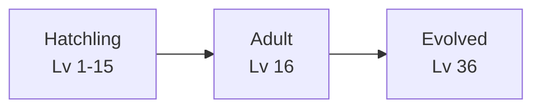
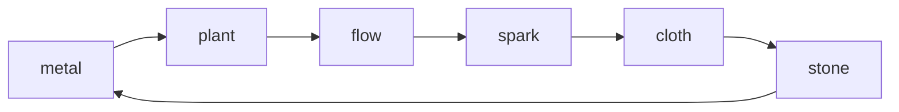
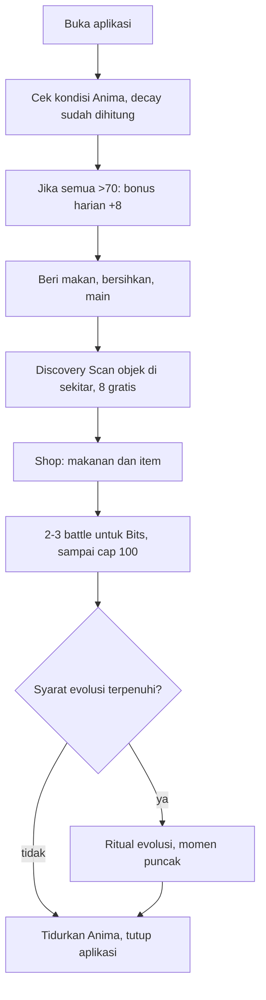

# 04 — Game Loop & Core Systems Design

Dokumen ini mendesain tiga sistem yang saling terikat: perawatan gaya Tamagotchi, ekonomi yang menahan biaya API agar tidak meledak, dan pertarungan berbasis stat yang diturunkan dari foto objek.

Urutannya sengaja: ekonomi dibahas lebih dulu daripada yang terlihat wajar, karena struktur biaya API menentukan bentuk game loop-nya. Mendesain loop dulu lalu menempelkan monetisasi belakangan akan menghasilkan game yang bangkrut pada pemain ke-500.

## 1. Kenyataan biaya yang membentuk seluruh desain

Dua angka, dan jarak di antara keduanya adalah keseluruhan desain ekonomi Scanima:

| Aksi | Anggaran biaya ke kita |
| --- | --- |
| Menganalisis foto (Vision LLM) | **~$0.003** |
| Menciptakan spesies baru (GPT Image 2 medium) | **~$0.070** |

Generation medium terbaru pada 13 Agustus 2026 terukur sekitar **$0.05 per
sheet**, dekat dengan harga tercantum Replicate $0.047. Dokumen ekonomi tetap
memakai $0.070 sebagai reserve konservatif, bukan mengubah harga produk dari satu
sampel. Snapshot lengkap dan aturan pembanding model ada di
[02](02-prompt-engineering.md#baseline-harga-untuk-pembanding-model).

Selisih anggarannya masih sekitar **23 kali**. Aksi yang satu murah, yang lain mahal. Menyatukan keduanya di balik satu tombol "Foto" berarti setiap tap membawa risiko ~$0.07, dan itu tetap memaksa kita membatasi tap — padahal memfoto benda adalah hal paling menyenangkan di game ini dan seharusnya dilakukan sesering mungkin.

Jadi jangan disatukan. Pisahkan menjadi dua aksi yang berbeda, dan biarkan struktur biaya menjadi mekanik game:

**Discovery Scan** — foto objek yang spesiesnya sudah ada di pustaka. Biaya ke kita hanya panggilan Vision, jadi **murah, langsung jadi, tanpa menunggu**. Pemain langsung dapat Anima dengan nama dan stat unik miliknya sendiri.

**Genesis** — foto objek yang spesiesnya belum pernah ada. Ini yang memicu image generation, terukur 57–63 detik, dan menghabiskan satu **Genesis Core**.

Yang membuat pembagian ini bekerja bukan efisiensinya, tapi kenyataan bahwa ia jujur secara naratif. Memfoto mug yang ke-seribu memang *seharusnya* tidak terasa seperti penemuan besar. Memfoto sesuatu yang belum pernah dilihat siapa pun *seharusnya* terasa istimewa. Struktur biaya kita dan struktur rasa game-nya menunjuk ke arah yang sama.



Ada satu pagar produk di atas diagram itu: **Guest Seeker hanya boleh satu Scan
sukses**, baik hasilnya Discovery Scan maupun Genesis. Gate/transport yang gagal
tidak menghabiskan kesempatan itu. Sesudah sukses, client menawarkan Google;
Care, Battle, Shop, dan Collection tidak ikut terkunci. `claim_scan_charge()`
memeriksa slot guest di bawah profile lock sebelum Vision, lalu cache/Genesis
memeriksanya lagi saat commit. Guard awal mencegah modified client membayar Vision
berulang; guard akhir menjaga dua request paralel tidak melahirkan dua Anima.

Momen "spesies ini belum pernah ditemukan siapa pun" adalah momen paling kuat yang dimiliki game ini, dan itu bukan paywall kalau dibingkai benar. Pemain pertama yang menciptakan sebuah spesies dicatat permanen sebagai penemunya di pustaka, terlihat oleh semua pemain lain yang nanti men-scan objek yang sama. Membayar Genesis Core bukan membuka konten yang ditahan; ia mengklaim sesuatu yang tidak bisa diklaim dua kali.

**Temuan Tertunda** menyelamatkan kasus pemain kehabisan Core tepat saat menemukan hal baru. Hasil Vision disimpan (biayanya sudah keluar, tidak perlu ulang) dan pemain bisa menuntaskannya nanti tanpa harus memfoto ulang objeknya — yang mungkin sudah tidak ada di dekatnya. Berlaku 7 hari.

**Plafon client sementara:** selama IAP, rewarded ads, dan BYOK belum mengisi
Core, `genesis_cores == 0` mengunci Scan untuk akun linked (termasuk cache hit).
Guest memakai pagar yang lebih dulu: `guest_scan_used_at` mengubah CTA menjadi
`Sign in to Scan Again`, walau Core-nya belum habis. `species_key` Vision terlalu
rapuh untuk diandalkan sebagai jalur gratis. Server `NO_CORE` dan
`GUEST_SCAN_USED` tetap pagar terakhir; rumus Core vs cache hit di atas tidak
berubah.

## 2. Mata uang dan sumbernya

Tiga mata uang, dan yang menentukan pembagiannya adalah biaya nyata yang mereka wakili:

| Mata uang | Untuk apa | Sumber |
| --- | --- | --- |
| **Scan Charge** | Discovery Scan, 8 per hari | Refill harian, rewarded ad, langganan |
| **Genesis Core** | Menciptakan spesies baru | 1 untuk guest + 2 saat link Google (sekali), 1 per minggu gratis nanti, IAP/langganan nanti |
| **Bits** | Makanan dan item di Shop | 50 saat onboarding (akun baru saja), Shop, hadiah battle (cap 100/hari lokal) |

> **Keputusan produk, dikonfirmasi 13 Agustus 2026:** jalur gratis Genesis Core adalah **1 Core per minggu**. Fitur mingguan belum diimplementasikan. Build sekarang memberi 1 Core lewat ledger `starter_guest`, lalu upgrade Google melengkapi grant starter lifetime menjadi 3 dengan maksimal +2 sekali. Ini bukan reset saldo: guest yang sudah membelanjakan Core akan memiliki saldo 2 sesudah link. Akun lama diberi marker `starter_legacy` tanpa mengubah saldo atau menerima bonus kedua. Grant mingguan nanti wajib server-authoritative dan tercatat di ledger; detail claim/catch-up/anti-abuse belum final.

### Kenapa rewarded ad tidak boleh membiayai Genesis Core

Ini angka yang harus dilihat sebelum menempatkan tombol "Tonton iklan untuk 1 Core":

Dengan eCPM rewarded ad di pasar Indonesia sekitar $1-4, satu tayangan bernilai **$0.001 sampai $0.004** bersih. Satu Genesis Core berbiaya sekitar **$0.070**. Artinya satu Core masih butuh **18 sampai 70 tayangan iklan** untuk menutup biayanya.

Tidak ada pembingkaian UX yang bisa menyelamatkan itu. Menawarkan Core dengan 1 iklan berarti kita rugi sekitar $0.066–0.069 setiap kali, dan pemain yang paling aktif menjadi pemain yang paling merugikan — kebalikan dari yang seharusnya.

Iklan tetap bekerja untuk hal yang murah, tapi marginnya jauh lebih tipis daripada yang tampak di rancangan awal. Satu tayangan bernilai $0.001-0.004 bersih, dan satu Discovery Scan berbiaya $0.003. Artinya **satu iklan kurang-lebih membiayai satu scan, bukan enam** — dan pada eCPM rendah ia bahkan tidak menutupinya. Pemetaannya masih benar, tapi alasannya harus dinyatakan ulang dengan jujur:

- Iklan → **Bits** (biaya kita nol, di sini marginnya nyata dan besar)
- Iklan → **Scan Charge**, dibatasi, 1 iklan = 1 charge (kira-kira pulang pokok, bukan sumber untung)
- IAP dan langganan → Genesis Core (biaya kita ~$0.070)
- BYOK → Genesis **dan** Vision tanpa batas (biaya kita nol; sejak Vision pindah ke Replicate, satu token pemain menutup keduanya)

### Biaya per pemain aktif, angka yang harus diawasi

Yang berubah bukan hanya rasio iklan. Delapan Scan Charge gratis per hari, kalau dipakai habis, berarti **$0.024 per pemain per hari** dalam biaya Vision saja. Pada 1.000 DAU itu ~$24/hari atau **~$720/bulan** sebelum satu Genesis pun terjadi. Dengan model Vision kelas lite yang lebih kecil angkanya sepersepuluh dari itu.

Ini konsekuensi sadar dari memakai satu vendor untuk satu token (alasannya di [01](01-architecture-dataflow.md)), dan ada tiga tuas yang bisa ditarik sebelum menyentuh kuota gratis pemain, berurut dari yang paling murah:

1. **Hapus `stat_reasoning` dari skema produksi.** Ia field untuk mata manusia saat eval. Output ditagih delapan kali lipat input di model ini, jadi memangkasnya memotong biaya Vision hampir separuh.
2. **Turunkan foto ke 768px** sebelum dikirim. Gemini memotong gambar jadi petak 768px berharga 258 token; 1024px memakan empat petak, 768px cuma satu.
3. **Ganti `VISION_MODEL`** ke model lite yang lebih kecil. Cukup env, tanpa ubah kode, tapi wajib jalan ulang Smoke Set karena stat dan `species_key` bisa bergeser.

Yang tidak boleh jadi tuas pertama: mengurangi 8 Scan Charge harian. Itu satu-satunya angka di daftar ini yang pemain rasakan.

### Harga IAP dan marginnya

Asumsi potongan toko 30% dan kurs Rp 16.000/USD. Angka bersih adalah yang kita terima setelah potongan.

| Paket | Harga | Bersih | Biaya kita | Margin |
| --- | --- | --- | --- | --- |
| 1 Genesis Core | Rp 9.000 (~$0.56) | $0.39 | ~$0.07 | ~$0.32 (82%) |
| 5 Genesis Core | Rp 29.000 (~$1.81) | $1.27 | ~$0.35 | ~$0.92 (72%) |
| 15 Genesis Core | Rp 75.000 (~$4.69) | $3.28 | ~$1.05 | ~$2.23 (68%) |
| **Scanima Plus** / bulan | Rp 39.000 (~$2.44) | $1.71 | ~$0.56 + Vision + hosting | perlu divalidasi dari pemakaian |

Scanima Plus berisi 8 Genesis Core per bulan, Scan Charge tanpa batas, tanpa iklan, dan slot koleksi lebih besar. Perhatikan marginnya paling tipis di antara semua paket — dan itu memang sengaja: langganan dinilai dari retensi, bukan dari margin per transaksi.

Yang perlu dijaga: **jangan pernah menjual Core lebih murah dari $0.12 bersih.** Itu menyisakan ruang untuk variasi token input, pajak, dan kegagalan operasional di atas biaya generation rata-rata ~$0.07.

### Biaya rata-rata per pemain

Yang menentukan sehat atau tidaknya seluruh model adalah **rasio cache hit** — berapa persen foto yang jatuh ke spesies yang sudah ada.

| Rasio cache hit | Biaya per Anima (blended) | Catatan |
| --- | --- | --- |
| 0% (hari pertama, pustaka kosong) | ~$0.073 | Fase paling mahal, DAU masih kecil |
| 50% | ~$0.038 | Sekitar 500-1.000 spesies di pustaka |
| 80% | ~$0.017 | Titik di mana model mulai nyaman |
| 95% (matang) | ~$0.007 | Ribuan spesies, objek umum sudah tercakup |

Kurvanya bergerak ke arah yang benar seiring waktu, dan itu adalah properti struktural yang paling berharga dari desain ini: **biaya per pemain turun saat basis pemain bertambah.** Pemain awal secara efektif membangun pustaka untuk pemain berikutnya. Karena itu soft launch dengan basis kecil adalah fase yang paling mahal per pemain, dan itu harus diantisipasi, bukan dikagetkan.

Instrumentasi wajib sejak Phase 2, dua query yang harus bisa dijawab kapan saja:

```sql
-- Rasio cache hit 7 hari terakhir
select
  count(*) filter (where status = 'cache_hit')::float / nullif(count(*), 0) as hit_rate,
  sum(cost_usd_estimate) as spend_usd
from generations
where created_at > now() - interval '7 days';

-- Pemain paling mahal, untuk mendeteksi kebocoran ekonomi lebih awal
select owner_id, count(*) as gens, sum(cost_usd_estimate) as usd
from generations
where status = 'succeeded' and created_at > now() - interval '30 days'
group by owner_id order by usd desc limit 20;
```

### Sakelar darurat

Kalau tagihan harian melewati ambang yang ditetapkan, sistem harus bisa menahan diri sendiri tanpa menunggu developer bangun. Satu baris konfigurasi di tabel `app_config` yang dibaca `create_anima`: `daily_spend_cap_usd`. Saat tercapai, Genesis masuk antrean dan diberi tahu jujur ("Inkubator sedang penuh, Anima-mu diproses beberapa jam lagi"), sementara Discovery Scan tetap jalan normal karena biayanya tidak signifikan. Menahan Genesis merusak satu momen; tagihan tak terkendali merusak proyeknya.

### Menghapus Anima tidak membalik transaksi

Pemain boleh menghapus Anima miliknya secara permanen setelah satu dialog
konfirmasi, tetapi **tidak menerima refund Genesis Core, Scan Charge, atau Bits**.
Biaya Vision/generation sudah benar-benar keluar dan art spesies sudah menjadi
bagian dari pustaka bersama; delete bukan mekanik ekonomi untuk mengulang roll.

Operasinya memakai DELETE PostgREST langsung dengan policy RLS
`auth.uid() = owner_id`, bukan Edge Function service-role baru. Row `animas`
hilang, `care_events` ikut cascade, sedangkan `generations` dipertahankan untuk
audit dengan `anima_id = null`. `species_library` dan cache art di device juga
tetap ada karena satu varian dapat dipakai Anima lain. Client reload roster lalu
memilih Anima terbaru berikutnya; kalau tidak ada, Home kembali ke empty state.

### Seeker, upgrade akun, dan progression kosmetik

Pemain baru masuk sebagai user anonim tanpa login gate. `handle_new_user()`
memberi 1 Core dan 50 Bits; satu Scan sukses kemudian mengisi slot guest secara
atomik di `record_cache_hit()` atau `claim_genesis()`. Cache hit tidak mendebit
Core. Genesis gagal yang benar-benar direfund juga melepaskan slot guest bila
tidak ada Scan sukses/pending lain.

Link Google memakai identity linking Supabase sehingga UID dan semua row progres
tetap sama. `upgrade_seeker_account()` memverifikasi identity Google, memegang
profile row lock, dan memakai indeks ledger unik agar retry hanya memberi
pelengkap starter sekali. Sign-in ke Google yang sudah memiliki Seeker adalah
restore, bukan merge: progres guest instalasi itu tidak dipindahkan.

`seeker_xp` adalah progression akun yang kosmetik:

```text
Seeker Level = 1 + floor(sqrt(seeker_xp / 5))
```

Setiap Anima yang pertama kali menjadi `ready` memberi +5 Seeker EXP. Kenaikan
EXP Anima (`care_score`) dari Care atau Battle dicerminkan 1:1 setelah transaksi
dan idempotency yang sama lolos. `battle_victories` menghitung setiap session
yang berubah terminal menjadi `won`, termasuk Training, tepat sekali. Level ini
tidak dipakai untuk stat, matchmaking, reward, atau otorisasi.

Nama Seeker wajib unik case-insensitive dan rename punya cooldown 30 hari.
Birth year/gender opsional. **Delete Account** berbeda dari Delete Anima:
Edge Function `seeker` menghapus `auth.users`, cascade membersihkan profil,
Anima, inventory, dan session pemain, sedangkan pustaka art bersama tetap ada.

## 3. Survival / Tamagotchi mechanics

Tiga kebutuhan, masing-masing 0-100. Bond bukan meter pemain: progres memakai **EXP** (`care_score` di wire) dan **Level**.

| Kebutuhan | Turun penuh dalam | Dipulihkan oleh | Efek saat 0 |
| --- | --- | --- | --- |
| **Hunger** | 10 jam | Makanan (Bits) | ATK -30%, tidak mau bertarung |
| **Energy** | 14 jam bangun | Tidur (waktu nyata) | SPD -40%, sering gagal aksi |
| **Hygiene** | 24 jam | Sabun (Bits) | DEF -20% |

### Decay dihitung saat dibuka, bukan lewat proses latar

Tidak ada cron, tidak ada background service, tidak ada timer yang harus tetap hidup. Semua kebutuhan adalah fungsi dari waktu yang berlalu sejak `care_synced_at`. Satu perhitungan saat Anima dibuka, dan hasilnya identik entah aplikasi ditutup 5 menit atau 5 hari.

```gdscript
const DECAY_PER_HOUR := { "hunger": 10.0, "energy": 7.1, "hygiene": 4.2 }
const MAX_DECAY_HOURS := 48.0

static func apply_decay(care: Dictionary, synced_at: float, now: float) -> Dictionary:
	var hours := minf(maxf(0.0, (now - synced_at) / 3600.0), MAX_DECAY_HOURS)
	var out := care.duplicate()
	for need in DECAY_PER_HOUR:
		out[need] = clampf(care[need] - DECAY_PER_HOUR[need] * hours, 0.0, 100.0)
	return out
```

Tiga keputusan di fungsi itu perlu dijelaskan karena semuanya menolak desain Tamagotchi klasik dengan sengaja.

**Decay dihitung sejak sync terakhir, tanpa grace.** Versi awal memotong 8 jam dari setiap interval, lalu menuliskan ulang `care_synced_at`. Pemain yang membuka app lebih sering dari itu tidak pernah kehilangan Hunger atau Hygiene, jadi Feed/Clean jadi kosmetik. Sekarang dua jam offline memotong Hunger 20 dan Hygiene 8,4 — satu Feed (+35) menutupi kira-kira 3,5 jam, satu Clean (+35) kira-kira 8 jam. Tidur Anima tetap memulihkan Energy; Hunger dan Hygiene terus turun, jadi pagi hari tetap perlu makan.

**Plafon decay 48 jam** membuat pergi seminggu tidak lebih buruk daripada pergi dua hari. Tanpa plafon, pemain yang kembali setelah liburan menemukan koleksinya hancur total, dan reaksi paling umum untuk itu bukan bertobat, tapi menghapus aplikasi.

**Tidak ada permadeath.** Ini yang paling penting dan paling menyimpang dari genre. Di Tamagotchi, monster mati adalah inti tegangannya. Di Scanima, monster dibuat dari **uang nyata** — Genesis Core, entah dibeli atau didapat mingguan. Membunuh sesuatu yang pemain bayar untuk menciptakannya adalah cara memberi tahu mereka bahwa membayar itu tidak aman.

Jadi pengganti kematian: setelah cap **48 jam decay efektif** tercapai dengan Hunger dan Hygiene nol, Anima masuk state **Dormant** — meringkuk, pucat, tidak bisa bertarung, dan kelihatan sedih. `dormant_since` terpisah dari generation `status`, sehingga ia tetap ada di roster `ready`. Ia pulih ketika Hunger dan Hygiene sama-sama mencapai 50. EXP (`care_score`) **tidak** direset: Dormant bukan un-level.

### EXP, Level, dan aksi perawatan

Kolom Postgres tetap `care_score`; pemain melihatnya sebagai **EXP**. `level = 1 + floor(exp / 5)`, cap 40. Form copy (sprite tetap stage 1 sampai `evolve_anima` ada): Hatchling 1–15, Adult 16–35, Evolved 36–40.

```
Beri makan yang menyeberangkan Hunger ke ≥40 : +3 EXP
Beri makan yang masih di bawah 40            : +0
Bersihkan saat hygiene < 50      : +3 EXP
Tidur penuh (siklus 6 jam nyata) : +5 EXP
Bermain                          : +1 EXP (maksimal +5 per hari)
Menang battle                    : +4 EXP
Hunger, Energy, Hygiene > 70     : +8 EXP (bonus harian "terawat")
Masuk state Dormant              : EXP tidak direset
```

Bonus "terawat" +8 adalah pendorong terbesar dan itu memang tujuannya: yang ingin kita hargai adalah pemain yang membuka game dan menemukan Anima-nya dalam keadaan baik, bukan pemain yang menekan tombol makan dua puluh kali.

Nilai aksi yang live di Phase 2:

- **Feed:** wajib `food_id` dari inventory; Hunger + nilai makanan (Byte Berry 10 … Nova Feast 100). Tidak mendebit Bits. EXP +3 hanya jika Hunger sebelum aksi <40 **dan** sesudah restore ≥40. Ditolak `NEED_FULL` kalau Hunger setelah decay >= 99.5, `NO_ITEM` kalau tas kosong, `INVALID_ITEM` kalau bukan makanan. Client meredupkan tombol dan toast tanpa request — Godot menelan `pressed` kalau `disabled`.
- **Clean:** gratis, Hygiene +35; EXP +3 hanya jika Hygiene sebelum aksi <50. Gerbang penuh yang sama.
- **Energy item (`use_item`):** Pulse Cell +20 / Reactor Pack +50, dijepit 100, tanpa EXP. `NEED_FULL` pada Energy >= 99.5.
- **Play:** gratis, Energy -5; EXP +1 maksimal lima kali per hari sipil lokal. Tidak ada cap Bond; anti-farm-nya Energy dan counter harian. Client menahan tap sesudah cap (toast, tanpa request).
- **Sleep:** pulih linear dari Energy awal sampai 100 selama enam jam nyata; selesai penuh +5 EXP. Wake lebih awal mempertahankan pemulihan parsial tanpa EXP. Client menjadwalkan satu sync di batas enam jam dari timestamp server dan mengulang sync saat app kembali dari background, sehingga pose berubah ke Awake tanpa menunggu tap. Anima yang **tidak di-Summon** juga tidur, tanpa auto-bangun dan tanpa +5 EXP — Energy pulih dalam tiga jam (dua kali lipat companion). Collection menampilkan Sleep selama Energy pulih, Hungry/Dirty kalau lapar/kotor, Idle begitu siap Summon; row Postgres tetap tidur agar Energy tidak luruh. `Summon` menulis `profiles.active_anima_id` dan menidurkan sisanya.

Saldo, kebutuhan, inventory, dan score diputuskan satu transaction function Postgres. `care_events` membuat retry idempoten; `quota_ledger` mencatat pembelian Shop (`shop_buy`). Client menyimpan satu intent `pending_care` (plus `item_id`) dan satu `pending_purchase`, bukan salinan saldo atau tas.

## 4. Evo-tree

Tiga form copy, sprite masih stage 1. Art baru (`evolve_anima`, ~$0.07, cache `(species_key, color_bucket, stage)`) menyusul. Percabangan Guardian/Ravager juga menunggu art.



| Form | Syarat | Efek stat |
| --- | --- | --- |
| Hatchling | — | `1 + 0.02 * (level - 1)` |
| Adult | Level ≥ 16 (75 EXP) | multiplier +0.15 |
| Evolved | Level ≥ 36 (175 EXP) | multiplier +0.20 lagi |

`animas.stage` tetap 1 supaya loader art tidak mencari sheet stage 2 yang belum ada. Age-gate 2/7 hari dan `care_score` 60/200 diganti gerbang level. Stats Battle memakai `growthMultiplier(level)`, bukan `stageMultipliers`, sampai art evolusi live.

Cabang Guardian/Ravager tetap rencana Phase 3: ditentukan oleh **bagaimana pemain bermain**, bukan dropdown. Art evolusi (`evolve_anima`) tidak mendebit Genesis Core; pemain pertama per `(species_key, color_bucket, stage)` memicu generation ~$0.07, yang lain cache hit. Slice ini hanya lompatan stat + copy Adult/Evolved.

## 5. Basic battle mechanics

Battle harus memenuhi satu syarat yang tidak biasa: ia harus membuat stat yang berasal dari foto **terasa** berasal dari foto. Kalau gunting dan bantal bertarung dengan cara yang sama, seluruh premis "stat diturunkan dari objek nyata" jadi hiasan kosong.

**Vertical slice ini sudah live sejak 13 Agustus 2026.** Satu-satunya sumber
formula production adalah
`backend/supabase/functions/_shared/battle.mjs`; potongan GDScript di bawah
menjelaskan rumusnya, bukan implementasi kedua. Client hanya mengirim
`strike`/`surge`/`guard`/`item` dan menganimasikan ordered event log dari server.

### Stat turunan

`base_stats` dari Vision LLM (masing-masing 10-95) dikali pertumbuhan level:

```gdscript
static func to_battle_stats(base: Dictionary, level: int) -> Dictionary:
	var g := growth_multiplier(level) # 1 + 0.02*(lv-1), +0.15 di 16, +0.20 di 36
	return {
		"max_hp":  int(base["hp"] * 4.0 * g) + 20,
		"atk":     int(base["atk"] * g),
		"def":     int(base["def"] * g),
		"spd":     int(base["spd"] * g),
		"special": int(base["special"] * g),
	}
```

HP dikali 4 supaya battle berlangsung 6-10 turn. Lebih pendek terasa dangkal, lebih panjang membosankan di sesi mobile.

`createFighter` memotong stat tempur pemain sesudah pertumbuhan level kalau care rendah. Hunger < 40 interpolasi linear ke ×0.6 di 0; Hygiene < 50 interpolasi ke ×0.7 di 0; keduanya dikalikan lalu dijepit minimal ×0.5. Ambang sama dengan pose Hungry/Dirty. Bot tidak dipotong. `battleRewardPreview` memakai stat tanpa penalti supaya care rendah tidak menaikkan tier Bits. Hunger dan Hygiene bukan gerbang masuk.

### Element wheel

Enam elemen dalam satu siklus tertutup. Setiap elemen kuat terhadap elemen berikutnya (x1.5) dan lemah terhadap elemen sebelumnya (x0.67).



| Menyerang | Kuat vs | Lemah vs | Logika |
| --- | --- | --- | --- |
| metal | plant | stone | Logam memotong yang organik, batu menumpulkan logam |
| plant | flow | metal | Akar menyerap air |
| flow | spark | plant | Air memendekkan arus listrik |
| spark | cloth | flow | Listrik membakar kain |
| cloth | stone | spark | Kain membungkus batu, seperti kertas menutup batu |
| stone | metal | cloth | Batu menghantam logam |

Satu siklus, satu arah, tanpa tabel matriks 6x6 yang harus dihafal. Pemain bisa memahami seluruh sistem dari satu gambar roda, dan tetap ada kedalaman taktis karena menyusun tim berarti menutupi kelemahan siklusnya.

Pemetaan elemen dari objek nyata ada di [02](02-prompt-engineering.md), dan pemetaannya intuitif: gunting jadi `metal`, tanaman jadi `plant`, gelas jadi `flow`, keyboard jadi `spark`, batu jadi `stone`, bantal jadi `cloth`.

### Rumus damage

```gdscript
const ELEMENT_CYCLE := ["metal", "plant", "flow", "spark", "cloth", "stone"]

static func element_multiplier(attacker: String, defender: String) -> float:
	var a := ELEMENT_CYCLE.find(attacker)
	var d := ELEMENT_CYCLE.find(defender)
	if a < 0 or d < 0:
		return 1.0
	var n := ELEMENT_CYCLE.size()
	if (a + 1) % n == d:
		return 1.5          # menyerang yang lemah terhadapnya
	if (d + 1) % n == a:
		return 0.67         # menyerang yang kuat terhadapnya
	return 1.0


static func compute_damage(atk: int, def: int, power: float, elem_mult: float,
		crit: bool, rng: RandomNumberGenerator) -> int:
	# def masuk sebagai peredam, bukan pengurang: mencegah damage nol
	# saat DEF tinggi, dan menjaga pertarungan tetap bergerak.
	var mitigation := 100.0 / (100.0 + float(def))
	var variance := rng.randf_range(0.92, 1.08)
	var crit_mult := 1.8 if crit else 1.0
	var raw := float(atk) * (power / 50.0) * mitigation * elem_mult * crit_mult * variance
	return maxi(1, int(raw))
```

DEF dipakai sebagai peredam multiplikatif `100/(100+DEF)`, bukan pengurang `ATK - DEF`. Alasannya praktis: dengan pengurang, Anima berbahan batu dengan DEF 90 akan kebal total terhadap Anima kertas dengan ATK 20, dan pertarungannya jadi macet tanpa jalan keluar. Dengan peredam, kertas tetap menggigit sedikit — dan roda elemen memberinya jalan menang yang sah (kain mengalahkan batu).

Setiap event serangan membawa `element_multiplier` authoritative dari formula server. Client menampilkan `Super effective!` untuk `1.5`, `Not very effective.` untuk `0.67`, dan tidak menampilkan callout pada matchup netral; warna serta punch angka damage mengikuti hasil yang sama. Callout memakai Oxanium ExtraBold besar dengan outline gelap dan glow warna—tanpa box, border, atau garis samping—di ruang kosong tepat di bawah fighter HUD agar tidak menutupi badan Anima. Tilt dan pop dimatikan oleh Reduced Motion. Dengan begitu feedback elemen terasa sebagai impact saat hit tanpa menyalin roda elemen ke client.

Peluang critical diambil dari SPD: `crit_chance = clampf(spd / 400.0, 0.02, 0.25)`. Ini membuat SPD bernilai ganda (urutan turn dan crit) sehingga objek ringan dan lincah punya identitas yang jelas di pertarungan, bukan cuma bergerak lebih dulu.

### Struktur turn

Auto-battle akan lebih mudah dibuat, tapi tiga pilihan per turn adalah harga yang murah untuk sesuatu yang membuat pemain merasa bertanggung jawab atas kemenangannya:

| Aksi (wire) | Copy pemain | Power | Biaya PP | Catatan |
| --- | --- | --- | --- | --- |
| `strike` | **Attack** | 50, berbasis ATK | 0 | Aksi dasar, selalu tersedia |
| `surge` | **Special** | 75, berbasis SPECIAL | 1 | Menembus 50% DEF lawan |
| `guard` | **Guard** | — | 0, memulihkan 1 | Damage masuk x0.5 turn ini |

Turn tetap menunggu event authoritative server, tetapi tap tidak boleh terlihat seperti tombol mati selama round-trip jaringan. Client langsung menandai aksi pilihan dengan underline pulse, meredupkan dua pilihan lain, menampilkan `Attack locked in`/`Special charged`/`Guard up`, lalu mengabaikan input ulang tanpa menerapkan style disabled. Ini hanya mengakui command pemain—damage, initiative, PP, dan animasi hasil tetap menunggu response server sehingga snappiness tidak dibayar dengan state optimistis yang bisa salah.

Battle dan Training memakai entry gate yang sama: Anima harus memiliki **minimal 20 Energy**, dan **start session baru memotong 20 Energy**. Hunger **bukan** gerbang masuk — Bits didapat dari duel dan makanan dibeli pakai Bits, jadi mengunci faucet di belakang sink-nya membuat 0 Bits + tas kosong jadi soft-lock. Pose Hungry dan EXP Feed tetap memakai ambang 40. `start_battle()` menjalankan `apply_care(..., 'sync')` sebelum memeriksa Energy authoritative, sehingga client tidak bisa memakai snapshot Energy lama untuk masuk. Client juga menonaktifkan CTA lebih awal ketika row roster sudah menunjukkan Energy di bawah 20, tetapi keputusan akhir tetap di transaksi server. Resume session aktif tidak memotong Energy kedua kali, dan duel yang sudah berjalan tidak dibatalkan di tengah.

**PP** adalah budget per-battle: mulai penuh 3, satu Special memakan 1, dan ia **tidak pulih sendiri setiap turn** — satu-satunya pemulihan adalah Guard, plus item PP Capsule yang menaikkan max sementara sampai 5. Ia sengaja dinamai berbeda dari mata uang di bagian 2 karena ia bukan mata uang: ia lahir dan mati di dalam satu pertarungan, tidak pernah disimpan, dan tidak bisa dibawa ke duel berikutnya. Perannya menciptakan ritme bertahan-lalu-menyerang tanpa perlu sistem cooldown per skill: tiga Special adalah anggaran yang pemain sendiri putuskan kapan dibelanjakan, dan Guard adalah harga untuk menambahnya.

**Regen per-turn dihapus karena panjang battle mengukurnya menjadi tidak relevan.** Diukur dengan modul formula ini sendiri pada stat 260 HP (Special ~70 damage, Attack ~37, elemen netral), satu battle selesai sekitar **empat turn**. Dengan regen +1 per turn, biaya 1 berarti PP pemain membeku di angka awalnya sepanjang pertarungan — counter di tombol tidak pernah bergerak dan Attack tidak pernah punya alasan ditekan, sebab Special selalu tersedia, selalu lebih kuat, dan selalu menembus DEF. Versi lama memakai biaya 2 dengan regen 1, yang memang mengekang tepat satu turn dari empat, tapi mengekangnya di turn yang terasa arbitrer bagi pemain karena harganya tidak pernah ditampilkan. Budget tanpa regen memindahkan keputusannya ke pemain dan membuat tombolnya menjelaskan dirinya sendiri.

**PP tidak persist antar battle, dan itu keputusan sadar — bukan versi setengah jalan dari PP Pokémon.** Membuatnya persist (diisi lewat Feed/Sleep) pernah dipertimbangkan dan ditolak karena empat hal yang bisa ditunjuk di kode ini. Bot adalah snapshot anonim Anima pemain lain, jadi PP-nya harus sintetis dan rasionalisasinya cuma mengenai manusianya. Feed sekarang memakan inventory, bukan 5 Bits tetap, jadi break-even battle-vs-makanan tidak lagi 1:1 — Bits masuk lewat Shop dan keluar lewat harga katalog. Regen di dalam fight adalah satu-satunya sumber keputusan "Special sekarang atau Guard dulu"; tanpa itu jawabannya sepele, yaitu Special sampai habis lalu Attack terus. Dan tanpa tutorial, "tidak bisa Special sampai besok" adalah hukuman yang lebih keras daripada Dormant. Yang membuat resource ini terbaca oleh pemain baru bukan persistensinya, melainkan counter-nya menempel di tombol (`Special 3/3`), bukan cuma di header. PP Capsule menaikkan max duel itu saja sampai 5; duel berikutnya tetap mulai 3.

Urutan turn dari SPD, dengan tiebreak acak. Karena itu bot sah menyerang lebih
dulu setelah pemain memilih aksi; client mengumumkan nama aktor serta kedua
angka SPD sebelum animasi agar initiative terbaca jelas. Special memakai SPECIAL,
yang di [02](02-prompt-engineering.md) diturunkan dari kompleksitas fungsional
objek — sehingga keyboard mekanis dengan banyak tombol benar-benar bertarung
berbeda dari batu, dan bedanya bisa dijelaskan dengan menunjuk objek aslinya.
Itu tujuan seluruh sistem ini.

### Hadiah dan tempat battle dalam loop

Combat power = `MaxHP / 4 + Attack + Special + Defense + Speed`. Rasio bot/pemain
memilih tier saat session dibuat, lalu roll deterministik ±1 dari seed session
(bukan dari turn) supaya replay tidak mengubah payout:

| Tier | Rasio bot/pemain | Bits dasar |
| --- | --- | --- |
| Favorable | < 0.95 | 6 |
| Even | < 1.05 | 8 |
| Tough | < 1.10 | 11 |
| Formidable | sisanya | 15 |

Payout disimpan di `battle_sessions.reward_tier/roll/bits`. Tiga kemenangan
pertama per akun per hari sipil lokal masing-masing memberi Bits itu (dijepit
sisa cap), `care_score +4`, dan `battle_wins +1`. Ledger progression memakai
`reason = 'battle_win'` — dihitung dari **jumlah baris**, bukan nominal Bits.
Setelah 3/3, duel tetap **Training**: EXP dan win nol, tetapi Bits masih
dibayar sampai cap **100 Bits per hari lokal** (`app_config.battle_bits_per_day`),
ledger `reason = 'battle_train'`. Payout terakhir dijepit sisa cap, tidak
melewati 100. Sesudah 100/100 Training nol Bits. Cap account-wide. Kalah dan
forfeit tidak memberi reward. Satu item Battle per session, mengganti aksi turn
itu; konsumsi inventory atomik dengan commit turn. Battle **tidak pernah**
memberi Genesis Core.

`daily_reward` payload membawa `earned/limit/remaining` (progression) plus
`bits_earned/bits_limit/bits_remaining`. Lobby menampilkan tier dan Bits, CTA
`Battle` lalu `Train` (copy Bits-only) lalu Training nol hadiah. Client tidak
menghitung cap dari jam device.

**Keputusan UI 14 Agustus 2026:** Battle dan Training tidak menjadi dua tombol.
Keduanya memakai duel yang sama, jadi dua pilihan hanya memberi keputusan palsu.
Tab tetap bernama Battle; satu CTA berbunyi `Battle` selama progression tersedia
dan berubah menjadi `Train` setelah 3/3. Kemenangan ketiga tetap result Battle
berhadiah (`Progress 3/3`); mode Training baru berlaku session berikutnya.

Lawan vertical slice adalah snapshot anonim Anima `ready` milik pemain lain,
dengan art yang sudah ada di `species_library`. Prioritasnya stage sama dan
total base stat dalam ±15%; fallback dinormalisasi ke power pemain. `owner_id`
dan nickname tidak pernah dikirim ke lawan. Ini memberi rasa dunia yang hidup
tanpa netcode. PvP/asynchronous matchmaking, tim multi-Anima, ranked ladder,
dan item drop ditunda setelah vertical slice terbukti.

## 6. Loop harian yang diharapkan



Targetnya 5-8 menit per sesi, dua sesi per hari. Yang menarik pemain kembali besok adalah tiga hal berbeda yang jatuh pada jadwal berbeda: kebutuhan Anima yang menurun (harian), kemajuan menuju evolusi (mingguan), dan kemungkinan menemukan spesies baru (kapan saja, tidak terduga). Yang terakhir adalah satu-satunya yang tidak bisa direncanakan pemain, dan karena itu yang paling kuat — sebab objek yang belum pernah ada di pustaka bisa muncul di meja kantor kapan saja.

## 7. Pemeriksaan yang wajib ada

Care dan combat sengaja diuji di runtime yang memiliki sumber kebenarannya:

- `game/tests/test_game_rules.gd` menguji decay, Sleep, Dormant, score, dan
  validasi kontrak event yang diterima client.
- `eval/selftest.mjs` mengimpor **file combat production yang sama** dengan Edge
  Function. Ia menjaga enam relasi elemen, minimum damage, DEF pierce, crit cap,
  Guard, PP, SPD order, KO, batas turn, deterministic retry, reward tier, dan
  tujuh efek item Battle, plus dua sheet katalog 3×3.
- `backend/tests/quota_rules.sql` menguji eligibility, satu active session,
  stale/concurrent turn, replay idempoten, reward atomik, cap progression 3 vs
  cap Bits 100, pembelian Shop, Feed inventory, satu item per Battle, nol reward
  loss/forfeit, Core tidak berubah, dan RPC/tabel tertutup dari client.
- `game/tests/live_battle.gd` melewati transport production untuk
  start/resume/`strike`/`guard`/`surge`/replay/forfeit tanpa model call.

Minimum damage tetap pagar balancing paling penting: kalau peredam DEF
`100/(100+DEF)` diganti pengurang sederhana, selftest gagal sebelum pertarungan
macet muncul sebagai laporan pemain.
