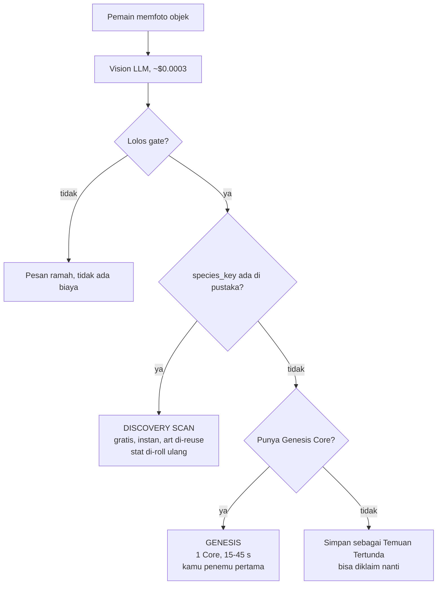
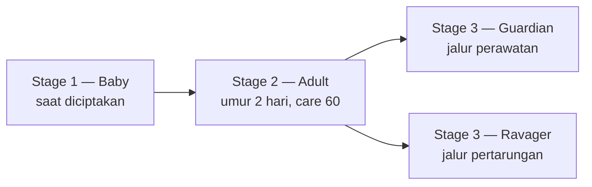
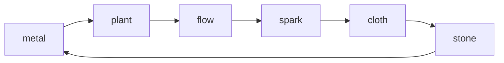
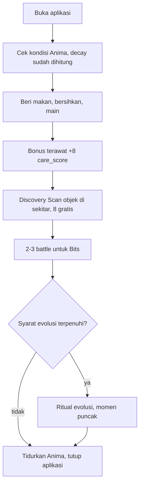

# 04 — Game Loop & Core Systems Design

Dokumen ini mendesain tiga sistem yang saling terikat: perawatan gaya Tamagotchi, ekonomi yang menahan biaya API agar tidak meledak, dan pertarungan berbasis stat yang diturunkan dari foto objek.

Urutannya sengaja: ekonomi dibahas lebih dulu daripada yang terlihat wajar, karena struktur biaya API menentukan bentuk game loop-nya. Mendesain loop dulu lalu menempelkan monetisasi belakangan akan menghasilkan game yang bangkrut pada pemain ke-500.

## 1. Kenyataan biaya yang membentuk seluruh desain

Dua angka, dan jarak di antara keduanya adalah keseluruhan desain ekonomi Scanima:

| Aksi | Biaya nyata ke kita |
| --- | --- |
| Menganalisis foto (Vision LLM) | **~$0.0003** |
| Menciptakan spesies baru (image generation 2K) | **~$0.134** |

Selisihnya **450 kali**. Aksi yang satu praktis gratis, yang lain mahal. Menyatukan keduanya di balik satu tombol "Foto" berarti setiap tap membawa risiko $0.134, dan itu memaksa kita membatasi tap — padahal memfoto benda adalah hal paling menyenangkan di game ini dan seharusnya dilakukan sesering mungkin.

Jadi jangan disatukan. Pisahkan menjadi dua aksi yang berbeda, dan biarkan struktur biaya menjadi mekanik game:

**Discovery Scan** — foto objek yang spesiesnya sudah ada di pustaka. Biaya ke kita hanya panggilan Vision, jadi **praktis gratis, langsung jadi, tanpa menunggu**. Pemain langsung dapat Anima dengan nama dan stat unik miliknya sendiri.

**Genesis** — foto objek yang spesiesnya belum pernah ada. Ini yang memicu image generation, butuh 15-45 detik, dan menghabiskan satu **Genesis Core**.

Yang membuat pembagian ini bekerja bukan efisiensinya, tapi kenyataan bahwa ia jujur secara naratif. Memfoto mug yang ke-seribu memang *seharusnya* tidak terasa seperti penemuan besar. Memfoto sesuatu yang belum pernah dilihat siapa pun *seharusnya* terasa istimewa. Struktur biaya kita dan struktur rasa game-nya menunjuk ke arah yang sama.



Momen "spesies ini belum pernah ditemukan siapa pun" adalah momen paling kuat yang dimiliki game ini, dan itu bukan paywall kalau dibingkai benar. Pemain pertama yang menciptakan sebuah spesies dicatat permanen sebagai penemunya di pustaka, terlihat oleh semua pemain lain yang nanti men-scan objek yang sama. Membayar Genesis Core bukan membuka konten yang ditahan; ia mengklaim sesuatu yang tidak bisa diklaim dua kali.

**Temuan Tertunda** menyelamatkan kasus pemain kehabisan Core tepat saat menemukan hal baru. Hasil Vision disimpan (biayanya sudah keluar, tidak perlu ulang) dan pemain bisa menuntaskannya nanti tanpa harus memfoto ulang objeknya — yang mungkin sudah tidak ada di dekatnya. Berlaku 7 hari.

## 2. Mata uang dan sumbernya

Tiga mata uang, dan yang menentukan pembagiannya adalah biaya nyata yang mereka wakili:

| Mata uang | Untuk apa | Sumber |
| --- | --- | --- |
| **Scan Charge** | Discovery Scan, 8 per hari | Refill harian, rewarded ad, langganan |
| **Genesis Core** | Menciptakan spesies baru | 3 saat onboarding, 1 per minggu gratis, IAP, langganan |
| **Bits** | Makanan, sabun, revive, kosmetik | Rewarded ad, hadiah battle, quest harian |

### Kenapa rewarded ad tidak boleh membiayai Genesis Core

Ini angka yang harus dilihat sebelum menempatkan tombol "Tonton iklan untuk 1 Core":

Dengan eCPM rewarded ad di pasar Indonesia sekitar $1-4, satu tayangan bernilai **$0.001 sampai $0.004** bersih. Satu Genesis Core berbiaya **$0.134**. Artinya satu Core butuh **34 sampai 134 tayangan iklan** untuk menutup biayanya.

Tidak ada pembingkaian UX yang bisa menyelamatkan itu. Menawarkan Core dengan 1 iklan berarti kita rugi $0.13 setiap kali, dan pemain yang paling aktif menjadi pemain yang paling merugikan — kebalikan dari yang seharusnya.

Tapi iklan bekerja sangat baik untuk hal yang murah. Satu tayangan ($0.002) membiayai **sekitar 6 Discovery Scan** ($0.0003 masing-masing) dengan margin sehat. Jadi pemetaannya jadi rapi dan tidak perlu dipaksa:

- Iklan → Scan Charge dan Bits (biaya kita $0.0003 atau nol)
- IAP dan langganan → Genesis Core (biaya kita $0.134)
- BYOK → Genesis tanpa batas (biaya kita nol, pemain memakai token sendiri)

### Harga IAP dan marginnya

Asumsi potongan toko 30% dan kurs Rp 16.000/USD. Angka bersih adalah yang kita terima setelah potongan.

| Paket | Harga | Bersih | Biaya kita | Margin |
| --- | --- | --- | --- | --- |
| 1 Genesis Core | Rp 9.000 (~$0.56) | $0.39 | $0.134 | $0.26 (66%) |
| 5 Genesis Core | Rp 29.000 (~$1.81) | $1.27 | $0.67 | $0.60 (47%) |
| 15 Genesis Core | Rp 75.000 (~$4.69) | $3.28 | $2.01 | $1.27 (39%) |
| **Scanima Plus** / bulan | Rp 39.000 (~$2.44) | $1.71 | $1.07 + hosting | ~$0.55 (32%) |

Scanima Plus berisi 8 Genesis Core per bulan, Scan Charge tanpa batas, tanpa iklan, dan slot koleksi lebih besar. Perhatikan marginnya paling tipis di antara semua paket — dan itu memang sengaja: langganan dinilai dari retensi, bukan dari margin per transaksi.

Yang perlu dijaga: **jangan pernah menjual Core lebih murah dari $0.20 bersih.** Di bawah itu, satu pembelian besar dari pemain yang gemar memfoto benda-benda aneh bisa membuat satu akun merugi. Ini bukan kekhawatiran teoretis; pemain yang paling antusias justru yang paling mungkin men-generate spesies baru terus-menerus.

### Biaya rata-rata per pemain

Yang menentukan sehat atau tidaknya seluruh model adalah **rasio cache hit** — berapa persen foto yang jatuh ke spesies yang sudah ada.

| Rasio cache hit | Biaya per Anima (blended) | Catatan |
| --- | --- | --- |
| 0% (hari pertama, pustaka kosong) | $0.134 | Fase paling mahal, DAU masih kecil |
| 50% | $0.067 | Sekitar 500-1.000 spesies di pustaka |
| 80% | $0.027 | Titik di mana model mulai nyaman |
| 95% (matang) | $0.007 | Ribuan spesies, objek umum sudah tercakup |

Kurvanya bergerak ke arah yang benar seiring waktu, dan itu adalah properti struktural yang paling berharga dari desain ini: **biaya per pemain turun saat basis pemain bertambah.** Pemain awal secara efektif membangun pustaka untuk pemain berikutnya. Karena itu soft launch dengan basis kecil adalah fase yang paling mahal per pemain, dan itu harus diantisipasi, bukan dikagetkan.

Instrumentasi wajib sejak Phase 2, dua query yang harus bisa dijawab kapan saja:

```sql
-- Rasio cache hit 7 hari terakhir
select
  count(*) filter (where status = 'cache_hit')::float / nullif(count(*), 0) as hit_rate,
  sum(cost_usd_estimate) as spend_usd
from generations
where created_at > now() - interval '7 days';

-- Pemain paling mahal, untuk mendeteksi kebocoran ekonomi lebih awal
select owner_id, count(*) as gens, sum(cost_usd_estimate) as usd
from generations
where status = 'succeeded' and created_at > now() - interval '30 days'
group by owner_id order by usd desc limit 20;
```

### Sakelar darurat

Kalau tagihan harian melewati ambang yang ditetapkan, sistem harus bisa menahan diri sendiri tanpa menunggu developer bangun. Satu baris konfigurasi di tabel `app_config` yang dibaca `create_anima`: `daily_spend_cap_usd`. Saat tercapai, Genesis masuk antrean dan diberi tahu jujur ("Inkubator sedang penuh, Anima-mu diproses beberapa jam lagi"), sementara Discovery Scan tetap jalan normal karena biayanya tidak signifikan. Menahan Genesis merusak satu momen; tagihan tak terkendali merusak proyeknya.

## 3. Survival / Tamagotchi mechanics

Empat kebutuhan, masing-masing 0-100:

| Kebutuhan | Turun penuh dalam | Dipulihkan oleh | Efek saat 0 |
| --- | --- | --- | --- |
| **Hunger** | 10 jam | Makanan (Bits) | ATK -30%, tidak mau bertarung |
| **Energy** | 14 jam bangun | Tidur (waktu nyata) | SPD -40%, sering gagal aksi |
| **Hygiene** | 24 jam | Sabun (Bits) | Kehilangan bond lebih cepat, DEF -20% |
| **Bond** | naik dari perawatan | Perawatan konsisten | Menolak evolusi |

### Decay dihitung saat dibuka, bukan lewat proses latar

Tidak ada cron, tidak ada background service, tidak ada timer yang harus tetap hidup. Semua kebutuhan adalah fungsi dari waktu yang berlalu sejak `care_synced_at`. Satu perhitungan saat Anima dibuka, dan hasilnya identik entah aplikasi ditutup 5 menit atau 5 hari.

```gdscript
const DECAY_PER_HOUR := { "hunger": 10.0, "energy": 7.1, "hygiene": 4.2 }
const OFFLINE_GRACE_HOURS := 8.0
const MAX_DECAY_HOURS := 48.0

static func apply_decay(care: Dictionary, synced_at: float, now: float) -> Dictionary:
	var hours := (now - synced_at) / 3600.0

	# Jam pertama offline gratis: pemain tidak dihukum karena tidur.
	hours = maxf(0.0, hours - OFFLINE_GRACE_HOURS)

	# Plafon decay: pergi dua hari atau dua minggu hasilnya sama.
	hours = minf(hours, MAX_DECAY_HOURS)

	var out := care.duplicate()
	for need in DECAY_PER_HOUR:
		out[need] = clampf(care[need] - DECAY_PER_HOUR[need] * hours, 0.0, 100.0)

	# Bond hanya luntur kalau kebutuhan lain benar-benar terabaikan.
	var neglected := out["hunger"] <= 0.0 and out["hygiene"] <= 0.0
	if neglected:
		out["bond"] = clampf(care["bond"] - 2.0 * hours, 0.0, 100.0)

	return out
```

Tiga keputusan di fungsi itu perlu dijelaskan karena semuanya menolak desain Tamagotchi klasik dengan sengaja.

**Grace period 8 jam** ada karena manusia tidur. Menghukum pemain karena tidak membuka aplikasi jam 3 pagi adalah cara paling cepat membuat orang berhenti bermain, dan tidak ada satu pun pemain yang merasa hukuman itu adil.

**Plafon decay 48 jam** membuat pergi seminggu tidak lebih buruk daripada pergi dua hari. Tanpa plafon, pemain yang kembali setelah liburan menemukan koleksinya hancur total, dan reaksi paling umum untuk itu bukan bertobat, tapi menghapus aplikasi.

**Tidak ada permadeath.** Ini yang paling penting dan paling menyimpang dari genre. Di Tamagotchi, monster mati adalah inti tegangannya. Di Scanima, monster dibuat dari **uang nyata** — Genesis Core, entah dibeli atau didapat mingguan. Membunuh sesuatu yang pemain bayar untuk menciptakannya adalah cara memberi tahu mereka bahwa membayar itu tidak aman.

Jadi pengganti kematian: pada kebutuhan nol berkepanjangan, Anima masuk state **Dormant** — meringkuk, pucat, tidak bisa bertarung, dan kelihatan sedih. Pulih penuh dalam beberapa siklus perawatan. Yang hilang permanen hanyalah `care_score` yang sudah terakumulasi, yang berarti kemajuan menuju evolusi tertunda. Konsekuensinya nyata dan terasa, tapi tidak ada yang tidak bisa dikembalikan.

### Care score dan aksi perawatan

`care_score` adalah akumulasi yang menjadi gerbang evolusi, dan aturannya dirancang untuk menghargai konsistensi, bukan penumpukan.

```
Beri makan saat hunger < 40      : +3
Beri makan saat hunger > 80      : +0   (tidak ada gunanya menimbun)
Bersihkan saat hygiene < 50      : +3
Tidur penuh (siklus 6 jam nyata) : +5
Bermain / interaksi tap          : +1   (maksimal +5 per hari)
Menang battle                    : +4
Semua kebutuhan > 70 saat dibuka : +8   (bonus harian "terawat")
Masuk state Dormant              : care_score direset ke 0
```

Bonus "terawat" +8 adalah pendorong terbesar dan itu memang tujuannya: yang ingin kita hargai adalah pemain yang membuka game dan menemukan Anima-nya dalam keadaan baik, bukan pemain yang menekan tombol makan dua puluh kali.

## 4. Evo-tree

Tiga stage, dengan percabangan hanya di stage terakhir. Menahan diri di sini bukan kemalasan — setiap cabang adalah art baru yang harus di-generate, dan pohon yang terlalu lebar berarti pustaka species yang jarang kena cache.



| Stage | Syarat | Efek stat |
| --- | --- | --- |
| 1 Baby | — | base |
| 2 Adult | umur ≥ 2 hari nyata, `care_score` ≥ 60, tidak Dormant | semua stat x1.4 |
| 3 Guardian | umur ≥ 7 hari, `care_score` ≥ 200, rasio perawatan lebih besar dari rasio battle | HP dan DEF x1.9, ATK x1.5 |
| 3 Ravager | umur ≥ 7 hari, `care_score` ≥ 200, ≥ 15 kemenangan battle | ATK dan SPD x1.9, DEF x1.4 |

Cabang ditentukan oleh **bagaimana pemain bermain**, bukan oleh pilihan menu. Anima yang lebih sering dirawat daripada diadu menjadi Guardian; yang sebaliknya menjadi Ravager. Pemain tidak diberi tahu rumusnya secara eksplisit, hanya diberi petunjuk lewat dialog ("Anima-mu tumbuh jadi pelindung..."), karena percabangan yang terasa seperti konsekuensi jauh lebih berkesan daripada percabangan yang terasa seperti dropdown.

### Evolusi hampir selalu gratis, dan itu bukan kebetulan

Evolusi butuh art baru, artinya satu image generation, artinya $0.134. Kedengarannya seperti evolusi harus berbayar — dan itu akan buruk, karena evolusi adalah puncak dari seminggu perawatan dan meletakkan paywall di sana akan terasa seperti pengkhianatan.

Tapi arsitektur caching sudah menyelesaikannya. Art evolusi di-cache dengan kunci `(species_key, color_bucket, stage)` di `species_library`, persis seperti art stage 1. Jadi pemain **pertama** yang mengevolusikan Anima mug membayar biayanya (dan dicatat sebagai penemunya), dan semua pemilik Anima mug sesudahnya mendapat art itu **gratis dan instan**.

Karena evolusi butuh 7 hari perawatan, sementara Discovery Scan bisa dilakukan sejak hari pertama, pustaka evolusi terisi jauh lebih lambat daripada pustaka stage 1. Konsekuensi praktisnya: di minggu-minggu awal soft launch, sebagian besar evolusi adalah cache miss dan harus dibiayai.

Cara menanganinya bukan dengan menagih pemain dan bukan dengan menambah mata uang keempat. `evolve_anima` **tidak mendebit Genesis Core sama sekali**; server memverifikasi syarat evolusi lalu mengizinkan generation-nya, dan mencatat barisnya di `generations` dengan `kind: "evolve"` agar biayanya tetap terlihat di dasbor. Jadi evolusi selalu gratis dari sisi pemain, dan biayanya kita serap sebagai biaya membangun pustaka.

Yang mencegah ini dieksploitasi bukan mata uang, tapi syaratnya sendiri: satu Anima hanya bisa berevolusi dua kali sepanjang hidupnya, dan tiap tahap butuh berhari-hari perawatan nyata. Batas atasnya sudah ketat tanpa perlu penjaga tambahan.

## 5. Basic battle mechanics

Battle harus memenuhi satu syarat yang tidak biasa: ia harus membuat stat yang berasal dari foto **terasa** berasal dari foto. Kalau gunting dan bantal bertarung dengan cara yang sama, seluruh premis "stat diturunkan dari objek nyata" jadi hiasan kosong.

### Stat turunan

`base_stats` dari Vision LLM (masing-masing 10-95) diubah jadi stat battle:

```gdscript
static func to_battle_stats(base: Dictionary, stage_mult: Dictionary) -> Dictionary:
	return {
		"max_hp":  int(base["hp"] * 4.0 * stage_mult["hp"]) + 20,
		"atk":     int(base["atk"] * stage_mult["atk"]),
		"def":     int(base["def"] * stage_mult["def"]),
		"spd":     int(base["spd"] * stage_mult["spd"]),
		"special": int(base["special"] * stage_mult["special"]),
	}
```

HP dikali 4 supaya battle berlangsung 6-10 turn. Lebih pendek terasa dangkal, lebih panjang membosankan di sesi mobile.

### Element wheel

Enam elemen dalam satu siklus tertutup. Setiap elemen kuat terhadap elemen berikutnya (x1.5) dan lemah terhadap elemen sebelumnya (x0.67).



| Menyerang | Kuat vs | Lemah vs | Logika |
| --- | --- | --- | --- |
| metal | plant | stone | Logam memotong yang organik, batu menumpulkan logam |
| plant | flow | metal | Akar menyerap air |
| flow | spark | plant | Air memendekkan arus listrik |
| spark | cloth | flow | Listrik membakar kain |
| cloth | stone | spark | Kain membungkus batu, seperti kertas menutup batu |
| stone | metal | cloth | Batu menghantam logam |

Satu siklus, satu arah, tanpa tabel matriks 6x6 yang harus dihafal. Pemain bisa memahami seluruh sistem dari satu gambar roda, dan tetap ada kedalaman taktis karena menyusun tim berarti menutupi kelemahan siklusnya.

Pemetaan elemen dari objek nyata ada di [02](02-prompt-engineering.md), dan pemetaannya intuitif: gunting jadi `metal`, tanaman jadi `plant`, gelas jadi `flow`, keyboard jadi `spark`, batu jadi `stone`, bantal jadi `cloth`.

### Rumus damage

```gdscript
const ELEMENT_CYCLE := ["metal", "plant", "flow", "spark", "cloth", "stone"]

static func element_multiplier(attacker: String, defender: String) -> float:
	var a := ELEMENT_CYCLE.find(attacker)
	var d := ELEMENT_CYCLE.find(defender)
	if a < 0 or d < 0:
		return 1.0
	var n := ELEMENT_CYCLE.size()
	if (a + 1) % n == d:
		return 1.5          # menyerang yang lemah terhadapnya
	if (d + 1) % n == a:
		return 0.67         # menyerang yang kuat terhadapnya
	return 1.0


static func compute_damage(atk: int, def: int, power: float, elem_mult: float,
		crit: bool, rng: RandomNumberGenerator) -> int:
	# def masuk sebagai peredam, bukan pengurang: mencegah damage nol
	# saat DEF tinggi, dan menjaga pertarungan tetap bergerak.
	var mitigation := 100.0 / (100.0 + float(def))
	var variance := rng.randf_range(0.92, 1.08)
	var crit_mult := 1.8 if crit else 1.0
	var raw := float(atk) * (power / 50.0) * mitigation * elem_mult * crit_mult * variance
	return maxi(1, int(raw))
```

DEF dipakai sebagai peredam multiplikatif `100/(100+DEF)`, bukan pengurang `ATK - DEF`. Alasannya praktis: dengan pengurang, Anima berbahan batu dengan DEF 90 akan kebal total terhadap Anima kertas dengan ATK 20, dan pertarungannya jadi macet tanpa jalan keluar. Dengan peredam, kertas tetap menggigit sedikit — dan roda elemen memberinya jalan menang yang sah (kain mengalahkan batu).

Peluang critical diambil dari SPD: `crit_chance = clampf(spd / 400.0, 0.02, 0.25)`. Ini membuat SPD bernilai ganda (urutan turn dan crit) sehingga objek ringan dan lincah punya identitas yang jelas di pertarungan, bukan cuma bergerak lebih dulu.

### Struktur turn

Auto-battle akan lebih mudah dibuat, tapi tiga pilihan per turn adalah harga yang murah untuk sesuatu yang membuat pemain merasa bertanggung jawab atas kemenangannya:

| Aksi | Power | Biaya Momentum | Catatan |
| --- | --- | --- | --- |
| **Strike** | 50, berbasis ATK | 0 | Aksi dasar, selalu tersedia |
| **Surge** | 75, berbasis SPECIAL | 2 | Menembus 50% DEF lawan |
| **Guard** | — | 0, memulihkan 1 | Damage masuk x0.5 turn ini |

**Momentum** adalah sumber daya per-battle, maksimal 5, mulai dari 3, pulih 1 per turn. Ia sengaja dinamai berbeda dari mata uang di bagian 2 karena ia bukan mata uang: ia lahir dan mati di dalam satu pertarungan, tidak pernah disimpan, dan tidak bisa dibeli. Perannya menciptakan ritme bertahan-lalu-menyerang tanpa perlu sistem cooldown per skill: pemain menahan diri untuk mengumpulkan Surge, dan itu keputusan yang cukup menarik untuk dibuat berulang kali.

Urutan turn dari SPD, dengan tiebreak acak. `Surge` memakai SPECIAL, yang di [02](02-prompt-engineering.md) diturunkan dari kompleksitas fungsional objek — sehingga keyboard mekanis dengan banyak tombol benar-benar bertarung berbeda dari batu, dan bedanya bisa dijelaskan dengan menunjuk objek aslinya. Itu tujuan seluruh sistem ini.

### Hadiah dan tempat battle dalam loop

Battle memberi Bits, item perawatan, `care_score` +4, dan hitungan kemenangan untuk gerbang Ravager. Battle **tidak pernah** memberi Genesis Core, karena itu akan membuka jalur farming yang biayanya kita tanggung tanpa batas.

Lawan di Phase 3 adalah bot yang disusun dari `species_library` — tim yang dibangun dari spesies yang benar-benar ditemukan pemain lain, dengan stat yang di-roll pada level yang sepadan. Ini memberi rasa dunia yang hidup tanpa perlu satu pun baris kode netcode, dan memakai aset yang sudah ada. PvP asinkron (menghadapi salinan tim pemain lain, bukan real-time) adalah kandidat Phase 5, bukan lebih awal.

## 6. Loop harian yang diharapkan



Targetnya 5-8 menit per sesi, dua sesi per hari. Yang menarik pemain kembali besok adalah tiga hal berbeda yang jatuh pada jadwal berbeda: kebutuhan Anima yang menurun (harian), kemajuan menuju evolusi (mingguan), dan kemungkinan menemukan spesies baru (kapan saja, tidak terduga). Yang terakhir adalah satu-satunya yang tidak bisa direncanakan pemain, dan karena itu yang paling kuat — sebab objek yang belum pernah ada di pustaka bisa muncul di meja kantor kapan saja.

## 7. Pemeriksaan yang wajib ada

Tiga bagian di dokumen ini punya logika yang kalau rusak akan merusak keseimbangan game secara halus dan sulit dilacak: decay, roda elemen, dan rumus damage. Satu file assert, dijalankan lewat `godot --headless --script res://tests/test_game_rules.gd`.

```gdscript
extends SceneTree

func _init() -> void:
	var full := { "hunger": 100.0, "energy": 100.0, "hygiene": 100.0, "bond": 50.0 }

	# Grace period: 8 jam pertama tidak menghukum
	var after_8h := CareRules.apply_decay(full, 0.0, 8.0 * 3600.0)
	assert(after_8h["hunger"] == 100.0, "grace 8 jam harus utuh")

	# Decay berjalan setelah grace: 18 jam = 10 jam efektif = hunger habis
	var after_18h := CareRules.apply_decay(full, 0.0, 18.0 * 3600.0)
	assert(after_18h["hunger"] == 0.0, "hunger harus habis di 10 jam efektif")

	# Plafon 48 jam: seminggu tidak lebih buruk daripada dua hari
	var after_2d := CareRules.apply_decay(full, 0.0, 56.0 * 3600.0)
	var after_7d := CareRules.apply_decay(full, 0.0, 168.0 * 3600.0)
	assert(after_2d["hygiene"] == after_7d["hygiene"], "decay harus berplafon")

	# Tidak ada nilai negatif, apa pun yang terjadi
	for need in ["hunger", "energy", "hygiene", "bond"]:
		assert(after_7d[need] >= 0.0, "kebutuhan tidak boleh negatif: " + need)

	# Roda elemen: siklus tertutup, tidak ada elemen yang kuat vs dirinya
	var cycle := BattleRules.ELEMENT_CYCLE
	for i in cycle.size():
		var me: String = cycle[i]
		var next: String = cycle[(i + 1) % cycle.size()]
		assert(is_equal_approx(BattleRules.element_multiplier(me, next), 1.5),
			me + " harus kuat vs " + next)
		assert(is_equal_approx(BattleRules.element_multiplier(next, me), 0.67),
			next + " harus lemah vs " + me)
		assert(is_equal_approx(BattleRules.element_multiplier(me, me), 1.0),
			me + " harus netral vs dirinya sendiri")

	# Damage: DEF tinggi meredam tapi tidak pernah membuat kebal
	var rng := RandomNumberGenerator.new()
	rng.seed = 42
	var vs_tank := BattleRules.compute_damage(20, 95, 50.0, 1.0, false, rng)
	assert(vs_tank >= 1, "damage minimum harus 1, bukan 0")
	var vs_paper := BattleRules.compute_damage(20, 10, 50.0, 1.0, false, rng)
	assert(vs_paper > vs_tank, "DEF rendah harus menerima damage lebih besar")

	# Keunggulan elemen benar-benar terasa
	var neutral := BattleRules.compute_damage(60, 50, 50.0, 1.0, false, rng)
	var strong := BattleRules.compute_damage(60, 50, 50.0, 1.5, false, rng)
	assert(strong > neutral, "x1.5 harus menghasilkan damage lebih besar")

	print("test_game_rules: OK")
	quit()
```

Assert `vs_tank >= 1` adalah yang paling penting di antara semuanya. Ia menjaga keputusan desain yang mudah tergerus saat balancing: kalau seseorang nanti mengganti peredam DEF dengan pengurang sederhana, test ini gagal dan alasannya langsung terlihat, alih-alih muncul berbulan-bulan kemudian sebagai laporan "battle-nya nyangkut".
