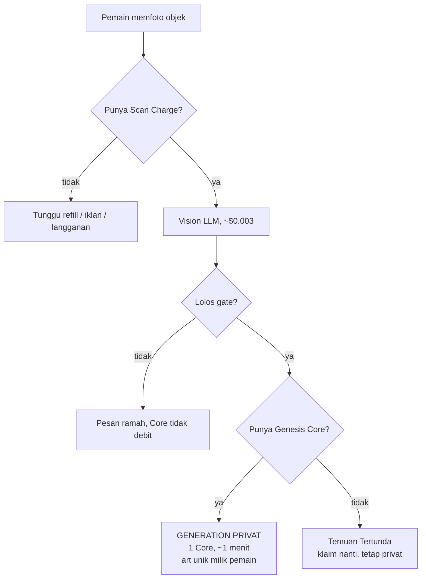
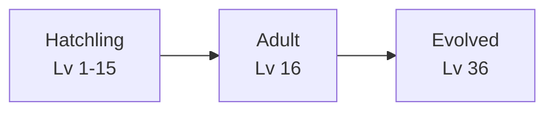
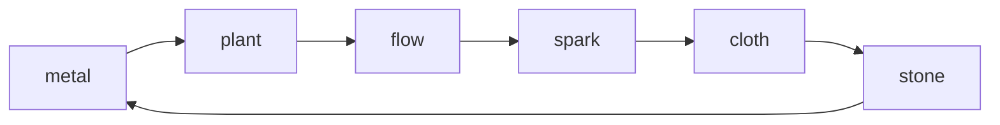
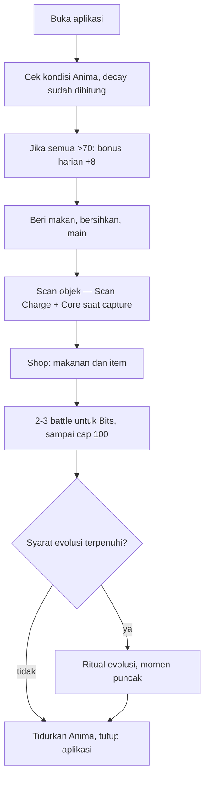

# 04 — Game Loop & Core Systems Design

Dokumen ini mendesain tiga sistem yang saling terikat: perawatan gaya Tamagotchi, ekonomi yang menahan biaya API agar tidak meledak, dan pertarungan berbasis stat yang diturunkan dari foto objek.

> **Status kontrak (15 Agustus 2026):** Ekonomi capture privat, 18 elemen,
> dual typing, grant Core mingguan, dan bot Gallery di bawah sudah menjadi
> kontrak production. Bagian bertanda *historis* dipertahankan hanya sebagai
> decision record sebelum cutover. Spesifikasi art privat dan Gallery:
> [08 — Art Privat dan Gallery](08-private-art-and-gallery.md).

Urutannya sengaja: ekonomi dibahas lebih dulu daripada yang terlihat wajar, karena struktur biaya API menentukan bentuk game loop-nya. Mendesain loop dulu lalu menempelkan monetisasi belakangan akan menghasilkan game yang bangkrut pada pemain ke-500.

## 1. Kenyataan biaya yang membentuk seluruh desain

Dua angka, dan jarak di antara keduanya adalah keseluruhan desain ekonomi Scanima:

| Aksi | Anggaran biaya ke kita |
| --- | --- |
| Menganalisis foto (Vision LLM) | **~$0.003** |
| Menciptakan spesies baru (GPT Image 2 medium) | **~$0.070** |

Generation medium terbaru pada 13 Agustus 2026 terukur sekitar **$0.05 per
sheet**, dekat dengan harga tercantum Replicate $0.047. Dokumen ekonomi tetap
memakai $0.070 sebagai reserve konservatif, bukan mengubah harga produk dari satu
sampel. Snapshot lengkap dan aturan pembanding model ada di
[02](02-prompt-engineering.md#baseline-harga-untuk-pembanding-model).

Selisih anggarannya masih sekitar **23 kali**. Aksi yang satu murah, yang lain mahal. **Target kontrak** memisahkan keduanya secara eksplisit agar pemain bisa sering mencoba foto tanpa selalu memicu generation $0.07:

| Langkah | Biaya ke kita | Biaya ke pemain (target) |
| --- | --- | --- |
| Percobaan Vision (gate + stat) | ~$0.003 | **1 Scan Charge** (batas percobaan) |
| Capture diterima (gate lolos) | ~$0.07 generation | **1 Genesis Core** + generation unik privat |

**Scan Charge** tetap membatasi **percobaan Vision**, bukan jalur art gratis. Setiap capture yang lolos gate memicu **generation privat** (~57–63 detik terukur *historis*) dan mendebit **tepat satu Core** — tidak ada reuse sheet antar pemain. Dua pemain memfoto mug yang sama mendapat dua Anima terpisah; `species_key` hanya untuk deduplikasi internal/analitik, bukan cache hit ([08](08-private-art-and-gallery.md)).

Objek yang boleh di-scan: **benda non-hidup** plus **hewan non-manusia**, dengan safety gate menolak manusia dan konten terlarang.



**Guest Seeker** (target, selaras slice *historis*): satu capture sukses per akun anonim; gate/transport gagal tidak menghabiskan slot. Sesudah sukses, client menawarkan link Google; Care, Battle, Shop, dan Collection tidak terkunci. `claim_scan_charge()` sebelum Vision; debit Core atomik saat commit generation. Guard ganda mencegah Vision berulang dan dua request paralel melahirkan dua Anima.

**Temuan Tertunda** tetap berlaku: Vision sudah keluar (~$0.003), Core habis → simpan hasil, klaim dalam 7 hari tanpa foto ulang; saat klaim tetap generation privat.

**Plafon client:** `genesis_cores == 0` mengunci commit capture (termasuk klaim tertunda). Guest: `guest_scan_used_at` → CTA `Sign in to Scan Again`. Server `NO_CORE` / `GUEST_SCAN_USED` pagar terakhir.

#### Model historis (build production saat ini)

Sebelum pivot privat, satu alur Scan memecah menjadi **Discovery Scan** (spesies sudah di `species_library` → hanya Vision, art reuse) dan **Genesis** (spesies baru → Core + generation ke pustaka bersama). Pemain pertama per spesies tercatat sebagai penemu publik. Diagram dan copy UI lama masih hidup di kode sampai migrasi selesai; angka blended cache hit di §2 *historis* merujuk ke model ini.

## 2. Mata uang dan sumbernya

Tiga mata uang, dan yang menentukan pembagiannya adalah biaya nyata yang mereka wakili:

| Mata uang | Untuk apa (target) | Sumber |
| --- | --- | --- |
| **Scan Charge** | Batas **percobaan Vision** (gate), bukan art gratis | Refill harian, rewarded ad, langganan |
| **Genesis Core** | **Setiap capture diterima** — generation privat ~$0.07 | Starter guest/link, **grant mingguan linked**, IAP/langganan |
| **Bits** | Makanan dan item di Shop | 50 saat onboarding, Shop, hadiah battle (cap 100/hari lokal) |

> **Grant Core mingguan (live):** akun **linked** (bukan guest anonim) menerima **+1 Genesis Core otomatis setiap 7 hari kalender server** sejak grant terakhir. **Tidak ada catch-up** — offline 30 hari tetap +1 saat jatuh tempo, bukan +4. **Cap saldo gratis: 3 Core** — grant tidak menumpuk di atas 3; pembelian IAP di luar cap. Grant server-authoritative + ledger-backed. Starter tetap 1 Core guest, +3 sekali saat link Google → maks 4 lifetime starter. Akun Google lama dengan lifetime 3 mendapat +1 sekali (`starter_team`).

#### Starter dan grant — keadaan historis (build saat ini)

*Historis, 13 Agustus 2026:* grant mingguan belum tersedia; catatan ini tidak
menggambarkan build setelah cutover.

### Kenapa rewarded ad tidak boleh membiayai Genesis Core

Ini angka yang harus dilihat sebelum menempatkan tombol "Tonton iklan untuk 1 Core":

Dengan eCPM rewarded ad di pasar Indonesia sekitar $1-4, satu tayangan bernilai **$0.001 sampai $0.004** bersih. Satu Genesis Core berbiaya sekitar **$0.070**. Artinya satu Core masih butuh **18 sampai 70 tayangan iklan** untuk menutup biayanya.

Tidak ada pembingkaian UX yang bisa menyelamatkan itu. Menawarkan Core dengan 1 iklan berarti kita rugi sekitar $0.066–0.069 setiap kali, dan pemain yang paling aktif menjadi pemain yang paling merugikan — kebalikan dari yang seharusnya.

Iklan tetap bekerja untuk hal yang murah, tapi marginnya jauh lebih tipis daripada yang tampak di rancangan awal. Satu tayangan bernilai $0.001-0.004 bersih, dan satu percobaan Vision berbiaya $0.003. Artinya **satu iklan kurang-lebih membiayai satu percobaan Scan**, bukan satu capture penuh (~$0.073 target) — dan pada eCPM rendah ia bahkan tidak menutup Vision. Pemetaan target:

- Iklan → **Bits** (biaya kita nol, margin nyata)
- Iklan → **Scan Charge**, dibatasi, 1 iklan ≈ 1 charge (pulang pokok Vision, bukan generation)
- IAP dan langganan → Genesis Core (biaya kita ~$0.07 per capture)
- BYOK → Vision + generation tanpa batas (biaya kita nol; satu token Replicate pemain)

### Biaya per pemain aktif, angka yang harus diawasi

Delapan Scan Charge gratis per hari, kalau dipakai habis, berarti **$0.024 per pemain per hari** dalam biaya Vision saja — **sebelum** satu capture diterima (~$0.07). Pada 1.000 DAU itu ~$24/hari Vision-only atau **~$97/hari** jika setiap charge jadi capture (8 × $0.073). Model Vision lite bisa menurunkan bagian Vision sepersepuluh.

Ini konsekuensi sadar dari memakai satu vendor untuk satu token (alasannya di [01](01-architecture-dataflow.md)), dan ada tiga tuas yang bisa ditarik sebelum menyentuh kuota gratis pemain, berurut dari yang paling murah:

1. **Hapus `stat_reasoning` dari skema produksi.** Ia field untuk mata manusia saat eval. Output ditagih delapan kali lipat input di model ini, jadi memangkasnya memotong biaya Vision hampir separuh.
2. **Turunkan foto ke 768px** sebelum dikirim. Gemini memotong gambar jadi petak 768px berharga 258 token; 1024px memakan empat petak, 768px cuma satu.
3. **Ganti `VISION_MODEL`** ke model lite yang lebih kecil. Cukup env, tanpa ubah kode, tapi wajib jalan ulang Smoke Set karena stat dan `species_key` bisa bergeser.

Yang tidak boleh jadi tuas pertama: mengurangi 8 Scan Charge harian. Itu satu-satunya angka di daftar ini yang pemain rasakan.

### Harga IAP dan marginnya

Asumsi potongan toko 30% dan kurs Rp 16.000/USD. Angka bersih adalah yang kita terima setelah potongan.

| Paket | Harga | Bersih | Biaya kita | Margin |
| --- | --- | --- | --- | --- |
| 1 Genesis Core | Rp 9.000 (~$0.56) | $0.39 | ~$0.07 | ~$0.32 (82%) |
| 5 Genesis Core | Rp 29.000 (~$1.81) | $1.27 | ~$0.35 | ~$0.92 (72%) |
| 15 Genesis Core | Rp 75.000 (~$4.69) | $3.28 | ~$1.05 | ~$2.23 (68%) |
| **Scanima Plus** / bulan | Rp 39.000 (~$2.44) | $1.71 | ~$0.56 + Vision + hosting | perlu divalidasi dari pemakaian |

Scanima Plus berisi 8 Genesis Core per bulan, Scan Charge tanpa batas, tanpa iklan, dan slot koleksi lebih besar. Perhatikan marginnya paling tipis di antara semua paket — dan itu memang sengaja: langganan dinilai dari retensi, bukan dari margin per transaksi.

Yang perlu dijaga: **jangan pernah menjual Core lebih murah dari $0.12 bersih.** Itu menyisakan ruang untuk variasi token input, pajak, dan kegagalan operasional di atas biaya generation rata-rata ~$0.07.

### Biaya rata-rata per pemain

**Target:** setiap capture diterima ≈ **$0.073** (Vision + generation privat). Scan Charge mengontrol percobaan; Core mengontrol capture. Tidak ada blended cache hit.

#### Tabel historis — model shared cache (tidak lagi target)

*Historis:* ketika Discovery Scan reuse art, rasio cache hit menentukan biaya blended:

| Rasio cache hit | Biaya per Anima (blended) | Catatan |
| --- | --- | --- |
| 0% (hari pertama, pustaka kosong) | ~$0.073 | Fase paling mahal |
| 50% | ~$0.038 | ~500–1.000 spesies di pustaka |
| 80% | ~$0.017 | Model mulai nyaman |
| 95% (matang) | ~$0.007 | Ribuan spesies |

Kurva turun seiring pustaka bertambah — alasan pivot ke art privat: margin per capture stabil dan selalu menutup generation.

Instrumentasi wajib sejak Phase 2 — target menambah metrik capture privat; query *historis* cache hit tetap berguna selama migrasi:

```sql
-- Historis: rasio cache hit 7 hari (model lama)
select
  count(*) filter (where status = 'cache_hit')::float / nullif(count(*), 0) as hit_rate,
  sum(cost_usd_estimate) as spend_usd
from generations
where created_at > now() - interval '7 days';

-- Target: capture diterima vs percobaan Vision
select
  count(*) filter (where status = 'succeeded') as captures,
  sum(cost_usd_estimate) as spend_usd
from generations
where created_at > now() - interval '7 days';

-- Pemain paling mahal (audit kebocoran)
select owner_id, count(*) as gens, sum(cost_usd_estimate) as usd
from generations
where status = 'succeeded' and created_at > now() - interval '30 days'
group by owner_id order by usd desc limit 20;
```

### Sakelar darurat

Kalau tagihan harian melewati ambang yang ditetapkan, sistem harus bisa menahan diri sendiri tanpa menunggu developer bangun. Satu baris konfigurasi di tabel `app_config` yang dibaca `create_anima`: `daily_spend_cap_usd`. Saat tercapai, **generation privat** masuk antrean ("Inkubator sedang penuh…"); percobaan Vision dengan Scan Charge tetap bisa ditolak lebih awal jika cap sudah kritis. Menahan generation merusak satu momen; tagihan tak terkendali merusak proyeknya.

### Menghapus Anima tidak membalik transaksi

Pemain boleh menghapus Anima miliknya secara permanen setelah satu dialog
konfirmasi, tetapi **tidak menerima refund Genesis Core, Scan Charge, atau Bits**.
Biaya Vision/generation sudah keluar. **Target:** art privat pemilik dihapus dari storage scoped; tidak ada kewajiban mempertahankan sheet untuk pemain lain. **Historis:** delete tidak menyingkirkan entri `species_library` bersama — art reuse tetap untuk capture lain.

Operasinya memakai DELETE PostgREST langsung dengan policy RLS
`auth.uid() = owner_id`. Row `animas` hilang, `care_events` cascade, `generations`
audit dengan `anima_id = null`. Client reload roster lalu memilih Anima terbaru
berikutnya; kalau tidak ada, Home kembali ke empty state.

### Seeker, upgrade akun, dan progression kosmetik

Pemain baru masuk sebagai user anonim tanpa login gate. `handle_new_user()`
memberi 1 Core dan 50 Bits; satu capture sukses mengisi slot guest secara
atomik. **Target:** setiap sukses mendebit Core dan memicu generation privat.
**Historis:** cache hit memakai slot tanpa Core; Genesis gagal yang direfund
melepaskan slot guest bila tidak ada sukses/pending lain.

Link Google memakai identity linking Supabase sehingga UID dan semua row progres
tetap sama. `upgrade_seeker_account()` memverifikasi identity Google, memegang
profile row lock, dan memakai indeks ledger unik agar retry hanya memberi
pelengkap starter sekali. Sign-in ke Google yang sudah memiliki Seeker adalah
restore, bukan merge: progres guest instalasi itu tidak dipindahkan.

`seeker_xp` adalah progression akun yang kosmetik:

```text
Seeker Level = 1 + floor(sqrt(seeker_xp / 5))
```

Setiap Anima yang pertama kali menjadi `ready` memberi +5 Seeker EXP. Kenaikan
EXP Anima (`care_score`) dari Care atau Battle dicerminkan 1:1 setelah transaksi
dan idempotency yang sama lolos. `battle_victories` menghitung setiap session
yang berubah terminal menjadi `won`, termasuk Training, tepat sekali. Level ini
tidak dipakai untuk stat, matchmaking, reward, atau otorisasi.

Nama Seeker wajib unik case-insensitive dan rename punya cooldown 30 hari.
Birth year/gender opsional. **Delete Account** berbeda dari Delete Anima:
Edge Function `seeker` menghapus `auth.users`, cascade membersihkan profil,
Anima, inventory, dan session pemain. Entri Galeri published (target) ikut
ditarik; bot pool tidak lagi memakai snapshot tersebut.

## 3. Survival / Tamagotchi mechanics

Tiga kebutuhan, masing-masing 0-100. Bond bukan meter pemain: progres memakai **EXP** (`care_score` di wire) dan **Level**.

| Kebutuhan | Turun penuh dalam | Dipulihkan oleh | Efek saat 0 |
| --- | --- | --- | --- |
| **Hunger** | 25 jam (aktif) | Makanan (Bits) | ATK turun; Battle tetap boleh |
| **Energy** | 14 jam bangun | Tidur (waktu nyata) | SPD -40%, sering gagal aksi |
| **Hygiene** | 24 jam | Sabun (Bits) | DEF -20% |

### Decay dihitung saat dibuka, bukan lewat proses latar

Tidak ada cron, tidak ada background service, tidak ada timer yang harus tetap hidup. Semua kebutuhan adalah fungsi dari waktu yang berlalu sejak `care_synced_at`. Satu perhitungan saat Anima dibuka, dan hasilnya identik entah aplikasi ditutup 5 menit atau 5 hari.

```gdscript
const DECAY_PER_HOUR := { "hunger": 4.0, "energy": 7.1, "hygiene": 4.2 }
const MAX_DECAY_HOURS := 48.0

static func apply_decay(care: Dictionary, synced_at: float, now: float) -> Dictionary:
	var hours := minf(maxf(0.0, (now - synced_at) / 3600.0), MAX_DECAY_HOURS)
	var out := care.duplicate()
	for need in DECAY_PER_HOUR:
		out[need] = clampf(care[need] - DECAY_PER_HOUR[need] * hours, 0.0, 100.0)
	return out
```

Tiga keputusan di fungsi itu perlu dijelaskan karena semuanya menolak desain Tamagotchi klasik dengan sengaja.

**Decay dihitung sejak sync terakhir, tanpa grace.** Versi awal memotong 8 jam dari setiap interval, lalu menuliskan ulang `care_synced_at`. Pemain yang membuka app lebih sering dari itu tidak pernah kehilangan Hunger atau Hygiene, jadi Feed/Clean jadi kosmetik. Sekarang dua jam offline di Home memotong Hunger 8 dan Hygiene 8,4 — satu Feed (+35) menutupi kira-kira 8,75 jam aktif, satu Clean (+35) kira-kira 8 jam. Anima yang tidak di-Summon memakai 25% laju itu (Hunger 1/jam, Hygiene 1,05/jam) dan tidak turun di bawah Hunger 40 / Hygiene 50, serta tidak masuk Dormant baru. Floor itu menahan decay, bukan mengangkat meter yang sudah di bawah ambang; Dormant yang sudah ada dan bonus terawat +8 hanya berubah pada companion aktif. Tidur Anima tetap memulihkan Energy; Hunger dan Hygiene companion aktif terus turun, jadi pagi hari di Home tetap perlu makan.

**Plafon decay 48 jam** membuat pergi seminggu tidak lebih buruk daripada pergi dua hari. Tanpa plafon, pemain yang kembali setelah liburan menemukan koleksinya hancur total, dan reaksi paling umum untuk itu bukan bertobat, tapi menghapus aplikasi.

**Tidak ada permadeath.** Ini yang paling penting dan paling menyimpang dari genre. Di Tamagotchi, monster mati adalah inti tegangannya. Di Scanima, monster dibuat dari **uang nyata** — Genesis Core, entah dibeli atau didapat mingguan. Membunuh sesuatu yang pemain bayar untuk menciptakannya adalah cara memberi tahu mereka bahwa membayar itu tidak aman.

Jadi pengganti kematian: setelah cap **48 jam decay efektif** tercapai dengan Hunger dan Hygiene nol, Anima masuk state **Dormant** — meringkuk, pucat, tidak bisa bertarung, dan kelihatan sedih. `dormant_since` terpisah dari generation `status`, sehingga ia tetap ada di roster `ready`. Ia pulih ketika Hunger dan Hygiene sama-sama mencapai 50. EXP (`care_score`) **tidak** direset: Dormant bukan un-level.

### EXP, Level, dan aksi perawatan

Kolom Postgres tetap `care_score`; pemain melihatnya sebagai **EXP**. Kurva live:

```text
need_next(level) = 5 × ceil(level / 5), untuk Level 1–39
EXP Level 16 = 150
EXP Level 36 = 700
EXP Level 40 = 860
```

Level adalah inverse threshold itu dan di-cap 40; `care_score` dijepit 0–860.
Form copy (sprite tetap stage 1 sampai `evolve_anima` ada): Hatchling 1–15,
Adult 16–35, Evolved 36–40. Migrasi dari kurva flat mempertahankan Level lama
serta fraksi progress bar, dengan trigger mirror Seeker EXP dimatikan hanya
selama rebase administratif.

```
Beri makan yang menyeberangkan Hunger ke ≥40 : +3 EXP
Beri makan yang masih di bawah 40            : +0
Bersihkan saat hygiene < 50      : +3 EXP
Tidur penuh (siklus 6 jam nyata) : +5 EXP sekali per Anima/hari
Bermain                          : +1 EXP (maksimal +5 per hari)
Menang battle                    : yield Level/tier lawan
Hunger, Energy, Hygiene > 70     : +8 EXP (bonus harian "terawat")
Masuk state Dormant              : EXP tidak direset
```

Bonus "terawat" +8 adalah pendorong terbesar dan itu memang tujuannya: yang ingin kita hargai adalah pemain yang membuka game dan menemukan Anima-nya dalam keadaan baik, bukan pemain yang menekan tombol makan dua puluh kali.

Nilai aksi yang live di Phase 2:

- **Feed:** wajib `food_id` dari inventory; Hunger + nilai makanan (Byte Berry 10 … Nova Feast 100). Harga Food live: 1, 2, 2, 3, 4, 5, 6, 8, 10 Bits. Tidak mendebit Bits. EXP +3 hanya jika Hunger sebelum aksi <40 **dan** sesudah restore ≥40. Ditolak `NEED_FULL` kalau Hunger setelah decay >= 99.5, `NO_ITEM` kalau tas kosong, `INVALID_ITEM` kalau bukan makanan. Client meredupkan tombol dan toast tanpa request — Godot menelan `pressed` kalau `disabled`.
- **Clean:** gratis, Hygiene +35; EXP +3 hanya jika Hygiene sebelum aksi <50. Gerbang penuh yang sama.
- **Energy item (`use_item`):** Pulse Cell +20 / Reactor Pack +50, dijepit 100, tanpa EXP. `NEED_FULL` pada Energy >= 99.5.
- **Play:** gratis, Energy -5; EXP +1 maksimal lima kali per hari sipil lokal. Tidak ada cap Bond; anti-farm-nya Energy dan counter harian. Client menahan tap sesudah cap (toast, tanpa request).
- **Sleep:** pulih linear dari Energy awal sampai 100 selama enam jam nyata; selesai penuh memberi +5 EXP hanya sekali per Anima per hari sipil lokal. Siklus berikutnya tetap memulihkan Energy tanpa EXP. Wake lebih awal mempertahankan pemulihan parsial tanpa EXP. Client menjadwalkan satu sync di batas enam jam dari timestamp server dan mengulang sync saat app kembali dari background, sehingga pose berubah ke Awake tanpa menunggu tap. Anima yang **tidak di-Summon** juga tidur, tanpa auto-bangun dan tanpa +5 EXP — Energy pulih dalam tiga jam (dua kali lipat companion). Collection menampilkan Sleep selama Energy pulih, Hungry/Dirty kalau lapar/kotor, Idle begitu siap Summon; row Postgres tetap tidur agar Energy tidak luruh. `Summon` menulis `profiles.active_anima_id` dan menidurkan sisanya.

Saldo, kebutuhan, inventory, dan score diputuskan satu transaction function
Postgres. `care_events` membuat retry idempoten; `quota_ledger` mencatat
pembelian Shop (`shop_buy`). Client menyimpan satu intent `pending_care` (plus
`item_id`) dan satu `pending_purchase`, bukan salinan saldo atau tas. Shop
menerima saldo Bits last-known authoritative dari profile dan men-disable harga
yang lebih mahal sebagai preflight; transaksi server tetap pagar akhirnya.

## 4. Evo-tree

Tiga form copy, sprite masih stage 1. **Target:** art evolusi (`evolve_anima`, ~$0.07) **privat per Anima** — tidak reuse sheet antar pemain. **Historis:** cache `(species_key, color_bucket, stage)` ke pustaka bersama; pemain pertama trigger generation, lainnya hit.



| Form | Syarat | Efek stat |
| --- | --- | --- |
| Hatchling | — | `1 + 0.02 * (level - 1)` |
| Adult | Level ≥ 16 (150 EXP) | multiplier +0.15 |
| Evolved | Level ≥ 36 (700 EXP) | multiplier +0.20 lagi |

`animas.stage` tetap 1 supaya loader art tidak mencari sheet stage 2 yang belum ada. Stats Battle memakai `growthMultiplier(level)`, bukan `stageMultipliers`, sampai art evolusi live.

Cabang Guardian/Ravager tetap rencana Phase 3. Evolusi tidak mendebit Core tambahan di kontrak target (generation sudah dibayar saat evolusi trigger); slice ini lompatan stat + copy Adult/Evolved.

## 5. Basic battle mechanics

Battle harus memenuhi satu syarat yang tidak biasa: ia harus membuat stat yang berasal dari foto **terasa** berasal dari foto. Kalau gunting dan bantal bertarung dengan cara yang sama, seluruh premis "stat diturunkan dari objek nyata" jadi hiasan kosong.

Vertical slice Battle sekarang memakai **18 elemen** directed graph di bawah.
Client tetap hanya mengirim `strike`/`surge`/`guard`/`item` dan menganimasikan
ordered event log; server memilih elemen Attack/Special dan multiplier final.

### Stat turunan

`base_stats` dari Vision LLM (masing-masing 10-95) dikali pertumbuhan level:

```gdscript
static func to_battle_stats(base: Dictionary, level: int) -> Dictionary:
	var g := growth_multiplier(level) # 1 + 0.02*(lv-1), +0.15 di 16, +0.20 di 36
	return {
		"max_hp":  int(base["hp"] * 4.0 * g) + 20,
		"atk":     int(base["atk"] * g),
		"def":     int(base["def"] * g),
		"spd":     int(base["spd"] * g),
		"special": int(base["special"] * g),
	}
```

HP dikali 4 supaya battle berlangsung 6-10 turn. Lebih pendek terasa dangkal, lebih panjang membosankan di sesi mobile.

`body_height_cm` bukan stat tempur dan tidak masuk combat power. Ia adalah tinggi
vertikal stance Battle 20–2000 cm yang ditentukan Vision v19 atau author chapter.
Vision memakai skala nyata sebagai anchor, membesarkan benda genggam kecil ke
floor boneka gendong ~50 cm (bukan tinggi anak), dan hanya memakai exaggeration
besar bila transformed silhouette memang menuntutnya. Snapshot Battle meneruskannya bersama
`render_metrics` sheet; client memakai kurva non-linear dari kartu desain
720×800. Anima 120 cm mengisi sekitar 45% kartu itu. Tinggi *tampilan* Anima
dijepit 300 cm (`ANIMA_VISUAL_HEIGHT_CAP_CM`) walaupun `body_height_cm` 20 m.
Boss Seeker tetap di kurva 720×800; Anima di sampingnya memakai rasio linear
ke tinggi Seeker di layar, jadi 3 m ≈ 300/165 × Seeker (~1,8×). Tinggi Anima
diukur dari bbox opak runtime (bukan sel kotak slicing); haze alpha rendah
diabaikan. Sesudah skala tubuh dihitung, satu camera zoom seragam diterapkan
pada seluruh fighter layer. Kamera mendekat untuk pasangan kecil dan menjauh
untuk pasangan besar, lalu dibatasi lagi oleh gabungan bbox opak agar kedua
Anima dan Seeker selalu terlihat utuh dengan margin 5%. Karena zoom-nya
seragam, rasio tinggi 300/165 tidak berubah; hanya ukuran seluruh shot yang
berubah. Art arena chapter mempertahankan crop 16:9 raw sampai maksimal 2048 px
lebar, lalu client membuat mipmap dan memakai linear-with-mipmaps supaya zoom
out tidak aliasing. Shader `battle_background_dof.gdshader` memakai satu
`textureLod` per piksel: langit/arsitektur mengambil mip lebih blur, lantai
dekat mengambil mip lebih tajam, lalu saturation dan brightness turun tipis
agar fighter tetap menjadi focal point tanpa Gaussian multi-tap. TextureRect
diukur manual sebagai cover, bukan
`KEEP_ASPECT_COVERED`, sehingga overflow horizontal bisa dipan. Posisi pan
diturunkan dari ID encounter: encounter berbeda mendapat potongan kiri/tengah/
kanan berbeda, tetapi retry turn dan resume session yang sama tidak menggeser
latar. Zoom latar tetap 1,55× untuk pasangan normal dan menuju 1× pada Anima
di cap 3 m.
Anima yang tinggi tampilannya > 60% tinggi Seeker (`SEEKER_OVERLAP_RATIO`)
pindah ke layer belakang Seeker. Tepi piksel opak
Anima menentukan shot sehingga padding transparan sel tidak membuang
ruang. Lebar jendela tidak mengubah rasio tubuh, dan ruang vertikal ekstra tidak
membesarkan tubuh. Perbedaan kecil/normal/raksasa tetap terbaca tanpa
memberi damage/HP gratis dan tanpa menutup HUD. Sheet Boss 3×3 1024 dibuka
per sel penuh (341 px) di client; capture 300 px memotong kaki tubuh yang
lebih tinggi dari jendela itu.

`createFighter` memotong stat tempur pemain sesudah pertumbuhan level kalau care rendah. Hunger < 40 interpolasi linear ke ×0.6 di 0; Hygiene < 50 interpolasi ke ×0.7 di 0; keduanya dikalikan lalu dijepit minimal ×0.5. Ambang sama dengan pose Hungry/Dirty. Bot Gallery/legacy tidak dipotong; **lawan sistem Duel dipotong sama besar** karena snapshot-nya membawa Hunger/Hygiene pemain (lihat [Resep lawan sistem](#resep-lawan-sistem)). Simulasi tier `battleRewardPreview` menetralkan care di kedua sisi supaya care rendah tidak menaikkan Bits — tanpa itu Anima lapar+kotor menang 0% dan naik ke Formidable 15 Bits. Hunger dan Hygiene bukan gerbang masuk.

### Element wheel — target (18 elemen)

Vision menetapkan **satu elemen primary** dan **satu elemen secondary** per Anima dari daftar tetap:

`metal`, `wood`, `stone`, `ceramic`, `glass`, `plastic`, `cloth`, `paper`, `plant`, `food`, `fauna`, `flow`, `spark`, `flame`, `frost`, `air`, `toxin`, `sound`

Setiap elemen punya **tepat dua kekuatan** (×1,5) dan **tepat dua kelemahan** (×0,67). Relasi **directed** — bukan satu siklus 6-node.

| Elemen | Kuat vs (×1,5) | Lemah vs (×0,67) |
| --- | --- | --- |
| metal | plant, wood | stone, spark |
| wood | spark, sound | metal, flame |
| stone | metal, ceramic | cloth, paper |
| ceramic | toxin, flame | stone, sound |
| glass | toxin, air | plastic, sound |
| plastic | flow, glass | frost, toxin |
| cloth | stone, sound | fauna, spark |
| paper | food, stone | flow, air |
| plant | flow, air | metal, fauna |
| food | fauna, frost | paper, toxin |
| fauna | plant, cloth | food, frost |
| flow | spark, paper | plastic, plant |
| spark | cloth, metal | wood, flow |
| flame | wood, frost | ceramic, air |
| frost | fauna, plastic | food, flame |
| air | flame, paper | glass, plant |
| toxin | food, plastic | ceramic, glass |
| sound | glass, ceramic | wood, cloth |

Pemetaan objek → elemen di [02](02-prompt-engineering.md) harus diselaraskan ke 18 label ini (bukan 6).

#### Resolusi elemen di turn

| Sisi | Elemen dipakai |
| --- | --- |
| **Attack** (`strike`) | **Primary** penyerang |
| **Special** (`surge`) | **Secondary** penserang; jika secondary null/invalid, fallback ke primary |
| **Pertahanan lawan** | Evaluasi **primary dan secondary** defender |

Untuk satu serangan, hitung multiplier terhadap **primary** dan **secondary** defender:

- Jika **kuat** (×1,5) dan **lemah** (×0,67) keduanya terpicu → **netral ×1,0** (saling cancel).
- Jika hanya kuat → ×1,5.
- Jika hanya lemah → ×0,67.
- Jika keduanya netral → ×1,0.

**Plafon keras:** multiplier gabungan **tidak pernah** di luar **[0,67 ; 1,5]** — dual defense tidak menumpuk super-effective ganda atau resist ganda.

```text
function matchup(attacker_elem, defender_primary, defender_secondary):
  m1 = directed_multiplier(attacker_elem, defender_primary)   // 1.0 | 1.5 | 0.67
  m2 = directed_multiplier(attacker_elem, defender_secondary)
  if m1 == 1.5 and m2 == 0.67: return 1.0
  if m1 == 0.67 and m2 == 1.5: return 1.0
  if m1 == 1.5 or m2 == 1.5: return 1.5
  if m1 == 0.67 or m2 == 0.67: return 0.67
  return 1.0
```

Client menampilkan `Super effective!` / `Not very effective.` dari `element_multiplier` authoritative event — tanpa menyalin graph ke client.

#### Model historis — 6 elemen siklus (build saat ini)

*Historis:* satu siklus `metal → plant → flow → spark → cloth → stone → metal`; satu elemen per Anima; multiplier dari posisi siklus saja.



Implementasi saat ini masih di `battle.mjs` sampai migrasi elemen selesai.

### Rumus damage

Potongan GDScript di bawah mengilustrasikan peredam DEF; **multiplier elemen** target memakai `matchup()` di atas, bukan siklus 6-node.

```gdscript
static func compute_damage(atk: int, def: int, power: float, elem_mult: float,
		crit: bool, rng: RandomNumberGenerator) -> int:
	# def masuk sebagai peredam, bukan pengurang: mencegah damage nol
	# saat DEF tinggi, dan menjaga pertarungan tetap bergerak.
	var mitigation := 100.0 / (100.0 + float(def))
	var variance := rng.randf_range(0.92, 1.08)
	var crit_mult := 1.8 if crit else 1.0
	var raw := float(atk) * (power / 50.0) * mitigation * elem_mult * crit_mult * variance
	return maxi(1, int(raw))
```

*Historis — siklus 6 elemen masih di production:*

```gdscript
const ELEMENT_CYCLE := ["metal", "plant", "flow", "spark", "cloth", "stone"]

static func element_multiplier(attacker: String, defender: String) -> float:
	var a := ELEMENT_CYCLE.find(attacker)
	var d := ELEMENT_CYCLE.find(defender)
	if a < 0 or d < 0:
		return 1.0
	var n := ELEMENT_CYCLE.size()
	if (a + 1) % n == d:
		return 1.5
	if (d + 1) % n == a:
		return 0.67
	return 1.0
```

DEF dipakai sebagai peredam multiplikatif `100/(100+DEF)`, bukan pengurang `ATK - DEF`. Alasannya praktis: dengan pengurang, Anima ber-DEF tinggi kebal total terhadap ATK rendah, dan pertarungan macet. Dengan peredam, damage minimum tetap mengalir — dan graph 18 elemen memberi jalan menang yang sah (mis. `paper` kuat vs `stone`).

Setiap event serangan membawa `element_multiplier` authoritative dari formula server. Client menampilkan `Super effective!` untuk `1.5`, `Not very effective.` untuk `0.67`, dan tidak menampilkan callout pada matchup netral; warna serta punch angka damage mengikuti hasil yang sama. Callout memakai Oxanium ExtraBold besar dengan outline gelap dan glow warna—tanpa box, border, atau garis samping—di ruang kosong tepat di bawah fighter HUD agar tidak menutupi badan Anima. Tilt dan pop dimatikan oleh Reduced Motion. Dengan begitu feedback elemen terasa sebagai impact saat hit tanpa menyalin roda elemen ke client.

Peluang critical diambil dari SPD: `crit_chance = clampf(spd / 400.0, 0.02, 0.25)`. Ini membuat SPD bernilai ganda (urutan turn dan crit) sehingga objek ringan dan lincah punya identitas yang jelas di pertarungan, bukan cuma bergerak lebih dulu.

### Struktur turn

Auto-battle akan lebih mudah dibuat, tapi tiga pilihan per turn adalah harga yang murah untuk sesuatu yang membuat pemain merasa bertanggung jawab atas kemenangannya:

| Aksi (wire) | Copy pemain | Power | Biaya PP | Catatan |
| --- | --- | --- | --- | --- |
| `strike` | **Attack** | 50, berbasis ATK | 0 | Aksi dasar, selalu tersedia |
| `surge` | **Special** | 75, berbasis SPECIAL | 1 | Menembus 50% DEF lawan |
| `guard` | **Guard** | — | 0, memulihkan 1 | Damage masuk x0.5 turn ini |

Turn tetap menunggu event authoritative server, tetapi tap tidak boleh terlihat seperti loading. Client langsung menandai aksi pilihan dengan underline pulse + haptic, meredupkan pilihan lain, dan mengabaikan input ulang tanpa style disabled. Jangan tampilkan `Attack locked in` / `Special charged` / `Resolving turn` — copy itu mengumumkan freeze. Damage, initiative, PP, dan animasi hasil tetap menunggu response server; yang instan hanya acknowledgement di tombol, supaya SPD lawan yang lebih tinggi tidak terlihat seperti animasi pemain yang “salah”.

Sesudah ordered event log authoritative diterima, pelat event menahan nama aksi
selama 1,4 detik lalu **wajib hilang sebelum pose Attack dipasang**. Setelah itu
urutan visualnya Attack → VFX/lunge → impact → Idle. Tepat sesudah
`FX_TRAVEL_SEC`, penyerang kembali Idle sebelum damage/effectiveness copy
berikutnya. Damage tetap tidak diprediksi client. Boss Seeker tidak memakai
`concern_hit` pada Guard; pose itu dimulai tepat pada beat impact yang sama
dengan `target.hit_react()`, lalu kembali Idle setelah animasi damage selesai
dan sebelum effectiveness copy ditampilkan.

Semua HP bar memakai tiga warna diskret dari rasio `hp / max_hp`: merah saat
rasio `<= 0.20`, oranye saat `<= 0.50`, dan biru/cyan di atasnya. Tidak ada
interpolasi antarwarna. Angka `current / max` tetap ditampilkan untuk
aksesibilitas. Ground shadow Team/Expedition/Boss memakai alpha pusat 0,45,
setengah dari nilai lama 0,90. Sprite shadow selalu centered; titik opak
terbawah Anima atau Boss Seeker dipasang tepat pada pusat vertikal shadow tanpa
offset Y tambahan.

Battle dan Training memakai entry gate yang sama: Anima harus memiliki **minimal 20 Energy**, dan **start session baru memotong 20 Energy**. Hunger **bukan** gerbang masuk — Bits didapat dari duel dan makanan dibeli pakai Bits, jadi mengunci faucet di belakang sink-nya membuat 0 Bits + tas kosong jadi soft-lock. Pose Hungry dan EXP Feed tetap memakai ambang 40. `start_battle()` menjalankan `apply_care(..., 'sync')` sebelum memeriksa Energy authoritative, sehingga client tidak bisa memakai snapshot Energy lama untuk masuk. Client juga menonaktifkan CTA lebih awal ketika row roster sudah menunjukkan Energy di bawah 20, tetapi keputusan akhir tetap di transaksi server. Resume session aktif tidak memotong Energy kedua kali, dan duel yang sudah berjalan tidak dibatalkan di tengah.

**PP** adalah budget per-battle: mulai penuh 3, satu Special memakan 1, dan ia **tidak pulih sendiri setiap turn** — satu-satunya pemulihan adalah Guard, plus item PP Capsule yang menaikkan max sementara sampai 5. Ia sengaja dinamai berbeda dari mata uang di bagian 2 karena ia bukan mata uang: ia lahir dan mati di dalam satu pertarungan, tidak pernah disimpan, dan tidak bisa dibawa ke duel berikutnya. Perannya menciptakan ritme bertahan-lalu-menyerang tanpa perlu sistem cooldown per skill: tiga Special adalah anggaran yang pemain sendiri putuskan kapan dibelanjakan, dan Guard adalah harga untuk menambahnya.

**Regen per-turn dihapus karena panjang battle mengukurnya menjadi tidak relevan.** Diukur dengan modul formula ini sendiri pada stat 260 HP (Special ~70 damage, Attack ~37, elemen netral), satu battle selesai sekitar **empat turn**. Dengan regen +1 per turn, biaya 1 berarti PP pemain membeku di angka awalnya sepanjang pertarungan — counter di tombol tidak pernah bergerak dan Attack tidak pernah punya alasan ditekan, sebab Special selalu tersedia, selalu lebih kuat, dan selalu menembus DEF. Versi lama memakai biaya 2 dengan regen 1, yang memang mengekang tepat satu turn dari empat, tapi mengekangnya di turn yang terasa arbitrer bagi pemain karena harganya tidak pernah ditampilkan. Budget tanpa regen memindahkan keputusannya ke pemain dan membuat tombolnya menjelaskan dirinya sendiri.

**PP tidak persist antar battle, dan itu keputusan sadar — bukan versi setengah jalan dari PP Pokémon.** Membuatnya persist (diisi lewat Feed/Sleep) pernah dipertimbangkan dan ditolak karena empat hal yang bisa ditunjuk di kode ini. Bot adalah snapshot anonim Anima pemain lain, jadi PP-nya harus sintetis dan rasionalisasinya cuma mengenai manusianya. Feed sekarang memakan inventory, bukan 5 Bits tetap, jadi break-even battle-vs-makanan tidak lagi 1:1 — Bits masuk lewat Shop dan keluar lewat harga katalog. Regen di dalam fight adalah satu-satunya sumber keputusan "Special sekarang atau Guard dulu"; tanpa itu jawabannya sepele, yaitu Special sampai habis lalu Attack terus. Dan tanpa tutorial, "tidak bisa Special sampai besok" adalah hukuman yang lebih keras daripada Dormant. Yang membuat resource ini terbaca oleh pemain baru bukan persistensinya, melainkan counter-nya menempel di tombol (`Special 3/3`), bukan cuma di header. PP Capsule menaikkan max duel itu saja sampai 5; duel berikutnya tetap mulai 3.

Urutan turn dari SPD, dengan tiebreak acak. Karena itu bot sah menyerang lebih
dulu setelah pemain memilih aksi; client mengumumkan nama aktor serta kedua
angka SPD sebelum animasi agar initiative terbaca jelas. Special memakai SPECIAL,
yang di [02](02-prompt-engineering.md) diturunkan dari kompleksitas fungsional
objek — sehingga keyboard mekanis dengan banyak tombol benar-benar bertarung
berbeda dari batu, dan bedanya bisa dijelaskan dengan menunjuk objek aslinya.
Itu tujuan seluruh sistem ini.

### Hadiah dan tempat battle dalam loop

Tier Duel **diukur, bukan ditaksir**. `duelWinRate()` menjalankan
`DUEL_DIFFICULTY_RUNS = 64` duel penuh lewat `resolveTurn` yang sama dengan
production saat session dibuat, lalu `tierFromWinRate()` memetakan hasilnya:

| Tier | Peluang menang terukur | Bits dasar | Bits harapan per duel |
| --- | --- | --- | --- |
| Favorable | ≥ 80% | 6 | 5,8 |
| Even | ≥ 55% | 8 | 5,6 |
| Tough | ≥ 40% | 11 | 5,4 |
| Formidable | sisanya | 15 | — |

Kolom terakhir adalah alasan tangganya berhenti di angka itu: diukur pada
matchup yang benar-benar lolos [gate keseimbangan](#gate-keseimbangan-duel),
nilai harapannya rata, jadi lawan berat adalah pilihan gaya dan bukan pajak.
Roll deterministik ±1 tetap datang dari seed session (bukan dari turn) supaya
replay tidak mengubah payout, dan payout disimpan di
`battle_sessions.reward_tier/roll/bits`.

Tiga hal yang menentukan simulasinya, dan semuanya diukur:

- **Kebijakan pemainnya `bestDuelAction()`** — menekan Special ketika Special
  memang lebih besar terhadap pertahanan lawan itu. `chooseBotAction` bukan
  pengganti yang sah: memakainya untuk kedua sisi menggeser tier di 30 dari 38
  matchup, sebab bot memilih Special 68% acak tanpa melihat elemen.
- **Care dinetralkan di dua sisi.** Tanpa itu Anima lapar+kotor menang 0%, naik
  ke Formidable, dan menelantarkan Anima menjadi cara menaikkan Bits.
- **Seed simulasinya konstan**, jadi matchup yang sama selalu mendapat tier yang
  sama; itu juga terukur lebih akurat daripada seed per-matchup (salah 6/38
  versus 8/38 terhadap patokan 800 duel).

Biayanya ~2 ms sekali per session, dan tier tidak pernah salah lebih dari satu
tingkat dibanding patokan 800 duel. Team Battle tetap memakai
`rewardTierFromRatio` atas combat power dua roster: arenanya membandingkan
delapan Anima dengan switch, jadi satu simulasi 1v1 tidak mewakilinya.

EXP Duel dihitung dari snapshot immutable:

```text
base = 1 + ceil(opponent_level / 10)
underdog = +1 per selisih 5 Level saat lawan lebih tinggi, maksimum +2
difficulty = +1 untuk Tough atau Formidable
full_yield = clamp(base + underdog + difficulty, 1, 8)
```

Tiga kemenangan pertama per akun per hari sipil lokal masing-masing memberi
Bits itu (dijepit sisa cap), `full_yield` aktual setelah clamp Level 40, dan
`battle_wins +1`. Ledger progression memakai
`reason = 'battle_win'` — dihitung dari **jumlah baris**, bukan nominal Bits.
Setelah 3/3, duel tetap **Training**: EXP dan win nol, tetapi Bits masih
dibayar sampai cap **100 Bits per hari lokal** (`app_config.battle_bits_per_day`),
ledger `reason = 'battle_train'`. Payout terakhir dijepit sisa cap, tidak
melewati 100. Sesudah 100/100 Training nol Bits. Cap account-wide. Kalah dan
forfeit tidak memberi reward. Satu item Battle per session, mengganti aksi turn
itu; konsumsi inventory atomik dengan commit turn. Battle **tidak pernah**
memberi Genesis Core.

Result Duel yang memberi EXP menampilkan nama Anima aktif dan jumlah EXP
authoritative. Training/capped tidak memakai copy itu.

`daily_reward` payload membawa `earned/limit/remaining` (progression) plus
`bits_earned/bits_limit/bits_remaining`. Lobby menampilkan tier dan Bits, CTA
`Battle` lalu `Train` (copy Bits-only) lalu Training nol hadiah. Client tidak
menghitung cap dari jam device.

**Keputusan UI 14 Agustus 2026:** Battle dan Training tidak menjadi dua tombol.
Keduanya memakai duel yang sama, jadi dua pilihan hanya memberi keputusan palsu.
Tab tetap bernama Battle; satu CTA berbunyi `Battle` selama progression tersedia
dan berubah menjadi `Train` setelah 3/3. Kemenangan ketiga tetap result Battle
berhadiah (`Progress 3/3`); mode Training baru berlaku session berikutnya.

Lawan Battle:

| | Aturan live | Sebelum 17 Agustus 2026 |
| --- | --- | --- |
| Sumber | Gallery published, lalu legacy privat, lalu bot sistem | Gallery published lalu legacy |
| Identitas | Tidak pernah `owner_id` / nickname | Sama |
| Matching | ±15% base stat + **gate keseimbangan**; stage sama diutamakan | ±15% base stat saja |
| Pool kosong / tidak ada yang seimbang | **Bot sistem** dari `_shared/duel_bot.mjs` | Error `NO_BATTLE_OPPONENT` |

Detail publish/unpublish Galeri: [08](08-private-art-and-gallery.md). PvP
real-time, ranked, dan item drop tetap ditunda.

#### Gate keseimbangan Duel

**Pool ±15% total base stat tidak pernah cukup, dan itu terukur.** Ia tidak
melihat Level, bentuk sebaran stat, maupun elemen. Pada tujuh Anima production,
duel ber-label `even` berkisar **8% sampai 100%** peluang menang; satu duel
ber-label `formidable` justru dimenangkan 71%, sedangkan satu ber-label `even`
dimenangkan 7%. Combat power tidak bisa dipakai sebagai gate karena ia
menjumlahkan stat sementara hasil duel adalah damage **dikali** daya tahan — dua
Anima ber-combat power identik terukur menang 100% dan 0,3%.

`estimateDuelBalance()` menaksir rasio turn-to-kill kedua sisi: berapa turn
pemain butuh untuk menjatuhkan lawan dibagi sebaliknya, memakai `computeDamage`
yang sama, pengali elemen dua arah, pengali care, plus setengah turn untuk sisi
yang lebih cepat. Di bawah 1 berarti pemain lebih cepat. Kalibrasi terhadap win
rate hasil resolver:

| Rasio taksiran | Win rate terukur | Keputusan |
| --- | --- | --- |
| 0,39 – 0,50 | 98% – 100% | ditolak, walkover |
| **0,53 – 1,00** | **42% – 71%** | **diterima** |
| 1,22 – 1,34 | 7% – 8% | ditolak, mustahil |

Kandidat yang lolos diurutkan `stableRank(seed:id)` seperti sebelumnya, jadi
lawannya tetap bervariasi. Taksiran ini **tidak** dipakai menghitung hadiah:
gate berjalan atas semua kandidat, jadi ia harus murah, sedangkan tier hanya
dihitung sekali untuk lawan yang benar-benar dipilih dan karena itu boleh
disimulasikan penuh (lihat [Hadiah](#hadiah-dan-tempat-battle-dalam-loop)).

#### Resep lawan sistem

`systemDuelBot(playerSnapshot, seed)` deterministik terhadap seed, jadi resume
dan replay bertemu lawan yang sama tanpa menyimpan resepnya. Tiga identitas
(`system-duel-fledgling` / `-warden` / `-paragon`) dipilih lewat
`formFromLevel()`; keduanya hanya menentukan nama dan art, bukan kekuatan.

| Bagian | Aturan | Alasan terukur |
| --- | --- | --- |
| Level | dicerminkan persis | selisih Level adalah tuas terbesar; Lv1 vs Lv16 berstat identik menang 0,3% |
| Total base stat | **dicari** sampai peluang menang terukur ≈ 65%, bisection 7 langkah di `0,90 – 1,25 ×` | band tetap tidak bisa melayani dua ujung roster: angka yang aman untuk Anima ber-Special 15 adalah walkover 89%–100% bagi enam Anima lainnya |
| Bentuk sebaran stat | cermin persis | mencampur ke arah rata melebarkan sebaran win rate antar-roster dari 23 poin menjadi 71 poin (70/30) dan 88 poin (50/50) |
| Elemen | netral **dua arah**, tunggal | pada stat identik, elemen unggul memberi 0% dan lemah memberi 100%, sedangkan netral 77%; pengali elemen tidak masuk perhitungan tier |
| Hunger / Hygiene | disamakan dengan pemain | tanpa ini Anima lapar menang 0%–22% dan lapar+kotor 0%–2% |
| `bot_anima_id` | `null` | ia snapshot murni, tidak ada baris `animas` dan tidak ada pemilik |
| Art | `system_asset: "placeholder"` | client sudah punya `PlaceholderSheet`; nol perubahan client |

**Kekuatan bot dicari, bukan dipatok, dan itu koreksi terhadap versi pertama.**
Band tetap `0,96 – 1,00` sudah dipakai lebih dulu dan gagal: satu konstanta harus
melayani dua ujung roster sekaligus, batas atasnya ditentukan Anima paling rapuh,
dan angka aman untuk Anima itu ternyata walkover bagi enam Anima production
lainnya. Karena tier sekarang diukur, walkover itu jujur dilabeli Favorable dan
dibayar 6 Bits — jadi resep yang terlalu lembek langsung memotong penghasilan
pemain. `balancedRatio()` menggantinya dengan bisection 7 langkah atas
`duelWinRate()`, resolver yang sama yang menentukan tier.

Rasio bukan tuas linear, dan itu justru alasan pencarian per-Anima diperlukan.
Pada langkah 0,005 peluang menang runtuh di sekitar titik cermin: klasik 100% di
0,990, 70% di 0,995, lalu 38% di 1,020. Sweep 0,90–1,58 pada tujuh Anima tidak
punya satu pun titik yang naik kembali, jadi bisection sah.

| Anima | Rasio hasil pencarian | Win rate 800 duel |
| --- | --- | --- |
| Mugshots (Special 15) | 0,990 | 66,5% |
| klasik | 1,000 | 73,5% |
| Playtron | 1,000 | 72,0% |
| Sunhound | 1,000 | 77,3% |
| Deckon | 1,047 | 65,4% |
| Veridian | 1,053 | 68,0% |
| Hydron (HP 80) | 1,121 | 55,9% |

Ketujuhnya mendarat di band Even, jadi Bits harapan per duel kembali **8,00**
seperti patok lama — bedanya sekarang angka itu dibayar untuk duel 56%–77%, bukan
untuk walkover 81%–100%. Sampel 64 duel punya derau sampai 10 poin, dan target
65% dipilih di tengah band 25 poin justru supaya derau itu tidak menggeser tier.
Selftest menuntut tier lawan sistem **tepat** `even`, dan menuntut rasio
antar-Anima menyebar > 0,05 supaya kekuatannya tidak diam-diam kembali dipatok.

**Bentuk stat hiper-spesialis tidak punya titik imbang, dan pencarian tidak boleh
memilih sisi yang kalah.** Pada bentuk seperti `95/95/95/10/10`, duel cermin
adalah fungsi tangga: 98% pada rasio 1,007 lalu langsung ~30% sesudahnya, tanpa
satu pun titik di antaranya. Itu sifat mencerminkan bentuk ekstrem, bukan
kegagalan pencarian. Jarak-ke-target sendirian bisa memilih sisi 30% karena ia
kebetulan lebih dekat ke 65% daripada 98%, dan itu mengubah lawan sistem dari
jalan keluar menjadi dinding. `preferBot()` memberi prioritas mutlak kepada
kandidat yang masih dimenangkan ≥ 55%; baru sesudah itu jarak ke target
menentukan. Disapu atas 400 bentuk stat acak, **8 di antaranya (2%)** tanpa pagar
ini berakhir di duel 47%–52%, jadi cabangnya bukan hipotetis. Konsekuensi yang
diterima: bentuk seperti itu mendapat duel gampang berbayar 6 Bits — duel yang
mudah masih menghasilkan, duel yang tidak bisa dimenangkan tidak menghasilkan
apa pun.

Pencarian ini wajib care-neutral, dan itu gratis karena `duelWinRate()` memang
menetralkannya. Bot yang ikut melemah saat meter pemain kosong akan membuat
menelantarkan Anima menjadi cara mendapat duel gampang dengan bayaran yang sama,
sebab tier juga care-neutral. Selftest memeriksanya dengan membandingkan
`base_stats` bot pada lima kondisi care.

**Menyamakan Hunger/Hygiene adalah satu-satunya cara yang bekerja.** Gerbang
Hunger dibuang (`20260814101323_allow_hungry_battle`) supaya pemain tanpa Bits
dan tanpa makanan tidak kehabisan jalan, tetapi tanpa lawan yang ikut terpotong
jalan keluarnya cuma bergeser menjadi "kalah saja". Menyesuaikan total base stat
bot dengan pengali care juga sudah diuji dan **gagal**: suku HP tetap `+20` di
`toBattleStats()` dan lantai 10 per stat di `normalizeBaseStats()` dua-duanya
tidak menyusut, sehingga bot berakhir lebih tebal daripada pemain — HP efektif
pemain 143 versus bot 152 — dan Anima ber-Special rendah tetap 0% pada setiap
lantai yang dicoba (1,00 sampai 0,50). Menyamakan care membatalkan kedua
distorsi sekaligus, tanpa aritmetika baru.

Konsekuensinya: **perawatan terlantar tidak lagi menentukan hasil Duel.** Biaya
neglect hidup di luar arena — EXP dari Feed, risiko Dormant, Energy yang hanya
pulih lewat Sleep. Itu disengaja; Duel adalah jalan keluar dari kehabisan Bits,
jadi ia tidak boleh menjadi jalan buntu.

Skenario 34 di `npm run selftest` menjaga seluruh angka di atas dengan
menjalankan resolver production, bukan membandingkannya ke angka hafalan: kalau
rumus combat bergeser, kalibrasinya gagal di sana.

### Team Battle dan Expedition

Team Battle tidak mengubah economy Duel. Ia mempunyai cap account-wide sendiri:
baseline **2 rewarded wins** dan **40 Bits per hari sipil lokal**. Empat anggota
membayar 10 Energy saat session baru dibuat. Level lawan memakai rata-rata
roster snapshot yang dibulatkan; setiap anggota memakai Level snapshot-nya
sendiri. `full_yield` memakai formula Duel, lalu fighter hidup yang pernah aktif
mendapat `ceil(full_yield / 2)`, bench hidup mendapat
`ceil(full_yield / 4)`, dan KO mendapat 0. Loss, draw, dan forfeit nol.
Result memfilter `anima_exp` ke row `exp > 0`, menampilkan nama penerima serta
Level Up, dan payload terminal Team memulihkan array itu dari receipt JSON turn
saat resume/replay.

Pada Expedition, setiap row yang melintasi batas Level juga masuk queue presentasi
client sesudah summary hadiah: banner bernama lalu perbandingan lima stat grown
lama → baru. Continue memajukan satu anggota dan Return to Map terkunci sampai
seluruh anggota yang naik Level selesai ditampilkan.

Expedition tidak menjadi faucet Bits berulang. **Begin Expedition** mendebit
30 Energy dari masing-masing empat anggota satu kali; seluruh Start Zone dan
Boss dalam run itu tidak lagi memakai Energy. Roster dikunci sampai complete
atau abandon supaya anggota pengganti tidak menghindari biaya masuk. Expedition
memakai soft budget **30 total EXP roster per hari**: bila budget masih
menyisakan minimal 1, encounter dibayar penuh dan boleh melewati 30; encounter
berikutnya memberi 0. Battle/Elite/Boss memetakan bonus difficulty ke
normal/Tough/Formidable, lalu pembagian active/bench/KO sama seperti Team.
Boss membypass budget untuk satu payout party normal per run dan
`boss_exp_awarded_at` mencegah replay/rematch menggandakannya. Tokens (wire
`supplies`) tetap masuk karena hanya berlaku di run. First clear chapter memberi
reward satu kali + Trophy. Bits hanya keluar untuk satu refresh Shop opsional;
jika attempt zona gagal, debit itu direfund idempoten bersama rollback checkpoint.

HP persisten antar-node dan antar-zona. Sebelum Zona 2/3, checkpoint
server-authoritative mewajibkan Recover (+50% max HP; KO bangkit 50%) atau Power
Up (+10% Attack/Guard/Speed untuk satu zona). PP reset tiap encounter, dan
growth dari EXP dipakai di encounter Battle berikutnya; kenaikan max HP menambah
sisa HP sebesar delta max HP tanpa membangunkan KO. Aturan roster, switch, node,
checkpoint, Trophy, dan Chapter Factory ada di
[`09-team-battle-and-expedition.md`](09-team-battle-and-expedition.md).

Roster node Expedition non-Boss tidak boleh membawa cast member `special`.
Runtime menggantinya secara deterministik dari pool Battle zona yang sama tanpa
mengubah manifest immutable. Hanya encounter `kind = boss` yang mempertahankan
ace untuk urutan final authoritative.

Boss chapter menandai tepat satu anggota lawan sebagai `special`/ace. Resolver
server menahan ace selama masih ada anggota reguler hidup, termasuk untuk
starter dan forced switch. Saat ace akhirnya masuk, ordered event log selalu
`final_ace → switch → ace_passive`; state menyimpan bahwa passive sudah dipakai
agar retry/replay tidak menggandakannya. Sugarworks memakai **Final
Confection**, bonus +1 max/current PP untuk Cotton tepat sekali. Allowlist live
juga mendukung bounded stat boost dan one-hit shield untuk chapter berikutnya.

Dua bentuk mekanik ace sengaja belum live. **Ace-exclusive move** memerlukan
action wire baru, resolver dan validasi target, VFX/pose manifest, copy, AI, dan
replay tests; menumpangkannya pada `surge` akan membuat client lama salah
menganimasikan event. **Full Boss phase** memerlukan schema phase, transition
state, HP/passive reset policy, reward tuning, dan UI checkpoint khusus. Keduanya
dicatat sebagai arah lanjut, bukan perilaku build sekarang.

## 6. Loop harian yang diharapkan



Targetnya 5-8 menit per sesi, dua sesi per hari. Yang menarik pemain kembali: kebutuhan Anima (harian), evolusi (mingguan), dan **capture privat** (kapan saja — setiap objek = Anima unik, opsional publish ke Galeri).

## 7. Pemeriksaan yang wajib ada

Care dan combat sengaja diuji di runtime yang memiliki sumber kebenarannya:

- `game/tests/test_game_rules.gd` menguji decay, Sleep, Dormant, score, dan
  validasi kontrak event yang diterima client.
- `eval/selftest.mjs` mengimpor modul combat production yang sama dengan Edge
  Function. **Target:** assert 18 relasi directed, dual-defense cancel, plafon
  0,67–1,5, minimum damage, DEF pierce, crit, Guard, PP, SPD, reward tier, item
  Battle. **Historis:** assert enam relasi siklus masih jalan sampai migrasi.
- `backend/tests/quota_rules.sql` menguji eligibility, satu active session,
  stale/concurrent turn, replay idempoten, reward atomik, cap progression 3 vs
  cap Bits 100, pembelian Shop, Feed inventory, satu item per Battle, nol reward
  loss/forfeit, Core tidak berubah, dan RPC/tabel tertutup dari client.
- `game/tests/live_battle.gd` melewati transport production untuk
  start/resume/`strike`/`guard`/`surge`/replay/forfeit tanpa model call.

Minimum damage tetap pagar balancing paling penting: kalau peredam DEF
`100/(100+DEF)` diganti pengurang sederhana, selftest gagal sebelum pertarungan
macet muncul sebagai laporan pemain.
