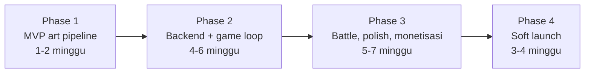

# 05 — Phased Development Roadmap

Empat fase, masing-masing dengan exit criteria yang bisa dijawab ya atau tidak. Urutannya tidak arbitrer: setiap fase dirancang untuk membunuh risiko terbesar yang tersisa, bukan untuk membangun fitur termudah lebih dulu.

Estimasi waktu memakai asumsi satu developer indie, 15-20 jam per minggu.

## Risiko yang menentukan urutan

Satu pertanyaan menentukan apakah Scanima layak dibuat sama sekali: **apakah model gambar benar-benar bisa menghasilkan monster yang secara meyakinkan berasal dari objek yang difoto, konsisten, dalam satu sheet 2x2 yang bisa dipotong otomatis?**

Kalau jawabannya tidak, tidak ada backend, tidak ada ekonomi, dan tidak ada sistem battle yang bisa menyelamatkannya. Karena itu Phase 1 tidak membangun game — ia menjawab pertanyaan itu, dengan sesedikit mungkin kode, sebelum satu jam pun dihabiskan untuk hal lain.

Kesalahan yang paling mungkin dilakukan di proyek seperti ini adalah menghabiskan enam minggu membangun Supabase, autentikasi, sistem kuota, dan UI toko, lalu menemukan bahwa art-nya tidak pernah terlihat cukup baik.

## Phase 1 — MVP: buktikan pipeline art

**Target: 1-2 minggu. Tujuan: jawab pertanyaan risiko utama, sekali dan untuk selamanya.**

Sengaja tanpa Supabase, tanpa autentikasi, tanpa database, tanpa sistem kuota. Panggilan API dilakukan dari script Node lokal dan build Godot khusus development yang membaca token dari file lokal yang di-gitignore.

> **Status per 13 Agustus 2026.** Pipeline sudah terbukti dengan foto sungguhan pada nano-banana-pro dan GPT Image 2. Setelah A/B medium vs high, default dipindah ke GPT Image 2 medium dan prompt production v2 mengikuti anime cel-shaded style guide. Smoke Set berbayar dengan template v2 final sudah menjalankan 3/3 sheet 4/4 sel dan gate 2/2. V3 menghilangkan logo Nike lewat marking pengganti dan tetap menjadi default production. Candidate terbaru **v5** membawa pagar logo/damage material milik v4 lalu menambah `character_direction`, Idle non-angry, limb plan opsional, dan larangan nama `-mon`; 23 skenario gratis serta dry-run lima foto lulus, tetapi v5 belum dipromosikan sebelum Smoke Set visual berbayar disetujui. Sisi Godot kini punya **413 pemeriksaan headless inti**: client state 55, slicing/presenter 89, UI 239, dan aturan care/event 30, ditambah 1299 pemeriksaan katalog i18n.

### Yang dikerjakan

**Setel kata-kata prompt secara manual lebih dulu.** ChatGPT bisa dipakai untuk menyusun art direction dan checklist tanpa membayar generation API; file [style guide](monster_camera_anime_cel_shaded_style_guide.md) berasal dari langkah itu. Tetapi validasi visual tetap harus memakai model production yang sebenarnya karena setiap generation GPT Image 2 medium berbiaya sekitar $0.07 dan punya mode kegagalan komposisi sendiri.

Baru setelah kata-katanya stabil, pindah ke script. `eval/run.mjs` yang mengambil satu foto, memanggil Vision LLM dengan system prompt dari [02](02-prompt-engineering.md), menyusun prompt sheet, memanggil Replicate, mengunduh hasilnya.

Iterasi berikutnya memakai **Smoke Set 5 foto** (~$0.225 per run), bukan set penuh. Isinya 3 foto generation yang masing-masing menguji satu mode kegagalan berbeda, plus 2 foto uji gate yang tidak memicu generation sama sekali.

**Full Set 20 foto dijalankan sekali saja**, di akhir fase, sebagai gerbang penerimaan setelah Smoke Set sudah bersih. Di situ penilaiannya jujur: berapa dari 20 yang benar-benar terlihat berasal dari objeknya? Berapa yang keempat pose-nya konsisten? Angka itu yang menentukan lanjut atau pivot. Menjalankannya lebih awal membakar sekitar $1.32 untuk informasi yang sebagian besar sudah diberikan Smoke Set dengan harga seperenam.

Lalu post-processing sebagai script Node berdiri sendiri: chroma key HSV, deteksi bbox per kuadran, normalisasi `frame_size`, tulis PNG RGBA + `manifest.json`. Ditulis sebagai script dulu, bukan langsung sebagai Edge Function, karena men-debug algoritma piksel di dalam runtime serverless adalah penderitaan yang tidak perlu. Memindahkannya ke Deno nanti hampir copy-paste.

Terakhir Godot: satu scene yang memuat PNG + manifest dari disk, membangun empat `AtlasTexture`, dan menampilkan tombol untuk berganti pose. Plus tween napas dan lompat dari [03](03-godot-sprite-pipeline.md), karena perbedaan antara sprite statis dan sprite bernapas adalah perbedaan antara "oke" dan "hidup", dan itu perlu dilihat sekarang untuk menilai apakah empat pose memang cukup.

Tutup fase dengan menjalankan `test_sprite_slicing.gd`, dan tes di HP fisik — bukan hanya di editor desktop.

### Exit criteria

Gerbang pertama, Smoke Set (murah, diulang sesering perlu):

- **3 dari 3** foto generation menghasilkan Anima yang jelas terbaca berasal dari objeknya
- **3 dari 3** menghasilkan tepat 4 sel yang terdeteksi dan terpotong benar
- Gate menolak 2 foto yang seharusnya ditolak, tanpa kecuali

Gerbang kedua, Full Set (dijalankan sekali setelah gerbang pertama bersih):

- Minimal **16 dari 20** foto menghasilkan Anima yang jelas terbaca berasal dari objeknya (dinilai oleh mata, dicatat skornya)
- **20 dari 20** foto menghasilkan tepat 4 sel yang terdeteksi dan terpotong benar
- Residu hijau setelah keying di bawah 0,1% piksel di semua sheet

Sisanya:

- Sprite tampil dan bernapas di HP fisik, bukan cuma di editor
- `test_sprite_slicing.gd` lolos

### Kondisi pivot

Kalau setelah tiga versi prompt berbeda Smoke Set tetap tidak bisa mencapai 3 dari 3, jangan naik ke Full Set dan jangan lanjut ke Phase 2 — Full Set hanya akan mengonfirmasi kegagalan yang sama dengan harga enam kali lipat. Yang harus diuji sebagai gantinya, dalam urutan ini: sheet 1x1 (satu pose per panggilan, empat kali biaya, tapi jauh lebih mudah bagi model untuk fokus), lalu `image_input` berisi dua gambar (foto asli plus satu contoh art referensi gaya), lalu model gambar lain sebagai pembanding.

Kalau Smoke Set bersih tapi Full Set berhenti di 12-15 dari 20, itu bukan kondisi pivot melainkan pekerjaan prompt biasa: lihat foto mana yang gagal, tambahkan foto sejenis ke Smoke Set, dan iterasi lagi di set yang murah.

### Biaya Phase 1

| Pos | Jumlah | Biaya |
| --- | --- | --- |
| Iterasi kata-kata prompt secara manual | puluhan putaran | ~$0 |
| Smoke Set selama iterasi pipeline | 8-12 run x $0.225 | $1.80-2.70 |
| Full Set sebagai gerbang penerimaan | 1-2 run x $1.32 | $1.32-2.64 |
| **Total** | | **~$6-10** |

Angka ini menggantikan estimasi awal $12-20, yang berasumsi setiap iterasi memakai set penuh. Pemisahan Smoke Set dan iterasi manual memotongnya sekitar setengah tanpa mengurangi satu pun pemeriksaan yang menentukan kelanjutan proyek.

## Phase 2 — Backend dan core game loop

**Target: 4-6 minggu. Tujuan: dari "pipeline art bekerja" menjadi "game yang bisa dimainkan orang lain".**

Baru di sini Supabase masuk, dan alasannya karena sekarang kita tahu apa yang perlu di-backend-kan.

### Yang dikerjakan

Fondasi backend lebih dulu: migrasi Postgres berisi tabel dari [01](01-architecture-dataflow.md), RLS di semuanya, trigger `guard_profile_columns`, dan fungsi `claim_genesis` / `record_cache_hit` / `refund_generation`. Sistem kuota dibangun **sebelum** endpoint yang membelanjakan uang, bukan sesudahnya — urutan sebaliknya berarti ada periode di mana ada endpoint tanpa pagar.

**Status: fondasi itu sudah berdiri.** Delapan tabel, RLS plus hak kolom, fungsi kuota dan `apply_care`, bootstrap profil dengan 30 starter Bits, bucket Storage beserta policy per-folder, dan `backend/tests/quota_rules.sql` yang lulus di proyek remote. Client tidak bisa menulis kebutuhan/score atau memanggil RPC uang; satu key hanya mendebit satu Core/Bits.

**Titik keputusan CPU sudah dijawab dengan pengukuran, bukan dugaan: 173 ms** untuk sheet v3 sungguhan di runtime edge (batas 2 detik), dengan hasil identik piksel per piksel dengan Node. Tangga mitigasi di [01](01-architecture-dataflow.md) tidak perlu dinaiki.

**`create_anima` dan `replicate_webhook` sudah live** dengan `REPLICATE_API_TOKEN` terpasang, dan pagarnya diuji terhadap endpoint produksi tanpa biaya: token hilang, user kosong, `photo_path` milik orang lain, `idempotency_key` hilang, foto tidak ada, tanda tangan webhook palsu, unggahan ke folder pemain lain, dan mime non-gambar — semuanya ditolak di lapisan yang seharusnya. Nol baris `generations` sesudahnya membuktikan tidak ada satu pun dari uji itu yang menyentuh Vision.

Uji live itu menemukan satu hal yang tidak akan pernah ditemukan oleh test berbayar: **sign-in anonim mati secara default di project Supabase**, dan game ini tidak punya layar login. Kegagalannya terjadi di detik pertama app, di jalur yang tidak memanggil API sama sekali. Sekarang menyala dan dideklarasikan di `config.toml`.

**Jalur uangnya sudah dijalankan utuh sekali di produksi (~$0.076).** Foto mug putih dari pemain anonim: `create_anima` balik 15 detik dengan Vision selesai, webhook menyelesaikan hatch-nya, hasilnya 4/4 pose, residu hijau 0,005%, nol piksel lintas kuadran, dan foto mentah terhapus sendiri. Pemain kedua yang memfoto mug yang sama mendapat `cache_hit` dalam 11 detik tanpa satu Core pun tersentuh, dengan `times_reused` naik ke 1. Sheet itu lalu diunduh dari CDN dan `test_sprite_slicing.gd` lulus 75/75 terhadapnya — art produksi, bukan fixture.

**Sisi client sudah menyusul sampai Anima tampil di layar.** Dua autoload (`GameState` untuk sesi dan scan tertunda, `Backend` untuk transport) plus scene `scan_flow` sebagai entry point, dan rantainya sudah dijalankan sungguhan terhadap produksi lewat `tests/live_scan.gd` (~$0.003 per jalan): sign-in anonim, unggah ke folder sendiri, `create_anima` balik 11–16 detik, sheet ~1 MB dari CDN, `AnimaLoader` menerima keempat pose, saldo turun tepat satu Scan Charge tanpa menyentuh Core. Dua fase penantian dibedakan di UI karena panjangnya beda jauh: belasan detik untuk `create_anima`, lalu sekitar satu menit untuk gambarnya — satu spinner untuk keduanya akan terasa macet.

Tiga invarian client dijaga oleh `tests/test_client_state.gd` (60 check, tanpa
jaringan): kunci idempotency scan/care/Battle bertahan di disk sehingga app
yang mati tidak membayar atau commit kedua, access token diperbarui sebelum
request terautentikasi, dan refresh token yang ditolak tidak pernah dijawab
dengan sign-in anonim baru.

**Koleksi, Stats, sizing mobile, inkubator, care loop, dan visual shell sekarang selesai di Phase 2.** Tap Collection membuka bottom sheet base stats + care authoritative; `View Profile` menginspeksi tanpa mengganti active companion, sedangkan `Summon` memakai dissolve + portal sebelum membuka Home. Home membedakan Loading/Error/Empty/Ready dan memberi CTA first scan tanpa tutorial terpisah. Setiap hatch menawarkan rename opsional, dan Profile menyediakan hard delete owner-only tanpa refund lewat migration RLS yang sudah live di production. Empat meter berlabel serta Feed/Clean/Sleep/Play memakai target 96px. Theme cyan-violet-gold dipakai bersama production dan art inspector; chamber background, cards, CTA, modal, meter tween, serta press/reveal motion semuanya procedural tanpa texture UI tambahan. `care_anima` sudah live dan smoke produksi membuktikan sync serta Play idempoten tanpa model call. Decay 8h grace/48h cap, Sleep enam jam, score harian, debit Bits, dan Dormant dijaga oleh transaction function + 30 check `test_game_rules.gd`; `test_scan_ui.gd` menjaga 249 kontrak mobile, Battle, theme, dan roster.

**Kamera sudah masuk, dan catatan lama yang bilang ia terhalang itu keliru.** `CameraServer` sudah mendukung Android sejak setelah 4.4, tapi yang dipakai plugin `GodotGetImage` (fork PhotoPicker) — sebab `CameraFeed` memberi feed hidup, sementara yang dibutuhkan satu jepretan dari aplikasi kamera sistem, lengkap dengan fokus dan kualitas OEM. Fork-nya dipilih karena manifest upstream menyuntikkan `READ_MEDIA_IMAGES` ke APK walau galeri tidak pernah dipanggil, dan Play menolak izin itu untuk pilih-satu-foto. Galeri sendiri sengaja tidak dipakai: fiksinya memfoto benda di depanmu, dan galeri membuka pintu untuk memindai gambar unduhan yang justru harus ditahan gate.

Resize di device ikut sekarang, dan angkanya tidak dipilih bebas — 1280 px sama dengan foto terbesar di `eval/photos/`, sehingga produksi memberi Vision gambar yang persis di dalam amplop yang sudah divalidasi Smoke Set. Skenario 18 di `npm run selftest` menegakkan batas itu gratis, sebab `species_key` yang bergeser memecah dedup cache dan mengubah scan gratis menjadi $0.07. Jalur desktop lewat `FileDialog` tetap tinggal: ia yang membuat seluruh alur bisa diperiksa di laptop tanpa perangkat Android.

**Ekspor Android sudah berjalan, dan seluruhnya dari CLI.** Tidak ada langkah editor yang wajib: `--install-android-build-template` ternyata flag CLI dan `export_presets.cfg` boleh ditulis tangan, jadi APK debug 75 MB (`com.rekansebangku.scanima`, target SDK 35, arm64-v8a) lahir dari satu perintah. Dua jebakan ditemukan justru karena artefaknya diperiksa alih-alih dipercaya. Pertama, Godot 4 **mematikan izin `INTERNET` secara default**: APK pertama keluar dengan `CAMERA` sebagai satu-satunya izin, dan ia akan terpasang, terbuka, lalu mati senyap di sign-in anonim — kegagalan yang tampak seperti masalah jaringan, bukan seperti izin yang lupa. Kedua, template Android 4.6.2 mematok Gradle 8.11.1 yang tidak menerima JDK di atas 23, sementara mesin build punya JDK 26; JDK 17 dipasang berdampingan, bukan menggantikan. Hasil akhirnya diverifikasi tepat dua izin (`INTERNET` + `CAMERA`, nol `READ_MEDIA_IMAGES`) dengan kelas plugin terbukti ada di `classes.dex` — yang sekaligus memvalidasi pilihan fork PhotoPicker di artefak jadi, bukan cuma di manifest sumbernya.

Dengan itu, core loop Phase 2 lengkap. Satu pemeriksaan yang tetap tidak bisa dijalankan headless adalah kamera pada perangkat sungguhan, memakai spesies cache-hit (~$0.003, bukan $0.07).

Edge Functions: `create_anima`, `replicate_webhook`, dan `care_anima`. Post-processing Phase 1 dipakai apa adanya di Deno lewat satu modul bersama; care tidak punya model call. Unggah foto tidak dapat endpoint sendiri—policy Storage per-folder sudah menjadi pagarnya.

Autentikasi memakai anonymous sign-in Supabase. Tidak ada layar login di awal permainan; pemain baru langsung memfoto sesuatu. Upgrade ke akun ber-email ditawarkan nanti saat mereka punya sesuatu yang layak diselamatkan, dan pembingkaiannya soal tidak kehilangan koleksi, bukan soal mendaftar.

Sisi Godot: `AnimaLoader` lengkap dengan cache dan LRU, serta state machine Incubator dari [01](01-architecture-dataflow.md) beserta polling dan penanganan aplikasi masuk background. Integrasi kamera dan resize foto di device sudah selesai lebih awal, di Phase 2.

Loop perawatan kini mencakup empat kebutuhan, decay saat dibuka, beri makan / bersihkan / tidurkan / main, `care_score`, serta Dormant. Pembagian **Discovery Scan versus Genesis** dari [04](04-game-systems-economy.md) tetap menjadi inti kontrol biaya.

Instrumentasi ikut sekarang: query rasio cache hit dan pengeluaran harian, plus `daily_spend_cap_usd` sebagai sakelar darurat. Menerbangkan ini tanpa dasbor biaya sama dengan menerbangkan tanpa indikator bahan bakar.

Tutup dengan `test_game_rules.gd`.

### Exit criteria

- Satu pemain bisa: buka aplikasi → foto benda → lihat inkubasi → dapat Anima → rawat → tutup → buka lagi besok dan decay-nya benar
- Tidak ada API key di dalam build APK — **dan jangan memverifikasinya dengan `strings` pada APK.** Kriteria itu sudah dicoba dan terbukti tidak bisa gagal: pack Godot terkompresi, sehingga string kontrol yang jelas ada di `backend.gd` (`kgcaisvmmpxswevjvgft`) memberi nol hit pada APK jadi. Satu-satunya "temuan" yang muncul justru `r8_StorageE`, simbol C++ termangling di `libc++_shared.so`. Uji yang selalu lulus lebih berbahaya daripada tidak ada uji. Yang menjaganya sekarang skenario 19 di `npm run selftest`, yang memindai sumber `game/` — apa pun yang tidak ada di sana tidak mungkin ada di APK — dan sudah dibuktikan gagal saat token palsu disuntikkan.
- Kuota tidak bisa dicurangi lewat panggilan langsung ke Postgres dengan anon key (coba curangi sendiri; kalau bisa, RLS-nya bocor)
- Dua request `create_anima` paralel dengan `idempotency_key` sama hanya menghabiskan satu Core
- Discovery Scan selesai di bawah 3 detik; Genesis menangani jeda 45 detik tanpa membuat aplikasi terlihat hang
- Aplikasi ditutup paksa saat inkubasi lalu dibuka lagi tetap menemukan Anima-nya
- Dasbor biaya menampilkan rasio cache hit dan pengeluaran harian
- 3-5 penguji eksternal bermain 3 hari tanpa kehilangan data

## Phase 3 — Battle, evolusi, polish, monetisasi

**Target: 5-7 minggu. Tujuan: dari "bisa dimainkan" menjadi "layak dirilis".**

**Milestone pertama selesai 13 Agustus 2026:** vertical slice Battle 1v1 sudah
live—Anima aktif melawan snapshot anonim Anima pemain lain, tiga aksi per turn,
damage/elemen/PP server-authoritative, resume setelah restart, reward
atomik, dan presentasi hit di Godot.

Yang berikutnya di Phase 3 adalah evolusi vertical slice, onboarding, audio, dan
weekly Core/pending-discovery claim. PvP/matchmaking, tim multi-Anima, ranked
ladder, battle pass, dan item drop tetap ditunda; semuanya memperlebar sistem
sebelum loop 1v1 punya data pemain nyata.

### Yang dikerjakan

Battle dari [04](04-game-systems-economy.md) sekarang punya stat turunan, roda
elemen, Attack/Special/Guard, PP, bot anonim, flash, angka damage, dan haptic
ringan. Session Postgres berumur 30 menit; client menyimpan action/key tertunda,
sedangkan server sendiri yang memutuskan turn dan reward. Menang memberi 5 Bits,
`care_score +4`, dan `battle_wins +1`; loss/forfeit nol reward dan tidak ada
Genesis Core. Hanya tiga win pertama per akun per hari UTC yang memberi ketiga
reward itu; sesudahnya satu CTA lobby berubah dari Battle menjadi Train dan duel
tetap tersedia sebagai Training tanpa progression.

Evolusi: gerbang syarat di server, ritual evolusi sebagai momen puncak, percabangan Guardian dan Ravager, dan `evolve_anima` dengan `image_input` berisi sprite Idle Anima itu sendiri. Evolusi tidak mendebit Genesis Core — alasannya di [04](04-game-systems-economy.md).

Monetisasi, dengan pemetaan yang sudah dikunci di [04](04-game-systems-economy.md) dan tidak boleh digeser: rewarded ad hanya untuk Scan Charge dan Bits, IAP dan langganan untuk Genesis Core. **Keputusan 13 Agustus 2026: pemain juga mendapat 1 Genesis Core gratis per minggu**, server-authoritative dan ledger-backed; detail auto-credit/claim serta akumulasi minggu terlewat belum diputuskan. Implementasinya harus datang bersama jalur memakai Core itu untuk menuntaskan `pending_discoveries`, karena build sekarang sudah menyimpan temuannya tetapi belum punya endpoint/UI claim. Plus jalur BYOK: layar tempel token, validasi ke Replicate, penyimpanan lokal di device, generation langsung dari Godot, post-processing lewat shader bake, dan tawaran opt-in menyumbang sheet ke pustaka global.

UI Phase 3 berfokus pada permukaan fitur baru, bukan mengulang visual shell. Onboarding tiga layar berakhir dengan pemain memfoto sesuatu di dekatnya dalam 60 detik pertama — bukan tutorial berisi teks, tapi satu instruksi dan satu tombol kamera. Battle/evolution harus memakai theme dan `UiJuice` yang sudah ada. Koleksi dasar dan Stats numerik selesai di Phase 2; fase ini hanya mengganti placeholder kartu yang belum tercache dengan thumbnail server khusus bila jumlah roster nyata membuktikan kebutuhan itu, serta menambahkan `stat_reasoning` dari Vision LLM ("ATK tinggi karena ujungnya tajam"). Jangan mengunduh sheet 1 MB massal hanya untuk menghilangkan placeholder.

Audio: musik latar untuk kandang dan battle, dan yang lebih penting, SFX untuk setiap aksi perawatan. Umpan balik audio pada tap adalah pembeda terbesar antara terasa murah dan terasa dibuat dengan sungguh-sungguh, dengan biaya kerja paling kecil.

Ditutup dengan pass aksesibilitas dan performa: target ukuran tap 48dp, kontras teks yang memadai, tidak mengandalkan warna saja untuk menyampaikan elemen (ikon bentuk berbeda per elemen), 60 fps di HP mid-range, dan penggunaan memori yang stabil setelah 30 menit bermain.

### Exit criteria

- Loop lengkap dari foto sampai evolusi bisa dimainkan tanpa jalan buntu
- Pembelian IAP berhasil di build Play Store internal testing, dan Core-nya benar-benar masuk
- Rewarded ad tidak pernah bisa memberi Genesis Core lewat jalur mana pun
- BYOK menghasilkan Anima tanpa satu pun panggilan berbayar dari sisi kita
- 60 fps di HP mid-range, memori stabil setelah 30 menit
- Semua aksi punya umpan balik audio dan visual
- Privacy policy tertulis dan tertaut dari dalam aplikasi
- 10 penguji eksternal bermain 7 hari; retensi hari-3 di atas 40%

## Phase 4 — Soft launch

**Target: 3-4 minggu. Tujuan: rilis ke pemain nyata dan pelajari biaya nyata pada skala nyata.**

Rilis dua tahap, dan tahapnya berurutan bukan karena kehati-hatian berlebihan, tapi karena angka biaya per pemain dari Phase 3 masih berbasis 10 penguji.

**Tahap 1 — itch.io.** Build Android APK plus build Web sebagai demo (dengan catatan jelas bahwa versi Web tidak punya kamera dan memakai unggah file). Tanpa IAP, memakai kode promo yang memberi Genesis Core gratis. Tujuannya bukan pendapatan, tapi mengukur perilaku 50-200 pemain sungguhan: berapa foto per pemain per hari, benda apa yang sebenarnya mereka foto, dan yang paling penting, seberapa cepat rasio cache hit naik.

Tahap ini juga tempat pustaka species tumbuh. Dan karena biaya per pemain paling tinggi ketika pustaka masih kosong, tahap 1 adalah fase paling mahal per pemain di seluruh proyek. Anggarkan sadar: 100 pemain x 15 Anima x $0.10 blended = **~$150**.

**Tahap 2 — Play Store closed testing lalu produksi.** Closed testing 20 penguji selama 14 hari adalah persyaratan Play Store untuk akun developer pribadi baru, dan itu memakan kalender, jadi jadwalkan lebih awal. Perlu disiapkan: data safety form yang menyatakan penggunaan kamera dan pengiriman foto ke pihak ketiga, privacy policy yang di-host, konfigurasi IAP, target API level terbaru, dan aset toko. Rilis produksi memakai staged rollout mulai 10%, dengan dasbor biaya dipantau setiap hari selama minggu pertama.

### Exit criteria

- Rasio cache hit di atas 50% pada akhir tahap 1
- Biaya blended per Anima di bawah $0.06
- Crash-free session di atas 99%
- Retensi hari-1 di atas 35%, hari-7 di atas 15%
- Tidak ada insiden Vision gate bocor
- Setidaknya satu transaksi IAP nyata berhasil di produksi
- Rata-rata biaya API per pemain di bawah pendapatan rata-rata per pemain, atau selisihnya diketahui dan diterima sadar

## Ringkasan biaya per fase

| Fase | Biaya API | Catatan |
| --- | --- | --- |
| 1 | $6-10 | Iterasi manual gratis, 8-12 run Smoke Set, 1-2 run Full Set |
| 2 | $20-40 | Pengujian internal, 3-5 penguji |
| 3 | $40-80 | 10 penguji selama 7 hari, plus pengujian evolusi |
| 4 | $150-400 | 50-200 pemain nyata, pustaka masih tipis |

Biaya tetap di luar API: akun developer Play Store $25 sekali bayar, Supabase gratis sampai batas tertentu lalu $25 per bulan, domain untuk privacy policy sekitar $12 per tahun.

## Daftar risiko

| Risiko | Dampak | Penanganan |
| --- | --- | --- |
| Art tidak pernah cukup "True to Object" | Fatal, premis gagal | Diuji di Phase 1 sebelum apa pun dibangun; kondisi pivot sudah ditulis |
| Model tidak konsisten antar keempat pose | Tinggi | Style lock + kamera terkunci + skala eksplisit; deteksi varians tinggi bbox Idle vs Attack di post-processing |
| Rasio cache hit tidak pernah naik (pemain memfoto benda yang terlalu beragam) | Tinggi, ekonomi tidak jalan | Ukur sejak Phase 2; kalau macet, longgarkan kunci cache (buang `color_bucket`) sebelum menaikkan harga |
| Batas CPU Edge Function saat post-processing | Menengah | Tangga mitigasi tiga tingkat di [01](01-architecture-dataflow.md) |
| Replicate mengubah harga atau menghentikan model | Tinggi | Nama model dan payload dikonfigurasi, bukan di-hardcode; `allow_fallback_model` bisa dinyalakan sebagai tindakan darurat |
| Vision gate bocor, konten tidak pantas masuk | Tinggi, risiko toko aplikasi | Gate LLM plus `safety_filter_level` plus tombol laporkan; entri species bisa dihapus dari pustaka |
| Play Store menolak karena kebijakan foto/kamera | Menengah | Privacy policy dan data safety disiapkan di Phase 3, bukan saat mengunggah |
| Satu pemain menghabiskan biaya tidak proporsional | Menengah | `daily_spend_cap_usd`, query 20 pemain termahal, harga Core di atas $0.20 bersih |
| Pemain kehilangan Anima karena akun anonim | Menengah | Tawarkan upgrade akun setelah Anima pertama layak diselamatkan |
| Scope creep ke PvP real-time atau trading | Menengah | Keduanya secara eksplisit ditunda ke Phase 5 |

## Yang sengaja tidak dikerjakan

Menuliskan ini sama pentingnya dengan menuliskan yang dikerjakan, karena masing-masing terdengar menarik dan masing-masing akan menunda rilis:

PvP real-time (netcode, matchmaking, anti-cheat — bot dari `species_library` sudah memberi 80% rasanya dengan 5% kerjanya), trading antar pemain (butuh ekonomi yang aman dan moderasi), breeding (butuh generation ekstra per anak, biaya tidak terkendali), sistem quest bercabang, animasi frame-by-frame, dukungan iOS (tambah $99 per tahun dan satu pipeline rilis lagi; tunda sampai Android terbukti), dan lokalisasi di luar bahasa Indonesia dan Inggris.
