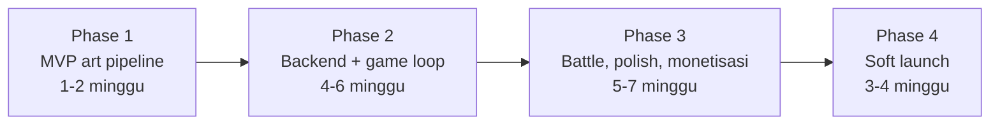

# 05 — Phased Development Roadmap

Empat fase, masing-masing dengan exit criteria yang bisa dijawab ya atau tidak. Urutannya tidak arbitrer: setiap fase dirancang untuk membunuh risiko terbesar yang tersisa, bukan untuk membangun fitur termudah lebih dulu.

Estimasi waktu memakai asumsi satu developer indie, 15-20 jam per minggu.

## Risiko yang menentukan urutan

Satu pertanyaan menentukan apakah Scanima layak dibuat sama sekali: **apakah model gambar benar-benar bisa menghasilkan monster yang secara meyakinkan berasal dari objek yang difoto, konsisten, dalam satu sheet 2x2 yang bisa dipotong otomatis?**

Kalau jawabannya tidak, tidak ada backend, tidak ada ekonomi, dan tidak ada sistem battle yang bisa menyelamatkannya. Karena itu Phase 1 tidak membangun game — ia menjawab pertanyaan itu, dengan sesedikit mungkin kode, sebelum satu jam pun dihabiskan untuk hal lain.

Kesalahan yang paling mungkin dilakukan di proyek seperti ini adalah menghabiskan enam minggu membangun Supabase, autentikasi, sistem kuota, dan UI toko, lalu menemukan bahwa art-nya tidak pernah terlihat cukup baik.

## Phase 1 — MVP: buktikan pipeline art

**Target: 1-2 minggu. Tujuan: jawab pertanyaan risiko utama, sekali dan untuk selamanya.**

Sengaja tanpa Supabase, tanpa autentikasi, tanpa database, tanpa sistem kuota. Panggilan API dilakukan dari script Node lokal dan build Godot khusus development yang membaca token dari file lokal yang di-gitignore.

> **Status per 12 Agustus 2026.** Pipeline sudah terbukti dengan foto sungguhan pada nano-banana-pro dan GPT Image 2. Setelah A/B medium vs high, default dipindah ke GPT Image 2 medium dan prompt production v2 mengikuti anime cel-shaded style guide. Post-processing punya 17 skenario gratis, termasuk regresi tangan yang melewati center seam; sisi Godot punya 75 pemeriksaan headless termasuk kontrak sheet keluaran Node.

### Yang dikerjakan

**Setel kata-kata prompt secara manual lebih dulu.** ChatGPT bisa dipakai untuk menyusun art direction dan checklist tanpa membayar generation API; file [style guide](monster_camera_anime_cel_shaded_style_guide.md) berasal dari langkah itu. Tetapi validasi visual tetap harus memakai model production yang sebenarnya karena setiap generation GPT Image 2 medium berbiaya sekitar $0.07 dan punya mode kegagalan komposisi sendiri.

Baru setelah kata-katanya stabil, pindah ke script. `eval/run.mjs` yang mengambil satu foto, memanggil Vision LLM dengan system prompt dari [02](02-prompt-engineering.md), menyusun prompt sheet, memanggil Replicate, mengunduh hasilnya.

Iterasi berikutnya memakai **Smoke Set 5 foto** (~$0.225 per run), bukan set penuh. Isinya 3 foto generation yang masing-masing menguji satu mode kegagalan berbeda, plus 2 foto uji gate yang tidak memicu generation sama sekali.

**Full Set 20 foto dijalankan sekali saja**, di akhir fase, sebagai gerbang penerimaan setelah Smoke Set sudah bersih. Di situ penilaiannya jujur: berapa dari 20 yang benar-benar terlihat berasal dari objeknya? Berapa yang keempat pose-nya konsisten? Angka itu yang menentukan lanjut atau pivot. Menjalankannya lebih awal membakar sekitar $1.32 untuk informasi yang sebagian besar sudah diberikan Smoke Set dengan harga seperenam.

Lalu post-processing sebagai script Node berdiri sendiri: chroma key HSV, deteksi bbox per kuadran, normalisasi `frame_size`, tulis PNG RGBA + `manifest.json`. Ditulis sebagai script dulu, bukan langsung sebagai Edge Function, karena men-debug algoritma piksel di dalam runtime serverless adalah penderitaan yang tidak perlu. Memindahkannya ke Deno nanti hampir copy-paste.

Terakhir Godot: satu scene yang memuat PNG + manifest dari disk, membangun empat `AtlasTexture`, dan menampilkan tombol untuk berganti pose. Plus tween napas dan lompat dari [03](03-godot-sprite-pipeline.md), karena perbedaan antara sprite statis dan sprite bernapas adalah perbedaan antara "oke" dan "hidup", dan itu perlu dilihat sekarang untuk menilai apakah empat pose memang cukup.

Tutup fase dengan menjalankan `test_sprite_slicing.gd`, dan tes di HP fisik — bukan hanya di editor desktop.

### Exit criteria

Gerbang pertama, Smoke Set (murah, diulang sesering perlu):

- **3 dari 3** foto generation menghasilkan Anima yang jelas terbaca berasal dari objeknya
- **3 dari 3** menghasilkan tepat 4 sel yang terdeteksi dan terpotong benar
- Gate menolak 2 foto yang seharusnya ditolak, tanpa kecuali

Gerbang kedua, Full Set (dijalankan sekali setelah gerbang pertama bersih):

- Minimal **16 dari 20** foto menghasilkan Anima yang jelas terbaca berasal dari objeknya (dinilai oleh mata, dicatat skornya)
- **20 dari 20** foto menghasilkan tepat 4 sel yang terdeteksi dan terpotong benar
- Residu hijau setelah keying di bawah 0,1% piksel di semua sheet

Sisanya:

- Sprite tampil dan bernapas di HP fisik, bukan cuma di editor
- `test_sprite_slicing.gd` lolos

### Kondisi pivot

Kalau setelah tiga versi prompt berbeda Smoke Set tetap tidak bisa mencapai 3 dari 3, jangan naik ke Full Set dan jangan lanjut ke Phase 2 — Full Set hanya akan mengonfirmasi kegagalan yang sama dengan harga enam kali lipat. Yang harus diuji sebagai gantinya, dalam urutan ini: sheet 1x1 (satu pose per panggilan, empat kali biaya, tapi jauh lebih mudah bagi model untuk fokus), lalu `image_input` berisi dua gambar (foto asli plus satu contoh art referensi gaya), lalu model gambar lain sebagai pembanding.

Kalau Smoke Set bersih tapi Full Set berhenti di 12-15 dari 20, itu bukan kondisi pivot melainkan pekerjaan prompt biasa: lihat foto mana yang gagal, tambahkan foto sejenis ke Smoke Set, dan iterasi lagi di set yang murah.

### Biaya Phase 1

| Pos | Jumlah | Biaya |
| --- | --- | --- |
| Iterasi kata-kata prompt secara manual | puluhan putaran | ~$0 |
| Smoke Set selama iterasi pipeline | 8-12 run x $0.225 | $1.80-2.70 |
| Full Set sebagai gerbang penerimaan | 1-2 run x $1.32 | $1.32-2.64 |
| **Total** | | **~$6-10** |

Angka ini menggantikan estimasi awal $12-20, yang berasumsi setiap iterasi memakai set penuh. Pemisahan Smoke Set dan iterasi manual memotongnya sekitar setengah tanpa mengurangi satu pun pemeriksaan yang menentukan kelanjutan proyek.

## Phase 2 — Backend dan core game loop

**Target: 4-6 minggu. Tujuan: dari "pipeline art bekerja" menjadi "game yang bisa dimainkan orang lain".**

Baru di sini Supabase masuk, dan alasannya karena sekarang kita tahu apa yang perlu di-backend-kan.

### Yang dikerjakan

Fondasi backend lebih dulu: migrasi Postgres berisi lima tabel dari [01](01-architecture-dataflow.md), RLS di semuanya, trigger `guard_profile_columns`, dan fungsi `claim_generation` / `refund_generation`. Sistem kuota dibangun **sebelum** endpoint yang membelanjakan uang, bukan sesudahnya — urutan sebaliknya berarti ada periode di mana ada endpoint tanpa pagar.

Lalu Edge Functions: `photo_upload_url`, `create_anima`, `replicate_webhook`, dengan post-processing dari Phase 1 diport ke Deno memakai ImageScript. Di sini muncul titik keputusan nyata soal batas CPU — ukur dulu dengan sheet asli, lalu naiki tangga mitigasi di [01](01-architecture-dataflow.md) hanya kalau memang kena.

Autentikasi memakai anonymous sign-in Supabase. Tidak ada layar login di awal permainan; pemain baru langsung memfoto sesuatu. Upgrade ke akun ber-email ditawarkan nanti saat mereka punya sesuatu yang layak diselamatkan, dan pembingkaiannya soal tidak kehilangan koleksi, bukan soal mendaftar.

Sisi Godot: `AnimaLoader` lengkap dengan cache dan LRU, state machine Incubator dari [01](01-architecture-dataflow.md) beserta polling dan penanganan aplikasi masuk background, integrasi kamera lewat plugin Android, dan resize foto di device sebelum upload.

Lalu loop perawatan: empat kebutuhan, `apply_decay` yang dihitung saat dibuka, aksi beri makan / bersihkan / tidurkan / main, `care_score`, state Dormant. Dan pembagian **Discovery Scan versus Genesis** dari [04](04-game-systems-economy.md), yang merupakan inti kontrol biaya dan harus ada sejak fase ini, bukan ditambahkan belakangan.

Instrumentasi ikut sekarang: query rasio cache hit dan pengeluaran harian, plus `daily_spend_cap_usd` sebagai sakelar darurat. Menerbangkan ini tanpa dasbor biaya sama dengan menerbangkan tanpa indikator bahan bakar.

Tutup dengan `test_game_rules.gd`.

### Exit criteria

- Satu pemain bisa: buka aplikasi → foto benda → lihat inkubasi → dapat Anima → rawat → tutup → buka lagi besok dan decay-nya benar
- Tidak ada API key di dalam build APK (verifikasi dengan `strings` pada APK, jangan berasumsi)
- Kuota tidak bisa dicurangi lewat panggilan langsung ke Postgres dengan anon key (coba curangi sendiri; kalau bisa, RLS-nya bocor)
- Dua request `create_anima` paralel dengan `idempotency_key` sama hanya menghabiskan satu Core
- Discovery Scan selesai di bawah 3 detik; Genesis menangani jeda 45 detik tanpa membuat aplikasi terlihat hang
- Aplikasi ditutup paksa saat inkubasi lalu dibuka lagi tetap menemukan Anima-nya
- Dasbor biaya menampilkan rasio cache hit dan pengeluaran harian
- 3-5 penguji eksternal bermain 3 hari tanpa kehilangan data

## Phase 3 — Battle, evolusi, polish, monetisasi

**Target: 5-7 minggu. Tujuan: dari "bisa dimainkan" menjadi "layak dirilis".**

### Yang dikerjakan

Battle dari [04](04-game-systems-economy.md): stat turunan, roda elemen, rumus damage, tiga aksi per turn, Momentum, lawan bot yang disusun dari `species_library` sehingga terasa seperti melawan temuan pemain lain. Yang membutuhkan waktu di sini bukan logikanya (logikanya sudah ditulis) melainkan presentasinya: setiap pukulan butuh hentakan, kilatan, angka damage yang melompat, dan getaran haptic — tanpa itu pertarungan berbasis stat terasa seperti spreadsheet.

Evolusi: gerbang syarat di server, ritual evolusi sebagai momen puncak, percabangan Guardian dan Ravager, dan `evolve_anima` dengan `image_input` berisi sprite Idle Anima itu sendiri. Evolusi tidak mendebit Genesis Core — alasannya di [04](04-game-systems-economy.md).

Monetisasi, dengan pemetaan yang sudah dikunci di [04](04-game-systems-economy.md) dan tidak boleh digeser: rewarded ad hanya untuk Scan Charge dan Bits, IAP dan langganan untuk Genesis Core. Plus jalur BYOK: layar tempel token, validasi ke Replicate, penyimpanan lokal di device, generation langsung dari Godot, post-processing lewat shader bake, dan tawaran opt-in menyumbang sheet ke pustaka global.

UI/UX polish di seluruh permukaan. Onboarding tiga layar yang berakhir dengan pemain memfoto sesuatu di dekatnya dalam 60 detik pertama — bukan tutorial berisi teks, tapi satu instruksi dan satu tombol kamera. Layar koleksi memakai thumbnail 128px alih-alih sheet penuh. Kartu stat yang menunjukkan `stat_reasoning` dari Vision LLM ("ATK tinggi karena ujungnya tajam"), yang membuat hubungan antara objek nyata dan angka jadi terlihat, dan itu salah satu hal paling memuaskan yang bisa ditunjukkan game ini.

Audio: musik latar untuk kandang dan battle, dan yang lebih penting, SFX untuk setiap aksi perawatan. Umpan balik audio pada tap adalah pembeda terbesar antara terasa murah dan terasa dibuat dengan sungguh-sungguh, dengan biaya kerja paling kecil.

Ditutup dengan pass aksesibilitas dan performa: target ukuran tap 48dp, kontras teks yang memadai, tidak mengandalkan warna saja untuk menyampaikan elemen (ikon bentuk berbeda per elemen), 60 fps di HP mid-range, dan penggunaan memori yang stabil setelah 30 menit bermain.

### Exit criteria

- Loop lengkap dari foto sampai evolusi bisa dimainkan tanpa jalan buntu
- Pembelian IAP berhasil di build Play Store internal testing, dan Core-nya benar-benar masuk
- Rewarded ad tidak pernah bisa memberi Genesis Core lewat jalur mana pun
- BYOK menghasilkan Anima tanpa satu pun panggilan berbayar dari sisi kita
- 60 fps di HP mid-range, memori stabil setelah 30 menit
- Semua aksi punya umpan balik audio dan visual
- Privacy policy tertulis dan tertaut dari dalam aplikasi
- 10 penguji eksternal bermain 7 hari; retensi hari-3 di atas 40%

## Phase 4 — Soft launch

**Target: 3-4 minggu. Tujuan: rilis ke pemain nyata dan pelajari biaya nyata pada skala nyata.**

Rilis dua tahap, dan tahapnya berurutan bukan karena kehati-hatian berlebihan, tapi karena angka biaya per pemain dari Phase 3 masih berbasis 10 penguji.

**Tahap 1 — itch.io.** Build Android APK plus build Web sebagai demo (dengan catatan jelas bahwa versi Web tidak punya kamera dan memakai unggah file). Tanpa IAP, memakai kode promo yang memberi Genesis Core gratis. Tujuannya bukan pendapatan, tapi mengukur perilaku 50-200 pemain sungguhan: berapa foto per pemain per hari, benda apa yang sebenarnya mereka foto, dan yang paling penting, seberapa cepat rasio cache hit naik.

Tahap ini juga tempat pustaka species tumbuh. Dan karena biaya per pemain paling tinggi ketika pustaka masih kosong, tahap 1 adalah fase paling mahal per pemain di seluruh proyek. Anggarkan sadar: 100 pemain x 15 Anima x $0.10 blended = **~$150**.

**Tahap 2 — Play Store closed testing lalu produksi.** Closed testing 20 penguji selama 14 hari adalah persyaratan Play Store untuk akun developer pribadi baru, dan itu memakan kalender, jadi jadwalkan lebih awal. Perlu disiapkan: data safety form yang menyatakan penggunaan kamera dan pengiriman foto ke pihak ketiga, privacy policy yang di-host, konfigurasi IAP, target API level terbaru, dan aset toko. Rilis produksi memakai staged rollout mulai 10%, dengan dasbor biaya dipantau setiap hari selama minggu pertama.

### Exit criteria

- Rasio cache hit di atas 50% pada akhir tahap 1
- Biaya blended per Anima di bawah $0.06
- Crash-free session di atas 99%
- Retensi hari-1 di atas 35%, hari-7 di atas 15%
- Tidak ada insiden Vision gate bocor
- Setidaknya satu transaksi IAP nyata berhasil di produksi
- Rata-rata biaya API per pemain di bawah pendapatan rata-rata per pemain, atau selisihnya diketahui dan diterima sadar

## Ringkasan biaya per fase

| Fase | Biaya API | Catatan |
| --- | --- | --- |
| 1 | $6-10 | Iterasi manual gratis, 8-12 run Smoke Set, 1-2 run Full Set |
| 2 | $20-40 | Pengujian internal, 3-5 penguji |
| 3 | $40-80 | 10 penguji selama 7 hari, plus pengujian evolusi |
| 4 | $150-400 | 50-200 pemain nyata, pustaka masih tipis |

Biaya tetap di luar API: akun developer Play Store $25 sekali bayar, Supabase gratis sampai batas tertentu lalu $25 per bulan, domain untuk privacy policy sekitar $12 per tahun.

## Daftar risiko

| Risiko | Dampak | Penanganan |
| --- | --- | --- |
| Art tidak pernah cukup "True to Object" | Fatal, premis gagal | Diuji di Phase 1 sebelum apa pun dibangun; kondisi pivot sudah ditulis |
| Model tidak konsisten antar keempat pose | Tinggi | Style lock + kamera terkunci + skala eksplisit; deteksi varians tinggi bbox Idle vs Attack di post-processing |
| Rasio cache hit tidak pernah naik (pemain memfoto benda yang terlalu beragam) | Tinggi, ekonomi tidak jalan | Ukur sejak Phase 2; kalau macet, longgarkan kunci cache (buang `color_bucket`) sebelum menaikkan harga |
| Batas CPU Edge Function saat post-processing | Menengah | Tangga mitigasi tiga tingkat di [01](01-architecture-dataflow.md) |
| Replicate mengubah harga atau menghentikan model | Tinggi | Nama model dan payload dikonfigurasi, bukan di-hardcode; `allow_fallback_model` bisa dinyalakan sebagai tindakan darurat |
| Vision gate bocor, konten tidak pantas masuk | Tinggi, risiko toko aplikasi | Gate LLM plus `safety_filter_level` plus tombol laporkan; entri species bisa dihapus dari pustaka |
| Play Store menolak karena kebijakan foto/kamera | Menengah | Privacy policy dan data safety disiapkan di Phase 3, bukan saat mengunggah |
| Satu pemain menghabiskan biaya tidak proporsional | Menengah | `daily_spend_cap_usd`, query 20 pemain termahal, harga Core di atas $0.20 bersih |
| Pemain kehilangan Anima karena akun anonim | Menengah | Tawarkan upgrade akun setelah Anima pertama layak diselamatkan |
| Scope creep ke PvP real-time atau trading | Menengah | Keduanya secara eksplisit ditunda ke Phase 5 |

## Yang sengaja tidak dikerjakan

Menuliskan ini sama pentingnya dengan menuliskan yang dikerjakan, karena masing-masing terdengar menarik dan masing-masing akan menunda rilis:

PvP real-time (netcode, matchmaking, anti-cheat — bot dari `species_library` sudah memberi 80% rasanya dengan 5% kerjanya), trading antar pemain (butuh ekonomi yang aman dan moderasi), breeding (butuh generation ekstra per anak, biaya tidak terkendali), sistem quest bercabang, animasi frame-by-frame, dukungan iOS (tambah $99 per tahun dan satu pipeline rilis lagi; tunda sampai Android terbukti), dan lokalisasi di luar bahasa Indonesia dan Inggris.
