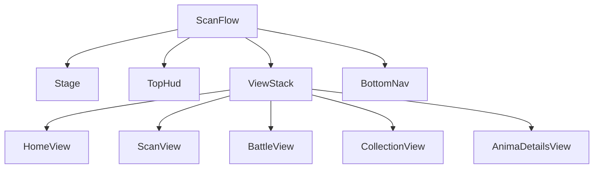

# UI shell dan globalization

## Tujuan

UI production Scanima dibangun sebagai game creature-first: Anima adalah hero,
care adalah aksi utama, Scan adalah signature CTA, lalu Collection dan Profile
menjadi progres sekunder. Shell tetap dark navy dengan aksen cyan/violet/gold,
tetapi dekorasi sci-fi tidak boleh mengalahkan karakter atau keterbacaan.

## Arsitektur scene

`scenes/scan_flow.tscn` adalah satu-satunya scene production yang berjalan. Ia
menjaga Stage, request, pending scan/care/battle, inkubator, top HUD, dan bottom
nav tetap hidup. Lima destination adalah child scene yang di-instance sekali:



Tab hanya mengubah visibility; jangan memakai `change_scene_to_file()` untuk
destination ini. `scan_flow.gd` tetap mengorkestrasi Backend/GameState.
Masing-masing view hanya menampilkan data dan memancarkan intent pemain.

## Tanggung jawab destination

- **Home:** identity, Anima stage, kebutuhan, Bond, Care Score, Feed/Clean/Sleep/Play.
  Bond penuh menonaktifkan Play; saat tidur hanya Wake yang tampil selebar dock.
  Tanpa roster, Home membedakan Loading/Error/Empty dan memberi CTA first scan.
- **Scan:** penjelasan discovery, preview foto, dua fase status, CTA kamera.
- **Battle:** lobby Anima aktif, dua fighter, HP/Momentum, Strike/Surge/Guard,
  ordered event feedback, result/retry, dan forfeit.
- **Collection:** roster dua kolom; tap membuka bottom sheet base stats + care
  authoritative dengan aksi `View Profile` dan `Summon`. Thumbnail hanya dari cache.
- **Anima Profile:** portrait, element, rarity, stage, care score, dan base stats.

Pose Idle/Attack/Sleep/Defeated bukan navigation production. Alat itu tetap ada
di `anima_demo.tscn`.

## Localization

Semua string player-facing bersumber dari `game/locales/ui.csv`; English adalah
kolom sumber, default, dan fallback. Static scene memakai translation key sebagai
`text`. Dynamic copy memakai `tr("KEY")` dan placeholder, bukan concatenation.

`LocaleManager` memusatkan:

- pilihan locale;
- integer, decimal, ratio, percent, dan ukuran file;
- nama element dan stage;
- mapping kode gate menjadi copy pemain;
- fallback display name Anima.

Untuk menambah bahasa:

1. tambah kolom locale ke `ui.csv` dan isi semua key;
2. daftarkan hasil `.translation` di `project.godot`;
3. tambahkan locale ke `SUPPORTED_LOCALES`;
4. panggil `LocaleManager.set_locale()` dari settings.

Jika script baru perlu menampilkan error Backend, log detail mentah ke console
dan tampilkan translation key yang stabil. Jangan bocorkan enum, snake_case,
path, atau prose internal server kepada pemain.

## Visual system

`themes/mobile_theme.tres` adalah sumber chrome bersama. Nunito Sans dipakai
untuk body dan Oxanium untuk display. Locale dengan script yang belum dicakup
font ini memakai system fallback yang aktif di import setting; font locale khusus
bisa ditambahkan ke Theme tanpa mengubah komponen UI. Asset font memakai OFL;
ikon Lucide memakai ISC dan lisensinya disimpan bersama asset.

Target minimum touch adalah 96 unit pada basis 720×1280. Layout memakai
Container/anchor dan safe-area conversion milik `scan_flow.gd`; jangan mengunci
lebar berdasarkan panjang copy English. Care actions otomatis berubah dari
empat menjadi dua kolom jika label locale tidak lagi muat.

Bottom nav berurutan Home, Scan, Battle, Collection, Anima. Kelima tombol
memakai ikon di atas label agar target 96px tetap muat; Scan tetap CTA cyan,
sementara destination aktif punya state pressed yang terpisah. Enam elemen
Battle memakai ikon berbentuk berbeda supaya informasi tidak bergantung pada
warna.

Chip Core tetap ringkas di HUD. Penjelasan Genesis Core dibuka sebagai modal
lokal saat chip disentuh, supaya istilah ekonomi tidak memenuhi layar utama.

## Motion dan accessibility

`UiJuice` memiliki semua motion Control termasuk bottom sheet.
`AnimaPresenter` memiliki transform Anima; `IncubatorEffect` memiliki telur dan
portal; `FirstAnimaEffect` memiliki scanner empty state. Jangan membuat tween
baru yang menulis properti milik komponen lain.

`UiMotion.reduced_motion` mematikan ambient motion, squash/reveal, meter tween,
dan hatch movement tanpa mematikan feedback atau kontrol. Settings
accessibility masa depan cukup mengatur flag ini.

## Verifikasi gratis

```bash
/Applications/Godot.app/Contents/MacOS/Godot --headless --path game \
  --script res://tests/test_scan_ui.gd
/Applications/Godot.app/Contents/MacOS/Godot --headless --path game \
  --script res://tests/test_i18n.gd
/Applications/Godot.app/Contents/MacOS/Godot --headless --path game \
  --script res://tests/test_sprite_slicing.gd

# Visual states tanpa panggilan model
godot --path game -- --screenshot=/tmp/home.png
godot --path game -- --collection --screenshot=/tmp/collection.png
godot --path game -- --collection-sheet-demo --screenshot=/tmp/collection-sheet.png
godot --path game -- --empty-demo --screenshot=/tmp/empty.png
godot --path game -- --summon-demo
godot --path game -- --stats --screenshot=/tmp/profile.png
godot --path game -- --preview=$PWD/eval/photos/mug-putih.jpg \
  --screenshot=/tmp/scan.png
```
