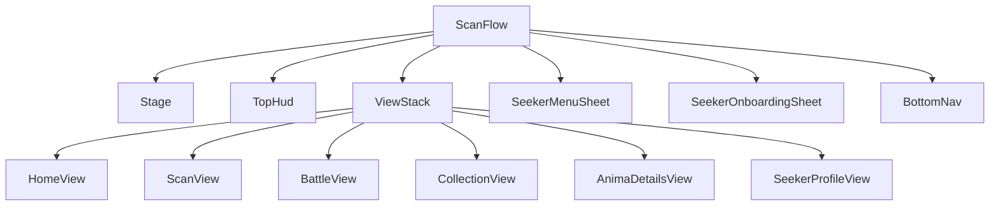

# UI shell dan globalization

## Tujuan

UI production Scanima dibangun sebagai game creature-first: Anima adalah hero,
care adalah aksi utama, Scan adalah signature CTA, lalu Collection dan Profile
menjadi progres sekunder. Shell tetap dark navy dengan aksen cyan/violet/gold,
tetapi dekorasi sci-fi tidak boleh mengalahkan karakter atau keterbacaan.

## Arsitektur scene

`scenes/scan_flow.tscn` adalah satu-satunya scene production yang berjalan. Ia
menjaga Stage, request, pending scan/care/battle, inkubator, top HUD, dan bottom
nav tetap hidup. Lima destination adalah child scene yang di-instance sekali:



Tab hanya mengubah visibility; jangan memakai `change_scene_to_file()` untuk
destination ini. `scan_flow.gd` tetap mengorkestrasi Backend/GameState.
Masing-masing view hanya menampilkan data dan memancarkan intent pemain.

## Tanggung jawab destination

- **Home:** identity, Level, kebutuhan, bar EXP, dan Feed/Clean/Sleep/Play.
  Play tidak terkunci Bond; saat tidur hanya Wake yang tampil selebar dock.
  **Shop** seukuran chip Bits dan menempel tepat di bawahnya; baris HUD Animas/Cores/Bits tetap satu.
  Tanpa roster, Home membedakan Loading/Error/Empty dan memberi CTA first scan.
  Tap tepat pada sprite memberi reaksi lokal sesuai awake/Sleep/Dormant tanpa
  mengubah care atau mengirim request.
- **Scan:** penjelasan discovery, preview foto, dua fase status, CTA kamera.
  Untuk Guest Seeker yang sudah memakai satu kesempatan Scan, CTA tetap aktif
  tetapi berubah menjadi **Sign in to Scan Again**; tab lain tidak ikut dikunci.
- **Battle:** lobby Anima aktif, dua fighter, HP/PP, Attack/Special/Guard/Item,
  ordered event feedback, result/retry, dan forfeit. Counter PP hidup **hanya** di
  tombol Special, di tempat pemain membelanjakannya; label header yang dulu
  mengulanginya sudah dihapus. Saat duel aktif, judul halaman hanya milik lobby;
  status turn/reward, Forfeit, dan satu fighter HUD versus menjadi combat visor
  yang mengambang di dalam arena. HUD tidak memakai panel terpisah per monster:
  identity dan bar HP dicerminkan ke tengah, dengan angka `current / max` di atas
  tiap bar. Footer tinggal satu baris feedback dan empat aksi 96px,
  sedangkan result membesar ke atas tanpa menggeser arena. Ini memberi sprite
  ruang utama tanpa mengecilkan target sentuh 96px. Kedua meter HP terkuras dari tepi luar layar ke
  dalam seperti Street Fighter — bar pemain `FILL_END_TO_BEGIN`, bar bot
  `FILL_BEGIN_TO_END` — sehingga sisa HP selalu memeluk tengah arena. Status row
  menampilkan `Progress x/3 · Bits x/100` plus tier lawan. Sesudah 3/3 CTA menjadi
  `Train` dengan copy Bits-only sampai cap 100; sesudah 100/100 Training nol hadiah.
  Kemenangan ketiga tetap result Battle berhadiah (`Progress 3/3`). Client refresh dari `server_now`/`reset_at` saat timer atau
  app resume, bukan dari jam device.
- **Collection:** roster dua kolom; tap langsung membuka bottom sheet identity +
  base stats. Condition memakai skeleton sampai care authoritative tersedia,
  dengan aksi `View Profile` dan `Summon`. Thumbnail hanya dari cache.
- **Anima Profile:** portrait dan sembilan row label/help/value untuk traits serta
  base stats. Konten scroll, dan setiap help membuka penjelasan singkat in-app.
- **Seeker Profile:** view tambahan di luar bottom nav. Portrait memakai companion
  aktif dan enam row menampilkan Level kosmetik, EXP, jumlah Anima/spesies,
  seluruh kemenangan, dan tanggal bergabung. Rename membuka `UiModal`.

Tombol menu 96px di Top HUD membuka `SeekerMenuSheet`: Profile, aksi
Google/account linked, Reduced Motion, Help, dan Delete Account. Setelah hatch
pertama, `SeekerOnboardingSheet` meminta nama unik; birth year dan gender
opsional. Sheet boleh ditutup dan akan ditawarkan lagi selama `seeker_name`
server masih null—tidak ada flag onboarding lokal yang bisa drift. Nama yang
tidak valid atau sudah dipakai menyalakan label + field merah dan pesan inline
merah; edit berikutnya membersihkan state error lama. Preflight client memakai
format server yang sama, jadi spasi tidak pernah dikirim sebagai nama Seeker.

Pose Idle/Attack/Sleep/Defeated bukan navigation production. Alat itu tetap ada
di `anima_demo.tscn`.

## Localization

Semua string player-facing bersumber dari `game/locales/ui.csv`; English adalah
kolom sumber, default, dan fallback. Static scene memakai translation key sebagai
`text`. Dynamic copy memakai `tr("KEY")` dan placeholder, bukan concatenation.

`LocaleManager` memusatkan:

- pilihan locale;
- integer, decimal, ratio, percent, dan ukuran file;
- nama element dan stage;
- mapping kode gate menjadi copy pemain;
- fallback display name Anima.

Untuk menambah bahasa:

1. tambah kolom locale ke `ui.csv` dan isi semua key;
2. daftarkan hasil `.translation` di `project.godot`;
3. tambahkan locale ke `SUPPORTED_LOCALES`;
4. panggil `LocaleManager.set_locale()` dari settings.

Jika script baru perlu menampilkan error Backend, log detail mentah ke console
dan tampilkan translation key yang stabil. Jangan bocorkan enum, snake_case,
path, atau prose internal server kepada pemain.

## Visual system

`themes/mobile_theme.tres` adalah sumber chrome bersama. Nunito Sans dipakai
untuk body dan Oxanium untuk display. Locale dengan script yang belum dicakup
font ini memakai system fallback yang aktif di import setting; font locale khusus
bisa ditambahkan ke Theme tanpa mengubah komponen UI. Asset font memakai OFL;
ikon Lucide memakai ISC dan lisensinya disimpan bersama asset. Panel kebutuhan
Home memakai `NeedChipLow` (bingkai merah Danger) pada ambang pose/Battle yang
sama, tanpa warna meter baru.

Target minimum touch adalah 96 unit pada basis 720×1280. Layout memakai
Container/anchor dan safe-area conversion milik `scan_flow.gd`; jangan mengunci
lebar berdasarkan panjang copy English. Care actions otomatis berubah dari
empat menjadi dua kolom jika label locale tidak lagi muat.

Bottom nav berurutan Home, Scan, Battle, Collection, Anima. Kelima tombol
memakai ikon di atas label agar target 96px tetap muat; Scan tetap CTA cyan,
sementara destination aktif punya state pressed yang terpisah. Enam elemen
Battle memakai ikon berbentuk berbeda supaya informasi tidak bergantung pada
warna.

Chip Core dan Bits tetap ringkas di HUD. Penjelasan Genesis Core atau Bits
dibuka sebagai modal lokal saat chip disentuh, supaya istilah ekonomi tidak
memenuhi layar utama. Chip Animas membuka Collection.

## Komponen chrome bersama

Komponen reusable tinggal di `scenes/ui/` dengan logic di `scripts/`:

- `UiModal`: mode info, confirm, danger-confirm, dan input. Host memberi string
  yang sudah di-resolve dan merutekan hasil memakai context; komponen menangani
  backdrop, focus aman, busy, Cancel, dan Reduced Motion.
- `ResourceChip`: value/name plus action overlay opsional 96px, isinya ditengahkan
  di dalam target itu. Tidak menyimpan domain saldo atau navigation.
- `UiBottomSheet`: backdrop, handle 96px, panel, dismiss, safe-area bawah, dan
  slide. Surface `BottomSheetPanel` hanya membulatkan sudut atas; rhythm chrome
  memakai 8px setelah handle dan 16px antar-konten. Sheet panjang mengaktifkan
  `scroll_content`: body dibatasi maksimal 92% tinggi host lalu scroll mengikuti
  focus, sehingga onboarding, menu Seeker, dan detail Collection tetap operable
  di landscape atau saat keyboard terbuka. Hanya handle yang menerima drag
  dismiss agar gesture header tidak berebut dengan scroll. Domain Collection
  tetap memegang selection revision, cache, dan care sync. Shop dan Bag memakai
  satu `ShopScroll` internal dengan viewport pilihan 560px agar lima row katalog
  terbaca sekaligus; tinggi itu menyusut mengikuti cap 92% pada layar pendek,
  sedangkan empty state menyembunyikan viewport agar sheet tetap ringkas.
- `UiSkeleton`: pulse bounded tanpa `_process`; Reduced Motion memakai state statis.
- `InfoValueRow`: label, value rata kanan pada kolom lebar tetap, lalu help redup
  96px paling akhir. Urutan itu yang membuat baris tetap sejajar walau value
  sependek `5` atau sepanjang `Baby`; help sengaja lebih redup daripada value
  supaya ia terbaca sebagai bantuan, bukan aksi utama.

FileDialog native, toast, Battle UI, Care Dock, dan efek Scan/Incubator tetap
domain-specific. Jangan memperluas komponen generik dengan aturan game.

Rename dan Delete memakai satu `UiModal` shell. Rename selalu menawarkan
`Save Name` + `Cancel`; Cancel tidak mengirim request, termasuk sesudah hatch.
Warna focus `PrimaryButton` harus tetap memakai teks navy di atas cyan.

## Motion dan accessibility

`UiJuice` memiliki semua motion Control termasuk bottom sheet.
`AnimaPresenter` memiliki transform Anima; `IncubatorEffect` memiliki telur dan
portal; `FirstAnimaEffect` memiliki scanner empty state. Jangan membuat tween
baru yang menulis properti milik komponen lain.

`UiMotion.reduced_motion` mematikan ambient motion, squash/reveal, meter tween,
dan hatch movement tanpa mematikan feedback atau kontrol. Check **Reduced
Motion** di menu Seeker menulis preference lewat `GameState`; nilainya tetap
lokal pada device dan dipertahankan saat restore/hapus akun.

Tap pada Anima Home bergantung pada dua hal yang mudah dilanggar. Pertama, semua
`Container` di atas Stage (`SafeMargin`, `Shell`, `ViewStack`, `HomeView`, dan
`Column`-nya) harus `mouse_filter = IGNORE`, sebab default `STOP` membuat GUI
menelan tap sebelum `_unhandled_input()` tanpa galat apa pun. Kedua, tween
reaksinya tidak boleh memakai `chain().set_parallel(true)`; kombinasi itu
menyatukan step sehingga hop dan kembalinya saling menghapus. `--home-tap-demo`
mendorong event lewat `push_input` dan mencetak perpindahan sprite, jadi kedua
kesalahan itu terlihat sebagai `reaction=(0, 0)`.

## Verifikasi gratis

```bash
/Applications/Godot.app/Contents/MacOS/Godot --headless --path game \
  --script res://tests/test_scan_ui.gd
/Applications/Godot.app/Contents/MacOS/Godot --headless --path game \
  --script res://tests/test_i18n.gd
/Applications/Godot.app/Contents/MacOS/Godot --headless --path game \
  --script res://tests/test_sprite_slicing.gd
/Applications/Godot.app/Contents/MacOS/Godot --headless --path game \
  --script res://tests/test_auth_flow.gd

# Visual states tanpa panggilan model
godot --path game -- --screenshot=/tmp/home.png
godot --path game -- --collection --screenshot=/tmp/collection.png
godot --path game -- --collection-sheet-demo --screenshot=/tmp/collection-sheet.png
godot --path game -- --collection-sheet-loading-demo --screenshot=/tmp/collection-loading.png
godot --path game -- --empty-demo --screenshot=/tmp/empty.png
godot --path game -- --summon-demo
godot --path game -- --stats --screenshot=/tmp/profile.png
godot --path game -- --profile-demo --screenshot=/tmp/profile-rows.png
godot --path game -- --profile-help-demo --screenshot=/tmp/profile-help.png
godot --path game -- --home-tap-demo
godot --path game -- --preview=$PWD/eval/photos/mug-putih.jpg \
  --screenshot=/tmp/scan.png
```
