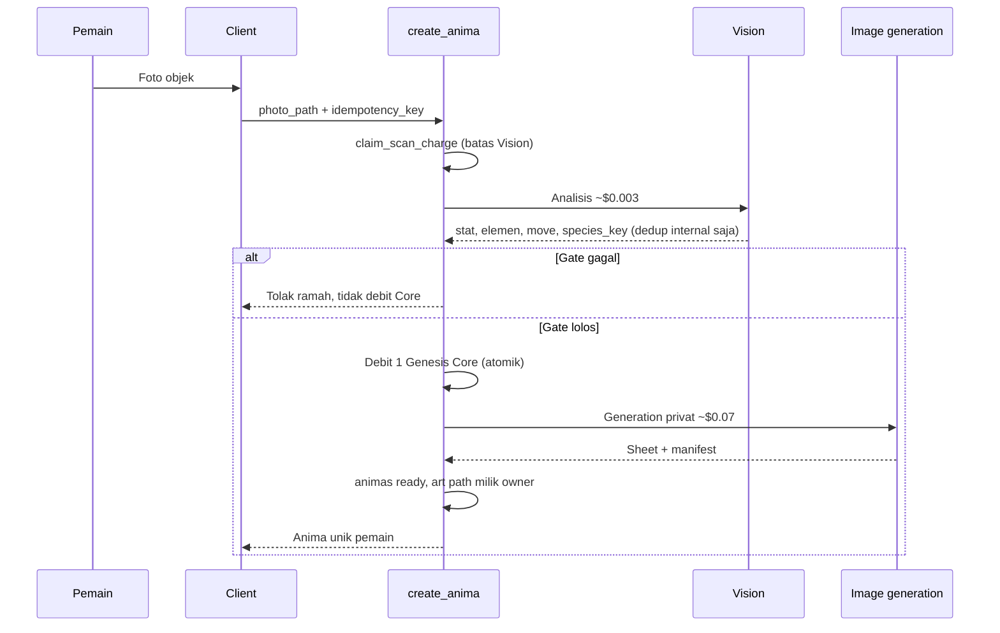
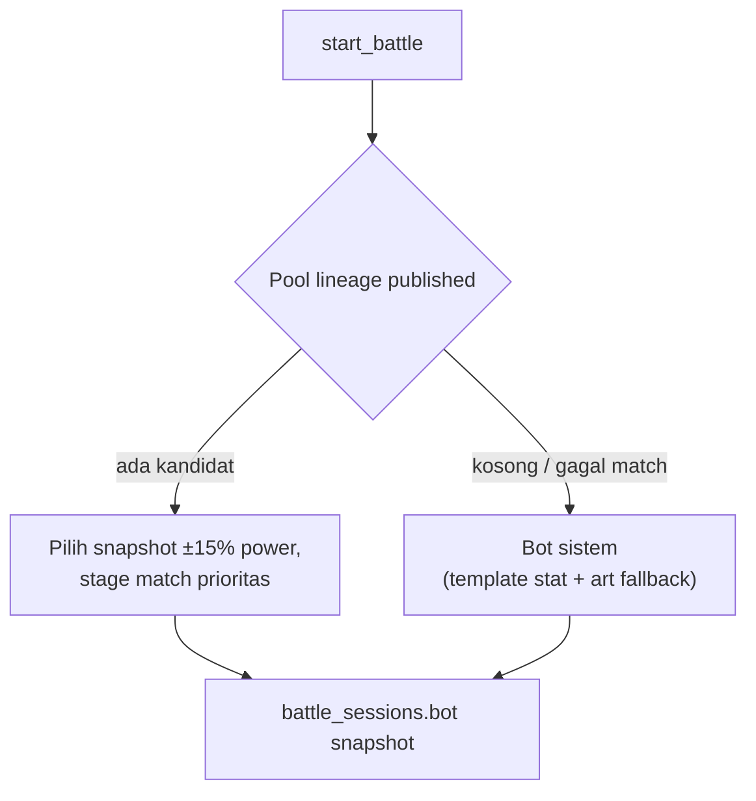

# 08 — Art Privat, Anima Atlas, dan Bot Pool

Dokumen ini adalah spesifikasi arsitektur/produk untuk kontrak **art privat +
publikasi lineage opsional**. UI pemainnya adalah Anima Atlas; nama tabel,
bucket, dan endpoint `gallery*` tetap dipertahankan sebagai wire kompatibilitas.
Ia melengkapi [04 — Game Loop & Core Systems](04-game-systems-economy.md) pada
bagian ekonomi Scan dan Battle bot pool.

Kontrak ini live sejak cutover 15 Agustus 2026. `species_library` dan bucket
`sheets` privat tetap ada hanya sebagai rollback legacy; capture baru selalu
unik dan privat.

## 1. Prinsip dasar

| Aspek | Target kontrak |
| --- | --- |
| Kepemilikan art | **Privat per pemilik** — setiap capture diterima menghasilkan generation unik milik akun pemain |
| Reuse art antar pemain | **Tidak** — tidak ada cache hit Discovery Scan; dua pemain memfoto objek sama tetap masing-masing membayar generation |
| Visibilitas default | **Privat** — hanya pemilik (dan sistem otoritatif) melihat sheet/manifest penuh |
| Anima Atlas | Discovery log form Scanned/Expedition/Duel; publikasi lineage pemain bersifat opt-in |
| Bot Battle | Hanya Anima yang **published ke Atlas** masuk pool lawan pemain; fallback sistem jika pool kosong |

Motivasi ekonomi: biaya generation (~$0.07 per capture diterima) harus selalu tertutup Core; biaya Vision (~$0.003) dibatasi Scan Charge agar percobaan gate tidak meledak tanpa batas.

## 2. Objek yang boleh di-scan

**Target gate Vision:**

- **Objek non-hidup** — benda nyata (alat, makanan, tanaman pot, furniture, dll.).
- **Hewan non-manusia** — semua satwa selain manusia, dengan pagar keamanan konten.

**Ditolak (safety gate):**

- Manusia (wajah, tubuh, atau siluet yang terbaca manusia).
- Konten NSFW, kekerasan grafis, simbol hate, atau objek yang melanggar kebijakan platform.

Gate tetap di sisi server (Vision + validasi) sebelum debit Core dan pemicu
generation. Percobaan yang gagal gate **tidak** memicu generation, **tidak**
mendebit Core, dan mengembalikan Scan Charge. Claim awal tetap membatasi request
paralel sebelum Vision, sedangkan refund membuat pemain tidak dihukum karena
foto yang ditolak (lihat [04 §1](04-game-systems-economy.md)).

## 3. Alur capture privat

**Catatan desain:**

- `species_key` boleh tetap dipakai untuk deduplikasi internal, analitik, atau moderation — **bukan** untuk reuse art antar pemain.
- Setiap baris `generations` accepted = biaya penuh generation; capture baru
  tidak membuat status `cache_hit`.
- Temuan Tertunda (Vision sudah keluar, Core habis) tetap masuk akal: simpan hasil Vision, klaim nanti tanpa foto ulang, tetap generation privat saat Core tersedia.

## 4. Penyimpanan dan akses

| Data | Pemilik | Client authenticated | Publik |
| --- | --- | --- | --- |
| Sheet RGBA + manifest penuh | Row `animas` / storage path scoped `owner_id` | Hanya `auth.uid() = owner_id` | Tidak |
| Thumbnail publikasi (jika publish) | Sistem + referensi ke generation | Tidak (baca lewat endpoint Atlas) | Ya, moderated |
| Metadata Battle bot (snapshot) | Derived dari publish | Lawan duel: snapshot anonim | Tidak identitas |
| Registry form Atlas | `atlas_forms` | Tidak langsung; Edge Function service-role | Hanya subset hasil discovery |
| Discovery Seeker | `seeker_atlas_discoveries` | Tidak langsung; ditulis trigger authoritative | Hanya milik Seeker lewat endpoint |

**RLS:** semua tabel data pemain tetap tertutup dari query client langsung.
Endpoint Atlas hanya mengekspos subset form yang dimiliki atau sudah ditemukan.
Untuk entry Duel, nama Seeker saat ini boleh tampil; nickname Anima, care,
account ID, foto, dan link profil tidak pernah ikut.

**Delete Anima:** hard delete row pemilik; generation audit boleh dipertahankan tanpa `anima_id`. Art privat di storage pemilik dihapus; **tidak** ada entri bersama di pustaka global yang harus dipertahankan untuk pemain lain.

## 5. Anima Atlas, publikasi, dan moderasi

Gallery Feed sudah dihentikan. Anima Atlas memakai satu grid dengan filter
All/Scanned/Expedition/Duel. Hatchling, Adult, dan Evolved adalah form terpisah.
Cast chapter terbuka dapat tampil sebagai siluet; profil baru terbuka setelah
encounter authoritative.

| Ada | Tidak ada |
| --- | --- |
| Form yang dibuat sendiri atau ditemui di Duel/Expedition | Feed publik, like, comment, follow, DM |
| Profil statis form dan nama Seeker pemilik entry Duel | Nickname, care, account ID, foto, link profil |
| Opt-in publish / unpublish seluruh lineage | Reward completion pada MVP |
| Moderation sebelum lineage masuk Duel pool | Discovery client-side yang bisa dipalsukan |

**Alur publish:**

1. Pemain membuka Anima siap (`ready`) dari Collection atau Profile.
2. Aksi **Publish Lineage to Atlas** menjelaskan bahwa generated profile, form
   yang ditemui, dan nama Seeker saat ini dapat terlihat.
3. Server enqueue moderation (otomatis + manual jika flag).
4. Setelah `approved`, lineage masuk pool Duel.
5. Battle session authoritative mencatat form lawan ke Atlas penantang.
6. **Unpublish** menarik lineage dari pool dan menghapus discovery non-owner.

Moderation memeriksa thumbnail yang sama seperti gate capture: tidak manusia, tidak NSFW, tidak simbol terlarang. Reject tidak menghapus Anima privat pemain.

`atlas_forms` menyimpan snapshot form kanonis; `seeker_atlas_discoveries`
menyimpan sumber, first/last seen, count, dan Level saat encounter. Trigger
`animas`, `battle_sessions`, `expedition_encounters`, serta switch Expedition
menulis ledger. Backfill rilis mengisi form milik pemain, Duel historis yang sah,
dan encounter Expedition historis. Report menghapus lineage dari Atlas reporter;
auto-hide, unpublish, atau Delete menghapus seluruh discovery non-owner.

## 6. Bot pool Battle

Vertical slice **historis** memakai snapshot anonim dari `species_library` (semua art bersama). **Target:**

| Aturan | Detail |
| --- | --- |
| Sumber lawan | Hanya Anima dengan publication `published = true` dan moderation `approved` |
| Anonimitas | Snapshot tidak membawa `owner_id`, nickname Seeker, atau link profil |
| Matching | Sama seperti slice live: total base stat ±15%, prioritas stage sama |
| Fallback | Bot sistem deterministik dari seed session — bukan pemain nyata |
| Unpublish | Anima unpublished tidak masuk draw session baru; session aktif tidak diputus |

Ini memberi insentif publish tanpa memaksa: duel tetap jalan lewat fallback, tetapi variasi art lawan datang dari komunitas yang opt-in.

## 7. Implikasi biaya (live vs historis)

| Metrik | Model historis (shared cache) | Target (privat) |
| --- | --- | --- |
| Biaya per capture diterima | $0.003 (hit) – $0.073 (miss) blended | **~$0.073** tetap (Vision + generation) |
| Rasio cache hit | Metrik bisnis utama | **Tidak relevan** untuk margin per capture |
| Scan Charge | Discovery Scan murah | **Batas percobaan Vision** (~$0.003/tembak) |
| Genesis Core | Hanya spesies baru | **Setiap capture diterima** |
| Grant mingguan | Tidak ada | **+1 Core / 7 hari server**, linked only, cap saldo gratis 3 |

Angka historis cache hit (50% → $0.038 blended, dll.) tetap berguna sebagai catatan **mengapa** pivot dilakukan, bukan sebagai proyeksi target.

## 8. Batas implementasi yang sengaja ditunda

- IAP, rewarded ads, BYOK — tetap di roadmap; kontrak Core/Scan tidak menunggu monetisasi final.
- PvP ranked, tim multi-Anima, item drop — di luar scope dokumen ini.
- Migrasi data: Anima lama di pustaka bersama membutuhkan rencana transisi terpisah (freeze publish, tidak dijelaskan di sini).

## 9. Pemeriksaan kontrak

Saat implementasi, verifikasi minimal:

- Dua akun memfoto objek identik → dua generation terpisah, dua debit Core, tidak share `sheet_path`.
- Guest / linked: aturan slot guest dan grant starter tetap; grant mingguan hanya linked, interval 7 hari server, saldo gratis ≤ 3.
- Battle tanpa publication → fallback sistem, bukan error.
- Atlas: detail Duel hanya mengembalikan nama Seeker; tidak ada nickname, care,
  account ID, foto, atau link profil.
- Unpublish/Delete/auto-hide → hilang dari Atlas non-owner dan pool bot session
  berikutnya.
- Report → lineage hilang dari Atlas reporter.

Rincian rumus Battle (18 elemen, Attack/Special element) ada di [04 §5](04-game-systems-economy.md).
