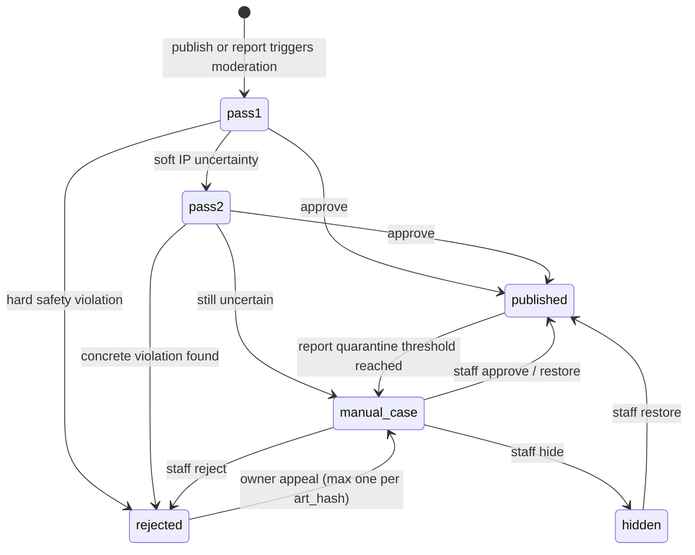

# Atlas Moderation Admin

Status: live in production 23 August 2026. `feature_atlas_moderation_v2=true`,
`admin_moderation` and the two-pass `gallery` engine are deployed, and the
first admin (`ryansetiawan.works@gmail.com`) is bootstrapped in
`staff_accounts`. Rollout provenance, including the PostgREST schema-cache
gotcha hit during bootstrap, is in
[docs/14-deploy-log.md](../14-deploy-log.md). The v1 single-pass path
described in
[docs/08-private-art-and-gallery.md](../08-private-art-and-gallery.md)
remains wired as the rollback (flip the flag back to `false`); nothing about
it was removed.

## Intent

Today `moderateSheetImage()` makes one Vision call per `art_hash` and returns a
binary `safe`/`reject_reason` free-text pair (see
`backend/supabase/functions/_shared/gallery_moderation.mjs`). A generic
franchise-similarity mention in that free text has the same weight as a
concrete hard-safety violation, so an ambiguous "this looks like it could be a
mascot" reading is indistinguishable from "this is unambiguously a named
franchise character" — both hard-reject with no path back except deleting and
rescanning. This design splits that judgment into a structured decision the
system can act on differently, adds a queue for the cases that stay
ambiguous, and adds the staff tooling to resolve them without ever exposing
service-role credentials to a browser.

## State machine

- `pass1`/`pass2` are automated, capped at exactly one automated second
  opinion. There is no third automated pass — a case that leaves `pass2`
  uncertain always becomes a `manual_case`, never another model call. This
  mirrors the existing "no image-generation retry loop" cost discipline in
  CLAUDE.md's non-negotiable rules, applied to Vision calls instead of
  GPT Image calls.
- `gallery_moderations` stays the permanent cache keyed by `art_hash`, but it
  is written **only** by the automated passes (`pass1`/`pass2`), never by a
  staff decision. A `manual_case` is scoped to `(entry_id, art_hash)` and its
  resolution updates only that entry's `gallery_entries` row. This is
  deliberate: if two different owners' entries happen to share an
  `art_hash`, one owner's appeal outcome must never silently resolve the
  other owner's case — each entry gets its own independent review.
- A `manual_case` has exactly one active row per `(entry_id, art_hash)` —
  a second report or a second appeal on an already-open case attaches to the
  existing case instead of forking a duplicate.

## Role matrix

| Capability | `viewer` | `moderator` | `admin` |
|---|---|---|---|
| Read queue, case detail, reports, analytics, audit | yes | yes | yes |
| Approve / reject / hide / restore / escalate a case | no | yes | yes |
| Set or revoke a profile sanction | no | yes | yes |
| Manage `staff_accounts` (grant/revoke roles) | no | no | yes |
| Bootstrap the first admin row | — | — | one-time, manual SQL only |

Role is resolved server-side inside `admin_moderation` from `staff_accounts`,
keyed by the Supabase `auth.users.id` of the verified JWT subject — never by
`user_metadata`, email claim, or anything the browser can influence. A caller
with no `staff_accounts` row gets 403, not a downgraded view.

## Report policy

- Categories: `character` (recognizable franchise character),
  `sexual`, `gore`, `hate`, `other`, each with an optional note bounded to a
  short length.
- One report per `(reporter_id, entry_id, art_hash)`. Re-reporting the same
  art hash after it changed (evolve, re-synthesis) is allowed again, matching
  "evolve resets moderation" in the existing invariants.
- A report always hides that lineage from the reporter locally and
  immediately (existing `atlas_hide_reporter()` trigger behavior, unchanged).
- Only *eligible* reports — unique reporters, current art hash — count toward
  the global quarantine threshold. Reaching it opens a `manual_case`; it does
  not itself flip `moderation_status` to `rejected`. A report is a trigger for
  human review, never an automatic verdict.
- Reporter identity is never exposed to the owner or in any owner-facing
  response. Staff see report categories and counts, not a name-to-report
  mapping beyond what's needed to prevent the same reporter double-counting.

## One-retry cost ceiling

- At most one automated second opinion (`pass2`) per `art_hash`, ever. Total
  automated Vision calls per art hash across its whole lifetime: 2, both
  cached permanently in `gallery_moderations`/`gallery_moderation_runs`.
- Manual staff decisions cost nothing beyond the two automated calls already
  paid for — resolving a `manual_case` never triggers another model call.
- Appeals do not re-run Vision. An appeal re-opens the *same* evidence
  (the already-generated sheet) for a human to look at; it never regenerates
  or re-scores the art.

## Privacy boundaries

- The browser (`admin/`) only ever holds the Supabase URL and publishable
  key. Every read or write that needs service-role access goes through
  `admin_moderation`, which re-verifies the staff role on every call — `proxy.ts`
  (Next.js 16's middleware convention) only refreshes the session cookie and
  does optimistic redirects; it authorizes nothing.
- `admin_moderation` returns short-lived signed URLs for art, not raw storage
  paths, and never returns `REPLICATE_API_TOKEN` or any service credential.
- Owners never see reporter identity, raw model prose, internal confidence
  scores, or report counts — only the player-safe states already defined in
  [docs/wiki/atlas.md](../wiki/atlas.md) (`Under review`, `Published`,
  `Cannot publish`, `Hidden after reports`, `Publishing suspended`).
- Staff accounts are excluded from player-facing analytics and leaderboards.
- All new tables are default-deny: RLS enabled, zero player policies, grants
  only to `service_role` — the same pattern as every other table in this
  schema (see `gallery_moderations`, `battle_failures`).

## Rollback

- `feature_atlas_moderation_v2` (boolean, `app_config`) gates the two-pass
  engine and manual-case creation. While `false`, `gallery/index.ts` keeps
  calling the existing one-pass `moderateSheetImage()` path unchanged.
- The admin app and `admin_moderation` function can be deployed and used for
  read-only triage before the flag flips — nothing about running the admin
  console requires the v2 engine to be live, since it operates on whatever
  rows already exist in `gallery_moderations`/`gallery_reports`.
- Rollback is flipping the flag back to `false`; no schema is dropped, no
  Godot client behavior depends on the flag directly (the client only ever
  sees the existing `my_status` states).

## Decision log

- Chosen: one automated second opinion then manual review. Rejected:
  unconditional **Publish Anyway**, because reporting cannot undo exposure
  before takedown.
- Chosen: local Next.js 16 admin with Google/Supabase Auth and an Edge
  Function privilege boundary. Rejected: Supabase Studio (no product
  workflow/RBAC) and direct browser database access (would weaken RLS or
  expose service credentials).
- Chosen: full moderation operations plus scoped sanctions and analytics.
  Explicit non-goal: economy/stat editing or a general-purpose player-data
  console.
- Chosen: build the Control Deck UI directly in code against the written
  visual spec below, skipping the Figma review gate the original plan called
  for — no Figma access is available in this environment. Flagged here
  instead of silently dropped.

## Visual direction (Control Deck)

Dark slate `#0F172A` background, deep violet `#7C3AED` primary, cyan `#0891B2`
secondary, restrained gold for trusted-approval states, red reserved for
destructive actions only. Space Grotesk for headings, Fira Sans for UI text,
Fira Code for IDs and raw data. The signature layout is an **Evidence Rail** on
case detail: Idle crop and full sheet beside automated findings, report
history, prior decisions, and a sticky reason-required action panel. Queue
aging and severity are structural (position, color-coded age), not decorative
KPI cards.
